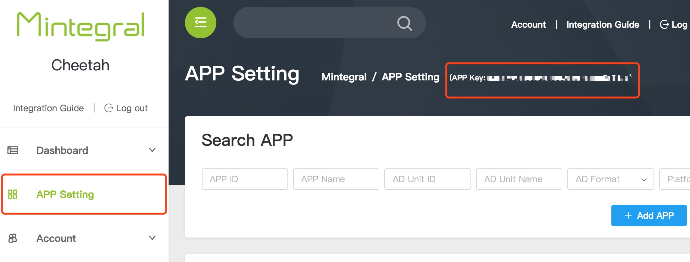

# Adobe AIR Plugin 开发文档

##1 概述
本文档描述了Adobe Air开发者如何集成Mintegral Adobe AIR Plugin产品。  
Adobe AIR Plugin 提供了4种广告形式，包括：RewardVideo（激励性视频）、Interstitial（插屏）、Interstitial Video（插屏视频）、InterActive（交互式广告）。 

###提供文件： 
**基础广告： MTGAdobeAirMintegral.ane**  
**Android-V4：MTGAdobeAirAndroidSupportV4.ane**  
**Android-V7：MTGAdobeAirAndroidSupportV7.ane**  

###集成注意：

MTGAdobeAirMintegral.ane包含了RewardVideo（激励性视频）、OfferWall、Interstitial（插屏）广告形式，如果不需要AppWall广告形式，可以只集成MTGAdobeAirMintegral.ane。
AppKey
需要AppWall广告形式，项目中没有集成android-support-v4.jar文件，需要集成MTGAdobeAirAndroidSupportV4.ane，集成了android-support-v4.jar文件，则不需要MTGAdobeAirAndroidSupportV4.ane文件。

MTGAdobeAirAndroidSupportV7.ane文件是针对FaceBook广告的，根据具体需要进行集成。

##2 集成准备
###2.1 申请账号
开发者从Mintegral运营人员处获取账号、密码后，登录[M系统后台](http://mmonetization.com/user/login )
###2.2 App Key
开发者每个账号都有对应的AppKey，请求广告时需要用到该参数，它可以从M系统后台获取。  
登录M系统后台，在AD Unit -> App界面，可以查看到该账号的AppKey，如图所示：  
   
###2.3 App Id
开发者每创建一个应用后，系统会自动生成AppId，可在AD Unit -> App界面查看到已创建的应用以及对应的AppId，如图所示：  

###2.4 Unit Id
开发者每创建一个广告位后，系统会自动生成UnitId，可在AD Unit -> AD Unit界面查看到已创建的广告位以及对应的UnitId，如图所示：  


## 3 Adobe Air 开发环境的配置
### 3.1 开发需求 

Adobe Flash Builder 4.7    
Adobe AIR SDK 4.0  
Mintegral Adobe AIR Plugin ANE

### 3.2 升级AIR SDK
开发需要最低版本为4.0的Adobe AIR SDK，需要您下载最新的[AIR SDK](http://www.adobe.com/devnet/air/air-sdk-download.html)，并覆盖到您的Flash Builder的sdks目录下。 
	
### 3.3 配置Adobe AIR Plugin
下载Adobe AIR Plugin ANE，然后完成以下步骤将其包含在您的项目中： 

在Flash Builder中，右键单击项目，然后转到属性 ➣Flex  构建路径  ➣本机扩展。  
点击“ 添加ANE .. ”，并添加Mintegral Adobe AIR Plugin ANE文件。   
右键单击您的项目并转到属性  ➣  Flex构建包装 ➣ 的Android / iOS版 ➣ 原生扩展，并确保该Mintegral Adobe AIR Plugin ANE被标记为“包”。

**注意：**  
如果您在项目中使用Adobe Animate CC，请转到：
文件➣ActionScript 设置 ➣ 库路径，并添加Mintegral Adobe AIR Plugin ANE文件。


## 4 初始化 Mintegral Adobe AIR Plugin

### 4.1 欧盟GDPR版本须知：
从2018年5月25日开始，欧盟的“通用数据保护条例”（GDPR）将生效。 开发者需要更新Mintergal SDK并按以下方法集成，否则会影响广告正常投放。同时，我们更新了[Mintegral隐私政策](https://www.mintegral.com/en/privacy/)。<br>

**注意**      
1、Android仅针对SDK v_8.11.0版本及以上版本，对应plugin版本为V_1.3.0。      
2、iOS仅针对SDK v_3.8.0 版本及以上版本，对应plugin版本为V_1.3.0。      
3、如果不上报用户信息，将会影响广告投放，可能会引起没有广告返回的情况，请知悉。      
4、对于欧盟用户，开发者集成时，建议在征得用户同意之前，先不要初始化SDK，以免引起不必要的麻烦。     

**1.新增字段说明**    
Android新增字段说明

```C#
//Android新增字段说明
	private static string AUTHORITY_KEY_ALL_INFO = "authority_all_info";  //所有信息
	private static string AUTHORITY_KEY_GENERAL_DATA = "authority_general_data";
	private static string AUTHORITY_KEY_DEVICE_ID = "authority_device_id";
	private static string AUTHORITY_KEY_GPS = "authority_gps";
	private static string AUTHORITY_KEY_IMEI_MAC = "authority_imei_mac";
	private static string AUTHORITY_KEY_ANDROID_ID = "authority_android_id";
	private static string AUTHORITY_KEY_APP_LIST = "authority_applist";
	private static string AUTHORITY_KEY_APP_DOWNLOAD = "authority_app_download";
	private static string AUTHORITY_KEY_APP_PROGRESS = "authority_app_progress";

	private static string IS_SWITCH_ON = "ON";//获取用户信息开
	private static string IS_SWITCH_OFF = "OFF";//获取用户信息关
```

iOS新增字段说明

```C#
//iOS新增字段说明
	private static string AUTHORITY_KEY_ALL_INFO = "authority_all_info";  //所有信息
	private static string AUTHORITY_KEY_GENERAL_DATA = "authority_general_data";
	private static string AUTHORITY_KEY_DEVICE_ID = "authority_device_id";
	private static string AUTHORITY_KEY_GPS = "authority_gps";

	private static string IS_SWITCH_ON = "ON";//获取用户信息开
	private static string IS_SWITCH_OFF = "OFF";//获取用户信息关
```


**2.两种方式显示用户隐私信息协议的对话框**      
  1、弹出对话框，让用户选择是否遵循欧盟GDPR协议

```C#
		//弹出对话框
		mtgAir.showUserPrivateInfoTips();
		
		//回调弹窗状态
		mtgAir.addEventListener("onShowUserInfoTips", onShowUserInfoTips);
		
		private function onShowUserInfoTips(event:StatusEvent):void
		{
			var tempLog:String = "code : "+event.code + "  -;-  level : "+event.level+" \n"; 
				trace(tempLog); 
		}			
```
  2、开发者主动调用

```C#
	//开发者主动调用,以iOS为例：
    mtgAir.setUserPrivateInfoType(AUTHORITY_KEY_GENERAL_DATA,IS_SWITCH_ON);
	mtgAir.setUserPrivateInfoType(AUTHORITY_KEY_GPS,IS_SWITCH_OFF);
	mtgAir.setUserPrivateInfoType(AUTHORITY_KEY_DEVICE_ID,IS_SWITCH_ON);
	mtgAir.setUserPrivateInfoType(AUTHORITY_KEY_ALL_INFO,IS_SWITCH_OFF);
		
```


**3.获取用户选择结果**  
    
```C#           
//获取用户选择结果  
		trace ("userPrivateInfo AUTHORITY_KEY_GPS : " + mtgAir.userPrivateInfo (AUTHORITY_KEY_GPS));          
		trace ("userPrivateInfo AUTHORITY_KEY_DEVICE_ID : " + mtgAir.userPrivateInfo (AUTHORITY_KEY_DEVICE_ID));     
		trace ("userPrivateInfo AUTHORITY_KEY_GENERAL_DATA : " + mtgAir.userPrivateInfo (AUTHORITY_KEY_GENERAL_DATA));      
		trace ("userPrivateInfo AUTHORITY_KEY_ALL_INFO : " + mtgAir.userPrivateInfo (AUTHORITY_KEY_ALL_INFO));   
				
```


### 4.2 初始化 
导入MTGAdobeAirMintegral.ane文件，必须在应用程序初始化的时候调用init()方法。

**导入**  

```actionScript  
	import com.mintegral.plugin.airsdk.base.MTGAdobeAirMintegral;
```

**初始化**

```actionScript  
	private var mtgAir:MTGAdobeAirMintegral =  MTGAdobeAirMintegral.getInstance();
	mtgAir.init(AppId,AppKey);
```

### 4.3 Android 版本的 AndroidManifest.xml 配置

**打开 AndroidManifest.xml，配置以下内容：**

**必要权限**

```actionScript
    <uses-permission android:name="android.permission.INTERNET" />
    <uses-permission android:name="android.permission.WRITE_EXTERNAL_STORAGE"/>
    <uses-permission android:name="android.permission.ACCESS_NETWORK_STATE" />
```

**非必要权限**

```actionScript
    <uses-permission android:name="android.permission.ACCESS_WIFI_STATE" />
    <uses-permission android:name="android.permission.READ_PHONE_STATE" />
    <uses-permission android:name="android.permission.ACCESS_COARSE_LOCATION" />
    <uses-permission android:name="android.permission.ACCESS_FINE_LOCATION" />
```

**启动模式修改，需要singleTop或者standard，不可以singleTask**

```actionScript
    <activity android:launchMode="singleTop">
      <intent-filter>
       <action android:name="android.intent.action.MAIN"/>
       <category android:name="android.intent.category.LAUNCHER"/>
      </intent-filter>
    </activity>
```

### 4.4 iOS 版本的 app.xml 配置
**设置id为苹果开发者证书的id**

```actionScript
    <id>com.mobvisita.SDKDemo</id>
```


## 5 激励性视频广告接入
**集成效果：**

**横屏效果图:**


**竖屏效果图:**


**横屏落地页效果图:**


**竖屏落地页效果图:**


### 接入流程 

**1、确保完成Mintegral Adobe AIR Plugin初始化，如果有需要集成的第三方ANE，请将第三方最新的ANE放入项目本机扩展中。**  


**2、请在AndroidManifest.xml文件声明AIR Plugin激励性视频的Activity**

``` 
<application android:enabled="true">
	 <activity
            android:name="com.mintegral.msdk.reward.player.MTGRewardVideoActivity"
            android:configChanges="orientation|keyboardHidden|screenSize"
            android:theme="@android:style/Theme.NoTitleBar.Fullscreen" />
</application>
```

**3、设置奖励信息，点击设置Virtual Reward,添加激励信息后，会自动生成RewardId**


**4、创建广告位时设置回调方式，视频播放完成后会给予开发者回调**         


**服务器回调方式:**

**声明callbakUrl，只需要开发者修改域名部分**

**例如:http(s)://www.sampleurl.com/mintegral?user_id={user_id}&trans_id={trans_id}&reward_amout={reward_amount}&reward_name={reward_name}&sign={sign}&unit_id={unit_id}**

**客户端回调方式:**
**设置setRewardVideoListener监听，视频播放完成后会回调此方法,请您读取其中event.level中的JSON字符串解析奖励信息。**	

```actionScript
	public function onAdClose(event:StatusEvent):void
	{
		trace("reward info :" + "RewardName:"+ "RewardAmout:" + event.level);
	}
```
**5、创建MTGAdobeAirMintegral的对象**  


**导入**  

```actionScript  
	import com.mintegral.plugin.airsdk.base.MTGAdobeAirMintegral;
```

**初始化**

```actionScript  
	private var mtgAir:MTGAdobeAirMintegral =  MTGAdobeAirMintegral.getInstance();
```

**6、设置侦听回调**  

```actionScript
	mtgAir.addEventListener("onLoadSuccessRewardVideo", onSuccess);
	mtgAir.addEventListener("onLoadFailRewardVideo", onLoadFail);
	mtgAir.addEventListener("onShowFailRewardVideo", onShowFail);
	mtgAir.addEventListener("onAdShowRewardVideo", onAdShow);
	mtgAir.addEventListener("onAdCloseRewardVideo", onAdClose);
	mtgAir.addEventListener("onAdClickedRewardVideo", onAdClicked);
	
		private function onSuccess(event:StatusEvent):void
		{
			trace(event.level);
		}
			
		private function onLoadFail(event:StatusEvent):void
		{
			trace(event.level);
		}
			
		private function onShowFail(event:StatusEvent):void
		{
			trace(event.level);
		}
			
		private function onAdShow(event:StatusEvent):void
		{
			trace(event.level);
		}
			
		private function onAdClose(event:StatusEvent):void
		{
			trace(event.level);
		}
			
		private function onAdClicked(event:StatusEvent):void
		{
			trace(event.level);
		}
```
**7、调用loadRewardVideo方法**

```actionScript
   mtgAir.loadRewardVideo(UnitId);
```
**8、在播放之前，判断视频是否ready，如果true，则调用show方法，播放，否则再次load。**  

```actionScript
    if (mtgAir.isReadyRewardVideo(UnitId)) {
		mtgAir.showRewardVideo(UnitId,RewardId,UserId);
	}else{
		mtgAir.loadRewardVideo(UnitId);
	}
```
**9、RewardVideo广告形式相关方法的介绍**


<table><tr><td bgcolor=#DCDCDC>public void loadRewardVideo（UnitId:String）</td></tr></table>

> 用于加载激励性视频广告

|参数名       |		参数信息  |
| ------------- |:-------------:|
| UnitId  | M系统创建的广告位ID  |
***


<table><tr><td bgcolor=#DCDCDC>public void showRewardVideo（UnitId:String, RewardId:String, UserId:String）</td></tr></table>

> 用于预播放激励性视频

|参数名       |		参数信息  |
| ------------- |:-------------:|
| UnitId  | M系统创建的广告位ID  |
| RewardId  | 激励ID，对应M系统后台配置的奖励信息  |
| UserId  | 用户ID，根据用户信息返回奖励  |

***


<table><tr><td bgcolor=#DCDCDC>public boolean isReadyRewardVideo(UnitId:String）</td></tr></table>

> 视频是否准备好播放

|参数名       |		参数信息  |
| ------------- |:-------------:|
| UnitId  | M系统创建的广告位ID  |

***


<table><tr><td bgcolor=#DCDCDC>public void addEventListener(code, level)</td></tr></table>

> 监听与视频广告有关的状态

|参数名       |		参数信息  |
| ------------- |:-------------:|
| onLoadSuccessRewardVideo  | 广告数据加载成功  |
| onLoadFailRewardVideo  | 广告数据加载失败  |
| onShowFailRewardVideo  | 广告播放失败  |
| onAdShowRewardVideo  | 广告正在播放  |
| onAdCloseRewardVideo  | 广告播放完毕获取奖励信息  |
| onAdClickedRewardVideo  | 广告安装界面点击  |

***


## 6 广告墙接入

**集成后的效果：**


### 接入流程  

**需要AppWall广告形式，没有集成android-support-v4.jar文件，需要集成MTGAdobeAirAndroidSupportV4.ane，集成了android-support-v4.jar文件，则不需要MTGAdobeAirAndroidSupportV4.ane文件。**

**1、确保完成Mintegral Adobe AIR Plugin初始化，如果有需要集成的第三方ANE，请将第三方最新的ANE放入项目本机扩展中。**  

**2、请在AndroidManifest.xml文件声明AIR Plugin广告墙的Activity**

``` 
<application android:enabled="true">
    <!-- 如果墙需要集成沉浸式 请加一个theme -->
     <activity
            android:name="com.mintegral.msdk.shell.MTGActivity"
            android:configChanges="keyboard|orientation"
            android:screenOrientation="portrait"
            android:theme="@style/MintegralAppTheme" >
       </activity>
    <!--如果配置墙沉浸式，请在res/values/style文件中添加以下样式-->  
    <style name="MintegralAppTheme" parent="AppBaseTheme">
    <item name="android:windowNoTitle">true</item>
    <item name="android:windowTranslucentStatus">true</item>
    <item name="android:windowTranslucentNavigation">true</item></style>
</application>
```

**3、创建MTGAdobeAirMintegral的对象**  

**导入**    

```actionScript        
	import com.mintegral.plugin.airsdk.base.MTGAdobeAirMintegral;
```

**初始化**

```actionScript  
	private var mtgAir:MTGAdobeAirMintegral =  MTGAdobeAirMintegral.getInstance();
```
**4、调用preloadWall方法**

```actionScript
    OfferWallmtgAir.preloadWall(UnitId);
```
**5、调用showAppWall方法**  

```actionScript
    mtgAir.showAppWall(UnitId);
```

**6、AppWall广告形式相关方法的介绍**

<table><tr><td bgcolor=#DCDCDC>public void preloadWall（UnitId:String）</td></tr></table>

> 用于预加载广告墙视频

|参数名       |		参数信息  |
| ------------- |:-------------:|
| UnitId  | 广告位ID，对应M系统后台配置的广告位ID  |

***

<table><tr><td bgcolor=#DCDCDC>public void showAppWall（UnitId:String）</td></tr></table>

> 用于预播放广告墙视频

|参数名       |		参数信息  |
| ------------- |:-------------:|
| UnitId  | 广告位ID，对应M系统后台配置的广告位ID  |

***

## 7 OfferWall接入
**集成后的效果：**


**1、确保完成Mintegral Adobe AIR Plugin初始化，如果有需要集成的第三方ANE，请将第三方最新的ANE放入项目本机扩展中。**  


**2、请在AndroidManifest.xml文件声明AIR Plugin OfferWall的Activity**

``` 
<application android:enabled="true">
         <activity
            android:name="com.mintegral.msdk.offerwall.view.MTGOfferWallActivity"
            android:screenOrientation="portrait"
            android:configChanges="screenSize|orientation"/>
        <activity
            android:name="com.mintegral.msdk.offerwall.view.MTGOfferWallRewardVideoActivity"
            android:configChanges="keyboardHidden|orientation|screenSize"
            android:theme="@android:style/Theme.NoTitleBar.Fullscreen"
            android:screenOrientation="landscape" />
</application>
```

**3、设置回调方式：**


**当MTG服务端获知用户完成任务后，通过Callback URL通知开发者服务端，为用户增加积分，对开发者来说，该方式实现起来稍微复杂，但安全性高。**
**服务器回调方式:**

**声明callbakUrl，只需要开发者修改域名部分**

**http(s)://www.sampleurl.com/mintegral?user_id={user_id}&trans_id={trans_id}&reward_amout={reward_amount}&reward_name={reward_name}&sign={sign}&unit_id={unit_id}**

**MTG Server获知获知到该user_id增加积分后，通过callback url通知开发者服务端。callback url附加的参数如下：**

|参数        |		说明         |
| ------------- |:-------------:|
| user_id | 用户ID，由开发者设置 |
| reward_amount | 用户应该获得的积分   |
| reward_name | 积分的名称   |
| unit_id | 广告位ID   |
| trans_id | 传输ID，MTG服务端生成，具有唯一性，   |
| sign | 加密标识 MD5(user_id_reward_amount_trans_id_security_key)   |


**开发者服务端一旦收到postback后，需给MTG服务端返回200或403。**

```objectivec
200表示：用户已成功获得奖励。       

403表示异常：              
1. sign不匹配         
2. user_id不存在      
3. 其它错误，Mintegral Server不应再重发同一条消息         
```


**MTG Server发起Postback后，若超时（20秒）无响应，则在24小时内每隔5分钟重试一次。**

**客户端回调方式:**

**1.如果视频类offer,用户看到80%时，SDK回调onAdCreditsEarned事件**

**2.如果是下载类offer，开发者需要调用**  

```actionScript
	mtgAir.queryRewardsOffWall();
	mtgAir.addEventListener("queryRewardsOfferWall", onQueryRewards);
	private function onQueryRewards(event:StatusEvent):void
	{
		trace(event.level);
	}
```


​	
**4、给OfferWall广告形式设置回调**

```actionScript
	mtgAir.addEventListener("onLoadSuccessOffWall", onSuccess);
	mtgAir.addEventListener("onLoadFailOffWall", onLoadFail);
	mtgAir.addEventListener("onShowFailOffWall", onShowFail);
	mtgAir.addEventListener("onAdShowOffWall", onAdShow);
	mtgAir.addEventListener("onAdCloseOffWall", onAdClose);
	mtgAir.addEventListener("onAdClickedOffWall", onAdClicked);
	mtgAir.addEventListener("onAdCreditsEarnedOffWall", onCreditsEarned);
	mtgAir.addEventListener("queryRewardsOffWall", onQueryRewards);

		private function onSuccess(event:StatusEvent):void
		{
			trace(event.level);
		}
			
		private function onLoadFail(event:StatusEvent):void
		{
			trace(event.level);
		}
			
		private function onShowFail(event:StatusEvent):void
		{
			trace(event.level);
		}
			
		private function onAdShow(event:StatusEvent):void
		{
			trace(event.level);
		}
			
		private function onAdClose(event:StatusEvent):void
		{
			trace(event.level);
		}
			
		private function onAdClicked(event:StatusEvent):void
		{
			trace(event.level);
		}
		
		private function onCreditsEarned(event:StatusEvent):void
		{
			trace(event.level);
		}
			
		private function onQueryRewards(event:StatusEvent):void
		{
			trace(event.level);
		}
	
```

**5、创建MTGAdobeAirMintegral的对象**  

**导入**  

```actionScript  
	import com.mintegral.plugin.airsdk.base.MTGAdobeAirMintegral;
```

**初始化**

```actionScript  
	private var mtgAir:MTGAdobeAirMintegral = MTGAdobeAirMintegral.getInstance();
```
**6、调用loadOfferWall方法**  
**注意：UserId必须有值**

```actionScript
	mtgAir.loadOffWall(UnitId,KAdCategoryIDForiOS,UserId);
```

**7、调用showOfferWall方法**

```actionScript
   mtgAir.showOffWall();
```

**8、OfferWall广告形式的相关介绍**

<table><tr><td bgcolor=#DCDCDC>public void loadOffWall（UnitId:String KAdCategoryIDForiOS:String,UserId:String）</td></tr></table>

> 用于加载OfferWall广告

|参数名       |		参数信息  |
| ------------- |:-------------:|
| UnitId  | M系统创建的广告位ID  |
| KAdCategoryIDForiOS  | iOS版本控制广告形式的ID  |
| UserId  | 用户ID  |

#### 常规数据类型


```actionScript
typedef NS_ENUM(NSInteger, KAdCategoryIDForiOS) {
    MTGOFFERWALL_AD_CATEGORY_ALL  = 0,
    MTGOFFERWALL_AD_CATEGORY_GAME = 1,
    MTGOFFERWALL_AD_CATEGORY_APP  = 2,
};
```

> 控制广告类型，其中，MTGOFFERWALL_AD_CATEGORY_ALL不限制类型，MTGOFFERWALL_AD_CATEGORY_GAME为游戏类广告，MTGOFFERWALL_AD_CATEGORY_APP为应用类广告，可根据需要进行选择。如果对广告类型没有特殊要求，填MTGOFFERWALL_AD_CATEGORY_ALL(或者数字0)即可

***


<table><tr><td bgcolor=#DCDCDC>public void showOffWall（）</td></tr></table>

> 用于预播放OfferWall

***


<table><tr><td bgcolor=#DCDCDC>public void setAlertOffWall(alertMsg:String,leftTitle:String,rightTitle:String）</td></tr></table>

> 设置关闭视频的提示框文字和按钮文字

**该方法只在iOS版本中生效**

|参数名       |		参数信息  |
| ------------- |:-------------:|
| alertMsg  | 提示框文字  |
| leftTitle  | 提示框左按钮文字，功能关闭视频  |
| rightTitle  | 提示框右按钮文字，功能退出提示框  |

***

<table><tr><td bgcolor=#DCDCDC>public void queryRewardsOffWall（）</td></tr></table>

> 主动查询奖励信息

***

<table><tr><td bgcolor=#DCDCDC>public void addEventListener(code, level)</td></tr></table>

> 监听与AppWall有关的状态


|参数名       |		参数信息  |
| ------------- |:-------------:|
| onLoadSuccessOffWall  | 广告数据加载成功  |
| onLoadFailOffWall  | 广告数据加载失败  |
| onShowFailOffWall  | 广告播放失败  |
| onAdShowOffWall  | 广告正在播放  |
| onAdCloseOffWall  | 广告播放完毕  |
| onAdClickedOffWall  | 广告安装界面点击  |
| onAdCreditsEarnedOffWall  | 广告播放完毕获取奖励信息  |
| queryRewardsOffWall  | 主动查询奖励信息  |

***

## 8 插屏广告接入
**集成后的效果：**


**1、确保完成Mintegral Adobe AIR Plugin初始化，如果有需要集成的第三方ANE，请将第三方最新的ANE放入项目本机扩展中。**  


**2、请在AndroidManifest.xml文件声明AIR Plugin Interstitial的Activity**

```actionScript 
        <activity
            android:name="com.mintegral.msdk.interstitial.view.MTGInterstitialActivity"
            android:screenOrientation="portrait"
            android:configChanges="orientation|screenSize"/>
```

**3、给Interstitial广告形式设置回调**

```actionScript
	mtgAir.addEventListener("onLoadSuccessInterstitial", onSuccess);
	mtgAir.addEventListener("onLoadFailInterstitial", onLoadFail);
	mtgAir.addEventListener("onShowFailInterstitial", onShowFail);
	mtgAir.addEventListener("onAdShowInterstitial", onAdShow);
	mtgAir.addEventListener("onAdCloseInterstitial", onAdClose);
	mtgAir.addEventListener("onAdClickedInterstitial", onAdClicked);

		private function onSuccess(event:StatusEvent):void
		{
			trace(event.level);
		}
			
		private function onLoadFail(event:StatusEvent):void
		{
			trace(event.level);
		}
			
		private function onShowFail(event:StatusEvent):void
		{
			trace(event.level);
		}
			
		private function onAdShow(event:StatusEvent):void
		{
			trace(event.level);
		}
			
		private function onAdClose(event:StatusEvent):void
		{
			trace(event.level);
		}
			
		private function onAdClicked(event:StatusEvent):void
		{
			trace(event.level);
		}
	
```

**4、创建MTGAdobeAirMintegral的对象**  

**导入**  

```actionScript  
	import com.mintegral.plugin.airsdk.base.MTGAdobeAirMintegral;
```

**初始化**

```actionScript  
	private var mtgAir:MTGAdobeAirMintegral = MTGAdobeAirMintegral.getInstance();
```
**5、调用loadInterstitial方法**

```actionScript
   mtgAir.loadInterstitial(UnitId,KAdCategoryIDForiOS);
```

**6、调用showInterstitial方法**

```actionScript
   mtgAir.showInterstitial();
```

**7、Interstitial广告形式相关方法的介绍**

<table><tr><td bgcolor=#DCDCDC>public void loadInterstitial（UnitId:String KAdCategoryIDForiOS:String）</td></tr></table>

> 用于加载Interstitial广告

|参数名       |		参数信息  |
| ------------- |:-------------:|
| UnitId  | M系统创建的广告位ID  |
| KAdCategoryIDForiOS  | iOS版本控制广告形式的ID  |

#### 常规数据类型


```actionScript
typedef NS_ENUM(NSInteger, KAdCategoryIDForiOS) {
    MTGOFFERWALL_AD_CATEGORY_ALL  = 0,
    MTGOFFERWALL_AD_CATEGORY_GAME = 1,
    MTGOFFERWALL_AD_CATEGORY_APP  = 2,
};
```

> 控制广告类型，其中，MTGOFFERWALL_AD_CATEGORY_ALL不限制类型，MTGOFFERWALL_AD_CATEGORY_GAME为游戏类广告，MTGOFFERWALL_AD_CATEGORY_APP为应用类广告，可根据需要进行选择。如果对广告类型没有特殊要求，填MTGOFFERWALL_AD_CATEGORY_ALL(或者数字0)即可

***


<table><tr><td bgcolor=#DCDCDC>public void showInterstitial（）</td></tr></table>

> 用于预播放Interstitial

***


<table><tr><td bgcolor=#DCDCDC>public void addEventListener(code, level)</td></tr></table>

> 监听与Interstitial广告有关的状态


|参数名       |		参数信息  |
| ------------- |:-------------:|
| onLoadSuccessInterstitial  | 广告数据加载成功  |
| onLoadFailInterstitial  | 广告数据加载失败  |
| onShowFailInterstitial  | 广告播放失败  |
| onAdShowInterstitial  | 广告正在播放  |
| onAdCloseInterstitial  | 广告播放完毕  |
| onAdClickedInterstitial  | 广告安装界面点击  |

***


## 9 插屏视频广告接入
**集成后的效果：**


**1、确保完成Mintegral Adobe AIR Plugin初始化，如果有需要集成的第三方ANE，请将第三方最新的ANE放入项目本机扩展中。**  


**2、请在AndroidManifest.xml文件声明AIR Plugin Interstitial Video的Activity**

```actionScript 
            <activity
            android:name="com.mintegral.msdk.reward.player.MTGRewardVideoActivity"
            android:configChanges="orientation|keyboardHidden|screenSize"
            android:theme="@android:style/Theme.NoTitleBar.Fullscreen" />
```

**3、给Interstitial广告形式设置回调**

```actionScript
			mtgAir.addEventListener("onLoadSuccessInterstitiaVideo", onSuccess);
			mtgAir.addEventListener("onLoadFailInterstitiaVideo", onLoadFail);
			mtgAir.addEventListener("onShowFailInterstitiaVideo", onShowFail);
			mtgAir.addEventListener("onAdShowInterstitiaVideo", onAdShow);
			mtgAir.addEventListener("onAdCloseInterstitiaVideo", onAdClose);
			mtgAir.addEventListener("onAdClickedInterstitiaVideo", onAdClicked);

		private function onSuccess(event:StatusEvent):void
			{
				trace(event.level);
				var tempLog:String = "code : "+event.code + "  -;-  level : "+event.level+" \n";
				tArea.text += tempLog;
				label1.text = "loaded is OK";
			}
			
			private function onLoadFail(event:StatusEvent):void
			{
				trace(event.level);
				var tempLog:String = "code : "+event.code + "  -;-  level : "+event.level+" \n";
				tArea.text += tempLog;
			}
			
			private function onShowFail(event:StatusEvent):void
			{
				trace(event.level);
				var tempLog:String = "code : "+event.code + "  -;-  level : "+event.level+" \n";
				tArea.text += tempLog;
			}
			
			private function onAdShow(event:StatusEvent):void
			{
				trace(event.level);
				var tempLog:String = "code : "+event.code + "  -;-  level : "+event.level+" \n";
				tArea.text += tempLog;
			}
			
			private function onAdClose(event:StatusEvent):void
			{
				trace(event.level);
				var tempLog:String = "code : "+event.code + "  -;-  level : "+event.level+" \n";
				tArea.text += tempLog;
			}
			
			private function onAdClicked(event:StatusEvent):void
			{
				trace(event.level);
				var tempLog:String = "code : "+event.code + "  -;-  level : "+event.level+" \n";
				tArea.text += tempLog;
			}	
```

**4、创建MTGAdobeAirMintegral的对象**  

**导入**  

```actionScript  
	import com.mintegral.plugin.airsdk.base.MTGAdobeAirMintegral;

```

**初始化**

```actionScript  
	private var mtgAir:MTGAdobeAirMintegral = MTGAdobeAirMintegral.getInstance();
```
**5、调用loadInterstitial方法**

```actionScript
  mtgAir.loadInterstitialVideo(unitId);
```

**6、调用showInterstitial方法**

```actionScript
  mtgAir.showInterstitialVideo();
```

**7、Interstitial Video广告形式相关方法的介绍**

<table><tr><td bgcolor=#DCDCDC>public void loadInterstitialVideo（UnitId:String）</td></tr></table>

> 用于加载Interstitial Video广告

|参数名       |		参数信息  |
| ------------- |:-------------:|
| UnitId  | M系统创建的广告位ID  |


<table><tr><td bgcolor=#DCDCDC>public void showInterstitialVideo()</td></tr></table>

> 用于预播放Interstitial Video

***


<table><tr><td bgcolor=#DCDCDC>public void addEventListener(code, level)</td></tr></table>

> 监听与Interstitial Video广告有关的状态


|参数名       |		参数信息  |
| ------------- |:-------------:|
| onLoadSuccessInterstitialVideo  | 广告数据加载成功  |
| onLoadFailInterstitialVideo  | 广告数据加载失败  |
| onShowFailInterstitialVideo  | 广告播放失败  |
| onAdShowInterstitialVideo  | 广告正在播放  |
| onAdCloseInterstitialVideo  | 广告播放完毕  |
| onAdClickedInterstitialVideo  | 广告安装界面点击  |

***

## 10 交互式广告接入 
交互式广告是Mintegral推出的全新广告形态，通过该形式用户可以实际参与一个精心设计的交互广告（比如试玩一个游戏Demo），进而大大提升转化效果。当前广告内容以Playable为主。

**集成后的效果：**


**1、确保完成Mintegral Adobe AIR Plugin初始化，如果有需要集成的第三方ANE，请将第三方最新的ANE放入项目本机扩展中。**  

**2、请在AndroidManifest.xml文件声明AIR Plugin Interactive的Activity**

```actionScript 
            <activity android:name="com.mintegral.msdk.interactiveads.activity.InteractiveShowActivity"
            android:theme="@android:style/Theme.NoTitleBar.Fullscreen"
            android:configChanges="keyboardHidden|orientation|screenSize"
            >
</activity>
```

**3、给Interactive广告形式设置回调**

```actionScript
			mtgAir.addEventListener("onLoadSuccessInterActive", onSuccess);
				mtgAir.addEventListener("onLoadFailInterActive", onLoadFail);
				mtgAir.addEventListener("onShowFailInterActive", onShowFail);
				mtgAir.addEventListener("onAdShowInterActive", onAdShow);
				mtgAir.addEventListener("onAdCloseInterActive", onAdClose);
				mtgAir.addEventListener("onAdClickedInterActive", onAdClicked);
				
				mtgAir.addEventListener("onMaterialLoadSuccessInterActive", onMaterialLoadSuccess);
				mtgAir.addEventListener("onPlayCompleteInterActive", onPlayComplete);

		private function onSuccess(event:StatusEvent):void
			{
				trace(event.level);
				var tempLog:String = "code : "+event.code + "  -;-  level : "+event.level+" \n";
				tArea.text += tempLog;
				label1.text = "loaded is OK";
			}
			
			private function onLoadFail(event:StatusEvent):void
			{
				trace(event.level);
				var tempLog:String = "code : "+event.code + "  -;-  level : "+event.level+" \n";
				tArea.text += tempLog;
			}
			
			private function onShowFail(event:StatusEvent):void
			{
				trace(event.level);
				var tempLog:String = "code : "+event.code + "  -;-  level : "+event.level+" \n";
				tArea.text += tempLog;
			}
			
			private function onAdShow(event:StatusEvent):void
			{
				trace(event.level);
				var tempLog:String = "code : "+event.code + "  -;-  level : "+event.level+" \n";
				tArea.text += tempLog;
			}
			
			private function onAdClose(event:StatusEvent):void
			{
				trace(event.level);
				var tempLog:String = "code : "+event.code + "  -;-  level : "+event.level+" \n";
				tArea.text += tempLog;
			}
			
			private function onAdClicked(event:StatusEvent):void
			{
				trace(event.level);
				var tempLog:String = "code : "+event.code + "  -;-  level : "+event.level+" \n";
				tArea.text += tempLog;
			}	
			private function onMaterialLoadSuccess(event:StatusEvent):void
			{
				trace(event.level);
				var tempLog:String = "code : "+event.code + "  -;-  level : "+event.level+" \n";
				tArea.text += tempLog;
			}
			
			private function onPlayComplete(event:StatusEvent):void
			{
				trace(event.level);
				var tempLog:String = "code : "+event.code + "  -;-  level : "+event.level+" \n";
				tArea.text += tempLog;
			}
```

**4、创建MTGAdobeAirMintegral的对象**  

**导入**  

```actionScript  
	import com.mintegral.plugin.airsdk.base.MTGAdobeAirMintegral;

```

**初始化**

```actionScript  
	private var mtgAir:MTGAdobeAirMintegral = MTGAdobeAirMintegral.getInstance();
```
**5、调用loadInterActive方法**

```actionScript
  mtgAir.loadInterActive(unitId);
```

**6、调用showInterActive方法**

```actionScript
  mtgAir.showInterActive();
```

**7、Interactive广告形式相关方法的介绍**

<table><tr><td bgcolor=#DCDCDC>public void loadInterActive（UnitId:String）</td></tr></table>

> 用于加载Interstitial Video广告

| 参数名 |      参数信息       |
| ------ | :-----------------: |
| UnitId | M系统创建的广告位ID |


<table><tr><td bgcolor=#DCDCDC>public void showInterActive()</td></tr></table>

> 用于播放Interactive

***


<table><tr><td bgcolor=#DCDCDC>public void addEventListener(code, level)</td></tr></table>

> 监听与Interactive广告有关的状态


| 参数名                           |     参数信息     |
| -------------------------------- | :--------------: |
| onLoadSuccessInterActive         | 广告数据加载成功 |
| onLoadFailInterActive            | 广告数据加载失败 |
| onShowFailInterActive            |   广告播放失败   |
| onAdShowInterActive              |   广告正在播放   |
| onAdCloseInterActive             |   广告播放完毕   |
| onAdClickedInterActive           | 广告安装界面点击 |
| onMaterialLoadSuccessInterActive | 广告物料加载成功 |
| onPlayCompleteInterActive        |   广告播放完成   |

***


## 11 常见问题 

1、返回的广告为什么有的是中文，但是手机设置是英文？  
答：和语言无关，和网络IP有关  

2、为什么广告第一次跳转很慢？  
答：广告会经过多层302跳转，拿到最终链接进行跳转，开发者可以在这个时间段设置Loadding对话框  

3、 为什么每次返回的广告都是一样的？      
答：Mintegral的广告是以小时级别刷新的

4、如果出现debug不崩溃，release崩溃的话，会是什么原因？    
请确保proguard文件按照对接文档上的要求来

5、为什么跳转Google paly的时间那么长？     
1、网络原因      
2、第一次会比较慢，之后的跳转都有缓存，会比较快 
    
6、激励视频从Google play切换回来之后黑屏了？     
请确保AndroidManifest.xml文件中对RewardVideo是这样声明的

```actionScript
 <activity
     <activity
            android:name="com.mintegral.msdk.reward.player.MTGRewardVideoActivity"
            android:configChanges="orientation|keyboardHidden|screenSize"
            android:theme="@android:style/Theme.NoTitleBar.Fullscreen" />
```

## 12 API
### Mintegral Adobe AIR Plugin  ###

#### 类介绍 ####
> 用于执行Plugin的初始化和预加载的操作

####  成员方法  ####
<table><tr><td bgcolor=#DCDCDC>public function <font color=#00000 face="微软雅黑" size =4>init</font>(appId:String,appKey:String)</td></tr></table>
> **用户生成一个带有AppId和AppKey,用于传入init的参数**

***

<table><tr><td bgcolor=#DCDCDC>public function <font color=#00000 face="微软雅黑" size =4>Version</font>():String</td></tr></table>
> **返回Plugin的当前版本号**

***

<table><tr><td bgcolor=#DCDCDC>public function set<font color=#00000 face="微软雅黑" size =4> DEBUG</font>(bol:Boolean)</td></tr></table>
> **设置输出打印日志，默认false**

***


## 13 ChangeLog 

版本号     |   changeLog    |日期
------|-----------|------
 1.6.0 |基于Android9.9.0 ，iOS5.2.0版本，新增2个InterActive广告事件回调： onMaterialLoadSuccessInterActive 素材加载成功；onPlayCompleteInterActive 试玩完成，参数：“0”试玩中断，“1”试玩完成；| 2019.04.02 
 1.5.0 |基于Android9.0.0，iOS3.4.0 版本，增加InterActive广告形式，增加新的GDPR设置获取方法；| 2018.09.05 
1.4.0 |替换Mintegral包名。|2018.08.01
 1.3.0	 |基于Android8.11.2和iOS 3.8.0 SDK版本，支持GDPR功能。 | 2018.05.18
 1.2.0  |基于Android 8.8.0和iOS 3.4.1 SDK 版本。 | 2018.03.19
 1.1.0  |基于Android 8.3.3和iOS 2.7.1版本，对ANE文件进行和并，形成基础广告MTGAdobeAirMobvista.ane，并分离Android支持ANE文件，增加DEBUG参数，Version()方法。| 2017.10.11
 1.0.5  |增加基于Android 8.3.3和iOS 2.7.1版本的OfferWall、Interstitial广告播放。| 2017.09.26
 1.0.4  |增加基于Android 8.3.3和iOS 2.7.1版本的AppWall广告播放。| 2017.09.25
 1.0.3  |基于Android 8.3.3和iOS 2.7.1版本的RewardVideo广告播放。| 2017.09.22
 1.0.2  |实现激励性视频(RewardVideo)广告Android和iOS平台的接入功能。| 2017.09.08
 1.0.1  |实现激励性视频(RewardVideo)广告Android平台的接入功能。| 2017.09.04

 

