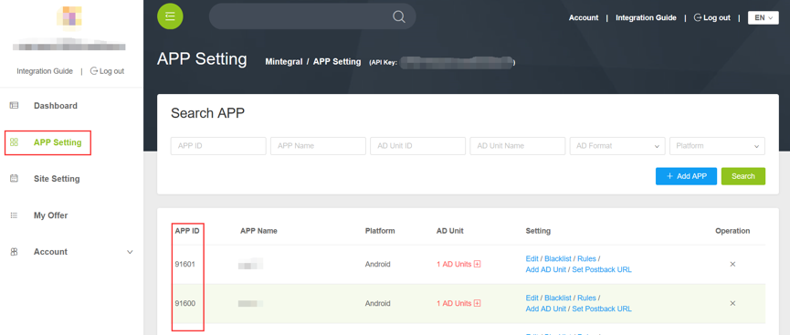

# Adobe AIR Plugin Development Document

##1 Overview
This document describes how Adobe Air publishers integrate Mintegral Adobe AIR Plugin product. Four types of Ads including RewardVideo, AppWall, OfferWall, Interstitial,Interstitial Video are provided in the Plugin.

###File provided： 
**Basic AD： MTGAdobeAirMintegral.ane**  
**Android-V4：MTGAdobeAirAndroidSupportV4.ane**  
**Android-V7：MTGAdobeAirAndroidSupportV7.ane**  

###Integrated Attention：

MTGAdobeAirMintegral.ane Contains RewardVideo 、OfferWall、Interstitial advertising form，You can only integrate MTGAdobeAirMintegral.ane if you don't need the AppWall ad format.

AppWall forms of advertising, no integrated android-support-v4.jar file in the project, need to integrate MTGAdobeAirAndroidSupportV4.ane, integrated android-support-v4.jar file, MTGAdobeAirAndroidSupportV4.ane file is not required.

The MTGAdobeAirAndroidSupportV7.ane file is for FaceBook advertising, integrated according to specific needs.

##2 Integration Prepare
###2.1 Apply an Account
Publishers can acquire the account and password from  [Mintegral OM](http://mmonetization.com/user/login ) to upload to the Mintegral portal.
###2.2 App Key
Every publisher’s accounts will have their relative AppKey. AppKey is needed when request Ads, which can be acquired form Mintegral portal. Log in Mintegral portal, publishers can view the AppKey of this account in AD Unit -> App page. As the picture shows:  
   
###2.3 App Id
The system will automatically create an AppId after publishers creates an App. Publishers can view the created App and its relative AppId in the AD Unit -> App page.  

###2.4 Unit Id
The system will automatically create an UnitId after publishers creates an unit. Publishers can view the created unit and its relative UnitId in the AD Unit -> App Unit page.       
        

## 3 Settings of Adobe Air Development Environment
### 3.1 Development Demand

Adobe Flash Builder 4.7    
Adobe AIR SDK 4.0  
Mintegral Adobe AIR Plugin ANE

### 3.2 Update Air SDK
The minimum version is Adobe Air SDK 4.0. So publishers need to download the latest [AIR SDK](http://www.adobe.com/devnet/air/air-sdk-download.html) and copy it to the SDKS catalogue of Flash Builder. 
	
### 3.3 Set up Adobe AIR Plugin
Download Adobe Air Plugin ANE and include it in your project according to the following step.

Click “Project” in Flash Builder and then redirect to Attributes ➣Flex Create Path ➣Local extension. Click“ AddANE .. ” to addMintegral Adobe AIR Plugin ANE. Click “Project” and then redirect to ➣ FlexCreate Package ➣ Android / iOS ➣ Native Extension, and confirmMintegral Adobe AIR Plugin ANEmarked by“Package”.

Attention: If publishers use Adobe Animate CC, please redirect to Document➣ActionScript Settings ➣ Library Path, and then addMintegral Adobe AIR Plugin ANEdocument.

## 4 Initialize Mintegral Adobe AIR Plugin

### 4.1 Instrucition of EU-GDPR version
Beginning on May 25th, 2018, the European Union’s General Data Protection Regulation (GDPR) will go into effect. Developers need to update the Mintergal SDK and integrate it as follows, otherwise it will affect ads serving. At the same time,  we have updated [Mintegral Privacy Policy.](https://www.mintegral.com/en/privacy/)<br>

**Attention**     
1、only for sdk version v_8.11.0 and above,The corresponding adapter version is V_1.3.0.     
2、only for sdk version v_3.8.0 and above,The corresponding adapter version is V_1.3.0.      
3、If users deny to authorize to collect infomation, it will have impact on delivering ads, might have no ads returned，Please be kindly notified.      
4、For Europe users, should get user authorization before initing SDK. Don't init sdk first，to avoid other conflict.        

**1、New API instrucition**   
Android New API instrucition

```C#
//Android New API instrucition
	private static string AUTHORITY_KEY_ALL_INFO = "authority_all_info";  //Main switch（Control all of the following parameters）
	private static string AUTHORITY_KEY_GENERAL_DATA = "authority_general_data";
	private static string AUTHORITY_KEY_DEVICE_ID = "authority_device_id";
	private static string AUTHORITY_KEY_GPS = "authority_gps";
	private static string AUTHORITY_KEY_IMEI_MAC = "authority_imei_mac";
	private static string AUTHORITY_KEY_ANDROID_ID = "authority_android_id";
	private static string AUTHORITY_KEY_APP_LIST = "authority_applist";
	private static string AUTHORITY_KEY_APP_DOWNLOAD = "authority_app_download";
	private static string AUTHORITY_KEY_APP_PROGRESS = "authority_app_progress";

	private static string IS_SWITCH_ON = "ON";//Allow  get user information	
	private static string IS_SWITCH_OFF = "OFF";//Rejecting access to user information 
	
```

iOS New API instrucition

```C#
//iOS New API instrucition
	private static string AUTHORITY_KEY_ALL_INFO = "authority_all_info";  //Main switch（Control all of the following parameters）
	private static string AUTHORITY_KEY_GENERAL_DATA = "authority_general_data";
	private static string AUTHORITY_KEY_DEVICE_ID = "authority_device_id";
	private static string AUTHORITY_KEY_GPS = "authority_gps";
	
	private static string IS_SWITCH_ON = "ON";//Allow  get user information	
	private static string IS_SWITCH_OFF = "OFF";//Rejecting access to user information 
	
```


**2、Two ways to display user privacy information protocol dialog**    
1、pop-up dialog,allowing users to choose whether to  follow the EU GDPR agreement.     

```C#
		//pop-up dialog
		mtgAir.showUserPrivateInfoTips();
		
		//Callback dialog status
		mtgAir.addEventListener("onShowUserInfoTips", onShowUserInfoTips);
		
		private function onShowUserInfoTips(event:StatusEvent):void
		{
			var tempLog:String = "code : "+event.code + "  -;-  level : "+event.level+" \n"; 
				trace(tempLog); 
		}		
```

 2、set method（Take iOS as an example）

```C#
	//Developers can set which userinfo can be gathered. 
    mtgAir.setUserPrivateInfoType(AUTHORITY_KEY_GENERAL_DATA,IS_SWITCH_ON);
	mtgAir.setUserPrivateInfoType(AUTHORITY_KEY_GPS,IS_SWITCH_OFF);
	mtgAir.setUserPrivateInfoType(AUTHORITY_KEY_DEVICE_ID,IS_SWITCH_ON);
	mtgAir.setUserPrivateInfoType(AUTHORITY_KEY_ALL_INFO,IS_SWITCH_OFF);
		
```

**3、Get user selection result**      
         
```C#           
   //get GDPR
		trace ("userPrivateInfo AUTHORITY_KEY_GPS : " + mtgAir.userPrivateInfo (AUTHORITY_KEY_GPS));          
		trace ("userPrivateInfo AUTHORITY_KEY_DEVICE_ID : " + mtgAir.userPrivateInfo (AUTHORITY_KEY_DEVICE_ID));     
		trace ("userPrivateInfo AUTHORITY_KEY_ALL_INFO : " + mtgAir.userPrivateInfo (AUTHORITY_KEY_ALL_INFO));      
		trace ("userPrivateInfo AUTHORITY_KEY_GENERAL_DATA : " + mtgAir.userPrivateInfo (AUTHORITY_KEY_GENERAL_DATA));   
				
```


### 4.2 Initialization 
Importing the MTGAdobeAirMintegral.ane file must be call init () method at the time the application is initialized.

**Import**  

```actionScript  
	import com.mintegralintegral.plugin.airsdk.base.MTGAdobeAirMintegral;
```

**Initialize**

```actionScript  
	private var mtgAir:MTGAdobeAirMintegral =  MTGAdobeAirMintegral.getInstance();
	mtgAir.init(AppId,AppKey);
```

### 4.3 Android edition AndroidManifest.xml

**Open AndroidManifest.xml and set up according to the following content:**

**Required Authority**

```actionScript
    <uses-permission android:name="android.permission.INTERNET" />
    <uses-permission android:name="android.permission.WRITE_EXTERNAL_STORAGE"/>
    <uses-permission android:name="android.permission.ACCESS_NETWORK_STATE" />
```

**Non-required Authority**

```actionScript
    <uses-permission android:name="android.permission.ACCESS_WIFI_STATE" />
    <uses-permission android:name="android.permission.READ_PHONE_STATE" />
    <uses-permission android:name="android.permission.ACCESS_COARSE_LOCATION" />
    <uses-permission android:name="android.permission.ACCESS_FINE_LOCATION" />
```

**Boot mode modification，need "singleTop" or "standard"，not "singleTask"**

```actionScript
    <activity android:launchMode="singleTop">
      <intent-filter>
       <action android:name="android.intent.action.MAIN"/>
       <category android:name="android.intent.category.LAUNCHER"/>
      </intent-filter>
   </activity>
```

### 4.4 iOS edition app.xml
**Set id as Apple Developer Certificate for id**

```actionScript
    <id>com.mobvisita.SDKDemo</id>
```

## 5 RewardVideo Integration
**Integration Result:**

**Horizontal Screen:**


**Vertical Screen:**


**Horizontal Landing Page:**


**Vertical Landing Page:**


### Integration Process 

**1、Please confirm the initialization of Mintegral Adobe Air Plugin accomplished. If the third-party ANE is need to be integrated, please add it in the Local Extensions.**  


**2、Please announce “Activity” of Air Plugin Reward Video in AndroidManifest.xml.**

``` 
<application android:enabled="true">
	 <activity
            android:name="com.mintegral.msdk.reward.player.MTGRewardVideoActivity"
            android:configChanges="orientation|keyboardHidden|screenSize"
            android:theme="@android:style/Theme.NoTitleBar.Fullscreen" />
</application>
```

**3、Set up reward information. Click “Set up Virtual Reward”, the RewardId will be created automatically after reward information is set up.**            


**4、 Set up callback mode when creating units. Publishers can receive callback after video is played.**


**Sever Callback Mode:**

**To announce Callback Url, publishers can only edit the url.**

**For example:http(s)://www.sampleurl.com/mintegral?user_id={user_id}&trans_id={trans_id}&reward_amout={reward_amount}&reward_name={reward_name}&sign={sign}&unit_id={unit_id}**

**Client Callback Mode:**
**Set up setRewardVideoListener, which will be callback when the video is completed. Please read the JSON string in event.level to parse the reward information.**	

```actionScript
	public function onAdClose(event:StatusEvent):void
	{
		trace("reward info :" + "RewardName:"+ "RewardAmout:" + event.level);
	}
```
**5、Create the audience of MTGAdobeAirMintegral.**  


**Import**  

```actionScript  
	import com.mintegral.plugin.airsdk.base.MTGAdobeAirMintegral;
```

**Initialize**

```actionScript  
	private var mtgAir:MTGAdobeAirMintegral =  MTGAdobeAirMintegral.getInstance();
```

**6、Set up listener callback**  

```actionScript
	mtgAir.addEventListener("onLoadSuccessRewardVideo", onSuccess);
	mtgAir.addEventListener("onLoadFailRewardVideo", onLoadFail);
	mtgAir.addEventListener("onShowFailRewardVideo", onShowFail);
	mtgAir.addEventListener("onAdShowRewardVideo", onAdShow);
	mtgAir.addEventListener("onAdCloseRewardVideo", onAdClose);
	mtgAir.addEventListener("onAdClickedRewardVideo", onAdClicked);
	
		private function onSuccess(event:StatusEvent):void
		{
			trace(event.level);
		}
			
		private function onLoadFail(event:StatusEvent):void
		{
			trace(event.level);
		}
			
		private function onShowFail(event:StatusEvent):void
		{
			trace(event.level);
		}
			
		private function onAdShow(event:StatusEvent):void
		{
			trace(event.level);
		}
			
		private function onAdClose(event:StatusEvent):void
		{
			trace(event.level);
		}
			
		private function onAdClicked(event:StatusEvent):void
		{
			trace(event.level);
		}
```
**7、The loadRewardVideo Method.**

```actionScript
   mtgAir.loadRewardVideo(UnitId);
```
**8、Before playing, please judge whether the video isready, if it istrue, then callshowmethod and play, if it is not, then loadagain.**  

```actionScript
    if (mtgAir.isReadyRewardVideo(UnitId)) {
		mtgAir.showRewardVideo(UnitId,RewardId,UserId);
	}else{
		mtgAir.loadRewardVideo(UnitId);
	}
```
**9、Introduction of RewardVideo advertisement form related method.**

***

<table><tr><td bgcolor=#DCDCDC>public void loadRewardVideo（UnitId:String）</td></tr></table>

> This type is used to load RewardVideo.

|Parameter Name|Parameter Information  |
| ------------- |:-------------:|
| UnitId  | created by Mintegral |

***

<table><tr><td bgcolor=#DCDCDC>public void showRewardVideo（UnitId:String,RewardId:String,UserId:String）</td></tr></table>

> This type is used to show Reward Video.

|Parameter Name|Parameter Information  |
| ------------- |:-------------:|
| UnitId  | created by Mintegral |
| RewardId  | RewardId, corresponding to the reward information of Mintegral  |
| UserId  | User Id, return reward by users’ information  |


***

<table><tr><td bgcolor=#DCDCDC>public boolean isReadyRewardVideo(UnitId:String）</td></tr></table>

> Whether the video is ready to play.

|Parameter Name|Parameter Information  |
| ------------- |:-------------:|
| UserId  | created by Mintegral |

***

<table><tr><td bgcolor=#DCDCDC>public void addEventListener(code, level)</td></tr></table>

> Listen the status related to video Ads.

|Parameter Name|Parameter Information  |
| ------------- |:-------------:|
| onLoadSuccessRewardVideo  | Ad data loaded successfully  |
| onLoadFailRewardVideo  | Ad data loaded failed  |
| onShowFailRewardVideo  | Ad playback failed  |
| onAdShowRewardVideo  | The ads are on  |
| onAdCloseRewardVideo  | After the advertisement is finished, the reward information is obtained  |
| onAdClickedRewardVideo  | Ad installation interface Click  |

***


## 6 AppWall Integration

**Integration Result:**


### Integration Process  

**AppWall forms of advertising, no integrated android-support-v4.jar file in the project, need to integrate MTGAdobeAirAndroidSupportV4.ane, integrated android-support-v4.jar file, MTGAdobeAirAndroidSupportV4.ane file is not required.**

**1、Please confirm the initialization of Mintegral Adobe Air Plugin accomplished. If the third-party ANE is need to be integrated, please add it in the Local Extensions.**  

**2、Please announce “Activity” of Air Plugin AppWall in AndroidManifest.xml.**


``` 
<application android:enabled="true">
   <!-- If the wall needs to be integrated, immersive, please add onetheme -->
    <activity 
        android:name="com.mintegral.msdk.shell.MTGActivity"
        android:configChanges="keyboard|orientation"
        android:screenOrientation="portrait"
        android:theme="@style/AppTheme2" >  
    </activity>
    <!--If you configure the wall to be immersive, add the following styles in the res/values/style file-->  
    <style name="AppTheme2" parent="AppBaseTheme">
    <item name="android:windowNoTitle">true</item>
    <item name="android:windowTranslucentStatus">true</item>
    <item name="android:windowTranslucentNavigation">true</item></style>
</application>
```

**3、Create the audience of MTGAdobeAirMintegral**  

**Import**  

```actionScript        
	import com.mintegral.plugin.airsdk.base.MTGAdobeAirMintegral;
```

**Initialize**

```actionScript  
	private var mtgAir:MTGAdobeAirMintegral =  MTGAdobeAirMintegral.getInstance();
```
**4、The preloadWall Method.**

```actionScript
   mtgAir.preloadWall(UnitId);
```
**5、The showAppWall Method.**  

```actionScript
    mtgAir.showAppWall(UnitId);
```

**6、Introduction of AppWall advertisement form related method.**

> Used to pre load AppWall


<table><tr><td bgcolor=#DCDCDC>public void preloadWall（UnitId:String）</td></tr></table>

|Parameter Name|Parameter Information  |
| ------------- |:-------------:|
| UnitId  | created by Mintegral  |

***

> Used to pre display AppWall


<table><tr><td bgcolor=#DCDCDC>public void showAppWall（UnitId:String）</td></tr></table>

|Parameter Name|Parameter Information  |
| ------------- |:-------------:|
| UnitId  | created by Mintegral  |

***

## 7 OfferWall Integration
**Integration Result:**


### Integration Process 

**1、 Please confirm the initialization of Mintegral Adobe Air Plugin accomplished. If the third-party ANE is need to be integrated, please add it in the Local Extensions.**  


**2、 Please announce “Activity” of Air Plugin OfferWall in AndroidManifest.xml.**

``` 
<application android:enabled="true">
         <activity
            android:name="com.mintegral.msdk.offerwall.view.MTGOfferWallActivity"
            android:screenOrientation="portrait"
            android:configChanges="screenSize|orientation"/>
        <activity
            android:name="com.mintegral.msdk.offerwall.view.MTGOfferWallRewardVideoActivity"
            android:configChanges="keyboardHidden|orientation|screenSize"
            android:theme="@android:style/Theme.NoTitleBar.Fullscreen"
            android:screenOrientation="landscape" />
</application>

```

**3、setting callback mode：**


**When the MTG server is notify of the user to complete the task, through the Callback URL notify the developer server, for the user to add points, for developers, the way to achieve a little complex, but high security.**

**Server callback mode:**

**Statement callbakUrl, only need to modify the host part of the developer**

**http(s)://www.sampleurl.com/mintegral?user_id={user_id}&trans_id={trans_id}&reward_amout={reward_amount}&reward_name={reward_name}&sign={sign}&unit_id={unit_id}**

**MTG ServerInformed that the increase in the user_id after the integration, through the callback URL notify developer server.**

**callback url Additional parameters are as follows:**

|parameter        |	describe         |
| ------------- |:-------------:|
| user_id | User ID，Set by developer |
| reward_amount | Users should get reward  |
| reward_name | reward name   |
| unit_id | UnitId   |
| trans_id | Transmission ID, MTG server generation, uniqueness   |
| sign | Encryption identifier MD5(user_id_reward_amount_trans_id_security_key)   |

**Once the developer server receives postback, you need to return to the Mintegral server 200 or 403.**

```objectivec
200 express：Users have been rewarded successfully.

403 express exception:
1. sign no match
2. user_id no existent
3. Other errors，Mintegral Server Don't repeat the same message
```


**MTG Server initiated after Postback，If timeout (20 seconds) no response，Try again every 5 minutes within 24 hours。**

**Client callback mode:**

**1.If it is a video class offer,user see 80%，SDK callback onOfferWallCreditsEarned method**

**2.If it is a download class offer, developers need to call.**

```actionScript
	mtgAir.queryRewardsOffWall();
	mtgAir.addEventListener("queryRewardsOfferWall", onQueryRewards);
	private function onQueryRewards(event:StatusEvent):void
	{
		trace(event.level);
	}  
	
```

**4、Set up listener callback for OfferWall Advertising form.**

```actionScript
	mtgAir.addEventListener("onLoadSuccessOffWall", onSuccess);
	mtgAir.addEventListener("onLoadFailOffWall", onLoadFail);
	mtgAir.addEventListener("onShowFailOffWall", onShowFail);
	mtgAir.addEventListener("onAdShowOffWall", onAdShow);
	mtgAir.addEventListener("onAdCloseOffWall", onAdClose);
	mtgAir.addEventListener("onAdClickedOffWall", onAdClicked);
	mtgAir.addEventListener("onAdCreditsEarnedOffWall", onCreditsEarned);
	mtgAir.addEventListener("queryRewardsOffWall", onQueryRewards);

		private function onSuccess(event:StatusEvent):void
		{
			trace(event.level);
		}
			
		private function onLoadFail(event:StatusEvent):void
		{
			trace(event.level);
		}
			
		private function onShowFail(event:StatusEvent):void
		{
			trace(event.level);
		}
			
		private function onAdShow(event:StatusEvent):void
		{
			trace(event.level);
		}
			
		private function onAdClose(event:StatusEvent):void
		{
			trace(event.level);
		}
			
		private function onAdClicked(event:StatusEvent):void
		{
			trace(event.level);
		}
		
		private function onCreditsEarned(event:StatusEvent):void
		{
			trace(event.level);
		}
			
		private function onQueryRewards(event:StatusEvent):void
		{
			trace(event.level);
		}
	
```

**5、Create the audience of MTGAdobeAirMintegral.**  

**Import**  

```actionScript  
	import com.mintegral.plugin.airsdk.base.MTGAdobeAirMintegral;
```

**Initialize**

```actionScript  
	private var mtgAir:MTGAdobeAirMintegral = MTGAdobeAirMintegral.getInstance();
```
**6、The Load Method of Calling OfferWall Advertising form.**  
**Note: UserId must have value**

```actionScript
	mtgAir.loadOffWall(UnitId,KAdCategoryIDForiOS,UserId);
```

**7、The Show Method of Calling OfferWall Advertising form.**

```actionScript
   mtgAir.showOffWall();
```

**8、Introduction of OfferWall advertisement form related method.**

<table><tr><td bgcolor=#DCDCDC>public void loadOffWall（UnitId:String KAdCategoryIDForiOS:String,UserId:String）</td></tr></table>

> This type is used to load OfferWall.

|Parameter Name|Parameter Information  |
| ------------- |:-------------:|
| UnitId  | created by Mintegral  |
| KAdCategoryIDForiOS  | iOS version controls the ID in the ad format  |
| UserId  | User ID  |

#### Conventional data type


```actionScript
typedef NS_ENUM(NSInteger, KAdCategoryIDForiOS) {
    MTGOFFERWALL_AD_CATEGORY_ALL  = 0,
    MTGOFFERWALL_AD_CATEGORY_GAME = 1,
    MTGOFFERWALL_AD_CATEGORY_APP  = 2,
};
```

> Control advertising types, among which,MTGOFFERWALL_AD_CATEGORY_ALL,Unlimited type，MTGOFFERWALL_AD_CATEGORY_GAME,Advertising for games,MTGOFFERWALL_AD_CATEGORY_APP,Application class ads can be selected as needed. If there is no special requirement for the type of advertisement,input MTGOFFERWALL_AD_CATEGORY_ALL(or number 0).

***

<table><tr><td bgcolor=#DCDCDC>public void showOffWall（）</td></tr></table>

> The Show Method of Calling OfferWall Advertising form.

***

<table><tr><td bgcolor=#DCDCDC>public boolean setAlertOffWall(alertMsg:String,leftTitle:String,rightTitle:String）</td></tr></table>

> Sets the prompt box, text, and button text to close the video

**This method works only in the iOS version**

|Parameter Name|Parameter Information  |
| ------------- |:-------------:|
| alertMsg  | Tooltip text  |
| leftTitle  | Prompt box, left button text, function to close video  |
| rightTitle  | Prompt box, right button text, function exit prompt box|

***

<table><tr><td bgcolor=#DCDCDC>public void queryRewardsOffWall（）</td></tr></table>

> Proactively querying reward information.

***

<table><tr><td bgcolor=#DCDCDC>public void addEventListener(code, level)</td></tr></table>

> Listen the status related to OfferWall Ads.


|Parameter Name|Parameter Information  |
| ------------- |:-------------:|
| onLoadSuccessOffWall  | Ad data loaded successfully  |
| onLoadFailOffWall  | Ad data loaded failed  |
| onShowFailOffWall  | Ad playback failed  |
| onAdShowOffWall  | The ads are on  |
| onAdCloseOffWall  | After the advertisement is finished, the reward information is obtained  |
| onAdClickedOffWall  | Ad installation interface Click  |
| onAdCreditsEarnedOffWall  | After the advertisement is finished, the reward information is obtained  |
| queryRewardsOffWall  | Proactively querying reward information  |

***

## 8 Interstitial Integration
**Integration Result：**


**1、Please confirm the initialization of Mintegral Adobe Air Plugin accomplished. If the third-party ANE is need to be integrated, please add it in the Local Extensions.**  


**2、Please announce “Activity” of Air Plugin Interstitial in AndroidManifest.xml.**


```actionScript 
  <activity
            android:name="com.mintegral.msdk.interstitial.view.MTGInterstitialActivity"
            android:screenOrientation="portrait"
            android:configChanges="orientation|screenSize"/>
```

**3、Set up listener callback for MTGEntryInterstitial audience**

```actionScript
	mtgAir.addEventListener("onLoadSuccessInterstitial", onSuccess);
	mtgAir.addEventListener("onLoadFailInterstitial", onLoadFail);
	mtgAir.addEventListener("onShowFailInterstitial", onShowFail);
	mtgAir.addEventListener("onAdShowInterstitial", onAdShow);
	mtgAir.addEventListener("onAdCloseInterstitial", onAdClose);
	mtgAir.addEventListener("onAdClickedInterstitial", onAdClicked);

		private function onSuccess(event:StatusEvent):void
		{
			trace(event.level);
		}
			
		private function onLoadFail(event:StatusEvent):void
		{
			trace(event.level);
		}
			
		private function onShowFail(event:StatusEvent):void
		{
			trace(event.level);
		}
			
		private function onAdShow(event:StatusEvent):void
		{
			trace(event.level);
		}
			
		private function onAdClose(event:StatusEvent):void
		{
			trace(event.level);
		}
			
		private function onAdClicked(event:StatusEvent):void
		{
			trace(event.level);
		}
	
```

**4、Create the audience of MTGAdobeAirMintegral.**  

**Import**  

```actionScript  
	import com.mintegral.plugin.airsdk.base.MTGAdobeAirMintegral;
```

**Initialize**

```actionScript  
	private var mtgAir:MTGAdobeAirMintegral = MTGAdobeAirMintegral.getInstance();
```

**5、The Load Method of Calling Interstitial Advertising form.**

```actionScript
   mtgAir.loadInterstitial(UnitId,KAdCategoryIDForiOS);
```

**6、The Show Method of Calling Interstitial Advertising form.**

```actionScript
   mtgAir.showInterstitial();
```

**7、Introduction of Interstitial advertisement form related method.**

<table><tr><td bgcolor=#DCDCDC>public void loadInterstitial（UnitId:String KAdCategoryIDForiOS:String）</td></tr></table>

> This type is used to load Interstitial.

|Parameter Name|Parameter Information  |
| ------------- |:-------------:|
| UnitId  | created by Mintegral   |
| KAdCategoryIDForiOS  | iOS version controls the ID in the ad format   |

#### Conventional data type


```actionScript
typedef NS_ENUM(NSInteger, KAdCategoryIDForiOS) {
    MTGOFFERWALL_AD_CATEGORY_ALL  = 0,
    MTGOFFERWALL_AD_CATEGORY_GAME = 1,
    MTGOFFERWALL_AD_CATEGORY_APP  = 2,
};
```

> Control advertising types, among which,MTGOFFERWALL_AD_CATEGORY_ALL,Unlimited type，MTGOFFERWALL_AD_CATEGORY_GAME,Advertising for games,MTGOFFERWALL_AD_CATEGORY_APP,Application class ads can be selected as needed. If there is no special requirement for the type of advertisement,input MTGOFFERWALL_AD_CATEGORY_ALL(or number 0).

***

<table><tr><td bgcolor=#DCDCDC>public void showInterstitial（）</td></tr></table>

> This type is used to show Interstitial .

***

<table><tr><td bgcolor=#DCDCDC>public void addEventListener(code, level)</td></tr></table>

> Listen the status related to Interstitial Ads.

|Parameter Name|Parameter Information  |
| ------------- |:-------------:|
| onLoadSuccessInterstitial  | Ad data loaded successfully  |
| onLoadFailInterstitial  | Ad data loaded failed  |
| onShowFailInterstitial  | Ad playback failed  |
| onAdShowInterstitial  | The ads are on  |
| onAdCloseInterstitial  | The advertisement is finished|
| onAdClickedInterstitial  | Ad installation interface Click  |
***


## 9 Interstitial Video Integration
**Integration Result：**


**1、Please confirm the initialization of Mintegral Adobe Air Plugin accomplished. If the third-party ANE is need to be integrated, please add it in the Local Extensions.**  


**2、Please announce “Activity” of Air Plugin Interstitial Video in AndroidManifest.xml.**


```actionScript 
   <activity
            android:name="com.mintegral.msdk.reward.player.MTGRewardVideoActivity"
            android:configChanges="orientation|keyboardHidden|screenSize"
            android:theme="@android:style/Theme.NoTitleBar.Fullscreen" />
```

**3、Set up listener callback for MTGEntryInterstitial audience**

```actionScript	 mtgAir.addEventListener("onLoadSuccessInterstitiaVideo", onSuccess);
			mtgAir.addEventListener("onLoadFailInterstitiaVideo", onLoadFail);
			mtgAir.addEventListener("onShowFailInterstitiaVideo", onShowFail);
			mtgAir.addEventListener("onAdShowInterstitiaVideo", onAdShow);
			mtgAir.addEventListener("onAdCloseInterstitiaVideo", onAdClose);
			mtgAir.addEventListener("onAdClickedInterstitiaVideo", onAdClicked);

		private function onSuccess(event:StatusEvent):void
			{
				trace(event.level);
				var tempLog:String = "code : "+event.code + "  -;-  level : "+event.level+" \n";
				tArea.text += tempLog;
				label1.text = "loaded is OK";
			}
			
			private function onLoadFail(event:StatusEvent):void
			{
				trace(event.level);
				var tempLog:String = "code : "+event.code + "  -;-  level : "+event.level+" \n";
				tArea.text += tempLog;
			}
			
			private function onShowFail(event:StatusEvent):void
			{
				trace(event.level);
				var tempLog:String = "code : "+event.code + "  -;-  level : "+event.level+" \n";
				tArea.text += tempLog;
			}
			
			private function onAdShow(event:StatusEvent):void
			{
				trace(event.level);
				var tempLog:String = "code : "+event.code + "  -;-  level : "+event.level+" \n";
				tArea.text += tempLog;
			}
			
			private function onAdClose(event:StatusEvent):void
			{
				trace(event.level);
				var tempLog:String = "code : "+event.code + "  -;-  level : "+event.level+" \n";
				tArea.text += tempLog;
			}
			
			private function onAdClicked(event:StatusEvent):void
			{
				trace(event.level);
				var tempLog:String = "code : "+event.code + "  -;-  level : "+event.level+" \n";
				tArea.text += tempLog;
			}	

	
```

**4、Create the audience of MTGAdobeAirMintegral.**  

**Import**  

```actionScript  
	import com.mintegral.plugin.airsdk.base.MTGAdobeAirMintegral;
```

**Initialize**

```actionScript  
	private var mtgAir:MTGAdobeAirMintegral = MTGAdobeAirMintegral.getInstance();
	
```

**5、The Load Method of Calling Interstitial Advertising form.**

```actionScript
   mtgAir.loadInterstitialVideo(unitId);
```

**6、The Show Method of Calling Interstitial Advertising form.**

```actionScript
   mtgAir.showInterstitialVideo();
```

**7、Introduction of Interstitial advertisement form related method.**

<table><tr><td bgcolor=#DCDCDC>public void loadInterstitialVideo（UnitId:String）</td></tr></table>

> This type is used to load Interstitial Video.

|Parameter Name|Parameter Information  |
| ------------- |:-------------:|
| UnitId  | created by Mintegral   |


<table><tr><td bgcolor=#DCDCDC>public void showInterstitialVideo（）</td></tr></table>

> This type is used to show InterstitialVideo .

***

<table><tr><td bgcolor=#DCDCDC>public void addEventListener(code, level)</td></tr></table>

> Listen the status related to Interstitial Video Ads.

|Parameter Name|Parameter Information  |
| ------------- |:-------------:|
| onLoadSuccessInterstitialVideo  | Ad data loaded successfully  |
| onLoadFailInterstitialVideo  | Ad data loaded failed  |
| onShowFailInterstitialVideo  | Ad playback failed  |
| onAdShowInterstitialVideo  | The ads are on  |
| onAdCloseInterstitialVideo  | The advertisement is finished|
| onAdClickedInterstitialVideo  | Ad installation interface Click  |
***


​             
## 10 FAQs


1. Why some of the returned Ad is in Chinese while the phone system language is English? Answer: This is not related to language but to IP Address.

2. Why the ads jump so slowly for the first time? Answer: The ads will jump for several times in 302 jump type, then to the final url. Publishers can set up a loading dialog from the very begining of this process.

3. Why the ads are the same for each return? A: Mintegral’s Ads refreshes hourly.

3. If the debug version does not crash, but the release version crashes, what is the reason? Make sure that the Proguard file is in accordance with the requirement of the integration document.

5. Why the time of jumping to Google paly is so long? 1. Network reasons. 2. The first time is a bit of slow, after that, there will be a cache, and the jump will be faster.

6. RewardVideo is a black screen after back from Google play ? Make sure that the Reward video is declared in the manifest.xml file like this:

```actionScript
   <activity
            android:name="com.mintegral.msdk.reward.player.MTGRewardVideoActivity"
            android:configChanges="orientation|keyboardHidden|screenSize"
            android:theme="@android:style/Theme.NoTitleBar.Fullscreen" />
```

## 11 API
### Mintegral Adobe AIR Plugin  ###

#### Class Introduction ####
> Used for SDK initialization and preload.

####  Member Method  ####
<table><tr><td bgcolor=#DCDCDC>public function <font color=#00000 face="Microsoft YaHei" size =4>init</font>(appId:String,appKey:String)</td></tr></table>
> **A Map object will be generated within AppID and AppKey, to import Map parameter of init.**

***

<table><tr><td bgcolor=#DCDCDC>public function <font color=#00000 face="Microsoft YaHei" size =4>Version</font>():String</td></tr></table>
> **Return this currect version of Plugin**

***

<table><tr><td bgcolor=#DCDCDC>public function set<font color=#00000 face="Microsoft YaHei" size =4> DEBUG</font>(bol:Boolean)</td></tr></table>
> **Set output print log，default false**

***


## 12 ChangeLog

version | changeLog | date
------|-----------|------
1.6.0 |Based on Android9.9.0 and iOS5.2.0 SDK version,add the onInterActiveMaterialLoaded method and onInterActivePlayingComplete method of InterActive ad.| Apr 02,2018 
1.5.0 |Based on Android9.0.0 and iOS3.4.0 SDK version，add interActive ad format and update new method to the GDPR settings.| Sep 05,2018 
1.4.0 |Replace the Mintegral package name.|Aug 01,2018
 1.3.0	 |Based on Android8.11.2 and iOS 3.8.0 SDK version, Supported GDPR function. | May 18,2018 
 1.2.0 |Based on the Android 8.8.0 and the iOS 3.4.1 SDK version.| Mar 19,2018
1.1.0 |Based on the Android 8.3.3 and the iOS 2.7.1 version, the ANE file is organized and combined to form the base advertisement MTGAdobeAirMobvista.ane,and separate Android to support ANE files,increase the DEBUG parameter, Version () method.| Oct 11,2017
1.0.5 |Add App Wall ad playback & Interstitialad playback based on Android, 8.3.3, and iOS 2.7.1 versions.| Sep 26,2017
1.0.4 |Add App Wall ad playback based on Android, 8.3.3, and iOS 2.7.1 versions.| Sep 25,2017
1.0.3 |Reward Video ad playback based on Android, 8.3.3, and iOS 2.7.1 versions.| Sep 22,2017
1.0.2 |Reward Video Integration is supported on Andrord and iOS platform.| Sep 08,2017
1.0.1 |Reward Video Integration is supported on Andrord platform.| Sep 09,2017