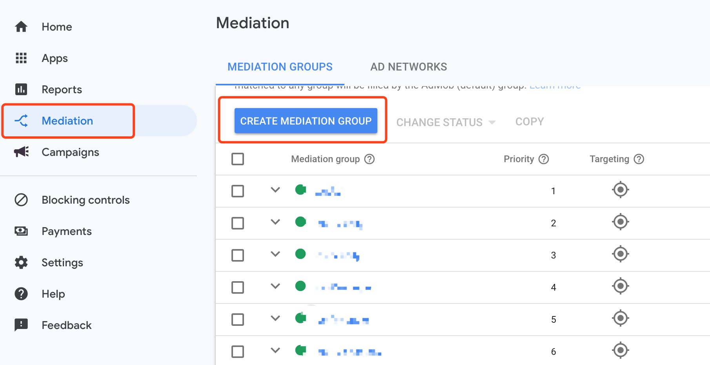

# Android-Admob聚合文档


## 概要

    
本文档描述了如何通过Admob聚合Mintegral SDK，目前支持的广告形式有Banner、Native、Interstitial Video、Rewarded Video。 

 
## 集成前准备

### 入门指南

   
在将Mintegral SDK聚合到Admob之前，请按照以下说明操作：   
1.关于Admob SDK 集成说明，请参考[Admob SDK集成文档](https://firebase.google.com/docs/admob/android/quick-start?hl=zh-CN).        
2.请仔细阅读[Mintegral Android SDK集成文档](http://cdn-adn.rayjump.com/cdn-adn/v2/markdown_v2/index.html?file=sdk-m_sdk-android&lang=cn)，其中介绍了各个广告形式需要导入的包，代码混淆，AndroidManifest权限及Activity注册等必要集成步骤说明。    


## 导入文件
### 导入SDK包
在[Mintegral Android SDK集成文档](http://cdn-adn.rayjump.com/cdn-adn/v2/markdown_v2/index.html?file=sdk-m_sdk-android&lang=cn)中获取SDK下载链接，并根据该文档的说明添加所需要的SDK包。

### 特殊说明
如果您需要使用mtg的插屏广告，则需要单独引入下方依赖包来适配adapter。sdkVersion保持和您引入的sdk版本相同，不需要插屏广告可以忽略这一步
```java
implementation 'com.mbridge.msdk.oversea:interstitialvideo:sdkVersion'
```


### 导入Adapter文件 

<!--**我们提供两种方式添加adapter:使用 Gradle和手动添加方式。**

**Gradle添加方法（支持Android SDK版本9.12.4及以上）**    

```java     
implementation 'com.mintegral.thrid.adapter:admob_adapter:2.2.2'
```-->

**手动添加方式需要导入以下文件**  [下载](https://cdn-adn.rayjump.com/cdn-adn/v2/portal/22/11/07/14/29/6368a5bbea0c5.zip)
 
#### 公共类
AdapterTools.java     

### Banner类型广告所需文件
MBridgeCustomAdapterBanner.java
MBridgeCustomBannerEventForwarder.java
  
#### Native类型广告所需文件       
CustomNativeEventForwarder.java            
MBridgeCustomAdapterNative.java           
MBridgeNativeContentAdMapper.java        
MBridgeNativeAppInstallAdMapper.java                           
MBridgeNativeMappedImage.java        

#### Rewarded Video类型广告所需文件        
AdmobNewRewardVideoAdapter.java      
MBRewardItem.java     
MBridgeExtrasBuilder.java     

#### Interstitial Video类型广告所需文件         
MBridgeCustomAdapterInterstitialVideoNative.java    


## Admob后台配置指南
  
在Admob用户界面，完成如下操作即可设置Custom SDK Network，生效时间大概一小时左右。
  
### 创建Mediation
选择Mediation,然后点击Create Mediation Group.
    
 
### 添加Custom Event
1、进入创建好的Mediation Group，找到最下方Ad sources模块，点击Add Custom Event.    
2、填写"Lable",根据自己需要填写，不能修改。   
3、测试时，需要将默认的AdMob Network 广告源的优化关闭，并将Mintegral的eCPM设置为最高。   

   

### 配置Class Name和Parameter      
1、Class Name填写绝对路径  Mintegral Adapter ClassName.       
2、Parameter使用json格式，参数中不能含有空格，注意大小写，具体格式参考下方各广告形式说明。
  
 


### 欧盟GDPR版本须知    
    
**注意**     
1、仅针对SDK v_8.11.0版本及以上版本，对应adapter 版本为V_2.2.2。      
2、如果不上报用户信息，将会影响广告投放，可能会引起没有广告返回的情况，请知悉。        
3、对于欧盟用户，开发者集成时，建议在征得用户同意之前，先不要初始化SDK，以免引起不必要的麻烦。  
      
```java
MBridgePrivacySettings.setHasUserConsent(true,this);
```
true为允许，false为禁止。

## Banner
1、在Class Name的部分，输入： com.mbrg.adapter.custom.banneradapter.MBridgeCustomAdapterBanner       
2、在Parameter部分，输入AppId、AppKey、UnitId、 PlacementId,例如：

```java
{"appId":"xxxx","appKey":"xxxx","unitId":"xxxx","placementId":"xxxx"} 
```

 
## Native
1、在Class Name的部分，输入：com.mbrg.adapter.custom.nativeadapter.MBridgeCustomAdapterNative       
2、在Parameter部分，输入AppId、AppKey、UnitId、PlacementId,例如：

```java
{"appId":"xxxx","appKey":"xxxx","unitId":"xxxx","placementId":"xxxx"} 
```


## 新Rewarded Video ([admob激励广告 - 新 API（测试版）](https://developers.google.com/admob/android/rewarded-ads)

**支持Google Mobile Ads SDK 19.7.0 及以上**

1、在Class Name的部分，输入： com.mbrg.adapter.custom.rewardbetaadapter.AdmobNewRewardVideoAdapter   
2、在Parameter部分，输入AppId、AppKey、UnitId、PlacementId、RewardId,例如：

```java
{"appId":"xxxx","appKey":"xxxx","unitId":"xxxx","placementId":"xxxx","rewardId":"1"}
```

   

## Interstitial Video 
1、在Class Name的部分，输入： com.mbrg.adapter.custom.interstitialvideoanativedapter.MBridgeCustomAdapterInterstitialVideoNative      
  
2、在Parameter部分，输入AppId、AppKey、UnitId、PlacementId,例如：

```java
{"appId":"xxxx","appKey":"xxxx","unitId":"xxxx","placementId":"xxxx"} 
```
3、加载和展示视频的方式     
3.1、load方法(加载视频)： 
  
```java
{
   mInterstitialAd = new InterstitialAd(this);
    mInterstitialAd.setAdUnitId(admobUnitId);
   mInterstitialAd.loadAd(new AdRequest.Builder().build());
  
  }
```

3.2、show方法(展示视频)：

```java
{
   mInterstitialAd.show();
}
```
   
## ChangeLog

版本号 | ChangeLog | 发布时间
------|-----------|------
3.1.1 | 1.adapter优化，减少Admob初始化时间 | 2022.11.07
3.1.0 | 1.适配admob 20.6.0版本SDK,更改native,iv广告映射类名 | 2022.07.19
3.0.0 | 1.适配admob 20.4.0版本SDK | 2021.11.04
2.3.3 | 1.admob接口适配15.5.5版本以上的SDK | 2021.08.10
2.3.2 | 1.替换所有广告类型映射文件，仅支持MTG SDK 15.4.6版本及以上 | 2021.02.25
2.2.2 | 1.admob native接口升级 2. gdpr接口升级 | 2019.10.29
2.2.1 | 1.支持admob new reward api | 2019.10.22
2.2.0 | 1、增加banner广告样式，支持Mintegral sdk 10.1.1及以上|2019.10.10
2.1.6 | 1、支持gradle集成|2019.7.20
2.1.3 | 1、支持sdk中的iv<br/> 2、mobvista替换为mintegral|2018.6.29
2.1.2 | 基于2.1.1、支持GDPR版本| 2018.05.10
2.1.1 | sdk适配至8.5.1 | 2017.11.23
2.1.0 | 1、新增IV聚合<br/>2、sdk适配至8.3.10| 2017.11.20


 