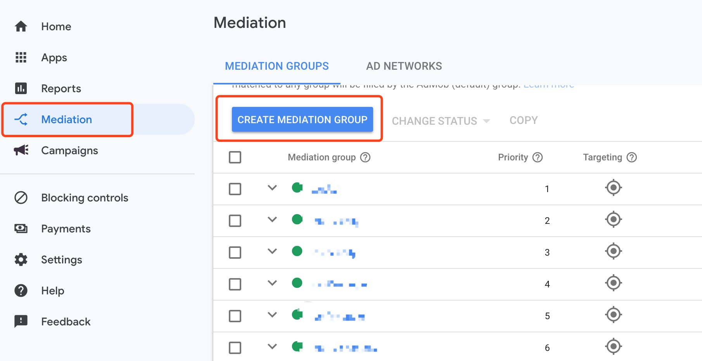
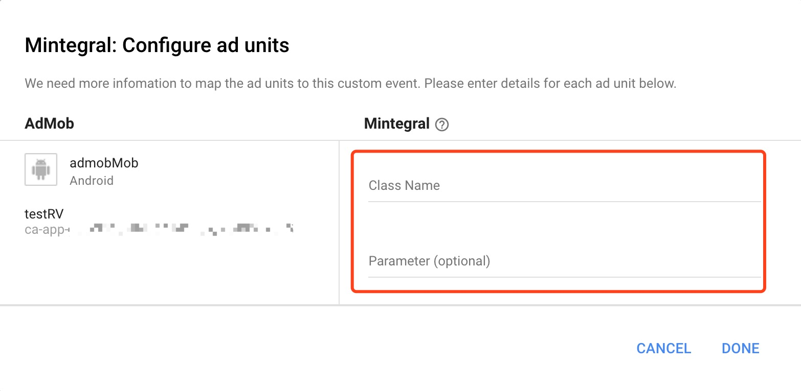

## Overview
The following instructions apply to publishers looking to mediate their Admob inventory to the Mintegral ad platform.
This document provides instructions on how to integrate the Mintegral SDK via Admob. The Mintegral SDK provides ad formats including Banner, Native,Interstitial Video and Rewarded Video.
## Preparation
### Get Started
Before integrating the Mintegral SDK via Admob, please follow the instructions below:    

1. For Admob SDK integration instructions, please refer to Admob SDK integration documentation [Admob SDK integrate documentation] [https://firebase.google.com/docs/admob/android/quick-start](https://firebase.google.com/docs/admob/android/quick-start).   
2. Please read [Mintegral's Android SDK Integration Document] [http://cdn-adn.rayjump.com/cdn-adn/v2/markdown_v2/index.html?file=sdk-m_sdk-android&lang=en](http://cdn-adn.rayjump.com/cdn-adn/v2/markdown_v2/index.html?file=sdk-m_sdk-android&lang=en). There you will find introductions to the various ad formats we support and their respective integration steps. This includes packages that need to be imported, code confusion, necessary permissions and activities to be registered in AndroidManifest.    

## Import The Mintegral SDK      
Get the SDK download link from [Mintegral's Android SDK Integration Document] [http://cdn-adn.rayjump.com/cdn-adn/v2/markdown_v2/index.html?file=sdk-m_sdk-android&lang=en](http://cdn-adn.rayjump.com/cdn-adn/v2/markdown_v2/index.html?file=sdk-m_sdk-android&lang=en). Add the required SDK packages instructed in the document.

### Special Instructions
If you need to use mtg interstitial ads, you need to import the following dependency package separately to adapt the adapter. The sdkVersion remains the same as the sdk version you introduced, you don't need interstitial ads, you can ignore this step
```java
implementation 'com.mbridge.msdk.oversea:interstitialvideo:sdkVersion'
```

## Import The Admob Adapter Files

<!--**There are two ways to add Mintegral adapter to your Android project: using Gradle integration or manual integration.**    

**For Gradle integration**     
(Currently only supports sdk version 9.12.4 and above)   

```java     
implementation 'com.mintegral.thrid.adapter:admob_adapter:2.2.2'   
```-->
**Manual addition requires importing the following files**  [download](https://cdn-adn.rayjump.com/cdn-adn/v2/portal/22/11/07/14/29/6368a5bbea0c5.zip) 

### **Basic Package**
AdapterTools.java  

### **Banner**
MBridgeCustomAdapterBanner.java
MBridgeCustomBannerEventForwarder.java

### **Native**       
CustomNativeEventForwarder.java            
MBridgeCustomAdapterNative.java           
MBridgeNativeContentAdMapper.java        
MBridgeNativeAppInstallAdMapper.java                           
MBridgeNativeMappedImage.java    

### **Rewarded Video**                    
AdmobNewRewardVideoAdapter.java      
MBRewardItem.java     
MBridgeExtrasBuilder.java     
       
### **Interstitial Video**      
MBridgeCustomAdapterInterstitialVideoNative.java    

## AdMob Configuration Guide
In the Admob dashboard, complete the following operations to set up the Custom SDK Network, which takes about an hour.  
### Create Mediation Group
Select Mediation and click Create Mediation Group.
 

### Add Custom Event
1. Go to the Mediation group you just created and click Add custom event in the ad sources table.
2. Fill in a label for the event. 
3. When testing, you need to turn off the default optimizing setting for AdMob's ad source. Simultaneously, set Mintegral's eCPM as the highest so that it is at the top of the mediation chain. 

   
### Configure Class Name And Parameter
1. For the Class Name (required), Mintegral's Adapter Class Name. 
2. The parameters are in Json format. Please keep in mind that the parameters cannot contain spaces and is case sensitive. The parameters for each ad format can be found in the descriptions following this section.

 

## The GDPR Instructions
**Attention**  

1. These instructions are only applicable for SDK version 8.11.0 and above. The corresponding adapter version is 2.2.2.           
2. If users do not authorize Mintegral's SDK to collect data, it will impact the delivery of ads and may even result in zero ad returns.
3. For European users, we strongly recommend getting users' consent before initing the Mintegral SDK.


```java
MBridgePrivacySettings.setHasUserConsent(true,this);
```
true means to give authorization and false means to decline authorization.

## Banner
1. In the custom event class section, you can just input： com.mbrg.adapter.custom.banneradapter.MBridgeCustomAdapterBanner                   
2. In the parameters section, enter the App ID, App Key, Unit ID, Placement ID, for example： 

```java
{"appId":"xxxx","appKey":"xxxx","unitId":"xxxx","placementId":"xxxx"} 
```

## Native
1. In the custom event class section, you can just input： com.mbrg.adapter.custom.nativeadapter.MBridgeCustomAdapterNative                      
2. In the parameters section, enter the App ID, App Key, Unit ID, Placement ID, for example： 

```java
{"appId":"xxxx","appKey":"xxxx","unitId":"xxxx","placementId":"xxxx"} 
```

## New Rewarded Ads -- [admob new Reward Ads](https://developers.google.com/admob/android/rewarded-ads)

**Support Google Mobile Ads SDK 19.7.0 and above**

1. In the custom event class section, you can just input： com.mbrg.adapter.custom.rewardbetaadapter.AdmobNewRewardVideoAdapter       
2. In the parameters section, enter the App ID, App Key, Unit ID, Placement ID, Reward ID, for example：   

```java
{"appId":"xxxx","appKey":"xxxx","unitId":"xxxx","placementId":"xxxx","rewardId":"1"}
```

## Interstitial Video  
1. In the custom event class section, you can just input:com.mbrg.adapter.custom.interstitialvideoanativedapter.MBridgeCustomAdapterInterstitialVideoNative    
2. In the parameters section, enter the App ID, App Key, Unit ID, Placement ID, for example：    

```java
{"appId":"xxxx","appKey":"xxxx","unitId":"xxxx","placementId":"xxxx"} 
```
3.How to load and display video  
    3.1 Load (for loading interstitial video)：   
     
```java
{
   mInterstitialAd = new InterstitialAd(this);
    mInterstitialAd.setAdUnitId(admobUnitId);
   mInterstitialAd.loadAd(new AdRequest.Builder().build());
  
  }
```

  3.2 Show (for showing interstitial video)：

```java
    mInterstitialAd.show();
```

## Change Log
Version   | ChangeLog   | Date
-------|----|----
3.1.1 | 1.Optimize Adapter to reduce Admob SDK initialization time | November 07, 2022
3.1.0 | 1.Adapt to admob 20.6.0 version SDK  2.Change the native、interstitial ad mapping class name| July 19, 2022
3.0.0 | 1.Adapt to admob 20.4.0 version SDK | November 10, 2021
2.3.3| 1. admob adapter adapts to Android SDK 15.5.5 and above  | August 10, 2021
2.3.2| 1. Replace all advertisement type mapping files, only support MTG SDK version 15.4.6 and above  | February 29, 2021
2.2.2| 1. upgrade native adapter 2. upgrade gdpr function | Oct 29, 2019
2.2.1| 1. support admob new reward ads | Oct 22, 2019
2.2.0| 1. Added Banner format,based on mintegral sdk 10.1.1  | Oct 10, 2019
2.1.6| 1. SDK supports gradle integration   | Jul 20, 2019
2.1.3| 1. SDK supports Interstitial Video2. Replaced Mobvista with Mintegral   | Jun 29, 2018  
2.1.2| Based on 2.1.1 support GDPR version |  May 10, 2018   
2.1.1|  Using Mintegral SDK v8.4.0 and above  |  Nov 23, 2017    
2.1.0| 1. Supports Interstitial Video ads2. Adapt to V_8.3.10   |  Nov 20, 2017    

​             
