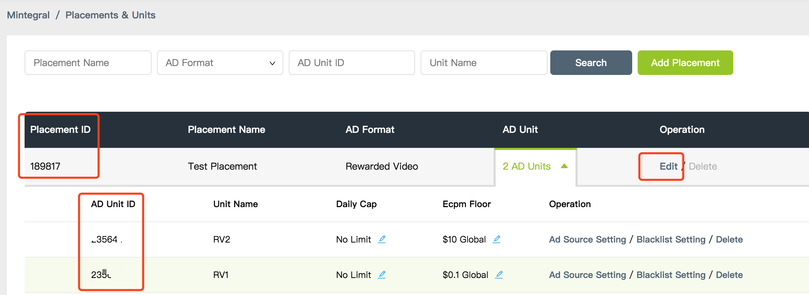
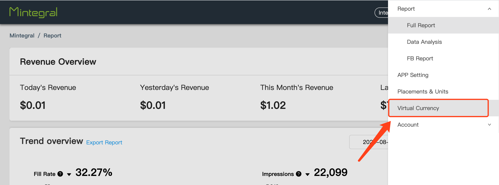
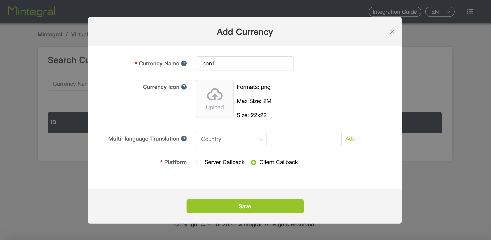
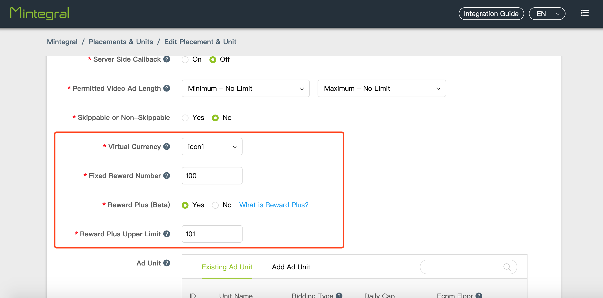
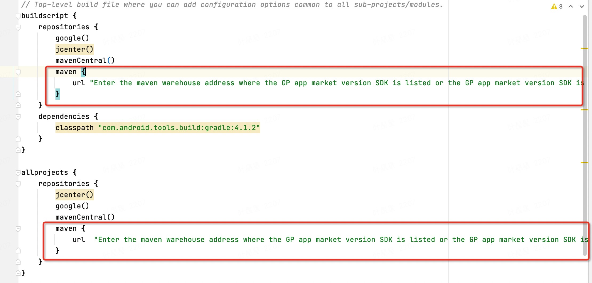
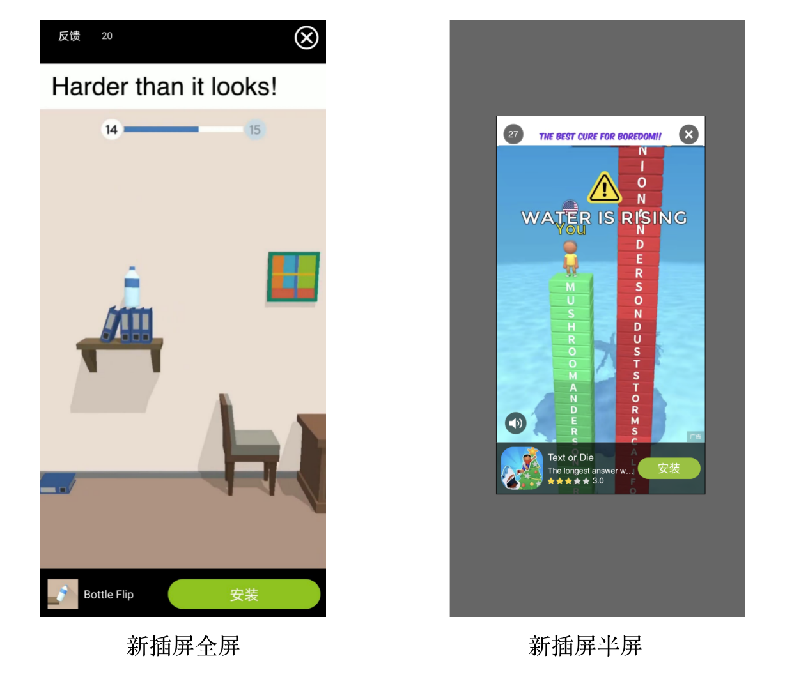
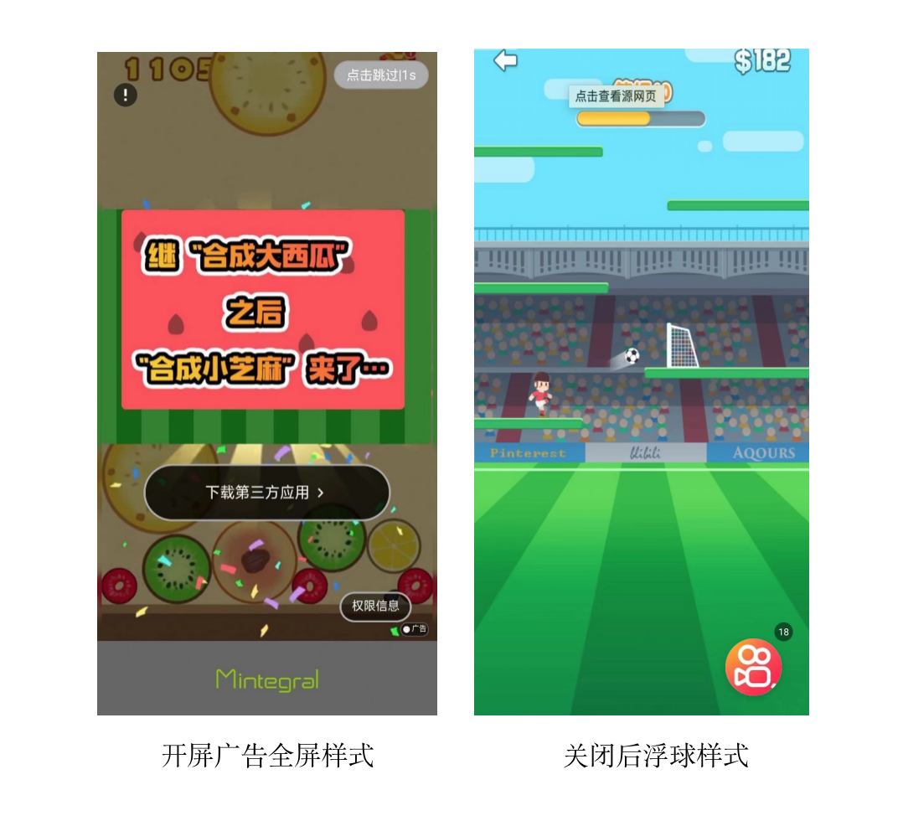

# Android开发文档

## 概要

本文档描述了Android开发者如何集成Mintegral SDK产品，通过集成MBridge sdk 展示广告创造收益。 
Mintegral SDK提供了6种广告形式，包括：Banner(横幅广告)、Native(原生广告,原生视频)、Automatic Rending Native（自动渲染原生广告）、RewardVideo（激励性视频）、Interstitial（新插屏广告）、Splash（开屏广告）。   我擦啊666。。。。。。。。。。。。。。。


## 集成前准备


### 获取账户信息    

**App Key**   

开发者每个账号都有对应的App Key，请求广告时需要用到该参数，它可以从Mintegral开发者后台获取，在**APP Setting -> App Key**界面，可以查看到该账号的App Key，如图所示：  
  

**App Id**        

开发者每创建一个应用后，系统会自动生成App Id，可在**APP Setting -> App Id**界面查看到已创建的应用以及对应的App Id，如图所示：  
    

**Placements & Units**

开发者每创建一个广告版位后，系统会自动生成Placement ID，可在**APP Setting -> Placement Management -> Edit Placement & Unit**界面添加或修改该广告版位的Unit Id，如图所示：<br/><br/>


**数据统计接口**        

参考MTG后台账户管理下接口工具中的文档  


**虚拟货币概念**

Mintegral平台为开发者提供管理部分虚拟货币的能力，使存在内部货币机制的产品可以运用自己的虚拟货币更好地激励用户。</br>      
后台增加“虚拟货币”管理模块，用于管理开发者的虚拟货币信息（Reward Info），Reward info设置信息可以与各种奖励性广告类型Placement ID进行同步，方便开发者管理自己的虚拟货币。
      
**创建虚拟货币**        
在后台右侧菜单栏中找到虚拟货币，进行创建。      
     

**新建货币类型**       
       
      
**配置虚拟货币**  
在Placement下配置虚拟货币    


**代码使用注意事项和导航栏配置信息**  
如果您在后台配置页面中设置的应用为接受apk广告投放，在使用任意广告类型时都需要向代码传入context对象且务必保证是Activity类型（Application context对象会有异常效果）。若展示广告的页面(Activity)为全屏无导航栏状态，请按照此[链接](https://developer.android.google.cn/training/system-ui/navigation)在您的Activity中添加隐藏导航栏的代码，否则可能导致导航栏显示异常。  

如果您使用的是非上架GP市场SDK版本，在使用任意广告时，以Splash广告为例，在A Activity构建SplashHandler,而需要在B Activity展示这种情况时，您需要在广告show之前调用以下代码，传入当前展示广告的activity对象
```java
// currentActivity 是您需要展示的Activity对象

MBridgeSDKFactory.getMBridgeSDK().updateDialogWeakActivity(new WeakReference<Activity>(currentActivity));
```


**集成SDK务必项目中引入RecyclerView**  
<font color=red>如果您使用MTG SDK，请务必在项目中引入RecyclerView依赖。MTG SDK需要RecyclerView组件，否则可能会引起程序的Crash!</font>


**所有广告形式均需要在主线程使用**  
<font color=red>MTG的所有广告形式，均需要您在主线程中加载使用</font>

## 获取SDK

请根据以下提示选择您的集成方式，点击“开始集成”获取SDK    
<iframe data-src="show_code.html" id="iframe_show_code_android"></iframe>

<iframe src="show_code.html"></iframe>

###Demo

在手动下载SDK的zip包里，名称为**MBTest**的是此下载版本对应的Demo

### 获取SDK版本号

MBConfiguration.SDK_VERSION

**注意：**<font color=red>如果使用gradle方式拉取代码失败，在项目根build.gradle文件中添加maven和mavenCentral仓库配置。
```java

 //上架GP市场应用 安卓X版本
 maven {
        url  "https://dl-maven-android.mintegral.com/repository/mbridge_android_sdk_oversea"
 }
 
```
</font>

截图展示:


### 支持小程序
推更小程序版本，需要开发者有第一步["注册appid"](https://open.weixin.qq.com/cgi-bin/frame?t=home/app_tmpl&lang=zh_CN)

```java
//从SDK16.1.7版本起，MTG广告支持小程序跳转功能，非上架GP市场SDK会自动引入opensdk，如果开发者不期望使用小程序，可以使用exclude排除。示例:
implementation ('com.mbridge.msdk.oversea:${adType}:${sdkVersion}'){
 exclude group: "com.tencent.mm.opensdk", module: "wechat-sdk-android"
}

//如果使用上架GP市场版本SDK,并且想使用小程序跳转功能，可以手动引入opensdk
implementation 'com.tencent.mm.opensdk:wechat-sdk-android:+'
```

## AndroidManifest.xml 配置   

1.必要权限<font color=red>(如果您使用的是aar或者gradle方式集成，可以忽略此步骤)。</font>   

**注：如果使用了国内流量版SDK ，"READ_PHONE_STATE"此条权限必须加上,如果Android系统6.0以上，需要动态申请此权限。**   

```java
<uses-permission android:name="android.permission.INTERNET" />
<uses-permission android:name="android.permission.ACCESS_NETWORK_STATE" />
<!-- 如果是国内流量版本SDK ，以下三条权限建议加上 -->
<!-- MTG-SDK不强制获取以下权限，即使没有获取可选权限SDK也能正常运行；获取以上权限将帮助Mintegral优化投放广告精准度和用户的交互体验，提高eCPM-->
<uses-permission android:name="android.permission.READ_PHONE_STATE"/>
<uses-permission android:name="android.permission.REQUEST_INSTALL_PACKAGES"/>
<!-- MTG将通过此权限在Android R系统上判定广告对应的应用是否在用户的app上安装，避免投放错误的广告，以此提高用户的广告体验。 -->
<uses-permission android:name="android.permission.QUERY_ALL_PACKAGES"/>
```

2.广告展示Activity清单配置<font color=red>(如果您使用的是aar或者gradle方式集成，可以忽略此步骤)。</font>  
```java
<activity
            android:name="com.mbridge.msdk.activity.MBCommonActivity"
            android:configChanges="keyboard|orientation"
            android:excludeFromRecents="true"
            android:exported="false"
            android:screenOrientation="portrait"
            android:theme="@android:style/Theme.Translucent.NoTitleBar"/>
 
            
<!--激励视频和插屏视频广告所需Activity-->            
<activity
            android:name="com.mbridge.msdk.reward.player.MBRewardVideoActivity"
            android:configChanges="orientation|keyboardHidden|screenSize"
            android:excludeFromRecents="true"
            android:theme="@style/mbridge_transparent_theme" />
            
<!--插屏图片广告所需Activity-->            
<activity
            android:name="com.mbridge.msdk.interstitial.view.MBInterstitialActivity"
            android:configChanges="orientation|screenSize"
            android:excludeFromRecents="true" />
            
<!--交互广告所需Activity-->            
<activity
            android:name="com.mbridge.msdk.interactiveads.activity.InteractiveShowActivity"
            android:excludeFromRecents="true"
            android:configChanges="keyboardHidden|orientation|screenSize"
            android:theme="@android:style/Theme.NoTitleBar.Fullscreen"/>                                                
            
```

3.下载器适配<font color=red>(如果您使用的是aar或者gradle方式集成，可以忽略此步骤)。</font>  

（1）**将Android Support v4包升级到26.0.0或以上。**

（2）**如果targetSDKVersion >= 24，需要适配FileProvider。 国内流量版本必需，海外版本可以不添加。**  
   在xml文件下添加mb_provider_paths.xml

```xml
<?xml version="1.0" encoding="utf-8"?>
<paths xmlns:android="http://schemas.android.com/apk/res/android">
    <external-path name="external_files" path="."/>
</paths>
```

   在AndroidManifest.xml文件中添加如下代码  

```xml
//国内流量版本必需，海外版本可以不添加。
<provider
        android:name="com.mbridge.msdk.foundation.tools.MBFileProvider"
        android:authorities="${applicationId}.mbFileProvider"
        android:exported="false"
        android:grantUriPermissions="true">
        <meta-data
            android:name="android.support.FILE_PROVIDER_PATHS"
            android:resource="@xml/mb_provider_paths"/>
</provider>
```

4.混淆配置

（1）AndroidX的混淆配置

```java
-keepattributes Signature
-keepattributes *Annotation*
-keep class com.mbridge.** {*; }
-keep interface com.mbridge.** {*; }
-dontwarn com.mbridge.**
-keepclassmembers class **.R$* { public static final int mbridge*; }

-keep public class com.mbridge.* extends androidx.** { *; }
-keep public class androidx.viewpager.widget.PagerAdapter{*;}
-keep public class androidx.viewpager.widget.ViewPager.OnPageChangeListener{*;}
-keep interface androidx.annotation.IntDef{*;}
-keep interface androidx.annotation.Nullable{*;}
-keep interface androidx.annotation.CheckResult{*;}
-keep interface androidx.annotation.NonNull{*;}
-keep public class androidx.fragment.app.Fragment{*;}
-keep public class androidx.core.content.FileProvider{*;}
-keep public class androidx.core.app.NotificationCompat{*;}
-keep public class androidx.appcompat.widget.AppCompatImageView {*;}
-keep public class androidx.recyclerview.*{*;}
-keep class com.mbridge.msdk.foundation.tools.FastKV{*;}
-keep class com.mbridge.msdk.foundation.tools.FastKV$Builder{*;}
```
​	         
（2）非AndroidX的混淆配置

```java
-keepattributes Signature
-keepattributes *Annotation*
-keep class com.mbridge.** {*; }
-keep interface com.mbridge.** {*; }
-dontwarn com.mbridge.**
-keepclassmembers class **.R$* { public static final int mbridge*; }

-keep class com.mbridge.msdk.foundation.tools.FastKV{*;}
-keep class com.mbridge.msdk.foundation.tools.FastKV$Builder{*;}
-keep public class android.support.v7.widget.RecyclerView{*;}
-keep public class android.support.v7.widget.DividerItemDecoration{*;}
-keep public class android.support.v7.widget.LinearLayoutManager{*;}
-keep public class android.support.v7.widget.GridLayoutManager{*;}
-keep public class android.support.v7.widget.OrientationHelper{*;}
-keep public class android.support.v7.widget.StaggeredGridLayoutManager{*;}
-keep public class android.support.v4.app.Fragment{*;}
-keep public class android.support.v4.app.FragmentActivity{*;}
-keep public class android.support.v4.app.FragmentManager{*;}
-keep public class android.support.v4.app.FragmentTransaction{*;}
-keep public class android.support.v4.app.FragmentStatePagerAdapter{*;}
-keep public class android.support.v4.view.ViewPager{*;}
-keep public class android.support.v4.view.PagerAdapter{*;}
-keep interface android.support.v4.view.ViewPager.OnPageChangeListener{*;}
-keep public class android.support.v4.view.MotionEventCompat{*;}
-keep public class android.support.v4.view.ViewConfigurationCompat{*;}
-keep public class android.support.v4.view.ViewCompat{*;}
-keep interface android.support.annotation.Nullable{*;}
-keep interface android.support.annotation.RequiresApi{*;}
-keep interface android.support.annotation.NonNull{*;}
-keep interface android.support.annotation.IntDef{*;}
-keep interface android.support.annotation.RequiresPermission{*;}
-keep interface android.support.annotation.CheckResult{*;}
-keep interface android.support.annotation.StringRes{*;}
-keep interface android.support.annotation.CallSuper{*;}
-keep public class android.support.v4.app.NotificationManagerCompat{*;}
-keep public class android.support.v4.app.NotificationCompat{*;}
-keep public class android.support.v4.content.FileProvider{*;}
-keep public class android.support.v7.widget.AppCompatButton{*;}
-keep public class android.support.v7.widget.AppCompatImageView{*;}
-keep public class android.support.v7.widget.AppCompatTextView{*;}
```

5.资源缩减配置

如果开启了shrinkResources，需要进行以下配置：

新增res/raw/keep.xml文件，添加如下内容：

```xml
<?xml version="1.0" encoding="utf-8"?>
    <resources xmlns:tools="http://schemas.android.com/tools"
        tools:keep="@drawable/mbridge*,@drawable-hdpi-v4/mbridge*,@drawable-hdpi/mbridge*,@layout/mbridge*,@values/mbridge*,@anim/mbridge*" />
```
6.资源混淆白名单配置

如果使用了[AndResGuard工具](https://github.com/shwenzhang/AndResGuard)，需要进行以下配置：

```java
"R.string.mbridge*",
"R.layout.mbridge*",
"R.drawable.mbridge*",
"R.anim.mbridge*",
"R.color.mbridge*",
"R.style.mbridge*",
"R.id.mbridge*"
```

##SDK初始化

作为集成的第一步，你需要先将Mintegral的SDK进行初始化。

###将Mintegral SDK添加至您的项目   

**通过JAR/AAR包集成**

| 包名                                                       | 作用                                                  |
| ---------------------------------------------------------- | :---------------------------------------------------- |
| same.jar/aar<br/>chinasame.jar/aar | 公共基础包                                            |
| mbbanner.aar.jar/aar                            | Banner广告功能包                                      |
| mbnative.jar/aar                                | Native广告功能包                                      |
| nativeex.jar/aar                                 | NativeVideo广告功能包                                 |
| mbnativeadvanced.jar/aar                        | AutomaticRendingNative广告功能包                      |
| reward.jar/aar                                   | RewardVideo广告功能包                                 |
| interstitial.jar/aar                             | Interstitial广告功能包                                |
| interactiveads.jar/aar                           | Interactive广告功能包                                 |
| mbsplash.jar/aar                                | Splash广告功能包                                      |
| playercommon.jar/aar                             | 视频播放器基础包                                      |
| videojs.jar/aar                                  | 视频播放器功能包                                      |
| videocommon.jar/aar                              | 视频下载部分的功能包                                  |
| mbjscommon.jar/aar                              | java 和 h5 交互的包                                   |


**Tips：**same.aar/chinasame.aar是公共基础包，是每种广告形式都必须要添加的,
如果要实现某种功能，必须要添加对应的aar包。例如要集成的是Splash形式的广告，需要放same.aar/chinasame.aar、mbsplash.aar。
**如果是jar包集成的话除了将jar包添加之外，还需要将它对应的res文件导入项目。**

### 初始化   

1.在application里的如下方法中调用初始化方法，传入在Mintegral后台得到的AppID和AppKey。**建议在主线程调用此方法,并且尽量在你应用启动时，越早初始化SDK越好。<font color=red>保证SDK在应用程序中只初始化一次，可以参考Demo中的MBridgeSDKManager.java工具类</font>**   

我们提供两种初始化SDK的方式：

（1）不带回调的初始化

```java
public void init(Map<String,String> ids,Application application);
```

示例代码：

```java
MBridgeSDK sdk = MBridgeSDKFactory.getMBridgeSDK();
Map<String, String> map = sdk.getMBConfigurationMap("your AppId", "your AppKey");
//如果希望您的广告支持小程序跳转功能，可传入wxAppId
Map<String, String> map = sdk.getMBConfigurationMap("your AppId", "your AppKey","your wxAppId");
sdk.init(map, this);
```

（2）带回调的初始化

**注：**

​      AndroidX：14.1.0及以上版本，SDK提供初始化状态的回调

​      非AndroidX：10.4.0及以上版本，SDK提供初始化状态的回调

```java
public void init(Map<String,String> ids, Application application, SDKInitStatusListener listener);
```

示例代码：

```java
MBridgeSDK sdk = MBridgeSDKFactory.getMBridgeSDK();
Map<String, String> map = sdk.getMBConfigurationMap("your AppId", "your AppKey");
//如果希望您的广告支持小程序跳转功能，可传入wxAppId
Map<String, String> map = sdk.getMBConfigurationMap("your AppId", "your AppKey","your wxAppId");

sdk.init(map, this, new SDKInitStatusListener() {
    @Override
    public void onInitSuccess() {
        Log.e("SDKInitStatus", "onInitSuccess");
    }

    @Override
    public void onInitFail(String errorMsg) {
        Log.e("SDKInitStatusFail", errorMsg);
    }
});
```


###<font color=#ff0000 >预加载广告（强烈建议）</font>

我们对Native(NativeVideo)这两种广告形式提供预加载功能，可以在SDK初始化的时候调用以下代码来进行预加载，提高你的广告加载效率。示例代码如下：

```java

MBridgeSDK sdk = MBridgeSDKFactory.getMBridgeSDK();
Map<String, Object> preloadMap = new HashMap<String, Object>();
preloadMap.put(MBridgeConstans.PROPERTIES_LAYOUT_TYPE, MBridgeConstans.LAYOUT_NATIVE);//设置广告形式为native
preloadMap.put(MBridgeConstans.PROPERTIES_UNIT_ID,"your unitId");
preloadMap.put(MBridgeConstans.PROPERTIES_AD_NUM, 1);
preloadMap.put(MBridgeConstans.PLACEMENT_ID, "your placementId");
sdk.preload(preloadMap);	
```


## 横幅广告接入

横幅广告是移动广告最传统的广告类型，易于实现，用户接受度高，对于超休闲游戏和工具类产品是一种很好的变现形式。

**广告效果示意：**  


### 初始化MBBannerView 

在xml中加入MBBannerView，或动态加载MBBannerView。      
*注意：动态加载MBBannerView时，SDK不会控制View的大小，所以需要setLayoutParams给view设定宽高。*
      
Example:
      
```java

mbBannerView.setLayoutParams(new FrameLayout.LayoutParams(FrameLayout.LayoutParams.MATCH_PARENT, FrameLayout.LayoutParams.MATCH_PARENT));
```

定义MBBannerView，如下代码： 

```java

public MBBannerView(Context context){
    this(context,null);
}

public void init(BannerSize bannerSize, String placementId, String unitId);
```
BannerSize 介绍：     

```java
	
/**
 * sizeType
 */
 
//表示固定横幅广告尺寸-320dp x 90dp.       
public static final int LARGE_TYPE = 1;
   
//表示固定横幅广告尺寸-300dp x 250dp.            
public static final int MEDIUM_TYPE = 2; 
       
//如果设备高度<= 720，则表示固定的横幅广告尺寸-320dp x 50dp;
//if device height > 720,Represents the fixed banner ad size - 320dp by 50dp.         
public static final int SMART_TYPE = 3;  
      
//表示固定横幅广告尺寸-320dp x 50dp.        
public static final int STANDARD_TYPE = 4;   
     
//根据您的需求定制尺寸.           
public static final int DEV_SET_TYPE = 5;

/**
 * @param 尺寸类型 
 * @param showWidth：您需要的宽度,单位PX
 * @param showHeight： 您需要的高度,单位PX
 */
public BannerSize(int sizeType,int showWidth,int showHeight);


```
### MBBannerView功能API介绍

```java  
/**
 * @param 是否允许展示关闭按钮.
 */
public void setAllowShowCloseBtn(boolean allowShowCloseBtn)

/**
 自动刷新时间（以秒为单位）设置在10s〜180s的范围内.
 如果设置为0，则不会自动刷新.
 需要在load广告之前调用.
 */
public void setRefreshTime(int refreshTime){
    if(controller != null){
        controller.setRefreshTime(refreshTime);
    }
}  
```

### 设置回调函数

对于广告请求，需要设置回调的方法有以下几个：

```java
public interface BannerAdListener {
	/**
     * 封装的ID对象
     * 广告加载失败时调用
     */
    void onLoadFailed(MBridgeIds ids, String msg);
    /**
     * 封装的ID对象
     * 广告加载成功时调用
     */
    void onLoadSuccessed(MBridgeIds ids);
    /**
     * 封装的ID对象
     * 广告展示时调用
     */
    void onLogImpression(MBridgeIds ids);      
    /**
     * 封装的ID对象
     * 广告点击时调用
     */
    void onClick(MBridgeIds ids);
    /**
     * 封装的ID对象
     * 点击广告后离开应用时调用
     */
    void onLeaveApp(MBridgeIds ids);
    /**
     * 空实现方法，可以忽略
     */      
	 void showFullScreen(MBridgeIds ids);
    /**
     * 空实现方法，可以忽略
     */	
	 void closeFullScreen(MBridgeIds ids);
    /**
     * 广告关闭时调用
     */
     void onCloseBanner(MBridgeIds ids);
    
}
```

### 请求并展示广告

方法如下：

```java
public void load()
```

### 生命周期同步

开发者需要主动调用以下两个生命周期回调方法，会减少错误数量的产生。

```java
@Override
protected void onPause() {
	super.onPause();
	if (mbBannerView != null) {
		mbBannerView.onPause();
	}
}

@Override
protected void onResume() {
	super.onResume();
	if (mbBannerView != null) {
		mbBannerView.onResume();
	}
}
```


### 获取Request ID

SDK在广告展示过程当中产生的问题，开发者可以通过此API将广告ID记录并反馈到Mintegral

```java
/**
* 在loadSuccess之后调用
* @return requestId
*/
public String getRequestId()
```


### 释放MBBannerView对象
在适当的时机调用release()方法来释放MBBannerView对象的内存空间

```java 
@Override
protected void onDestroy() {
	super.onDestroy();
	if(mbBannerView!= null){
		mbBannerView.release();
	}
}
```

### 示例代码

```java

xml:
    <com.mbridge.msdk.out.MBBannerView
        android:id="@+id/mb_banner_view"
        android:layout_width="match_parent"
        android:layout_height="match_parent"/>
java:        
		
    mbBannerView = findViewById(R.id.mb_banner_view);
    mbBannerView(new BannerSize(BannerSize.DEV_SET_TYPE,1294,720), "your placementId", UNIT_ID);
	mbBannerView.setAllowShowCloseBtn(true);
	mbBannerView.setRefreshTime(15);
	mbBannerView.setBannerAdListener(new BannerAdListener() {
		
        @Override
		public void onLoadFailed(MBridgeIds ids,String errorMsg) {
			ShowToast("on load failed"+errorMsg);
			Log.e(TAG, "on load failed"+errorMsg);

		}

		@Override
		public void onLoadSuccessed(MBridgeIds ids) {

			ShowToast("on load successd");
			Log.e(TAG, "on load successed");
		}

		@Override
		public void onClick(MBridgeIds ids) {
			ShowToast("onAdClick");
			Log.e(TAG, "onAdClick");
		}

		@Override
		public void onLeaveApp(MBridgeIds ids) {
			ShowToast("leave app");
			Log.e(TAG, "leave app");
		}

		@Override
		public void showFullScreen(MBridgeIds ids) {
			ShowToast("showFullScreen");
			Log.e(TAG, "showFullScreen");
		}

		@Override
		public void closeFullScreen(MBridgeIds ids) {
			ShowToast("closeFullScreen");
			Log.e(TAG, "closeFullScreen");
		}

		@Override
		public void onLogImpression(MBridgeIds ids) {
         ShowToast("onLogImpression");
			Log.e(TAG, "onLogImpression");
		}

        @Override
        public void onCloseBanner(MBridgeIds ids) {
            ShowToast("onCloseBanner");
            Log.e(TAG, "onCloseBanner");
        }
	});

	mbBannerView.load();
```


## 原生（视频）广告接入

原生广告是时下非常流行的广告类型之一，广告sdk会将素材信息返回给您的app，您可以根据需要对元素进行组装和渲染，进而更贴近您的产品风格，用户体验更好。

**注：该广告类型仅对部分开发者提供，如有需要请联系您的AM或致信developer@mintegral.com**

**广告效果示意：**  


​    


<!--### 预加载Native
[请参考这里](#1)-->

### 初始化MBNativeHandler 

定义MBNativeHandler，如下代码： 

```java
public MBNativeHandler(Map<String, Object> map, Context context);
```

> 建议context 使用Application对象

### 设置回调函数

对于广告请求，需要设置回调的方法有以下几个：

```java
public interface NativeAdListener {
    /**
     * 广告加载成功时调用
     */
    public void onAdLoaded(List<Campaign> campaigns, int template);
    /**
     * 广告加载失败时调用
     */
    public void onAdLoadError(String message);
    /**
     * 广告点击时调用
     */
    public void onAdClick(Campaign campaign);
    /**
     * 点击广告时调用（可以忽略）
     */
    public void onAdFramesLoaded(List<Frame> list);
    /**
     * 广告展示时调用
     */
    public void onLoggingImpression(int adsourceType);
}
```

设置广告展示和点击之后的回调函数，回调方法有以下几个：

```java

public interface NativeTrackingListener {
    /**
     * 截取显示默认的加载对话框
     */
    public boolean onInterceptDefaultLoadingDialog();
    /**
     * 显示默认对话框时调用
     */
    public void onShowLoading(Campaign campaign);
    /**
     * 默认对话框关闭时调用
     */
    public void onDismissLoading(Campaign campaign);
    /**
     * called when Ads start to redirection
     */
    public void onStartRedirection(Campaign campaign, String url);
    /**
     * 广告开始重定向时调用
     */
    public void onFinishRedirection(Campaign campaign, String url);
    /**
     * 广告完成重定向失败时调用
     */
    public void onRedirectionFailed(Campaign campaign, String url);
    /**
     * 广告开始下载时调用
     */
    public void onDownloadStart(Campaign campaign);
    /**
     * 广告下载完成后调用
     */
    public void onDownloadFinish(Campaign campaign);
    /**
     * 广告下载时调用
     */
    public void onDownloadProgress(int progress);
}
```

### 请求广告

Mintegral sdk调用此方法时会优先从缓存里读取广告，如果缓存里有广告，则直接返回，进而提升展示效率；如果缓存里没有，则会向服务器发送广告请求获取广告。                                 
**注意：我们不建议开发者对campaign对象做缓存处理**                                  请求方法如下：

```java
public abstract boolean load();
```

### 渲染广告

您可以根据onAdLoaded的回调去渲染广告，同时对于原生广告我们会提供MBMediaView去展示图片（视频）广告。**MBMediaView最佳设置的展示大小比例为16：9。**调用以下方法去展示广告：

```java
public void setNativeAd(Campaign campaign) 
```

### 广告选择图标

我们提供MBAdChoice来渲染广告标记（Adchoice）。它是一个继承自ImageView的类。调用以下方法去渲染Adchoice。                                 
**Tip:我们强烈建议开发者规划合适位置展示此图标，若未展示，会影响您后续的广告收益。**


```java
public void setCampaign(Campaign campaign)
```

### 注册点击跳转事件

对view设置广告点击跳转事件

```java
//注册可以点击跳转的视图
//如果开发者自己加载广告图片，请在图片加载完成之后调用registerView
public void registerView(View view, Campaign campaign)
public void registerView(View view, List<View> views, Campaign campaign)
```

### 释放NaitveHandler对象
在适当的时机调用release()方法来释放NaitveHandler对象的内存空间

```java 
@Override
protected void onDestroy() {
	if (mNativeHandle != null) {
		mNativeHandle.release();
	}
}
```

### MBMediaView一些功能API介绍

```java 
// 设置MBMediaView是否可以全屏显示,默认为true
public void setIsAllowFullScreen(boolean isAllowFullScreen)
// 设置在视频是否允许刷新,默认为true
public void setAllowVideoRefresh(boolean allowVideoRefresh)
// 设置视频是否要循环播放,默认为true
public void setAllowLoopPlay(boolean allowLoopPlay)
// 设置当手机方向在水平和垂直之间交替时是否重新加载视频,默认为true
public void setAllowScreenChange(boolean allowScreenChange)
 
/**
* 设置视频进度视图可见性,默认为true
*
* @param isShown
*/
public void setProgressVisibility(boolean isShown)
/**
* 设置声音指示器视图可见性,默认为true
*
* @param isShown
*/
public void setSoundIndicatorVisibility(boolean isShown)
/**
 * 开启或关闭视频声音,默认为false
 *
 * @param 开关
 */
public void setVideoSoundOnOff(boolean isOn)

 
public interface OnMBMediaViewListenerPlus {

    //当mediaview进入全屏模式时调用
	void onEnterFullscreen();
	
    //当Mediaview退出全屏模式时调用
	void onExitFullscreen();
	
    //广告开始跳转重定向时调用
	void onStartRedirection(Campaign campaign, String url);
	
    //广告完成跳转重定向后调用
	void onFinishRedirection(Campaign campaign, String url);
	
    //广告跳转重定向失败时调用
	void onRedirectionFailed(Campaign campaign, String url);
	
    //点击广告时调用
	void onVideoAdClicked(Campaign campaign);
	
	 //广告展示时调用
    void onVideoStart();

    //广告视频完全播放完后调用
    void onVideoComplete();
}
```

### 示例代码

```java
Map<String, Object> properties = MBNativeHandler.getNativeProperties("your placementId", "your unitId");
//期望获取的广告数量
properties.put(MBridgeConstans.PROPERTIES_AD_NUM, AD_NUM);
//如果想要获取原生广告视频时长，则至少添加如下两对Key之一
properties.put(MBridgeConstans.NATIVE_VIDEO_WIDTH, 720);
properties.put(MBridgeConstans.NATIVE_VIDEO_HEIGHT, 480);
//填写true即可
properties.put(NATIVE_VIDEO_SUPPORT, true);
mNativeHandle = new MBNativeHandler(properties, activity);
mNativeHandle.setAdListener(new NativeAdListener() {

@Override
public void onAdLoaded(List<Campaign> campaigns, int template) {
    if (campaigns != null && campaigns.size() > 0) {
        Campaign mCampaign = campaigns.get(0);

        int videoLength = mCampaign.getVideoLength();
        final View view = LayoutInflater.from(NativeActivity.this)
                .inflate(R.layout.mb_demo_mul_big_ad_content, null);
        final ImageView iv = (ImageView) view.findViewById(R.id.mb_demo_iv_image);
        final MBMediaView mbMediaView = (MBMediaView) view.findViewById(R.id.mb_mediaview);
        MBAdChoice adChoice = view.findViewById(R.id.mb_mediaview_adchoice);

        //建议根据campaign.getAdchoiceSizeHeight（）和campaign.getAdchoiceSizeWidth（）和campaign.adChoiceIconSize设置adChoice的大小
        RelativeLayout.LayoutParams Params =  (RelativeLayout.LayoutParams)view.getLayoutParams();
        Params.height = campaign.getAdchoiceSizeHeight();
        Params.width = campaign.getAdchoiceSizeWidth();
        adChoice.setLayoutParams(Params);
        adChoice.setCampaign(campaign);
        mbMediaView.setNativeAd(mCampaign);

        // 您可以使用自己的视图来显示ImageView，但是如果是视频，则必须使用MBMediaView来显示
        if (!TextUtils.isEmpty(mCampaign.getImageUrl())) {
            new ImageLoadTask(mCampaign.getImageUrl()) {

                @Override
                public void onRecived(Drawable result) {
                    iv.setImageDrawable(result);
                    mNativeHandle.registerView(view, mCampaign);
                }
            }.execute();
         }

        TextView tvAppName = (TextView) view.findViewById(R.id.mb_demo_bt_app_name);
        tvAppName.setText(mCampaign.getAppName());
        List<View> list = new ArrayList<View>();
        list.add(view);
        list.add(tvAppName);
        mNativeHandle.registerView(tvAppName, list, mCampaign);
    }
  }
	.
	.
	.
});

mNativeHandle.setTrackingListener(new NativeTrackingListener() {

	@Override
	public void onStartRedirection(Campaign campaign, String url) {
		Log.e("pro", "onStartRedirection---");
	}

	@Override
	public void onRedirectionFailed(Campaign campaign, String url) {
		Log.e("pro", "onRedirectionFailed---");
	}

	@Override
	public void onFinishRedirection(Campaign campaign, String url) {
		Log.e("pro", "onFinishRedirection---"+url);
	}

	@Override
	public void onDownloadStart(Campaign campaign) {
		Log.e("pro", "start---");
	}

	@Override
	public void onDownloadFinish(Campaign campaign) {
		Log.e("pro", "finish---");
	}

	@Override
	public void onDownloadProgress(int progress) {
		Log.e("pro", "progress----" + progress);
	}

	@Override
	public boolean onInterceptDefaultLoadingDialog() {
		return false;
	}

	@Override
	public void onShowLoading(Campaign campaign) {
	
    }

	@Override
	public void onDismissLoading(Campaign campaign) {

	}
});
```
## 自动渲染原生广告接入

Mintegral推出的自动渲染原生广告，集成比普通原生广告更加简单，开发者只需提供宽高区域，MB会自动展示与之契合的广告模板和素材。减少开发者对接成本的同时，更高效地利用MB算法输出广告创意，进而提升开发者收入水平。

**广告效果示意：**  


### 初始化MBNativeAdvancedHandler

```java
public MBNativeAdvancedHandler(Activity activity, String placementId, String unitId)
```

### 设置NativeAdvancedAdListener

```java
public interface NativeAdvancedAdListener {
    // 加载失败
    void onLoadFailed(MBridgeIds ids,String msg);
    // 广告资源加载成功且WebView渲染成功
    void onLoadSuccessed(MBridgeIds ids);
    // 展示成功
    void onLogImpression(MBridgeIds ids);
    // 点击广告
    void onClick(MBridgeIds ids);
    // 离开app
    void onLeaveApp(MBridgeIds ids);
    // 进入全屏 （只有走mraid协议的素材才会有这个回调）
    void showFullScreen(MBridgeIds ids);
    // 退出全屏 （只有走mraid协议的素材才会有这个回调）
    void closeFullScreen(MBridgeIds ids);
    // 关闭广告试图
    void onClose(MBridgeIds ids);
}
```

### 其他设置

#### 广告位大小设置

推荐: 320 x 250 比例

```java
mbNativeAdvancedHandler.setNativeViewSize(advancedNativeW,advancedNativeH);
```

#### 静音设置

静音按钮仅在视频区域在上方的布局方案下才展示（具体比例根据适配规则而定）

```java
// 默认静音
mbNativeAdvancedHandler.setPlayMuteState(MBridgeConstans.REWARD_VIDEO_PLAY_MUTE);
```

#### 关闭按钮展示设置

```java
/**
 *
 * @param 设置关闭按钮的状态
 */
mbNativeAdvancedHandler.setCloseButtonState(MBMultiStateEnum.positive);
```

#### 播放规则设置

```java
public interface AutoPlayMode {
    int PLAY_WHEN_NETWORK_IS_WIFI = 1;// wifi状态自动播放
    int PLAY_WHEN_USER_CLICK = 2;// 默认不播放，点击后播放
    int PLAY_WHEN_NETWORK_IS_AVAILABLE = 3;// 有网络即自动播放（默认）
}

mbNativeAdvancedHandler.autoLoopPlay(AutoPlayMode.PLAY_WHEN_NETWORK_IS_AVAILABLE);
```

#### H5布局设置

可以通过传入JSON，来自定义广告的展示布局
target可以选择：title、subTitle、button、icon、container、mediaContent


JSON格式举例如下：

```json
{
    "list": [{
        "target": "title",
        "values": {
            "paddingLeft": 15,
            "backgroundColor": "yellow",
            "fontSize": 15,
            "fontFamily": "微软雅黑",
            "color": "red"
        }
    }, {
        "target": "mediaContent",
        "values": {
            "paddingTop": 10,
            "paddingRight": 10,
            "paddingBottom": 10,
            "paddingLeft": 10
        }
    }]
}
```

### 加载广告

```java
public void load();
```

### 获取Request ID

SDK在广告展示过程当中产生的问题，开发者可以通过此API将广告ID记录并反馈到Mintegral

```java
/**
* 在loadSuccess之后调用
* @return requestId
*/
public String getRequestId()
```

### 判断广告是否准备好播放

```java
public boolean isReady()
```

### 展示广告

#### 获取广告试图

```java
mAdvancedNativeView = mbNativeAdvancedHandler.getAdViewGroup();
```

#### 将广告试图添加到指定容器中

```java
container = findViewById(R.id.mb_demo_advanced_native_ac_container);
container.addView(mAdvancedNativeView);
```

### 通知SDK

```java
// 当系统的onResume被调用时候，必须要调用MBNativeAdvancedHandler的onResume方法
public void onResume()
// 当系统的onPause被调用时候，必须要调用MBNativeAdvancedHandler的onPause方法  
public void onPause()
public void release()
```


### 释放MBNativeAdvancedHandler对象

在适当的时机调用release()方法来释放mbNativeAdvancedHandler对象的内存空间

```java 
mbNativeAdvancedHandler.release();
```

### 示例代码

```java
mbNativeAdvancedHandler = new MBNativeAdvancedHandler(this,placementId, mUnitId);

mbNativeAdvancedHandler.setNativeViewSize(advancedNativeW,advancedNativeH);
mbNativeAdvancedHandler.setCloseButtonState(MBMultiStateEnum.positive);
mbNativeAdvancedHandler.setPlayMuteState(MBridgeConstans.REWARD_VIDEO_PLAY_MUTE);
mbNativeAdvancedHandler.autoLoopPlay(AutoPlayMode.PLAY_WHEN_NETWORK_IS_AVAILABLE);
String style = 
        "{\n" +
        "    \"list\": [{\n" +
        "        \"target\": \"title\",\n" +
        "        \"values\": {\n" +
        "            \"paddingLeft\": 15,\n" +
        "            \"backgroundColor\": \"yellow\",\n" +
        "            \"fontSize\": 15,\n" +
        "            \"fontFamily\": \"微软雅黑\",\n" +
        "            \"color\": \"red\"\n" +
        "        }\n" +
        "    }, {\n" +
        "        \"target\": \"mediaContent\",\n" +
        "        \"values\": {\n" +
        "            \"paddingTop\": 10,\n" +
        "            \"paddingRight\": 10,\n" +
        "            \"paddingBottom\": 10,\n" +
        "            \"paddingLeft\": 10\n" +
        "        }\n" +
        "    }]\n" +
        "}\n";
JSONObject jsonObject = new JSONObject(style);
mbNativeAdvancedHandler.setViewElementStyle(jsonObject);
mAdvancedNativeView = mbNativeAdvancedHandler.getAdViewGroup();

mbNativeAdvancedHandler.setAdListener(new NativeAdvancedAdListener() {

    @Override
    public void onLoadSuccessed(MBridgeIds ids) {
        Toast.makeText(NativeAdvancedShowActivity.this,"onLoadSuccessed:",Toast.LENGTH_LONG).show();
    }

    @Override
    public void onLoadFailed(MBridgeIds ids,String msg) {
        Toast.makeText(NativeAdvancedShowActivity.this,"onLoadFailed:" ,Toast.LENGTH_LONG).show();
    }

    @Override
    public void onLogImpression(MBridgeIds ids) {
        Toast.makeText(NativeAdvancedShowActivity.this,"onLogImpression:" ,Toast.LENGTH_LONG).show();
    }

    @Override
    public void onClick(MBridgeIds ids) {
        Toast.makeText(NativeAdvancedShowActivity.this,"onClick:" ,Toast.LENGTH_LONG).show();
    }

    @Override
    public void onLeaveApp(MBridgeIds ids) {
        Toast.makeText(NativeAdvancedShowActivity.this,"onLeaveApp:" ,Toast.LENGTH_LONG).show();
    }

    @Override
    public void showFullScreen(MBridgeIds ids) {
        Toast.makeText(NativeAdvancedShowActivity.this,"showFullScreen:" ,Toast.LENGTH_LONG).show();
    }

    @Override
    public void closeFullScreen(MBridgeIds ids) {
        Toast.makeText(NativeAdvancedShowActivity.this,"closeFullScreen:" ,Toast.LENGTH_LONG).show();
    }

    @Override
    public void onClose(MBridgeIds ids) {
        Toast.makeText(NativeAdvancedShowActivity.this,"onDismiss:" ,Toast.LENGTH_LONG).show();
    }
}

private void show(){
    if (mAdvancedNativeView != null && mAdvancedNativeView.getParent() == null) {
        container.addView(mAdvancedNativeView);
    }
}

@Override
public void onClick(View v) {
    switch (v.getId()){
        case R.id.mb_demo_advanced_native_ac_preload:
            mbNativeAdvancedHandler.load();
            break;
        case R.id.mb_demo_advanced_native_ac_show:
            show();
            break;
        case R.id.mb_demo_advanced_native_ac_release:
            mbNativeAdvancedHandler.release();
            break;
    }
}

@Override
protected void onResume() {
    super.onResume();
    if(mbNativeAdvancedHandler != null){
        mbNativeAdvancedHandler.onResume();
    }
}

@Override
protected void onPause() {
    super.onPause();
    if(mbNativeAdvancedHandler != null){
        mbNativeAdvancedHandler.onPause();
    }
}

@Override
protected void onDestroy() {
    if(mbNativeAdvancedHandler != null){
        mbNativeAdvancedHandler.release();
    }
    super.onDestroy();
}


```
    

##  激励视频广告接入

激励视频是Mintegral平台效果非常好的广告形式，用户可以通过观看一段广告视频而获取奖励，由于广告视频素材非常具有创意和吸引力，因此会引起很多用户的兴趣，进而下载广告产品

**广告效果示意：**


### 硬件加速   
在application节点下修改"android:hardwareAccelerated"的属性值：

```xml
<application
    ...
    android:hardwareAccelerated="true">
    ...
    ...
    ...
    ...

</application>
```

### 初始化MBRewardVideoHandler


```java 
public MBRewardVideoHandler(Context context, String placementId, String unitId)  
```

### 设置RewardVideoListener

```java 
public interface RewardVideoListener {
	/**
	 * 在广告加载完毕并可以展示时调用
	 * @param ids  用户加载广告时候传递的placementID和unitID封装对象
	 */
	void onVideoLoadSuccess(MBridgeIds ids);
	/**
	 * 在广告加载完毕但不可以展示时调用
	 * @param ids  用户加载广告时候传递的placementID和unitID封装对象
	 */
	void onLoadSuccess(MBridgeIds ids);
	/**
	 * 广告加载失败时调用
	 * @param ids  用户加载广告时候传递的placementID和unitID封装对象
	 * @param errorMsg  加载错误信息
	 */
	void onVideoLoadFail(MBridgeIds ids,String errorMsg);
	/**
	 * 广告展示时调用
	 * @param ids  用户加载广告时候传递的placementID和unitID封装对象
	 */
	void onAdShow(MBridgeIds ids);
	/**
	 * 广告关闭时调用
	 * @param ids  用户加载广告时候传递的placementID和unitID封装对象
	 * @param rewardInfo   奖励内容的封装对象
	 */
	void onAdClose(MBridgeIds ids, RewardInfo rewardInfo);
	/**
	 * 广告显示失败时调用
	 * @param ids  用户加载广告时候传递的placementID和unitID封装对象
	 */
	void onShowFail(MBridgeIds ids, String errorMsg);
	/**
	 * 点击广告时调用
	 * @param ids  用户加载广告时候传递的placementID和unitID封装对象
	 */
	void onVideoAdClicked(MBridgeIds ids);
	/**
	 * 广告播放结束后调用
	 * @param ids  用户加载广告时候传递的placementID和unitID封装对象
	 */
	void onVideoComplete(MBridgeIds ids);
	/**
	 * 显示广告落地页时调用
	 * @param ids  用户加载广告时候传递的placementID和unitID封装对象
	 */
	void onEndcardShow(MBridgeIds ids);

```

### 静音设置
在调用load之前调用API

```java
//静音
mMBRewardVideoHandler.playVideoMute(MBridgeConstans.REWARD_VIDEO_PLAY_MUTE);
//默认非静音
mMBRewardVideoHandler.playVideoMute(MBridgeConstans.REWARD_VIDEO_PLAY_NOT_MUTE);

```

### Reward Plus 设置

**必须在load之前调用**
该API仅表示接受投放Reward plus的广告，下发奖励依然依赖SDK中 onAdClose() 回调的奖励数量货币信息参数(RewardName,RewardAmout)进行奖励发放。

```java 
public void setRewardPlus(boolean isRewardPlues)//在load之前调用，默认为false
//示例：
mMBRewardVideoHandler.setRewardPlus(true);
```

### 加载广告和展示广告

建议开发者在展示广告之前，提前进行广告加载（如初始化时或每次关闭广告后），进而给素材等资源的下载提供时间，减少用户在展示广告时等待的时间，提高用户体验和广告时间。调用以下方法来进行广告的加载和展示：                                 


```java 
public void load()
public void show()//客户端奖励回调 无需传递参数
public void show(String userId)//userId在服务器回调中用到
public void show(String userId, String extraData) //extraData在服务器回调中用到，用于传递的额外信息
```


### 获取Request ID

SDK在广告展示过程当中产生的问题，开发者可以通过此API将广告ID记录并反馈到Mintegral

```java
/**
* 在loadSuccess之后调用
* @return requestId
*/
public String getRequestId()
```


### 判断广告是否准备好播放

通过该方法来判断视频素材已经可以达到播放状态，建议在可播放情况下才进行广告的展示。

```java
//检查广告是否准备好展示
public boolean isReady()
```


### 示例代码

```java
MBRewardVideoHandler mMBRewardVideoHandler = new MBRewardVideoHandler(this, "your placementId", "your unitId");
mMBRewardVideoHandler.setRewardVideoListener(new RewardVideoListener() {

	@Override
	public void onLoadSuccess(MBridgeIds ids) {
        Log.e(TAG, "onLoadSuccess: " + (TextUtils.isEmpty(placementId) ? "" : placementId) + "  " + unitId);
		Toast.makeText(getApplicationContext(), "onLoadSuccess()", Toast.LENGTH_SHORT).show();

	}

	@Override
	public void onVideoLoadSuccess(MBridgeIds ids) {
        Log.e(TAG, "onVideoLoadSuccess: " + (TextUtils.isEmpty(placementId) ? "" : placementId) + "  " + unitId);
		Toast.makeText(getApplicationContext(), "onVideoLoadSuccess()", Toast.LENGTH_SHORT).show();

	}

	@Override
	public void onVideoLoadFail(MBridgeIds ids, String errorMsg) {
		Log.e(TAG, "onVideoLoadFail errorMsg:"+errorMsg);
		Toast.makeText(getApplicationContext(), errorMsg, Toast.LENGTH_SHORT).show();
	}

	@Override
	public void onShowFail(MBridgeIds ids, String errorMsg) {
		Log.e(TAG, "onShowFail=" + errorMsg);
		Toast.makeText(getApplicationContext(), "errorMsg:" + errorMsg, Toast.LENGTH_SHORT).show();
	}

	@Override
	public void onAdShow(MBridgeIds ids) {
		Log.e(TAG, "onAdShow");
		Toast.makeText(getApplicationContext(), "onAdShow", Toast.LENGTH_SHORT).show();
	}

	@Override
	public void onAdClose(MBridgeIds ids, RewardInfo rewardInfo) {
		Log.e(TAG, "onAdClose rewardinfo :" + "RewardName:" + RewardName + "RewardAmout:" + RewardAmout+" isCompleteView："+isCompleteView);
		//如果rewardInfo.isCompleteView()返回true,代表可以给用户奖励
		if(rewardInfo.isCompleteView()){
			Toast.makeText(getApplicationContext(),"onADClose:"+rewardInfo.isCompleteView()+",rName:"+rewardInfo.getRewardName() +"，RewardAmout:"+RewardAmout,Toast.LENGTH_SHORT).show();
		}else{
			Toast.makeText(getApplicationContext(),"onADClose:"+rewardInfo.isCompleteView()+",rName:"+rewardInof.getRewardName() +"，RewardAmout:"+RewardAmout,Toast.LENGTH_SHORT).show();
		}
	}

	@Override
	public void onVideoAdClicked(MBridgeIds ids) {
        Log.e(TAG, "onVideoAdClicked : " + (TextUtils.isEmpty(placementId) ? "" : placementId) + "  " + unitId);
		Toast.makeText(getApplicationContext(), "onVideoAdClicked", Toast.LENGTH_SHORT).show();
	}
	@Override
	public void onVideoComplete(MBridgeIds ids) {
        Log.e(TAG, "onVideoComplete : " + (TextUtils.isEmpty(placementId) ? "" : placementId) + "  " + unitId);
		Toast.makeText(getApplicationContext(), "onVideoComplete", Toast.LENGTH_SHORT).show();
	}

	@Override
	public void onEndcardShow(MBridgeIds ids) {
        Log.e(TAG, "onEndcardShow : " + (TextUtils.isEmpty(placementId) ? "" : placementId) + "  " + unitId);
		Toast.makeText(getApplicationContext(), "onEndcardShow", Toast.LENGTH_SHORT).show();
	}

});
```

```java
public class TestActivity extends Activity  implements View.OnClickListener{
    @Override
    protected void onCreate(@Nullable Bundle savedInstanceState) {
        super.onCreate(savedInstanceState);
        ...
        ...
        ...
    }

    ...
    ...
    ...
    @Override
    public void onClick(View v) {
        switch (v.getId()) {
            case R.id.bt_load:
                mMBRewardVideoHandler.load();
                break;
            case R.id.bt_show:
                if (mMBRewardVideoHandler.isReady()) {
                    mMBRewardVideoHandler.show("your userID", "your extraData");
                }
                break;
        }
    }
}
```

### 设置服务端回调       

您可以根据需要选择通过sdk或者服务端回调信息。若需要设置服务端回调，可以在后台添加callbackURL，Mintegral会在视频播放完成后调用callbackurl给予信息的回调。

1.创建广告位时设置回调方式       


在用户完成任务之后，Mintegral服务器会向开发者服务器发送请求（callbackURL）来告知开发者服务器用户此次任务所获得的积分。对于开发者来说，服务端回调更加安全。

2.对于声明callbackUrl，只需要开发者修改域名部分  

例如:                                 
https://www.sampleurl.com/mintegral?user_id={user_id}&trans_id={trans_id}&reward_amount={reward_amount}&reward_name={reward_name}&sign={sign}&unit_id={unit_id}&extra={extra}

3.Mintegral Server获知到该user_id增加积分后，通过callback url通知开发者服务端。callback url附加的参数如下：

|参数        |		说明         |
| ------------- |:-------------:|
| user_id | 用户ID，由开发者设置 |
| reward_amount | 用户应该获得的积分   |
| reward_name | 积分的名称   |
| unit_id | 广告位ID   |
| extra | 额外信息，String类型   |
| trans_id | 传输ID，Mintegral服务端生成，具有唯一性，   |
| sign | 加密标识 MD5(user_id_reward_amount_trans_id_security_key)   |

4.开发者服务端一旦收到postback后，需给Mintegral服务端返回200或403。

```java
200 means：User has been rewarded successfully.

403 means：abnormal 

1.sign does not match

2.user_id does not exist

```

5.Mintegral Server发起Postback后，若超时（20秒）无响应，则在24小时内每隔5分钟重试一次。


## 新插屏广告

新插屏广告是插屏广告的升级版，开发者可以在后台选择广告大小：分为全屏和插屏，全屏和插屏场景下开发者都可以选择投放的广告类型，分别为图片+视频、仅视频、仅图片。适用于更多应用场景切换时使用，如：应用内视图切换、游戏过关或失败、图书翻页、应用退出等。

**广告效果示意：** 



### 创建MBNewInterstitialHandler对象   

```java
public MBNewInterstitialHandler(Activity activity, String placementId, String unitId) 
```

### 设置NewInterstitialListener

```java
    /**
     * 广告已填充
     * @param ids 封装的广告id对象
     */
    void onLoadCampaignSuccess(MBridgeIds ids);
    /**
     * 广告资源加载成功，可以播放
     * @param ids 封装的广告id对象
     */
    void onResourceLoadSuccess(MBridgeIds ids);
    /**
     * 广告加载失败
     * @param errorMsg 加载错误原因
     */
    void onResourceLoadFail(MBridgeIds ids, String errorMsg);
    /**
     * Called 广告成功展示
     */
    void onAdShow(MBridgeIds ids);
    /**
     * 广告关闭时调用
     * @param info.isCompleteView如果为true，则表示已完全观看了视频
     */
    void onAdClose(MBridgeIds ids, RewardInfo info);
    /**
     * 广告播放失败
     * @param errorMsg 错误原因
     */
    void onShowFail(MBridgeIds ids, String errorMsg);
    /**
     * 广告被点击
     * @param 封装的广告id对象
     */
    void onAdClicked(MBridgeIds ids);

    /**
     * 广告播放完成时调用
     * @param ids 封装的广告id对象
     */
    void onVideoComplete(MBridgeIds ids);

    /**
     * 如果开发人员设置了IV奖励，则在广告关闭时调用.
     *
     * @param 封装的广告id对象
     * @param info.isCompleteView() 是否完全观看
     */
    void onAdCloseWithNIReward(MBridgeIds ids, RewardInfo info);

    /**
     * 展示广告落地页时调用
     * @param ids 封装的广告id对象
     */
    void onEndcardShow(MBridgeIds ids);

```

### 加载广告和展示广告

```java 
public void load()//加载
public void show()//展示
```

### 获取Request ID

SDK在广告展示过程当中产生的问题，开发者可以通过此API将广告ID记录并反馈到Mintegral

```java
/**
* 在loadSuccess之后调用
* @return requestId
*/
public String getRequestId()
```

### 静音设置
在调用load之前调用API

```java
//静音
mMBInterstitalVideoHandler.playVideoMute(MBridgeConstans.REWARD_VIDEO_PLAY_MUTE);
//默认非静音
mMBInterstitalVideoHandler.playVideoMute(MBridgeConstans.REWARD_VIDEO_PLAY_NOT_MUTE);
```

### 提示用户观看视频或试完完毕可获取奖励的弹窗的设置
在调用load之前调用API

```java 
/**
 * （可选）
 * 调用此方法后，当视频/playable播放或者用户点击关闭按钮时，会弹出一个窗口，提示用户观看视频或试完完毕可获取奖励。
 * 此方法接受两个参数。
 * 
 * @param rewardType 表示弹窗的时机。
 *                   一共两个预设值可选。
 *                   com.mbridge.msdk.MBridgeConstans#IVREWARD_TYPE_CLOSEMODE，此值表示当用户在点击关闭按钮时弹窗。
 *                   com.mbridge.msdk.MBridgeConstans#IVREWARD_TYPE_PLAYMODE，此值表示在视频或playable播放过程中弹窗。
 * 
 * @param value 预设定的值，此值可以选择传入整型或者浮点型的值。
 *              当传入的值是整型时，代表具体秒数被设定，如播放视频多少秒后弹窗。默认为5秒，取值为在0～100之间的整数。
 *              当传入的值是浮点型时，代表百分比值被设定，如播放视频百分之几后弹窗。默认为0.8，取值为0.0～1.0之间的小数。
 *               
 *              根据第一个参数rewardType（弹窗的时机）不同，代表含义如下：
 *              若弹窗时机为IVREWARD_TYPE_CLOSEMODE ：表示在设定值value之前，当用户点击了关闭按钮后，会弹窗提示用户。若在设定值value之后，用户点击了关闭按钮也不会出弹窗。
 *              若弹窗时机为IVREWARD_TYPE_PLAYMODE ： 表示当视频或者playable播放到设定值value时，将主动弹窗提示用户。
 *                   
 */
public void setIVRewardEnable(int rewardType, int value)//设置reward mode
public void setIVRewardEnable(int rewardType, double value)//设置reward mode
```
### 示例代码

```java
mMBInterstitalVideoHandler.setIVRewardEnable(MBridgeConstans.IVREWARD_TYPE_CLOSEMODE, 30);
```

### 判断广告是否准备好播放

通过该方法来判断视频素材已经可以达到播放状态，建议在可播放情况下才进行广告的展示。

```java
//检查广告是否准备好播放
public boolean isReady()
```

### 示例代码
```java
MBNewInterstitialHandler  mMBInterstitalVideoHandler = new MBNewInterstitialHandler(this, "your placementId", "your unitId");
mMBInterstitalVideoHandler.setInterstitialVideoListener(new NewInterstitialListener() {

				@Override
				public void onLoadCampaignSuccess(MBridgeIds ids) {
					Log.e(TAG, "onLoadCampaignSuccess: " + Thread.currentThread() + " " + ids.toString());
					Toast.makeText(getApplicationContext(), "onLoadCampaignSuccess()", Toast.LENGTH_LONG).show();
				}

				@Override
				public void onResourceLoadSuccess(MBridgeIds ids) {
					Log.e(TAG, "onResourceLoadSuccess: " + Thread.currentThread() + " " + ids.toString());
					hideLoadding();
					Toast.makeText(getApplicationContext(), "onResourceLoadSuccess()", Toast.LENGTH_LONG).show();
				}

				@Override
				public void onResourceLoadFail(MBridgeIds ids, String errorMsg) {
					Log.e(TAG, "onResourceLoadFail errorMsg: " + errorMsg + " " + ids.toString());
					hideLoadding();
					Toast.makeText(getApplicationContext(), errorMsg, Toast.LENGTH_LONG).show();
				}

				@Override
				public void onShowFail(MBridgeIds ids, String errorMsg) {
					Log.e(TAG, "onShowFail: " + errorMsg + " " + ids.toString());
					Toast.makeText(getApplicationContext(), "errorMsg:" + errorMsg, Toast.LENGTH_LONG).show();
				}

				@Override
				public void onAdShow(MBridgeIds ids) {
					Log.e(TAG, "onAdShow: "+ ids.toString());
					Toast.makeText(getApplicationContext(), "onAdShow", Toast.LENGTH_LONG).show();
				}

				@Override
				public void onAdClose(MBridgeIds ids, RewardInfo info) {
					Log.e(TAG, "onAdClose: " +  "isCompleteView：" + info.isCompleteView() + " " + ids.toString());
					Toast.makeText(getApplicationContext(),"onADClose:"+info.isCompleteView(),Toast.LENGTH_LONG).show();
				}

				@Override
				public void onAdClicked(MBridgeIds ids) {
					Log.e(TAG, "onAdClicked: " + ids.toString());
					Toast.makeText(getApplicationContext(), "onAdClicked", Toast.LENGTH_LONG).show();
				}

				@Override
				public void onVideoComplete(MBridgeIds ids) {
					Log.e(TAG,"onVideoComplete: " + ids.toString());
					Toast.makeText(getApplicationContext(),"onVideoComplete",Toast.LENGTH_LONG).show();
				}
				@Override
				public void onAdCloseWithNIReward(MBridgeIds ids, RewardInfo info) {
					Log.e(TAG, "onAdCloseWithNIReward: " + ids.toString() + "  " + info.toString());
					Toast.makeText(getApplicationContext(),"onAdCloseWithNIReward",Toast.LENGTH_LONG).show();

					Log.e(TAG, info.isCompleteView() ? "Video playback/playable is complete." : "Video playback/playable is not complete.");

					int rewardAlertStatus = info.getRewardAlertStatus();

					if (rewardAlertStatus == MBridgeConstans.IVREWARDALERT_STATUS_NOTSHOWN) {
						Log.e(TAG,"The dialog is not show.");
					}

					if (rewardAlertStatus == MBridgeConstans.IVREWARDALERT_STATUS_CLICKCONTINUE) {
						Log.e(TAG,"The dialog's continue button clicked.");
					}

					if (rewardAlertStatus == MBridgeConstans.IVREWARDALERT_STATUS_CLICKCANCEL) {
						Log.e(TAG,"The dialog's cancel button clicked.");
					}
				}

				@Override
				public void onEndcardShow(MBridgeIds ids) {
					Log.e(TAG,"onEndcardShow: " + ids.toString());
					Toast.makeText(getApplicationContext(),"onEndcardShow",Toast.LENGTH_LONG).show();
				}

			});
						
	@Override
	public void onClick(View v) {
		switch (v.getId()) {
			case R.id.bt_load:
				showLoadding();
				if (mMBInterstitalVideoHandler != null) {
					mMBInterstitalVideoHandler.load();
				}
				break;
			case R.id.bt_show:
				if (mMBInterstitalVideoHandler != null && mMBInterstitalVideoHandler.isReady()) {
					mMBInterstitalVideoHandler.show();
				}
				break;
			case R.id.bt_mute:
				if (mMBInterstitalVideoHandler != null) {
					Toast.makeText(getApplicationContext(),"bt_mute",Toast.LENGTH_LONG).show();
					mMBInterstitalVideoHandler.playVideoMute(MBridgeConstans.REWARD_VIDEO_PLAY_MUTE);
				}
				break;
			case R.id.bt_unmute:
				if (mMBInterstitalVideoHandler != null) {
					Toast.makeText(getApplicationContext(),"bt_unmute",Toast.LENGTH_LONG).show();
					mMBInterstitalVideoHandler.playVideoMute(MBridgeConstans.REWARD_VIDEO_PLAY_NOT_MUTE);
				}
				break;
		}
	}
```


## 开屏广告接入
开屏式广告是目前比较流行的广告形式之一。这种类型比较适合投放电商、品牌类广告，流量接入上也很适合接入应用类流量。用户可以点击广告跳转到广告落地页，或者点击右上角的“跳过”按钮，跳转到app内容首页。支持定义logo图片，同时也支持横竖屏。开屏广告会在您的应用开启时加载，展示完毕后自动关闭并进入您的应用主界面。

**广告效果示意：**<br/>

 


### 配置Androidmanifest.xml文件


需要在相应的activity里加上如下配置:
```java
android:configChanges="keyboardHidden|orientation|screenSize"
android:exported="false"
android:screenOrientation="竖屏或者横屏"
```
其中screenOrientation可以自定义


### 创建MBSplashHandler对象

```java
/**
 * @param activity Activity类型的上下文,上架GP版本SDK无activity参数
 * @param placementId placementId
 * @param unitId  ad unit
 */
public MBSplashHandler(Activity activity,String placementId, String unitId)

/**
 * @param activity Activity类型的上下文,上架GP版本SDK无activity参数
 * param placementId placementId
 * @param unitId  ad unit
 * @param canSkip 是否允许用户跳过启动广告
 * @param countDownS 广告播放的时间。 必须在2-10秒内
 */
public MBSplashHandler(Activity activity,String placementId, String unitId, boolean canSkip, int countDownS)

/**
 * @param activity Activity类型的上下文,上架GP版本SDK无activity参数
 * @param placementId placementId
 * @param unitId  ad unit
 * @param 是否允许用户跳过启动广告
 * @param countDownS 广告播放的时间。 必须在2-10秒内
 * @param orientation 广告展示时的屏幕方向
 * @param logoSizeH logo 高度
 * @param logoSizeW logo 宽度
 */
public MBSplashHandler(Activity activity,String placementId, String unitId, boolean canSkip, int countDownS, int orientation, int logoSizeH, int logoSizeW)
```


#### 开屏浮球设置

您可以在Mintegral后台开屏广告位开启浮球样式，当广告跳过或自动关闭后将默认自动收缩为小球出现在屏幕的右下方且可以拖动。您也可以自定义浮窗大小及位置。该功能将提升您的收益，建议开启。

```java
//设置是否支持浮球能力,true支持，false不支持
public void setSupportZoomOut(boolean supportZoomOut)

/**
 * zoomOutType 设置期望的浮球状态
 */
public ViewGroup createZoomOutByType(ZoomOutTypeEnum zoomOutType)

//将浮球view添加到合适位置的时候，通过该方法通知sdk
public void zoomOutAttacked()

//将浮球view从父布局移除的时候，通过该方法通知sdk
public void zoomOutPlayFinish()
```

**ZoomOutTypeEnum**

| 枚举值 | 数值 |
|-----|----|
|   FloatBall  |  1  |
|   SmallView  |  2  |
|   MediumView  |  3  |
|   BigView  |  4  |


### 设置加载超时时间（可选）

loadTimeOutMs：SDK在指定时间内没有完成广告加载（即加载超时），则直接关闭。单位是s。

```java
 public void setLoadTimeOut(long loadTimeOutS)
```

### 其他设置
设置logo的size、设置方向。<br>
**注：**
1. LogoView的size不能超过屏幕的 0.25
2. orientation默认是竖屏

```java
public void setLogoView(View bottomView,int width,int height)

/**
 * @param orientation 方向可以选择如下
 *        Configuration.ORIENTATION_PORTRAIT
 *        Configuration.ORIENTATION_LANDSCAPE
 */
public void setOrientation(int orientation)
```
### 设置MBSplashLoadListener

```java
public interface MBSplashLoadListener {
    void onLoadSuccessed(MBridgeIds ids,int reqType);
    void onLoadFailed(MBridgeIds ids, String msg,int reqType);
}
```
**注：**reqType为1，表示preLoad的回调;2表示loadAndShow的回调

### 设置MBSplashShowListener

```java
public interface MBSplashShowListener {

    /**
     *广告展示成功
     */
    void onShowSuccessed(MBridgeIds ids);

    /**
     *广告展示失败
     * @param msg
     */
    void onShowFailed(MBridgeIds ids, String msg);

    /**
     *广告点击
     */
    void onAdClicked(MBridgeIds ids);

    /**
     * 开屏页面关闭
     * @param type 开屏页面关闭的方式：1 是用户点击跳过；2 是倒计时结束 3 点击广告后跳出app
     */
    void onDismiss(MBridgeIds ids, int type);

    /**
     * 倒计时回调
     * @param millisUntilFinished 距离倒计时结束的时间，单位ms
     */
    void onAdTick(MBridgeIds ids, long millisUntilFinished);
}
```

### 加载广告和展示广告
我们提供两种请求展示广告方式：

**先预请求广告，再在合适的时机去展示广告<br>**

```java
public void preLoad()
public void show( ViewGroup container)// container：承载广告的容器
```
**实时请求并展示广告<br>**

```java
public void loadAndShow( ViewGroup container)
```

### 获取Request ID

SDK在广告展示过程当中产生的问题，开发者可以通过此API将广告ID记录并反馈到Mintegral

```java
/**
* 在loadSuccess之后调用
* @return requestId
*/
public String getRequestId()
```

### 判断广告是否准备好播放
通过该方法来判断视频素材已经可以达到播放状态，建议在可播放情况下才进行广告的展示。

```java
public boolean isReady()
```
**注：建议在合适的时机preload，生命周期内preload时机最好不要距离show时间过长，建议不超过30分钟，调用preload后，在show场景时可以通过isready判断，如果ready则调用show。如果不ready可以调用 load&show。**


### 通知SDK

```java
public void onResume()//通知我们页面可以显示出来
public void onPause()//通知我们页面可以被隐藏
public void onDestroy()//通知我们销毁资源
```

### 示例代码    


```java
//上架GP版本SDK无activity参数
mbSplashHandler = new MBSplashHandler(activity,"your placementId", mUnitId);
mbSplashHandler.setLoadTimeOut(loadTimeOut);
Button textView = new Button(this);
textView.setText("logo");
mbSplashHandler.setLogoView(textView, 100, 100);

mbSplashHandler.setSplashLoadListener(new MBSplashLoadListener() {
    @Override
    public void onLoadSuccessed(MBridgeIds ids, int reqType) {
        Log.e(TAG, "onLoadSuccessed" + reqType);
        Toast.makeText(SplashActivity.this,"onLoadSuccessed:" + reqType,Toast.LENGTH_LONG).show();
    }

    @Override
    public void onLoadFailed(MBridgeIds ids, String msg,int reqType) {
        Log.e(TAG, "onLoadFailed" + msg + reqType);
        Toast.makeText(SplashActivity.this,"onLoadFailed:" + reqType,Toast.LENGTH_LONG).show();
    }
});

mbSplashHandler.setSplashShowListener(new MBSplashShowListener() {
    @Override
    public void onShowSuccessed(MBridgeIds ids) {
        Log.e(TAG, "onShowSuccessed");
    }

    @Override
    public void onShowFailed(MBridgeIds ids, String msg) {
        Log.e(TAG, "onShowFailed" + msg);
    }

    @Override
    public void onAdClicked(MBridgeIds ids) {
        Log.e(TAG, "onAdClicked");
    }

    @Override
    public void onDismiss(MBridgeIds ids, int type) {
        Log.e(TAG, "onDismiss" + type);
        finish();
    }

    @Override
    public void onAdTick(MBridgeIds ids, long millisUntilFinished) {
        Log.e(TAG, "onAdTick" + millisUntilFinished);
    }
});

public void onClick(View v) {

    switch (v.getId()) {

        case R.id.mb_demo_splash_ac_load_show:

            mbSplashHandler.loadAndShow(container);
            break;

        case R.id.mb_demo_splash_ac_preload:

            mbSplashHandler.preLoad();
            break;

        case R.id.mb_demo_splash_ac_show:

            if (mbSplashHandler.isReady()) {
                mbSplashHandler.show(container);
            } else {
                Log.e(TAG, "isready is false");
            }
            break;
    }
}

@Override
protected void onResume() {
    super.onResume();
    if(mbSplashHandler != null){
        mbSplashHandler.onResume();
    }
}

@Override
protected void onPause() {
    super.onPause();
    if(mbSplashHandler != null){
        mbSplashHandler.onPause();
    }
}

@Override
protected void onDestroy() {
    if(mbSplashHandler != null){
        mbSplashHandler.onDestroy();
    }
    super.onDestroy();
}

```
## Test ID

您在测试期间所获取的广告均为Mintegral的正式广告，因此会受到算法智能优化的影响，如果测试期间经常load失败，返回EXCEPTION_RETURN_EMPTY，可使用以下测试id进行测试。

<table>
   <tr>
      <td> 
					<strong>AppKey<strong>
      </td>
      <td colspan="3">
        	<strong>7c22942b749fe6a6e361b675e96b3ee9<strong>
      </td>
   </tr>
   <tr>
      <td>
        	<strong>AppID<strong>
      </td>
      <td colspan="3"> 
        	<strong>144002<strong>
      </td>
   </tr>
   <tr>
      <td>
        	<strong>Ad format<strong>
      </td>
      <td>
      		<strong>Placement ID<strong>
      </td>
      <td>
        	<strong>Traditonal UnitId<strong>
      </td>
      <td>
        	<strong>Bid UnitId<strong>
      </td>      
   </tr>
   <tr>
      <td>Banner</td>
      <td>290655</td>
      <td>462376</td>
      <td>1542105</td>  
   </tr>
   <tr>
      <td>Native</td>
      <td>290656</td>
      <td>462377</td>
      <td>1542107</td>
   </tr>
   <tr>
      <td>Rewarded Video</td>
      <td>290651</td>
      <td>462372</td>
      <td>1542101</td>
   </tr>
   <tr>
      <td>New Interstitial</td>
      <td>290653</td>
      <td>462374</td>
      <td>1542103</td>
   </tr>
   <tr>
      <td>Splash</td>
      <td>328916</td>
      <td>1542060</td>
      <td>1566319</td>
   </tr>
   <tr>
      <td>Automatic Rending Native</td>
      <td>328917</td>
      <td>1542077</td>
      <td>1592613</td>
   </tr>
   <tr>
      <td>Static Interstitial(已废弃)</td>
      <td>328911</td>
      <td>1542055</td>
      <td>不支持</td>
   </tr>
</table>


## 数据对比
当开发者通过广告接口回调方式来计算填充数量和展示数量的情况时，如果与Portal上的数据产生较大的偏差，请先确保统计回调与下方表格中的回调接口保持一致。
我们建议您在上报填充和展示数据时携带RequestId（获取RequestId已在各广告形式文档提到）来确保数据的准确性

```java
    #示例代码
    public void onLoadSuccess(MBridgeIds ids){
        //在填充回调中上报填充数据
        uploadFillWithRequestID(handler.getRequestID())
    }
    
      public void onAdShow(MBridgeIds ids){
        //在展示回调中上报展示数据
        uploadImpressionWithRequestID(handler.getRequestID())
    }

```


| 广告形式   | 填充  | 展示  | 备注  |
|:------:|:---:|:---:|:---:|
| 激励视频   |   onLoadSuccess(MBridgeIds ids)  |  onAdShow(MBridgeIds ids)   |   此填充回调代表有offer下发，不代表满足可播状态  |
| 插屏视频   |  onLoadSuccess(MBridgeIds ids)   |    onAdShow(MBridgeIds ids)  |  此填充回调代表有offer下发，不代表满足可播状态   |
| 原生广告   |   onAdLoaded(List<Campaign> campaigns, int template)  |     onLoggingImpression(int adsourceType)|     |
| 自动渲染广告 |   onLoadSuccessed(MBridgeIds ids)  |   onLogImpression(MBridgeIds ids)  |     |
| 插屏图片广告 |  onLoadSuccessed(MBridgeIds ids)   |   onInterstitialShowSuccess(MBridgeIds ids)  |     |
| 开屏广告   |   onLoadSuccessed(MBridgeIds ids,int reqType)  |  onShowSuccessed(MBridgeIds ids)   |     |
|  横幅广告 |  onLoadSuccessed(MBridgeIds ids)   |  onLogImpression(MBridgeIds ids)   |     |
 


## 接口状态返回说明
 msg | 含义
-----------|------
 EXCEPTION_RETURN_EMPTY | 没有广告填充，可能导致的原因：1.您在测试期间所获取的广告均为Mintegral的正式广告，因此会受到算法智能优化的影响，若一段时间内大量加载和展示广告，可能导致一段时间后没有广告填充的现象。2.应用是上架Google Play的，但测试的网络状态是中国大陆网络。3.后台创建没有添加包名。4.后台将黑名单当做白名单，黑名单是选择你不想要投放的广告分类，请勿全选。5.当前广告位低价过高
 EXCEPTION_SIGN_ERROR | appID和appKey不匹配，解决方案：检查APPkey和APPID是否填写正确，APPkey可以在应用设置（APP Setting）模块顶部获取
 EXCEPTION_TIMEOUT | 请求超时
 EXCEPTION_UNIT_NOT_FOUND | 该unitID不存在/填写错误
 EXCEPTION_UNIT_ID_EMPTY | unitID没传
 EXCEPTION_UNIT_NOT_FOUND_IN_APP | 在该appID和unitID不匹配
 EXCEPTION_UNIT_ADTYPE_ERROR | 传入的unitID广告类型不符
 EXCEPTION_APP_ID_EMPTY| appID没有传入
 EXCEPTION_APP_NOT_FOUND | 该appID不存在/填写错误
 EXCEPTION_IV_RECALLNET_INVALIDATE | 请求时的网络状态不对，一般是SDK初始化还未完成就去请求导致的
 EXCEPTION_SERVICE_REQUEST_OS_VERSION_REQUIRED | 无法取得osVersion，一般是GDPR开关导致的
 NO_ADS_SOURCE | 没有可用的广告源 
 data load failed, errorMsg is No video campaign | load失败，返回的compaign 没有带视频素材。<br/>可能原因：<br/>1. 当前广告单子对应的app已经安装<br/>2. 服务器端返回的offer没有video_url 
 data load failed, errorMsg is load no ad | 服务端没有返回广告数据 
 data save failed | H5 zip包保存异常 
 data load failed, errorMsg is Network error,please check | 网络状态为不可用<br/>可能原因：<br/>1. 请求API 结束后，获取网络状态为不可用 <br/>2. 请求API结束后，拿到的API http 的resp为空 
 content write failed | H5源码保存异常 
 file is not effective | 视频文件无效<br/>可能原因：<br/>1. 视频文件是否存在 <br/>2. 视频文件是一个文件，不是文件夹<br/>3. 视频文件可读 
 MD5 check failed | 1. 视频文件内容md5与服务端下发的不匹配<br/>2. 客户端生成Md5异常 
 data load failed, errorMsg is The server returns an exception | 1. 服务端返回的code 非 200/206 <br/>2. code OK的情况下 body 为空 
 resource load timeout | Load Action 整体 60s 超时 
 CURRENT_UNIT_IS_LOADING | 当前的load请求没有结束再次点击load 
 EXCEPTION_FILTER_BY_PLACEMENTID_INCONSISTENT | placementId填写错误 
 EXCEPTION_UNIT_BIDDING_TYPE_ERROR | bidding type错误，例如使用waterfull广告代码加载Bidding广告位，或使用竞价代码加载waterfull广告位，请保持一致


##  SDK隐私合规说明

**1.谷歌应用商店隐私信息说明**

从2022年4月开始，[Google Play](https://support.google.com/googleplay/android-developer/answer/10787469?hl=en&ref_topic=2364761)要求开发者披露App以及App中所有第三方SDK使用的隐私信息。

为了帮助您回答有关mintegral SDK收集信息的调查表，请参阅下表。


| 数据类型                   | 具体数据                                                                                                                                                            | 用户是否可以选择不收集 | 是否会将数据传输到设备以外 | 目的       | 是否会将数据传输给第三方 | 传输过程中是否加密 | 开发者和用户是否能要求删除数据 |
|----------------------------|:--------------------------------------------------------------------------------------------------------------------------------------------------------------------|:-----------------------|:---------------------------|:-----------|:-------------------------|--------------------|--------------------------------|
| Device or other IDs        | 广告商标识符(GAID)、国际移动设备识别码（IMEI）、安卓ID、OAID                                                                                                             | YES                    | YES                        | 广告或营销 | YES                      | NO                 | YES                            |
| App activity               | 浏览、点击信息                                                                                                                                                       | NO                     | YES                        | 广告或营销 | YES                      | NO                 | YES                            |
| App info and performance   | 设备事件信息（如系统崩溃，系统活动），设备生产商，设备型号，设备的操作系统信息，设备类型，设备屏幕信息，设备电池信息，设备字体大小，设备网络信息，设备硬件信息，设备存储容量信息 | NO                     | YES                        | 广告或营销 | YES                      | NO                 | YES                            |
| Other app performance data | Mintegral合作方的应用包名，应用版本和特性，SDK版本                                                                                                                    | NO                     | YES                        | 广告或营销 | NO                       | NO                 | YES                            |
| Other app performance data | 用户代理                                                                                                                                                            | YES                    | YES                        | 广告或营销 | YES                      | NO                 | YES                            |


**2.欧盟GDPR合规指引**

[欧盟的"通用数据保护条例"（GDPR）](https://gdpr-info.eu/)已于2018年5月25日起生效。 依据该法规以及开发者与Mintegral签订的合作协议的约定，开发者需要在征得用户的同意（同意的内容、范围以双方签订的合作协议之约定为准）后再初始化mintegral SDK。如开发者在2018年5月25日前已经集成过mintegral SDK，需要更新Mintergal SDK并按以下方法集成，否则会影响广告正常投放。同时，我们更新了[Mintegral隐私政策](https://www.mintegral.com/cn/privacy/)。                                

### 接口介绍
设置是否获取用户信息的开关，此方法需要在SDK初始化之前调用

```java
//全部开启
void setConsentStatus(Context context,int status);
//根据指定类型状态开启
void setUserPrivateInfoType(Context context,String authorityInfoKey,int status);

@param authorityInfoKey包括：
 
//总开关
public static final String AUTHORITY_ALL_INFO="authority_all_info";
	
//通用信息，包括device mode, brand, cache, battery, screen size,network, user-agent，ip address,os version, language, timezone          
public static final String AUTHORITY_GENERAL_DATA="authority_general_data";
	
//谷歌广告id,oaid
public static final String AUTHORITY_DEVICE_ID="authority_device_id";
	
//设备序列号
public static final String AUTHORITY_SERIAL_ID="authority_serial_id";

//时区信息，电量信息，设备内存信息
public static final String AUTHORITY_OTHER="authority_other";
	
```

### 示例代码：

```java
MBridgeSDK sdk = MBridgeSDKFactory.getMBridgeSDK();
Map<String, String> map = sdk.getMBConfigurationMap("your appId", "your appKey");
sdk.setConsentStatus(MainApplication.this, MBridgeConstans.IS_SWITCH_ON);
//或者
sdk.setUserPrivateInfoType(MainApplication.this, MBridgeConstans.AUTHORITY_ALL_INFO, MBridgeConstans.IS_SWITCH_ON);
sdk.init(map, MainApplication.this);
```

### 注意事项

- ① 如果不收集用户信息，将会影响广告投放，**可能会引起没有广告返回的情况**，请知悉。     
- ② 对于欧盟用户，开发者集成时，建议在征得用户同意之前，**先不要初始化SDK**，以免引起不必要的麻烦。   

**3.美国加州CCPA合规指引**

2018年6月28日，美国加利福尼亚州（“加州”）颁布了[《2018年加州消费者隐私法案》（"CCPA"）](https://oag.ca.gov/privacy/ccpa)，旨在加强消费者隐私权和数据安全保护，CCPA已于2020年1月1日生效。对于美国加州用户，如用户提出禁止销售其个人信息（Do not sell my data）的请求，开发者可通过setDoNotTrackStatus接口进行设置。设置完成后，Mintegral将不再基于用户的个人信息向该用户展示个性化推荐广告。

**4.中国个人信息保护法合规指引**

2021年11月1日，[《中华人民共和国个人信息保护法》](http://www.npc.gov.cn/npc/c30834/202108/a8c4e3672c74491a80b53a172bb753fe.shtml)生效。根据该法及相关个人信息保护法律法规（“中国个保法规”）要求，请开发者注意遵守以下义务：

• **SDK初始化时机与用户授权：**

开发者需要在向mintegral SDK发送广告请求前，应当明确告知用户包括但不限于以下事项：（a）您选择了Mintegral作为您的合作伙伴并使用Mintegral的服务；（b）Mintegral的相关信息，包括Mintegral的公司名称和联系信息；（c）以合理的方式告知用户Mintegral处理用户个人信息的细节。开发者还应以合法的方式获得用户对上述事项的有效同意，并在获得同意后再初始化Mintegral的SDK。

常见的获取用户有效同意的方法如下（仅供参考，具体合规方案请自行咨询您的法律顾问或监管机构）：

（1）隐私弹窗：

&emsp;&emsp;a.APP首次运行应当有隐私弹窗，弹窗内容应当明确提示用户阅读隐私政策；</br>
&emsp;&emsp;b.隐私弹窗中应当有用户协议、隐私政策链接；</br>
&emsp;&emsp;c.隐私弹窗应有拒绝同意的按钮。
</br></br>
    
（2）隐私政策：
   
&emsp;&emsp;a.APP应当有独立的隐私政策；</br>
&emsp;&emsp;b.隐私政策应当包含SDK清单（包括mintegral SDK），并介绍各SDK所有者的名称、联系方式、个人信息的处理目的、处理方式，处理的个人信息种类、保存期限等，并展示SDK提供者隐私政策链接，参考示例：</br>
&emsp;&emsp;&emsp;<em>SDK名称：mintegralSDK</br>
&emsp;&emsp;&emsp;公司名称：【请填写和您签署了流量变现协议的Mintegral主体名称】</br>
&emsp;&emsp;&emsp;数据收集详情可参考： Mintegral隐私政策https://www.mintegral.com/cn/privacy/</br>
&emsp;&emsp;&emsp;数据使用目的：在用户设备上投放广告，包括基于我们收集的信息建立用户画像以投放基于兴趣的广告；监控流量并统计广告的表现及有效性，包括防止欺诈行为；理解和分析用户使用趋势和爱好；提高Mintegral服务质量，开发新产品；保证系统及流程的安全.</em></br>
&emsp;&emsp;c.在隐私政策中提供给用户撤回上述同意的方式，并及时将该撤回内容通知给Mintegral。</br>
    
• **退出个性化广告**

根据中国个保法规要求，通过自动化决策方式或推荐算法向用户进行信息推送、商业营销，应当同时提供不针对其个人特征的选项，或者向用户提供便捷的拒绝方式。基于上述要求，开发者须基于用户的选择通过setDoNotTrackStatus接口进行设置，通过该接口将用户拒绝通过自动化决策方式向其提供针对其个人特征的选项的相关信息反馈给Mintegral。如设置为“是”，Mintegral将不向该用户提供针对其个人特征的个性化信息推送。    

***setDoNotTrackStatus接口介绍**

对于美国加州地区，该接口是关于设置是否获取到关于美国加州用户禁止销售其个人信息（Do not sell my data）的请求的开关。

对于中华人民共和国大陆地区，该接口是关于设置是否获取到该地区用户拒绝通过自动化决策方式向其进行个性化推荐的开关。

```java
/**
 * If set to TRUE, the server will not display personalized ads based on the user's personal information.
 * When receiving the user's request, and will not synchronize the user's information to other third-party partners.
 * Default is FALSE.
 * @param status
 */
void setDoNotTrackStatus(boolean status);
```

### 示例代码

```java
MBridgeSDK sdk = MBridgeSDKFactory.getMBridgeSDK();
Map<String, String> map = sdk.getMBConfigurationMap("your AppId", "your AppKey");
sdk.init(map, MainApplication.this);
sdk.setDoNotTrackStatus(false);
```

***setCoppaStatus接口介绍**

是否属于面向13周岁以下儿童的APP并需适用及遵守COPPA规定。如选择"是"，则关于持久标识符的数据处理将严格遵守COPPA，并且不会用于投放指向行为的广告或者用于追踪用户以实现该目的(**建议放在SDK初始化成功之后**)

### 示例代码


```java
MBridgeSDK sdk = MBridgeSDKFactory.getMBridgeSDK();
Map<String, String> map = sdk.getMBConfigurationMap("your AppId", "your AppKey");
sdk.init(map, MainApplication.this);
sdk.setCoppaStatus(context,true);
```


## ChangeLog   

<!-- <font color=red>开发者在通过gradle方式拉取代码时，要在版本号末尾中添加渠道标识，1代表上架GP应用市场安卓X版本，2代表非上架GP应用市场安卓X版本，7代表非上架GP应用市场非安卓X版本。具体可以按照“获取SDK”一列来参考</font> -->

<font color=red>开发者在通过gradle方式拉取代码时，要在版本号末尾中添加渠道标识，1代表上架GP应用市场安卓X版本，具体可以按照“获取SDK”一列来参考</font>

| 版本号 | ChangeLog                                                    | 发布时间   |
| ------ | :----------------------------------------------------------- | ---------- |
| 16.4.4  | 1. 各个渠道版本恢复mnc、mcc、carrier上报 <br/>2. buyerid新增mnc和mcc参数 <br/>| 2023.05.15 |
| 16.4.3  | 1. 优化 RV/IV load 流程 <br/>2. 优化图片加载 <br/>3. 修改已知问题 <br/>| 2023.04.11 |
| 16.4.1  | 1. 新增load和show 错误code <br/>2. 修改已知问题 <br/>| 2023.03.14 |
| 16.3.9  | 1. 新增前端过滤功能 <br/>2. 修改rewardunitsetting的默认超时时间 <br/>| 2023.03.06 |
| 16.3.8  | 1. 调整rv和iv的load超时任务的启动节点，在load v3真正发起时，启动超时任务 <br/>2. 在上报中新增网络可用状态 <br/>| 2023.03.01 |
| 16.3.7  | 1. 增加 SDK 域名策略 <br/>2. 修复 Banner 抢占输入法焦点的问题 <br/>3. 优化性能 <br/>| 2023.02.21 |
| 16.3.6  | 1. 新增开机时间上报 <br/>2. 升级omsdk <br/>3. 修复已知问题 <br/>| 2023.02.09 |
| 16.3.5  | 1. 新增功能 vpn状态检测和代理状态检测 <br/>2. 优化开屏异型屏适配 <br/>| 2023.01.12 |
| 16.3.4  | 1. 优化 Native Video 视频没有触发下载的问题 <br/>| 2023.01.06 |
| 16.3.3  | 1. 动态 View 支持微信小程序 <br/>2. coppa 需求 <br/>3. 荣耀设备支持 OIAD <br/>4. 自有 ID 需求 <br/>5. 部分功能优化 <br/>6. 已知BUG修复 <br/>| 2023.01.04 |
| 16.3.2  | 1. 修改开屏广告的兜底语言 <br/>2. 部分功能优化 <br/>3. 已知BUG修复 <br/>| 2022.12.15 |
| 16.3.1  | 1. 新增 sdk 效果提升功能及埋点 <br/>2. 调整Splash 开屏逻辑 <br/>3. 部分功能优化 <br/>4. 已知BUG修复 <br/>| 2022.12.06 |
| 16.2.6  | 1. 点击跳转优化 <br/>2. 优化及修复已知问题 <br/>| 2022.10.27 |
| 16.2.5  | 1. 优化及修复已知问题 <br/>| 2022.10.11 |
| 16.2.4  | 1. 对齐H5 请求参数 <br/>2. 混淆功能 keep 范围调整 <br/>3. 部分功能优化 <br/>4. 已知BUG修复 <br/>| 2022.09.20 |
| 16.2.3  | 1. 优化及修复已知问题 <br/>| 2022.09.02 |
| 16.2.2  | 1. 优化及修复已知问题 <br/>| 2022.08.22 |
| 16.2.1  | 1. 支持新模板功能 <br/>2. 支持播放页 模板动态能力 <br/>3. 支持Endcard 页面 模板动态能力 <br/>4. 支持 二选一 模板 动态能力 <br/>5. 支持 新模板 动态能力 <br/>| 2022.08.03 |
| 16.1.9  | 1. 优化资源下载逻辑，修复可能导致资源被多次下载的问题 <br/>2. 下载逻辑增加埋点 <br/>3. 细化 Setting 请求失败的 message <br/>4. 支持 Setting 下发 wx app id <br/>5. 修复可能导致的崩溃的问题 <br/>6. 优化部分代码，重构部分逻辑 <br/>| 2022.07.28 |
| 16.1.8  | 1. 修复 SDK 使用 V5 请求时无法正常解析 offer 的问题 <br/>2. 修复 app reward setting 和 unit reward setting 的请求时机问题 <br/>3. 修复部分空指针导致的崩溃问题 <br/>4. 修复 setting 请求结果上报错误的问题 <br/>5. 优化部分代码 <br/>6. 调整 native 广告在召会多个 offer 的情况下的 impression 回调 <br/>| 2022.07.13 |
| 16.1.7  | 1. 支持小程序 <br/>| 2022.07.05 |
| 16.1.6  | 1. 优化数据库读写 <br/>2. 替换 SDK 内部 k-v 类型的数据存储实现 <br/>3. 优化慢函数 <br/>4. fix Crash <br/>5. fix ANR <br/>| 2022.06.29 |
| 16.1.5  | 1. 降级omsdk <br/>| 2022.06.17 |
| 16.1.4  | 1. 优化及修复已知问题 <br/>| 2022.06.14 |
| 16.1.3  | 1. 优化及修复已知问题 <br/>| 2022.05.31 |
| 16.1.2  | 1. sdk三方素材自动跳转监控 <br/>2. 升级omsdk <br/>3. setting和load的get长度限制 <br/>4. 混淆修改 <br/>5. webgl检查延迟 <br/>6. webview可用性检查 <br/>7. 其他已知问题 <br/>| 2022.05.18 |
| 16.1.1  | 1. splash 支持native 动态view <br/>2. 点击等上报重试 <br/>3. native支持摇一摇功能 <br/>4. 埋点上报抽样 <br/>5. 国内版本支持 rv/iv的动态view <br/>6. 修复其他问题 <br/>| 2022.04.13 |
| 16.0.3  | 1. 修复DynamicView playable load 异常问题 <br/>2. 添加DynamicView 不同阶段触发跳转埋点 <br/>3. 修复 isReady判断不一致导致show失败问题 <br/>| 2022.03.20 |
| 16.0.2  | 1. v5优化 <br/>2. playable 白屏优化 <br/>3. setting abtest 优化 <br/>4. 网络请求优化 <br/>5. 动态view优化 <br/>6. 确认弹框资源下载时机优化 <br/>7. 修复其他已知问题 <br/>| 2022.03.02 |
| 16.0.1  | 1. 新增新插屏广告样式 <br/>2. 修复网络库异常 <br/>| 2022.01.18 |
| 15.8.0  | 1. 优化及修复已知问题。 <br/>| 2021.12.16 |
| 15.7.7  | 1. 支持反馈按钮 <br/>2. 支持提前奖励 <br/>3. 修复线程池崩溃 <br/>| 2021.12.02 |
| 15.7.6   | 1. [优化] load 过程优化  <br/>2. [修复] 修复已知问题。 <br/>| 2021.11.22 |
| 15.7.5  | 1. 优化及修复已知问题。 <br/>| 2021.11.03 |
| 15.7.4  | 1.修复已知问题<br/>| 2021.10.20 |
| 15.7.3  | 1. 增加华为应用市场Storekit直达功能 <br/>2. 修复已知问题 修复其他已知问题 <br/>| 2021.09.29 |
| 15.7.2  | 1. 支持 HB 缓存逻辑 <br/>2. appsetting rewardsetting，unitsetting rewardunitsettting 新增接口 <br/>3. 修复其他已知问题 <br/>| 2021.09.02 |
| 15.7.1  | 1. 修复其他已知问题 <br/>2. 开屏支持浮球能力, <br/>3. 修改deeplink的逻辑 <br/>4. 支持native动态view <br/>5. 混淆文件加入到aar中 <br/>| 2021.08.30 |
| 15.6.3  | 1. 优化动态 View 的相关业务和性能 <br/>2. 修复 more offer 调用 DeepLink 时，Campaign 合并导致的问题 <br/>| 2021.08.06 |
| 15.6.2  | 1. 动态 View 的支持，支持以纯 Native 的方式更为高效的渲染广告 UI <br/>2. SDK 性能优化和内存优化 <br/>| 2021.08.02 |
| 15.6.1  | 1. 修复了若干Bug和内存泄漏问题 <br/>2. 性能优化 <br/>| 2021.07.22 |
| 15.6.0  | 1. 国内版本增加 QUERY_ALL_PACKAGES 权限，解决Android 11系统无法查询是否已安装逻辑 <br/>2. 修复某些情况下 RV/IV 被遮挡后视频没有暂停的问题 <br/>3.性能优化| 2021.07.12 |
| 15.5.5  | 1. SDK初始化接口增加失败回调信息 <br/>2. 所有广告样式回调接口增加返PlacementId和UnitId封装对象 <br/>3. RewardVideo广告样式支持开发者传入Reward Extra Data。<br/>4.若干Bug修复，性能优化| 2021.06.23 |
| 15.5.4 | 1、增加广告load阶段sdk堆栈信息上报<br/>2、若干bug修复<br/>| 2021.06.09 |
| 15.5.3 | 1、apk下载合规<br/>2、弹窗页面支持动态native<br/>| 2021.06.04 |
| 15.5.2 | 1、自由id升级<br/>2、修复已知问题<br/>| 2021.05.11 |
| 15.5.1 | 1、视频播放器更新为ExoPlayer<br/>2、边下边播不再依赖开发者配置<br/>3、国内版本下载器优化<br/>4、性能优化,若干bug修复<br/>| 2021.04.27 |
| 15.5.0 | 1、优化APK的下载<br/>2、恢复、优化setting campaign上报<br/>3、移除load阶段deeplink的逻辑判断<br/>4、性能优化<br/>| 2021.04.13 |
| 15.4.6 | 1、更改SDK的包名<br/>2、若干代码优化<br/>| 2021.02.23 |
| 15.4.5 | 1、适配AndroidX<br/>2、性能优化<br/>3、修复若干Bug| 2021.02.18 |
| 15.3.1 | 1、适配AndroidX<br/>2、修复某些情况视频播放失败的问题<br/>3、修复RV/IV中Excludelds没有上报的问题| 2020.11.24 |
| 15.3.0 | 1、适配AndroidX<br/>2、针对Android异形屏适配<br/>3、v3接口升级优化<br/>4、修复因混淆导致的新下载模块可能失效的问题| 2020.11.20 |
| 15.2.4 | 1、适配AndroidX<br/>2、删除JS有关的字符串<br/>3、删除与电量相关的API| 2020.11.11 |
| 15.2.2 | 1、适配AndroidX<br/>2、优化SDK的Demo<br/>3、优化更改SDK的用户数据参数<br/>4、性能优化| 2020.11.05 |
| 15.2.1 | 1、适配AndroidX<br/>2、提升sdk稳定性<br/>| 2020.11.04 |
| 14.6.2 | 1、适配AndroidX<br/>2、修复一些问题，优化性能<br/>| 2020.10.30 |
| 14.6.1 | 1、适配AndroidX<br/>2、优化deeplink<br/>3、移除user data上报<br/>| 2020.10.23 |
| 14.6.0 | 1、适配AndroidX<br/>2、修复一些问题，优化性能<br/>| 2020.10.15 |
| 14.5.0 | 1、适配AndroidX<br/>2、新增广告Id获取<br/>3、新增下载二次弹窗确认逻辑<br/>4、修复一些问题<br/>| 2020.09.18 |
| 14.4.6 | 1、适配AndroidX<br/>2、提升sdk稳定性| 2020.09.17 |
| 14.4.5 | 1、适配AndroidX<br/>2、修复一些问题| 2020.09.14 |
| 14.4.4 | 1、适配AndroidX<br/>2、修复一些问题| 2020.09.04 |
| 14.4.0 | 1、适配AndroidX<br/>2、新增Reward Plus<br/>3、优化性能<br/>| 2020.08.13 |
| 14.3.0 | 1、适配AndroidX<br/>2、NativeVideo新增播放完成回调和视频时长属性<br/>3、优化性能<br/>4、修复一些问题 | 2020.07.24 |
| 14.2.6 | 1、适配AndroidX<br/>2、优化性能<br/>3、修复一些问题          | 2020.07.21 |
| 14.2.5 | 1、适配AndroidX<br/>2、将在SDK中的网络安全配置交给开发者配置<br/>3、修复一些问题 | 2020.07.09 |
| 14.2.3 | 1、适配AndroidX<br/>2、修复一些问题                          | 2020.07.04 |
| 14.2.2 | 1、适配AndroidX<br/>2、优化性能<br/>3、修复一些问题          | 2020.06.30 |
| 14.2.1 | 1、适配AndroidX<br/>2、优化性能<br/>3、修复一些问题          | 2020.06.30 |
| 14.2.0 | 1、适配AndroidX<br/>2、修复一些问题                          | 2020.06.23 |
| 14.1.0 | 1、适配AndroidX<br/>2、新增SDK初始化成功和失败的回调         | 2020.06.04 |
| 14.0.0 | 1、适配AndroidX<br/>2、新增自动渲染原生广告样式<br/>3、修复一些问题 | 2020.05.26 |
| 13.1.1 | 1、适配AndroidX<br/>2、修复一些问题<br/>3、优化性能          | 2020.04.27 |
| 13.1.0 | 1、适配AndroidX<br/>2、所有广告类型初始化时增加placementId<br/>3、修复一些问题 | 2020.04.16 |
| 13.0.4 | 1、适配AndroidX<br/>2、优化 load 流程：减少 timeout 出现的情况和优化触发多次 load 时给开发者回调的问题<br/>3、修复一些问题 | 2020.03.26 |
| 13.0.3 | 1、适配AndroidX<br/>2、修复开屏展示上报问题                  | 2020.03.20 |
| 13.0.2 | 1、适配AndroidX<br/>2、修复sdk在check isready 时候在弱网情况下引发的load超时问题<br/>3、删除 runtime 的高风险代码 | 2020.03.20 |
| 13.0.1 | 1、适配AndroidX<br/>2、修复一些问题                          | 2020.03.12 |
| 13.0.0 | 1、适配AndroidX<br/>2、新增开屏广告样式<br/>3、适配中英文下载进度条<br/>4、修复已知bug | 2020.03.09 |
| 12.2.3 | 1、适配AndroidX<br/>2、修复一些问题                          | 2020.03.05 |
| 12.2.2 | 1、适配AndroidX<br/>2、优化性能                              | 2020.03.03 |
| 12.2.1 | 1、适配AndroidX<br/>2、修复可能导致NativeVideo无法正常播放的问题 | 2020.02.20 |
| 12.2.0 | 1、适配AndroidX<br/>2、新增 IV 试玩弹窗、奖励弹窗设置等<br/>3、RV & IV 静音设置优化，播放时以开发者的设置为准<br/>4、内部优化 | 2020.02.16 |
| 12.1.5 | 1、适配AndroidX<br/>2、新增banner的关闭回调                  | 2020.01.10 |
| 12.1.2 | 1、适配AndroidX<br/>2、新增支持智能下载<br/>3、修复aa类无法找到问题 | 2019.12.26 |
| 12.1.1 | 1、适配AndroidX<br/>2、修复判定BannerView展示失败的问题      | 2019.12.19 |
| 12.1.0 | 1、适配AndroidX<br/>2、修复bitmap异常<br/>3、内部优化        | 2019.12.13 |
| 12.0.0 | 1、适配AndroidX<br/>2、修改判断BannerView被遮盖的判定条件<br/>3、修复BannerView被放置于可滑动组件中时，可能出现的自动刷新及点击异常<br/>4、修复可能造成NativeVideo展示回调异常的问题。 | 2019.12.06 |
| 10.9.0 | 1、未适配AndroidX<br/>2、修复一些问题，优化性能| 2020.11.09 |
| 10.8.0 | 1、未适配AndroidX<br/>2、修复一些问题，优化性能| 2020.10.15 |
| 10.7.1 | 1、未适配AndroidX<br/>2、修复4.4及以下版本兼容问题| 2020.09.24 |
| 10.7.0 | 1、未适配AndroidX<br/>2、新增广告Id获取<br/>3、新增下载二次弹窗确认逻辑<br/>4、修复一些问题<br/>| 2020.09.18 |
| 10.6.6 | 1、未适配AndroidX<br/>2、提升sdk稳定性| 2020.09.17 |
| 10.6.5 | 1、未适配AndroidX<br/>2、修复一些问题| 2020.09.15 |
| 10.6.4 | 1、未适配AndroidX<br/>2、修复一些问题| 2020.09.04 |
| 10.6.0 | 1、未适配AndroidX<br/>2、新增Reward Plus<br/>3、优化性能 | 2020.08.17 |
| 10.5.1 | 1、未适配AndroidX<br/>2、NativeVideo新增播放完成回调和视频时长属性<br/>3、优化性能<br/>4、修复一些问题 | 2020.07.27 |
| 10.5.0 | 1、未适配AndroidX<br/>2、将在SDK中的网络安全配置交给开发者配置<br/>3、修复一些问题 | 2020.07.10 |
| 10.4.0 | 1、未适配AndroidX<br/>2、新增SDK初始化成功和失败的回调<br/>3、优化性能<br/>4、修复一些问题 | 2020.07.01 |
| 10.3.0 | 1、未适配AndroidX<br/>2、新增自动渲染原生广告样式和开屏广告样式<br/>3、修复一些问题 | 2020.05.27 |
| 10.2.5 | 1、未适配AndroidX<br/>2、修复一些问题                        | 2020.05.14 |
| 10.2.4 | 1、未适配AndroidX<br/>2、修复一些问题                        | 2020.03.12 |
| 10.2.3 | 1、未适配AndroidX<br/>2、优化性能                            | 2020.03.03 |
| 10.2.2 | 1、未适配AndroidX<br/>2、修复Setting无法获取时可能导致的Offer过期判定失误的问题<br/>3、修复NativeVideo二跳页在特定场景顶部可能出现白条的问题 | 2020.02.26 |
| 10.2.1 | 1、未适配AndroidX<br/>2、新增banner的关闭回调                | 2020.01.10 |
| 10.2.0 | 1、未适配AndroidX<br/>2、新增支持智能下载<br/>3、修复aa类无法找到问题 | 2019.12.30 |
| 10.1.9 | 1、未适配AndroidX<br/>2、修复判定BannerView展示失败的问题    | 2019.12.18 |
| 10.1.8 | 1、未适配AndroidX<br/>2、修改判断BannerView被遮盖的判定条件<br/>3、修复BannerView被放置于可滑动组件中时，可能出现的自动刷新及点击异常<br/>4、修复可能造成NativeVideo展示回调异常的问题 | 2019.12.06 |
| 10.1.7 | 1、未适配AndroidX<br/>2、开发者书旗反馈小米Mix3 退后台视频播放失败问题修复<br/>3、Banner回调两次问题修复<br/>4、开发者反馈华为oaid aidl文件混淆与不混淆冲突问题修复<br/>5、修复MBActivity有可能导致的Crash<br/>6、修复MBCommonActivity有可能导致的崩溃 | 2019.11.29 |
| 10.1.6 | AndroidX适配定制版                                           | 2019.11.14 |
| 10.1.0 | 1、支持om测试 2、Mraid expand支持 3、Banner回调优化          | 2019.09.24 |
| 10.0.0 | 新增banner样式                                               | 2019.08.27 |
| 9.13.1 | 1、支持Mraid协议                                             | 2019.07.09 |
| 9.12.4 | 1、新增Head-Bidding功能                                      | 2019.06.20 |
| 9.12.2 | 移除定位相关代码                                             | 2019.06.14 |
| 9.11.0 | RV/IV 回退键逻辑优化                                         | 2019.05.10 |
| 9.10.0 | 优化了RV和IV广告的逻辑                                       | 2019.03.25 |
| 9.9.1  | Nativevideo功能优化                                          | 2019.03.12 |
| 9.9.0  | 优化性能                                                     | 2019.03.06 |
| 9.8.0  | 优化性能                                                     | 2019.02.22 |
| 9.7.0  | 修复一些问题                                                 | 2019.02.01 |
| 9.6.0  | 新增Adchoice                                                 | 2019.01.10 |
| 9.5.0  | Android系统下载器适配优化                                    | 2018.12.29 |
| 9.3.0  | 支持deeplink跳转                                             | 2018.12.06 |
| 9.2.0  | Android系统下载器适配                                        | 2018.11.08 |
| 9.1.1  | 增加小程序跳转、支持https                                    | 2018.10.28 |
| 9.0.0  | 新增interactive Ad                                           | 2018.08.15 |
| 8.13.0 | 支持imei、mac、android id的获取                              | 2018.06.27 |
| 8.12.0 | 新增shortcuts                                                | 2018.06.13 |
| 8.11.0 | 支持欧盟GDPR                                                 | 2018.05.20 |
| 8.10.0 | 新增InterstitialVideo广告形式                                | 2017.05.10 |
| 8.9.0  | 视频结果页点击后，可自动关闭                                 | 2018.03.26 |
| 8.8.0  | mediaview支持gif                                             | 2018.03.12 |
| 8.7.0  | 优化整体广告                                                 | 2018.02.29 |
| 8.6.0  | RV支持设置静音                                               | 2018.01.26 |
| 8.5.0  | 支持视频重复播放功能                                         | 2017.12.04 |
| 8.4.0  | 修复了部分手机兼容问题                                       | 2017.11.14 |
| 8.3.0  | 修复了部分手机兼容问题                                       | 2017.09.04 |
| 8.2.0  | 新增NativeVideo功能                                          | 2017.08.02 |
| 8.1.0  | 修复了部分手机兼容问题                                       | 2017.11.14 |
| 8.0.0  | 修复了部分手机兼容问题                                       | 2016.12.06 |

