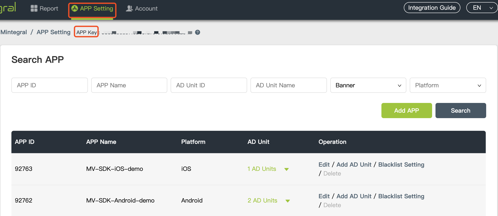

# Mintegral SDK Integration - Android

## Overview
This document provides instructions on how to integrate the Mintegral SDK for Android developers. 
Mintegral SDK provides six different Ads formats: Banner, Native, Automatic Rending Native, Rewarded Video, Interstitial and Splash.

## Preparation

### Retrieve account-related information

**APP Key**   
Each Mintegral account has a corresponding App Key, and the key will be needed for requesting ads. It can be retreived from your Mintegral account through the following path: **APP Setting -> App Key**:  
 

**App ID**   
The M-system will automatically generate a corresponding App ID for each app created by the developer. Find the App ID(s)  here: **APP Setting -> APP ID**:  


**Placements & Units**</br>
The M-system will automatically generate a corresponding Placement ID for each placement created by the developer. Add or edit the Placement & Unit here: Login **APP Setting -> Placement Management -> Edit Placement & Unit**:  


**Report API**   
It can be retreived from your Mintegral account through the following path: Account -> API Tools::  


**Virtual currency** 

The Mintegral platform provides developers with the ability to manage some virtual currencies, so that products with internal currency mechanisms can use their own virtual currencies to better motivate users.
A "virtual currency" management module is added in the background to manage the developer's virtual currency information (Reward Info). The Reward info setting information can be synchronized with various reward advertising types Placement ID, which is convenient for developers to manage their own virtual currency.    
 
**Create virtual currency**        
Find the virtual currency in the menu bar on the right side of the backstage and create it.     
     

**New currency type**       
       
      
**Configure virtual currency** 
Configure virtual currency under Placement     


**Precautions for code use and navigation bar configuration information**  
If the application you set in the background configuration page is to accept apk advertisements, you need to pass in the context object in the code when using any type of advertisement. Be sure to ensure that it is of the Activity type (the Application context object will have an abnormal effect). If the page (Activity) displaying the advertisement is full screen without navigation bar, please follow this [link](https://developer.android.google.cn/training/system-ui/navigation) to add hidden navigation in your Activity The code of the bar, otherwise it may cause the navigation bar to display abnormally. 

If you are using the domestic SDK version, when using any ads, take Splash ads as an example. When you build SplashHandler in A Activity and need to display this situation in B Activity, you need to call the following code before the ad show and pass in The activity object currently displaying the ad
```java
// currentActivity Is the Activity object you need to display

MBridgeSDKFactory.getMBridgeSDK().updateDialogWeakActivity(new WeakReference<Activity>(currentActivity));
``` 

**Introduce RecyclerView to the project of integrating MTG SDK**  
<font color=red>If you are using the MTG SDK , be sure to introduce the RecyclerView dependency into the project. MTG SDK requires RecyclerView component, otherwise it may cause program crash!</font>


**All ad forms need to be used on the main thread**  
<font color=red>All advertisement forms of MTG require you to load and use in the main thread</font>


## Import SDK
Please follow the tips below to choose your integration method, click "Start Integration" to get SDK.
<iframe data-src="show_code_en.html" id="iframe_show_code_android"></iframe>
###Demo

When not integrating with gradle, in the zip package of the manual download SDK, there is a file named **MBTest** which is the Demo corresponding to this download version.

### Get the current SDK version

MBConfiguration.SDK_VERSION


**Note：**<font color=red>If you fail to pull the code using gradle, add the maven warehouse configuration to the project root build.gradle file。
```java
 
 //Launch GP market application， Android X Version
 maven {
        url  "https://dl-maven-android.mintegral.com/repository/mbridge_android_sdk_oversea"
 }
 

```
</font>

Screenshot show:


### Support weixin mini program
Pushing a WeChat Mini Program requires developers to take the first step["register appid"](https://open.weixin.qq.com/cgi-bin/frame?t=home/app_tmpl&lang=en_US)
```java
//Starting from SDK 16.1.7, MTG ads support weixin mini program jumping function, and the non-listed GP market SDK will automatically introduce opensdk. If the developer does not want to use the weixin mini program, you can use exclude to exclude it. Example:
implementation ('com.mbridge.msdk.oversea:${adType}:${sdkVersion}'){
 exclude group: "com.tencent.mm.opensdk", module: "wechat-sdk-android"
}

//If you use the GP market version SDK and want to use the applet jump function, you can manually import opensdk
implementation 'com.tencent.mm.opensdk:wechat-sdk-android:+'
```

## AndroidManifest.xml configuration

1.Required permission<font color=red>(If you are using aar or gradle integration, you can ignore this step)。</font> 

**If you imported the  SDK for China-Mainland Traffic app , then you are required to get permission for "READ_PHONE_STATE".You need to apply for the permission in your java code if the android system is above 6.0.**     

```java
<uses-permission android:name="android.permission.INTERNET" />
<uses-permission android:name="android.permission.ACCESS_NETWORK_STATE" />

<!-- Required for China-Mainland Traffic app -->
<!-- MTG-SDK does not compulsorily obtain the following permissions, and the SDK can operate normally even if the optional permissions are not obtained; obtaining the above permissions will help Mintegral optimize advertising accuracy and user interaction experience, and improve eCPM-->
<uses-permission android:name="android.permission.READ_PHONE_STATE"/>
<uses-permission android:name="android.permission.REQUEST_INSTALL_PACKAGES"/>
<!-- MTG will use this permission to determine whether the application corresponding to the advertisement is installed on the user's app on the Android R system, so as to avoid placing false advertisements, so as to improve the user's advertising experience. -->
<uses-permission android:name="android.permission.QUERY_ALL_PACKAGES"/>
```

2.Advertising display Activity list configuration<font color=red>(If you are using aar or gradle integration, you can ignore this step)。</font>  
```java
<activity
            android:name="com.mbridge.msdk.activity.MBCommonActivity"
            android:configChanges="keyboard|orientation"
            android:excludeFromRecents="true"
            android:exported="false"
            android:screenOrientation="portrait"
            android:theme="@android:style/Theme.Translucent.NoTitleBar"/>
 
            
<!--Activities required for rewarded video and interstitial video ads-->            
<activity
            android:name="com.mbridge.msdk.reward.player.MBRewardVideoActivity"
            android:configChanges="orientation|keyboardHidden|screenSize"
            android:excludeFromRecents="true"
            android:theme="@style/mbridge_transparent_theme" />
            
<!--Activity required for interstitial image ads-->            
<activity
            android:name="com.mbridge.msdk.interstitial.view.MBInterstitialActivity"
            android:configChanges="orientation|screenSize"
            android:excludeFromRecents="true" />
            
<!--Activity required for interactive advertising-->            
<activity
            android:name="com.mbridge.msdk.interactiveads.activity.InteractiveShowActivity"
            android:excludeFromRecents="true"
            android:configChanges="keyboardHidden|orientation|screenSize"
            android:theme="@android:style/Theme.NoTitleBar.Fullscreen"/>                                                
            
```


3.Downloader adaptation<font color=red>(If you are using aar or gradle integration, you can ignore this step)。</font>   

(1)**Update the Android.Support.v4 to 26.0.0 or above.**

(2)**Need to adapter the FileProvider when the targetSDKVersion >= 24. China-Mainland Traffic app required, Oversea Traffic app can be ignore.**   
Add these codes in mb_provider_paths.xml

```xml
<?xml version="1.0" encoding="utf-8"?>
<paths xmlns:android="http://schemas.android.com/apk/res/android">
    <external-path name="external_files" path="."/>
</paths>
```
Add these codes in AndroidManifest.xml

```xml
//China-Mainland Traffic app required, Oversea Traffic app can be ignore.
<provider
    android:name="com.mbridge.msdk.foundation.tools.MBFileProvider"
    android:authorities="${applicationId}.mbFileProvider"
    android:exported="false"
    android:grantUriPermissions="true">
    <meta-data
        android:name="android.support.FILE_PROVIDER_PATHS"
        android:resource="@xml/mb_provider_paths"/>
</provider>
```


4.Proguard   

If you are using Proguard, add the following rules to your ProGuard configuration file:

（1）Support AndroidX

```java
-keepattributes Signature
-keepattributes *Annotation*
-keep class com.mbridge.** {*; }
-keep interface com.mbridge.** {*; }
-dontwarn com.mbridge.**
-keepclassmembers class **.R$* { public static final int mbridge*; }

-keep public class com.mbridge.* extends androidx.** { *; }
-keep public class androidx.viewpager.widget.PagerAdapter{*;}
-keep public class androidx.viewpager.widget.ViewPager.OnPageChangeListener{*;}
-keep interface androidx.annotation.IntDef{*;}
-keep interface androidx.annotation.Nullable{*;}
-keep interface androidx.annotation.CheckResult{*;}
-keep interface androidx.annotation.NonNull{*;}
-keep public class androidx.fragment.app.Fragment{*;}
-keep public class androidx.core.content.FileProvider{*;}
-keep public class androidx.core.app.NotificationCompat{*;}
-keep public class androidx.appcompat.widget.AppCompatImageView {*;}
-keep public class androidx.recyclerview.*{*;}
-keep class com.mbridge.msdk.foundation.tools.FastKV{*;}
-keep class com.mbridge.msdk.foundation.tools.FastKV$Builder{*;}
```
​            
（2）Not support AndroidX

```java
-keepattributes Signature
-keepattributes *Annotation*
-keep class com.mbridge.** {*; }
-keep interface com.mbridge.** {*; }
-dontwarn com.mbridge.**
-keepclassmembers class **.R$* { public static final int mbridge*; }

-keep class com.mbridge.msdk.foundation.tools.FastKV{*;}
-keep class com.mbridge.msdk.foundation.tools.FastKV$Builder{*;}
-keep public class android.support.v7.widget.RecyclerView{*;}
-keep public class android.support.v7.widget.DividerItemDecoration{*;}
-keep public class android.support.v7.widget.LinearLayoutManager{*;}
-keep public class android.support.v7.widget.GridLayoutManager{*;}
-keep public class android.support.v7.widget.OrientationHelper{*;}
-keep public class android.support.v7.widget.StaggeredGridLayoutManager{*;}
-keep public class android.support.v4.app.Fragment{*;}
-keep public class android.support.v4.app.FragmentActivity{*;}
-keep public class android.support.v4.app.FragmentManager{*;}
-keep public class android.support.v4.app.FragmentTransaction{*;}
-keep public class android.support.v4.app.FragmentStatePagerAdapter{*;}
-keep public class android.support.v4.view.ViewPager{*;}
-keep public class android.support.v4.view.PagerAdapter{*;}
-keep interface android.support.v4.view.ViewPager.OnPageChangeListener{*;}
-keep public class android.support.v4.view.MotionEventCompat{*;}
-keep public class android.support.v4.view.ViewConfigurationCompat{*;}
-keep public class android.support.v4.view.ViewCompat{*;}
-keep interface android.support.annotation.Nullable{*;}
-keep interface android.support.annotation.RequiresApi{*;}
-keep interface android.support.annotation.NonNull{*;}
-keep interface android.support.annotation.IntDef{*;}
-keep interface android.support.annotation.RequiresPermission{*;}
-keep interface android.support.annotation.CheckResult{*;}
-keep interface android.support.annotation.StringRes{*;}
-keep interface android.support.annotation.CallSuper{*;}
-keep public class android.support.v4.app.NotificationManagerCompat{*;}
-keep public class android.support.v4.app.NotificationCompat{*;}
-keep public class android.support.v4.content.FileProvider{*;}
-keep public class android.support.v7.widget.AppCompatButton{*;}
-keep public class android.support.v7.widget.AppCompatImageView{*;}
-keep public class android.support.v7.widget.AppCompatTextView{*;}
```

5.ShrinkResources   

If you are using shrinkResources，add the following rules to your res/raw/keep.xml file：
```xml
<?xml version="1.0" encoding="utf-8"?>
    <resources xmlns:tools="http://schemas.android.com/tools"
        tools:keep="@drawable/mbridge*,@drawable-hdpi-v4/mbridge*,@drawable-hdpi/mbridge*,@layout/mbridge*,@values/mbridge*,@anim/mbridge*" />
```

6.AndResGuard   

If you are using [AndResGuard](https://github.com/shwenzhang/AndResGuard), add the following whitelist to your AndResGuard configuration file:

```java
"R.string.mbridge*",
"R.layout.mbridge*",
"R.drawable.mbridge*",
"R.anim.mbridge*",
"R.color.mbridge*",
"R.style.mbridge*",
"R.id.mbridge*"
```

## SDK Initialization  

### Add the Mintegral SDK to your project

As the first step of integration,you need to add the Mintegral SDK to your project.  

**Integrate via JAR/AAR package**

| File Name                                                 | File Function                                                |
| :-------------------------------------------------------- | :----------------------------------------------------------- |
| same.jar/aar<br>chinasame.jar/aar | Basic functions                                              |
| mbbanner.aar.jar/aar                           | Banner ads package                                           |
| mbnative.jar/aar                               | Native ads package                                           |
| nativeex.jar/aar                                | Native Video ads package                                     |
| mbnativeadvanced.jar/aar                       | Automatic Rending Native ads package                         |
| reward.jar/aar                                  | Rewarded Video ads package                                   |
| interstitial.jar/aar                            | Interstitial ads package                                     |
| interactiveads.jar/aar                          | Interactive ads package                                      |
| mbsplash.jar/aar                               | Splash ads package                                           |
| playercommon.jar/aar                            | Video player basic package                                   |
| videojs.jar/aar                                 | Video player function package                                |
| videocommon.jar/aar                             | Video download basic package                                 |                                  |
| mbjscommon.jar/aar                             | Java and H5 Interactive package                              |


**Tips: same.aar/chinasame.aar  are basic function packages.**  that are required to be added into your project.
If you want to implement other functions, you must add the corresponding ".aar" files. For example, to integrate Mintegral's Splash, you need to add same.aar/chinasame.aar, mbsplash.aar and its corresponding res folder into the project.
**If you use JAR package integration, in addition to adding the JAR package, you need to import its corresponding res file into the project. **

 

### Initialization 

1.Put the initiating codes into Application through the respective App ID and App Key. See below example code for reference. **It is recommended to use the API in the main thread, And Initialize The SDK as soon as your app starts.<font color=red>Ensure that the SDK is initialized only once in the application, you can refer to the MBridgeSDKManager.java tool class in Demo</font>**

We provide two ways to initialize the SDK:

（1）Initialization without callback

```java
public void init(Map<String,String> ids,Application application);
```

Sample code:

```java
MBridgeSDK sdk = MBridgeSDKFactory.getMBridgeSDK();
Map<String, String> map = sdk.getMBConfigurationMap("your AppId", "your AppKey");
//If you want your ad to support the weixin mini program jump function, you can pass in wxAppId
Map<String, String> map = sdk.getMBConfigurationMap("your AppId", "your AppKey","your wxAppId");
sdk.init(map, this);
```

（2）Initialization with callback 

**Note：**

For AndroidX, SDK provides callback for initialization status  in version 14.1.0 and above.

For Android Support, SDK provides callback for initialization status  in version 10.4.0 and above.

```java
public void init(Map<String,String> ids, Application application, SDKInitStatusListener listener);
```

Sample code:

```java
MBridgeSDK sdk = MBridgeSDKFactory.getMBridgeSDK();
Map<String, String> map = sdk.getMBConfigurationMap("your AppId", "your AppKey");
//If you want your ad to support the weixin mini program jump function, you can pass in wxAppId
Map<String, String> map = sdk.getMBConfigurationMap("your AppId", "your AppKey","your wxAppId");

sdk.init(map, this, new SDKInitStatusListener() {
    @Override
    public void onInitSuccess() {
        Log.e("SDKInitStatus", "onInitSuccess");
    }

    @Override
    public void onInitFail(String errorMsg) {
        Log.e("SDKInitStatusInitFail", errorMsg);
    }
});
```


### <font color=#ff0000 >Preload Ads（Recommendation）</font>

We provide the ability to preload for Native(NativeVideo) Ads formats. Preload is the process of loading the Ads ahead of time and saving it in cache.Here is the sample code:


```java

MBridgeSDK sdk = MBridgeSDKFactory.getMBridgeSDK();
Map<String, Object> preloadMap = new HashMap<String, Object>();
preloadMap.put(MBridgeConstans.PROPERTIES_LAYOUT_TYPE, MBridgeConstans.LAYOUT_NATIVE);
preloadMap.put(MBridgeConstans.PROPERTIES_UNIT_ID,"your unitId");
preloadMap.put(MBridgeConstans.PLACEMENT_ID, "your placementId");
sdk.preload(preloadMap);
    
```

## Banner   

Banner ads is the most traditional type of advertising for mobile advertising. It is easy to implement and highly user-acceptable. It is a good form of realization for ultra-casual games and tools.

**UI sample:**  
 


### Create the MBBannerView
Add MBBannerView to xml or dynamically add MBBannerView.      

*Note: SDK does not control the size of the View, so if you use dynamically loading MBBannerView,  setLayoutParams is required to set the width and height of the view.*
     
Example:
      
```java

mbBannerView.setLayoutParams(new FrameLayout.LayoutParams(FrameLayout.LayoutParams.MATCH_PARENT, FrameLayout.LayoutParams.MATCH_PARENT));
```


```java

public MBBannerView(Context context){
    this(context,null);
}

public void init(BannerSize bannerSize, String placementId, String unitId);
```

Introduction of BannerSize:


```java

/**
 * sizeType
 */
 
//Represents the fixed banner ad size - 320dp by 90dp.       
  public static final int LARGE_TYPE = 1;
   
//Represents the fixed banner ad size - 300dp by 250dp.            
  public static final int MEDIUM_TYPE = 2; 
       
//if device height <=720,Represents the fixed banner ad size - 320dp by 50dp;     
  public static final int SMART_TYPE = 3;  
      
//Represents the fixed banner ad size - 320dp by 50dp.        
  public static final int STANDARD_TYPE = 4;   
     
//Customize the size according to your needs.           
  public static final int DEV_SET_TYPE = 5;

/**
 * @param sizeType 
 * @param showWidth Set your need Width,Unit is Px
 * @param showHeight Set your need Height,Unit is Px
 */
public BannerSize(int sizeType,int showWidth,int showHeight);
```


### Introduction of MBBannerView APIs       


```java
  
/**
 * @param allowShowCloseBtn can show close botton.
 */
public void setAllowShowCloseBtn(boolean allowShowCloseBtn)

/**
 Automatic refresh time, in seconds, is set in the range of 10s~180s.
 If set to 0, it will not be automatically refreshed.
 You need to set it before loading ad.
 */
public void setRefreshTime(int refreshTime){
    if(controller != null){
        controller.setRefreshTime(refreshTime);
    }
}  
```


### Set up the BannerAdListener

```java
public interface BannerAdListener {
	  /**
     * called when the ads loaded unsuccesfully
     */
    void onLoadFailed(String msg);
    /**
     * called when the ads loaded succesfully
     */
    void onLoadSuccessed();
    /**
     * called when the ads be shown
     */
    void onLogImpression();
    /**
     * called when the ads be clicked
     */
    void onClick();
    /**
     * called when leaved app after clicked the ads
     */
    void onLeaveApp();
    /**
     * empty implementation method,(It can be ignored)
     */      
	  void showFullScreen();
    /**
     * empty implementation method,(It can be ignored)
     */	
	  void closeFullScreen();
    /**
     * called when the ads be closed
     */
    void onCloseBanner();
    
}
```

### Load And Show Ads  
The request method is as follows:

```java
public void load()
```

### Notify SDK  
Developers need to actively call the following two life cycle callback methods, which will reduce the number of errors.

```java
@Override
protected void onPause() {
	super.onPause();
	if (mbBannerView != null) {
		mbBannerView.onPause();
	}
}

@Override
protected void onResume() {
	super.onResume();
	if (mbBannerView != null) {
		mbBannerView.onResume();
	}
}
```


### Get advertising ID
For problems arising from the SDK display process, developers can use this API to record the advertising ID and feed it back to Mintegral  
The request method is as follows:

```java
/**
* call this method after loadSuccess 
* @return requestId
*/
public String getRequestId()
```


### Release object of MBBannerView
Release the memory space of the MBBannerView object by calling the release() method at the appropriate time.

```java 
@Override
protected void onDestroy() {
	super.onDestroy();
	if(mbBannerView!= null){
		mbBannerView.release();
	}
}
```


### Sample code

```java

xml:
    <com.mbridge.msdk.out.MBBannerView
    android:id="@+id/mb_banner_view"
    android:layout_width="match_parent"
    android:layout_height="match_parent"/>
        
java: 
    mbBannerView = findViewById(R.id.mb_banner_view);
    mbBannerView.init(new BannerSize(BannerSize.DEV_SET_TYPE,1294,720), "your placementId", UNIT_ID);
    mbBannerView.setAllowShowCloseBtn(true);
    mbBannerView.setRefreshTime(15);
    mbBannerView.setBannerAdListener(new BannerAdListener() {
    	
        @Override
      	public void onLoadFailed(MBridgeIds ids, String msg) {
        		ShowToast("on load failed"+msg);
        		Log.e(TAG, "on load failed"+msg);
      	}

      	@Override
      	public void onLoadSuccessed(MBridgeIds ids) {
        		ShowToast("on load successd");
        		Log.e(TAG, "on load successed");
      	}

      	@Override
      	public void onClick(MBridgeIds ids) {
        		ShowToast("onAdClick");
        		Log.e(TAG, "onAdClick");
      	}

      	@Override
      	public void onLeaveApp(MBridgeIds ids) {
        		ShowToast("leave app");
        		Log.e(TAG, "leave app");
      	}

      	@Override
      	public void showFullScreen(MBridgeIds ids) {
        		ShowToast("showFullScreen");
        		Log.e(TAG, "showFullScreen");
      	}

      	@Override
      	public void closeFullScreen(MBridgeIds ids) {
        		ShowToast("closeFullScreen");
        		Log.e(TAG, "closeFullScreen");
      	}

      	@Override
      	public void onLogImpression(MBridgeIds ids) {
            ShowToast("onLogImpression");
      		  Log.e(TAG, "onLogImpression");
      	}

        @Override
        public void onCloseBanner(MBridgeIds ids) {
            ShowToast("onCloseBanner");
            Log.e(TAG, "onCloseBanner");
        }
    });

    mbBannerView.load();
```


## Native（Native Video）   

Native Ads is currently one of the most popular Ads types. The Mintegral SDK will report back creative material information to your app. You will then be able to assemble and adjust the creative elements as needed to ensure the creative material is compatible to your product style and in turn create the best user experience.

**Note: This ad format is only available to certain developers, please contact your AM or write to developer@mintegral.com if needed.**

**UI sample:**  
  


### Create the MBNativeHandler

```java
public MBNativeHandler(Map<String, Object> map, Context context);
```
> It is recommended to use Application object for context param.

### Set up the NativeAdListener

To set up Ads request tracking, the below set ups are required:


```java
public interface NativeAdListener {

    public void onAdLoaded(List<Campaign> campaigns, int template);

    public void onAdLoadError(String message);

    public void onAdClick(Campaign campaign);

    public void onAdFramesLoaded(List<Frame> list);

    public void onLoggingImpression(int adsourceType);
}
```

### Set up the NativeTrackingListener

To set up Ads impression and click tracking, the below set ups are required.


```java
 /**
  * Interface to define native ad tracking
  *
  */
public interface NativeTrackingListener {

    /**
     * intercept showing of default loading dialog
     *
     * @param campaign
     */
    public boolean onInterceptDefaultLoadingDialog();

    public void onShowLoading(Campaign campaign);

    public void onDismissLoading(Campaign campaign);

    public void onStartRedirection(Campaign campaign, String url);

    public void onFinishRedirection(Campaign campaign, String url);

    public void onRedirectionFailed(Campaign campaign, String url);

    public void onDownloadStart(Campaign campaign);

    public void onDownloadFinish(Campaign campaign);

    /**
     * download progress
     *
     * @param progress
     */
    public void onDownloadProgress(int progress);
}
```

### Load Ads  
When the Mintegral SDK calls this method, it will first read the Ads from the cache. If there is an AdAds in the cache, it will return directly, which will improve the display efficiency. If there is no cache, it will send an Ads request to the server to obtain the AdAds. <br>
**Notes:It's not recommendation that publishers save the object of campaign by themselves**<br>The request method is as follows:

```java
public abstract boolean load();
```

### Display Ads  
Use MBMediaView to display the Native(NativeVideo) Ads with "onAdLoaded" method. **The best size of  MBMediaView is 16:9.** 

```java
public void setNativeAd(Campaign campaign) 
```

### Display Adchoice

We provide MBAdChoice to display the Adchoiceview. It is a class that inherits from ImageView. Call the following method to Display the Adchoice.<br>
**Tip:We strongly suggest that developers can show this MBAdChoice(icon) in the right location in your app, if not, it will affect your ad revenue.**

```java
public void setCampaign(Campaign campaign)
```


### Set up your click-event for views 

```java

//Register the view which can be cliked to jump
//If the developer loads the ad image by yourself, please call registerView after the image is loaded
public void registerView(View view, Campaign campaign)
//Register the views which can be cliked to jump
public void registerView(View view, List<View> views, Campaign campaign)

```

### Release object of NaitveHandler
Release the memory space of the NativeHandler object by calling the release() method at the appropriate time.

```java 
@Override
protected void onDestroy() {
    if (mNativeHandle != null) {
        mNativeHandle.release();
    }
}
```

### Introduction of MBMediaView APIs


```java 
// Set up whether MBMediaView can display full screen,default is true 
public void setIsAllowFullScreen(boolean isAllowFullScreen)
// Set up whether to allow image to display first when video is not ready to  be displayed,default is true 
public void setAllowVideoRefresh(boolean allowVideoRefresh)
// Set up whether video is to be in loop play,default is true 
public void setAllowLoopPlay(boolean allowLoopPlay)
// Set up whether video reloads when phone orientation alternates between horizontal and vertical,default is true 
public void setAllowScreenChange(boolean allowScreenChange)
 
/**
 * set video progress view Visibility,default is true 
 *
 * @param isShown
 */
public void setProgressVisibility(boolean isShown)
 
/**
 * set sound indicator view visible,default is true 
 *
 * @param isShown
 */
public void setSoundIndicatorVisibility(boolean isShown)

/**
 * set video sound on or off,default is false 
 *
 * @param isOn
 */
public void setVideoSoundOnOff(boolean isOn)

public interface OnMBMediaViewListenerPlus {

    //called when the mediaview entered to fullscreen
    void onEnterFullscreen();

    //called when the mediaview out of fullscreen
    void onExitFullscreen();

    //called when the ads start to jump redirection
    void onStartRedirection(Campaign campaign, String url);

    //called when the ads finish jumping redirection
    void onFinishRedirection(Campaign campaign, String url);

    //called when the ads jumping redirection failed
    void onRedirectionFailed(Campaign campaign, String url);

    //called when the ads be clicked
    void onVideoAdClicked(Campaign campaign);

    //called when the ads be shown
    void onVideoStart();

    //called when the video of ad has finished playing completely
    void onVideoComplete();
}
```


### Sample code

```java
Map<String, Object> properties = MBNativeHandler.getNativeProperties("your placementId", "your unitId");
//Expected number of ads
properties.put(MBridgeConstans.PROPERTIES_AD_NUM, AD_NUM);
//If you want to get the duration of the native ad video, add at least one of the following two pairs of keys
properties.put(MBridgeConstans.NATIVE_VIDEO_WIDTH, 720);
properties.put(MBridgeConstans.NATIVE_VIDEO_HEIGHT, 480);
//Just fill in true
properties.put(NATIVE_VIDEO_SUPPORT, videoSupport);
mNativeHandle = new MBNativeHandler(properties, this);
mNativeHandle.setAdListener(new NativeAdListener() {

@Override
public void onAdLoaded(List<Campaign> campaigns, int template) {
    
    if (campaigns != null && campaigns.size() > 0) {
        
        Campaign mCampaign = campaigns.get(0);

        int videoLength = mCampaign.getVideoLength();

        final View view = LayoutInflater.from(NativeActivity.this)
                .inflate(R.layout.mb_demo_mul_big_ad_content, null);
        final ImageView iv = (ImageView) view.findViewById(R.id.mb_demo_iv_image);
        final MBMediaView mbMediaView = (MBMediaView) itemView.findViewById(R.id.mb_mediaview);
        MBAdChoice adChoice = view.findViewById(R.id.mb_mediaview_adchoice);
        
        //Suggest to set the adChoice'size depends on campaign.getAdchoiceSizeHeight() and campaign.getAdchoiceSizeWidth() campaign.adChoiceIconSize
        RelativeLayout.LayoutParams Params =  (RelativeLayout.LayoutParams)view.getLayoutParams();
        Params.height = campaign.getAdchoiceSizeHeight();
        Params.width = campaign.getAdchoiceSizeWidth();
        adChoice.setLayoutParams(Params);
        adChoice.setCampaign(campaign);      
        mbMediaView.setNativeAd(mCampaign);

        // you can use your own view to display the native,but if it is a native-video,you must use MBMediaView to display
        if (!TextUtils.isEmpty(mCampaign.getImageUrl())) {
            new ImageLoadTask(mCampaign.getImageUrl()) {

                @Override
                public void onRecived(Drawable result) {
                    iv.setImageDrawable(result);
                    mNativeHandle.registerView(view, mCampaign);
                }
            }.execute();
         }
        
        TextView tvAppName = (TextView) view.findViewById(R.id.mb_demo_bt_app_name);
        tvAppName.setText(mCampaign.getAppName());
        List<View> list = new ArrayList<View>();
        list.add(view);
        list.add(tvAppName);
        mNativeHandle.registerView(tvAppName, list, mCampaign);
    }
  }
});

mNativeHandle.load();
...
...

mNativeHandle.setTrackingListener(new NativeTrackingListener() {

  	@Override
  	public void onStartRedirection(Campaign campaign, String url) {
  		  Log.e("pro", "onStartRedirection---");
  	}

  	@Override
  	public void onRedirectionFailed(Campaign campaign, String url) {
  		  // TODO Auto-generated method stub
  		  Log.e("pro", "onRedirectionFailed---");
  	}

  	@Override
  	public void onFinishRedirection(Campaign campaign, String url) {
  		  Log.e("pro", "onFinishRedirection---"+url);
  	}

  	@Override
  	public void onDownloadStart(Campaign campaign) {
  		  Log.e("pro", "start---");
  	}

  	@Override
  	public void onDownloadFinish(Campaign campaign) {
  		  Log.e("pro", "finish---");
  	}

  	@Override
  	public void onDownloadProgress(int progress) {
  		  Log.e("pro", "progress----" + progress);
  	}

  	@Override
  	public boolean onInterceptDefaultLoadingDialog() {
  		  return false;
  	}

  	@Override
  	public void onShowLoading(Campaign campaign) {

  	}

  	@Override
  	public void onDismissLoading(Campaign campaign) {

  	}

});
```

## Automatic Rending Native

The Automatic Rending Native launched by Mintegral is simpler than ordinary Native ads. Developers only need to provide a wide and high area, and Mintegral will automatically display the ad templates and materials that match it. While reducing developer docking costs, more efficiently use the Mintegral algorithm to output advertising ideas, thereby improving developer income levels.

**UI sample：**  


### Create the MBNativeHandler

```java
public MBNativeHandler(Activity activity, String placementId, String unitId)
```

### Set up the NativeAdvancedAdListener

```java
public interface NativeAdvancedAdListener {
    void onLoadFailed(MBridgeIds ids, String msg);
    void onLoadSuccessed(MBridgeIds ids);
    void onLogImpression(MBridgeIds ids);
    void onClick(MBridgeIds ids);
    void onLeaveApp(MBridgeIds ids);
    // Only the material of the mraid protocol have this callback
    void showFullScreen(MBridgeIds ids);
    // Only the material of the mraid protocol have this callback
    void closeFullScreen(MBridgeIds ids);
    // close ad
    void onClose(MBridgeIds ids);
}
```
### Some custom configurations

#### Native View Size
Recommend: 320 by 250 

```java
mbNativeAdvancedHandler.setNativeViewSize(advancedNativeW, advancedNativeH);
```

#### Mute
The mute button will only be displayed when a video is on the top of the layout   (The specific proportion depends on the adaptation rules)
```java
// default: mute
mbNativeAdvancedHandler.setPlayMuteState(MBridgeConstans.REWARD_VIDEO_PLAY_MUTE);
```

#### Close Button State

```java
/**
 *
 * @param mbThreeState negative will hide close button,positive will display close button, other we will Decide whether to display based on the material
 */
mbNativeAdvancedHandler.setCloseButtonState(MBMultiStateEnum.positive);
```

#### Auto Play Mode

```java

public interface AutoPlayMode {
    int PLAY_WHEN_NETWORK_IS_WIFI = 1;
    int PLAY_WHEN_USER_CLICK = 2;
    int PLAY_WHEN_NETWORK_IS_AVAILABLE = 3;//default
}

mbNativeAdvancedHandler.autoLoopPlay(AutoPlayMode.PLAY_WHEN_NETWORK_IS_AVAILABLE);
```

#### H5 UI 

You can customize the display layout of ads through JSON.
Target can choose the following: title, subTitle, button, icon, container, mediaContent.


The JSON format is as follows:
```json
{
    "list": [{
        "target": "title",
        "values": {
            "paddingLeft": 15,
            "backgroundColor": "yellow",
            "fontSize": 15,
            "fontFamily": "Microsoft YaHei",
            "color": "red"
        }
    }, {
        "target": "mediaContent",
        "values": {
            "paddingTop": 10,
            "paddingRight": 10,
            "paddingBottom": 10,
            "paddingLeft": 10
        }
    }]
}
```

### Load Ads

```java
public void load();
```

### Get advertising ID  
For problems arising from the SDK display process, developers can use this API to record the advertising ID and feed it back to Mintegral
The request method is as follows:

```java
/**
* call this method after loadSuccess 
* @return requestId
*/
public String getRequestId()
```

### Check ads availability

Use the below method to determine whether a video material is ready to be played. It is strongly recommended to display ads only when the video material is ready to be played.

```java
public boolean isReady()
```

### Display Ads

#### Get Ad View
```java
mAdvancedNativeView = mbNativeAdvancedHandler.getAdViewGroup();
```
#### Add the view to the specified container
```java
container = findViewById(R.id.mb_demo_advanced_native_ac_container);
container.addView(mAdvancedNativeView);
```

### Notify SDK

```java
// When the system's onResume is called, the onResume method of MBNativeAdvancedHandler must be called.
public void onResume()
// When the system's onPause is called, the onPause method of MBNativeAdvancedHandler must be called.  
public void onPause()
public void release()
```

### Special scene display

```java
// When you construct the MBNativeAdvancedHandler object and the incoming activity is not the activity of the current show, please call before displaying the ad

MBridgeSDKFactory.getMBridgeSDK().updateDialogWeakActivity(new WeakReference<Activity>(currentActivity));
```

#### Release object of MBNativeAdvancedHandler
Release the memory space of the MBNativeAdvancedHandler object by calling the release() method at the appropriate time.

```java 
mbNativeAdvancedHandler.release();
```

### Sample code

```java

mbNativeAdvancedHandler = new MBNativeAdvancedHandler(this,placementId, mUnitId);

mbNativeAdvancedHandler.setNativeViewSize(advancedNativeW,advancedNativeH);
mbNativeAdvancedHandler.setCloseButtonState(MBMultiStateEnum.positive);
mbNativeAdvancedHandler.setPlayMuteState(MBridgeConstans.REWARD_VIDEO_PLAY_MUTE);
mbNativeAdvancedHandler.autoLoopPlay(AutoPlayMode.PLAY_WHEN_NETWORK_IS_AVAILABLE);
String style = 
        "{\n" +
        "    \"list\": [{\n" +
        "        \"target\": \"title\",\n" +
        "        \"values\": {\n" +
        "            \"paddingLeft\": 15,\n" +
        "            \"backgroundColor\": \"yellow\",\n" +
        "            \"fontSize\": 15,\n" +
        "            \"fontFamily\": \"Microsoft YaHei\",\n" +
        "            \"color\": \"red\"\n" +
        "        }\n" +
        "    }, {\n" +
        "        \"target\": \"mediaContent\",\n" +
        "        \"values\": {\n" +
        "            \"paddingTop\": 10,\n" +
        "            \"paddingRight\": 10,\n" +
        "            \"paddingBottom\": 10,\n" +
        "            \"paddingLeft\": 10\n" +
        "        }\n" +
        "    }]\n" +
        "}\n";
JSONObject jsonObject = new JSONObject(style);
mbNativeAdvancedHandler.setViewElementStyle(jsonObject);
mAdvancedNativeView = mbNativeAdvancedHandler.getAdViewGroup();

mbNativeAdvancedHandler.setAdListener(new NativeAdvancedAdListener() {

    @Override
    public void onLoadSuccessed(MBridgeIds ids) {
        Toast.makeText(NativeAdvancedShowActivity.this,"onLoadSuccessed:",Toast.LENGTH_LONG).show();
    }

    @Override
    public void onLoadFailed(MBridgeIds ids, String msg) {
        Toast.makeText(NativeAdvancedShowActivity.this,"onLoadFailed:" ,Toast.LENGTH_LONG).show();
    }

    @Override
    public void onLogImpression(MBridgeIds ids) {
        Toast.makeText(NativeAdvancedShowActivity.this,"onLogImpression:" ,Toast.LENGTH_LONG).show();
    }

    @Override
    public void onClick(MBridgeIds ids) {
        Toast.makeText(NativeAdvancedShowActivity.this,"onClick:" ,Toast.LENGTH_LONG).show();
    }

    @Override
    public void onLeaveApp(MBridgeIds ids) {
        Toast.makeText(NativeAdvancedShowActivity.this,"onLeaveApp:" ,Toast.LENGTH_LONG).show();
    }

    @Override
    public void showFullScreen(MBridgeIds ids) {
        Toast.makeText(NativeAdvancedShowActivity.this,"showFullScreen:" ,Toast.LENGTH_LONG).show();
    }

    @Override
    public void closeFullScreen(MBridgeIds ids) {
        Toast.makeText(NativeAdvancedShowActivity.this,"closeFullScreen:" ,Toast.LENGTH_LONG).show();
    }

    @Override
    public void onClose(MBridgeIds ids) {
        Toast.makeText(NativeAdvancedShowActivity.this,"onDismiss:" ,Toast.LENGTH_LONG).show();
    }
}


private void show(){
    if (mAdvancedNativeView != null && mAdvancedNativeView.getParent() == null) {
        container.addView(mAdvancedNativeView);
    }
}

@Override
public void onClick(View v) {
    switch (v.getId()){
        case R.id.mb_demo_advanced_native_ac_preload:
            mbNativeAdvancedHandler.load();
            break;
        case R.id.mb_demo_advanced_native_ac_show:
            show();
            break;
        case R.id.mb_demo_advanced_native_ac_release:
            mbNativeAdvancedHandler.release();
            break;
    }
}

@Override
protected void onResume() {
    super.onResume();
    if(mbNativeAdvancedHandler != null){
        mbNativeAdvancedHandler.onResume();
    }
}

@Override
protected void onPause() {
    super.onPause();
    if(mbNativeAdvancedHandler != null){
        mbNativeAdvancedHandler.onPause();
    }
}

@Override
protected void onDestroy() {
    if(mbNativeAdvancedHandler != null){
        mbNativeAdvancedHandler.release();
    }
    super.onDestroy();
}


```


##  Rewarded Video

Rewarded Video is one of the best performing Ads formats on the Mintegral platform. Users can get rewards by watching a video Ads. The creativity and attention-grabbing nature of the video content attracts users to download the advertised product. 

**Rewarded Video sample：** 

 


### HardwareAccelerated      
Add these codes "android:hardwareAccelerated=true" in tab of application：

```java
<application
    ...
    android:hardwareAccelerated="true">
    ...
    ...
    ...
    ...

</application>
```

### Create the MBRewardVideoHandler   

```java 
public MBRewardVideoHandler(Context context, String placementId, String unitId)  
```

### Set up the RewardVideoListener   

```java 
public interface RewardVideoListener {

	/**
	 * Called when the ad is loaded , and is ready to be displayed completely
	 * @param unitId
	 */
	void onVideoLoadSuccess(MBridgeIds ids);

	/**
	 * Called when the ad is loaded , but is not ready to be displayed completely
	 * @param unitId
	 */
	void onLoadSuccess(MBridgeIds ids);

	/**
	 * Called when the ad is load failed with the errorMsg
	 * @param errorMsg
	 */
	void onVideoLoadFail(MBridgeIds ids, String errorMsg);

	/**
	 * Called when the ad is shown
	 */
	void onAdShow(MBridgeIds ids);

	/**
	 * Called when the ad is closed
	 * @param rewardInfo.isCompleteView() if it is true,it means the video has been watched completely
	 * @param ids 
	 */
	void onAdClose(MBridgeIds ids, RewardInfo rewardInfo);

	/**
	 * Called when the ad is shown failed
	 * @param errorMsg
	 */
	void onShowFail(MBridgeIds ids,String errorMsg);

	/**
	 * Called when the ad is clicked
	 * @param unitId
	 */
	void onVideoAdClicked(MBridgeIds ids);

	/**
	 * Called when the ad played completely
	 * @param unitId
	 */
	void onVideoComplete(MBridgeIds ids);

	/**
	 * Called when the ad endcard be shown
	 * @param unitId
	 */
	void onEndcardShow(MBridgeIds ids);

} 
```

### Set Mute 

Please call playVideoMute before call load method.

```java
//mute
mMBRewardVideoHandler.playVideoMute(MBridgeConstans.REWARD_VIDEO_PLAY_MUTE);

//defult is not mute
mMBRewardVideoHandler.playVideoMute(MMBridgeConstans.REWARD_VIDEO_PLAY_NOT_MUTE);

```

### Reward Plus Setting

**Must be called before load**
This API only means accepting the advertisement of Reward plus, and issuing rewards still depends on the amount of reward currency information parameters (RewardName, RewardAmout) in the onAdClose() callback in the SDK for reward distribution.

```java 
public void setRewardPlus(boolean isRewardPlues)//Called before load, default is false
//For example
mMBRewardVideoHandler.setRewardPlus(true);
```


### Load and display Ads   

It is recommended that developers preload Ads before displaying them (either during initialization or after closing each ad). This way, it allows more time for the creative material to download and also decreases the amount of wait time for users to see an ad. Use the below method to load and display ads.<br>

```java 
public void load()
public void show()//Client reward callback, no need to pass parameters
public void show(String userID)//userId is used in server callback
public void show(String UserID, String extraData) //extraData is used in the server callback to pass additional information
```

### Get advertising ID  
For problems arising from the SDK display process, developers can use this API to record the advertising ID and feed it back to Mintegral
The request method is as follows:

```java
/**
* call this method after loadSuccess 
* @return requestId
*/
public String getRequestId()
```

### Check ads availability

Use the below method to determine whether a video material is ready to be played. It is strongly recommended to display ads only when the video material is ready to be played.


```java
//Check if the ad is ready to show
public boolean isReady()
```

```java
//This method is not recommended for use with load()  
//For example, the following way is not recommended.
if (mMBRewardVideoHandler.isReady()) {
	  mMBRewardVideoHandler.load();
}
```


### Sample code

```java
MBRewardVideoHandler mMBRewardVideoHandler = new MBRewardVideoHandler(this, "your placementId", "your unitId");
mMBRewardVideoHandler.setRewardVideoListener(new RewardVideoListener() {

  	@Override
  	public void onLoadSuccess(MBridgeIds ids)  {
            Log.e(TAG, "onLoadSuccess: " + (TextUtils.isEmpty(placementId) ? "" : placementId) + "  " + unitId);
    		Toast.makeText(getApplicationContext(), "onLoadSuccess()", Toast.LENGTH_SHORT).show();
  	}

  	@Override
  	public void onVideoLoadSuccess(MBridgeIds ids)  {
            Log.e(TAG, "onVideoLoadSuccess: " + (TextUtils.isEmpty(placementId) ? "" : placementId) + "  " + unitId);
    		Toast.makeText(getApplicationContext(), "onVideoLoadSuccess()", Toast.LENGTH_SHORT).show();
  	}

  	@Override
  	public void onVideoLoadFail(MBridgeIds ids, String errorMsg) {
    		Log.e(TAG, "onVideoLoadFail errorMsg:"+errorMsg);
    		Toast.makeText(getApplicationContext(), errorMsg, Toast.LENGTH_SHORT).show();
  	}

  	@Override
  	public void onShowFail(MBridgeIds ids, String errorMsg) {
    		Log.e(TAG, "onShowFail=" + errorMsg);
    		Toast.makeText(getApplicationContext(), "errorMsg:" + errorMsg, Toast.LENGTH_SHORT).show();
  	}

  	@Override
  	public void onAdShow(MBridgeIds ids) {
    		Log.e(TAG, "onAdShow");
    		Toast.makeText(getApplicationContext(), "onAdShow", Toast.LENGTH_SHORT).show();
  	}

  	@Override
  	public void onAdClose(MBridgeIds ids, RewardInfo rewardInfo) {
    		Log.e(TAG, "onAdClose rewardinfo :" + "RewardName:" + RewardName + "RewardAmout:" + RewardAmout+" isCompleteView："+isCompleteView);
    		//If rewardinifo.isCompleteView() returns true, it means that the user can be rewarded
            if(rewardinifo.isCompleteView()){
Toast.makeText(getApplicationContext(),"onADClose:"+isCompleteView+",rName:"+RewardName +"，RewardAmout:"+RewardAmout,Toast.LENGTH_SHORT).show();
      			showDialog(RewardName, RewardAmout);
    		}else{
  			    Toast.makeText(getApplicationContext(),"onADClose:"+isCompleteView+",rName:"+RewardName +"，RewardAmout:"+RewardAmout,Toast.LENGTH_SHORT).show();
    		}
  	}

  	@Override
  	public void onVideoAdClicked(MBridgeIds ids) {
            Log.e(TAG, "onVideoAdClicked : " + (TextUtils.isEmpty(placementId) ? "" : placementId) + "  " + unitId);
    		Toast.makeText(getApplicationContext(), "onVideoAdClicked", Toast.LENGTH_SHORT).show();
  	}

  	@Override
  	public void onVideoComplete(MBridgeIds ids)  {
            Log.e(TAG, "onVideoComplete : " + (TextUtils.isEmpty(placementId) ? "" : placementId) + "  " + unitId);
    		Toast.makeText(getApplicationContext(), "onVideoComplete", Toast.LENGTH_SHORT).show();
  	}

  	@Override
  	public void onEndcardShow(MBridgeIds ids)  {
            Log.e(TAG, "onEndcardShow : " + (TextUtils.isEmpty(placementId) ? "" : placementId) + "  " + unitId);
    		Toast.makeText(getApplicationContext(), "onEndcardShow", Toast.LENGTH_SHORT).show();
  	}

});
```

```java
public class TestActivity extends Activity  implements View.OnClickListener{
    
    @Override
    protected void onCreate(@Nullable Bundle savedInstanceState) {
        super.onCreate(savedInstanceState);
        ...
        ...
        ...
    }

    ...
    ...
    ...
    
    @Override
    public void onClick(View v) {
        switch (v.getId()) {
            case R.id.bt_load:
                mMBRewardVideoHandler.load();
                break;
            case R.id.bt_show:
                if (mMBRewardVideoHandler.isReady()) {
                    mMBRewardVideoHandler.show("your userID", "your extraData");
                }
                break;
        }
    }
}
```

### Set up "Server to Server" to return the Ad reward    

Based on your needs, you can choose to set up callback through SDK or through server to server. If you set up callback through server to server, Mintegral will use the callback URL to return reward information after a video ad is played.    

1.Set up the callbackURL in the dashboard   
   

When the user watches the video completely, Mintegral's server will request the callback URL to send the reward infomation to your server.

2.For the callback URL, developers only need to change the domain name.
   Example:<br>
   https://www.sampleurl.com/mintegral?user_id={user_id}&trans_id={trans_id}&reward_amount={reward_amount}&reward_name={reward_name}&sign={sign}&unit_id={unit_id}&extra={extra}   

3.When the Mintegral server recognizes that a user_id has earned a reward, it will inform the developer's server through the callback URL.    
   Additional parameters of the callback URL are as follow:

|	Parameter        |	Description   |
| ------------- |:-------------:|
| user_id | User ID，set by developer |
| reward_amount | Amount of reward users should receive |
| reward_name | Reward name  |
| extra | Extra information, String type   |
|unit_id | Unit ID |
| trans_id | Transmission ID, generated by Mintegral server, therefore is a unique ID |
| sign | Encryption identifier MD5(user_id_reward_amount_trans_id_security_key)   |

4.Once the developer's server receives the postback, it will need to return 200 or 403 to the Mintegral server.


```java
200 means：User has been rewarded successfully.

403 means：abnormal 

1.sign does not match

2.user_id does not exist

```

5.If no response is received from the developer's server 20 seconds after the Mintegral server initiates a postback, Mintegral will retry every 5 minutes for the next 24 hours.


## New Interstitial

The new interstitial ad is an upgraded version of the interstitial ad. You can choose the size of the ad in the dashboard. it is divided into full-screen and half-screen. In both full-screen and half-screen scenarios, developers can choose the type of ads to run, which are image + video, Video only, image only. It is suitable for use when switching more application scenarios.

**Interstitial Video sample：**<br>


### Create the MBNewInterstitialHandler   

```java
public MBNewInterstitialHandler(Context context, String placementId, String unitId)
```
### Set up NewInterstitialListener    


```java
public interface NewInterstitialListener {

    /**
     * Called when the ad is loaded , but is not ready to be displayed completely
     * @param ids
     */
    void onLoadCampaignSuccess(MBridgeIds ids);
    /**
     * Called when the ad is loaded , and is ready to be displayed completely
     * @param ids
     */
    void onResourceLoadSuccess(MBridgeIds ids);
    /**
     * Called when the ad is load failed with the errorMsg
     * @param errorMsg
     */
    void onResourceLoadFail(MBridgeIds ids, String errorMsg);
    /**
     * Called when the ad is shown
     */
    void onAdShow(MBridgeIds ids);
    /**
     * Called when the ad is shown
     * @param info isCompleteView if it is true,it means the video has been watched completely
     */
    void onAdClose(MBridgeIds ids, RewardInfo info);
    /**
     * Called when the ad is shown failed
     * @param errorMsg
     */
    void onShowFail(MBridgeIds ids, String errorMsg);
    /**
     * Called when the ad is clicked
     * @param ids
     */
    void onAdClicked(MBridgeIds ids);

    /**
     * Called when the ad played completely
     * @param ids
     */
    void onVideoComplete(MBridgeIds ids);

    /**
     * Called when the ad close if developer set iv reward.
     *
     * @param ids complete
     * @param info alert status
     */
    void onAdCloseWithNIReward(MBridgeIds ids, RewardInfo info);

    /**
     * Called when the ad endcard be shown
     * @param ids
     */
    void onEndcardShow(MBridgeIds ids);
}
```


### Set Mute 

Please call playVideoMute before call load method.

```java
//mute
mMBInterstitalVideoHandler.playVideoMute(MBridgeConstans.REWARD_VIDEO_PLAY_MUTE);

//defult is not mute
mMBInterstitalVideoHandler.playVideoMute(MBridgeConstans.REWARD_VIDEO_PLAY_NOT_MUTE);

```

### Set the reward alert dialog mode for interstitial video.
Please call setIVRewardEnable before call load method.

```java 

/**
 * Optional.
 *
 * NOTE : Please make sure that you call before {@link MBInterstitialVideoHandler#load()} method.
 *
 * Set the reward mode for interstitial video.
 *
 * Call this method when you want the IV to have a reward function.
 * After calling this method, When the video or playable is playing,
 * or the user clicked close button,
 * a {@link android.app.AlertDialog} will appear at the set time,
 * reminding the user to watch or play will get a reward.
 *
 * when IV closed will be called {@link InterstitialVideoListener#onAdCloseWithIVReward(boolean, int)},
 * you can decide whether to give the reward based on that callback.
 *
 * @param rewardType Set the reward alert show time.
 *                 {@link MBridgeConstans#IVREWARD_TYPE_CLOSEMODE} used when the user closes the video or playable.
 *                 {@link MBridgeConstans#IVREWARD_TYPE_PLAYMODE} used to get rewards after playing the video for a few seconds.
 *
 * @param value Set the value of the interstitial video reward mode type.
 *              In PLAYMODE, this value indicates a {@link android.app.AlertDialog} will appear after a few seconds of playback.
 *              In CLOSEMODE, this value indicates when the user click the close button before the set time, {@link android.app.AlertDialog} will appear.
 *
 *              You can set {@link Integer} or {@link Double},
 *              Integer values represent seconds and Double values represent percentages.
 *              the Integer value range is 0-100, Double value range is 0.0-1.0.
 *              The default value is 5s OR 80%(0.8).
 */    

public void setIVRewardEnable(int rewardType, int value)//Set the reward mode for interstitial video
public void setIVRewardEnable(int rewardType, double value)//Set the reward mode for interstitial video
```

### Sample code 

```java
mMBInterstitalVideoHandler.setIVRewardEnable(MBridgeConstans.IVREWARD_TYPE_CLOSEMODE, 30);
```

### Custom the reward alert dialog display text.
You‘d better call setAlertDialogText before call load method.


```java 

/**
  * Optional.
  *
  * Call this method when you wanna custom the reward alert dialog display text.
  *
  * @param confirmTitle title text for reward dialog.
  * @param confirmContent content text for reward dialog.
  * @param cancelText cancel button text for reward dialog.
  * @param confirmText confirm button text for reward dialog.
  */

public void setAlertDialogText(String confirmTitle, String confirmContent, String confirmText, String cancelText)//Custom the reward alert dialog display text.
```

### Sample code 

```java
mMBInterstitalVideoHandler.setAlertDialogText("Continue?", "If you continue, you can have reward when ad close.", "Continue", "Cancel");

```

### Load and display Ad      

```java 
public void load()//preload ad
public void show()//display ad
```

### Get advertising ID  
For problems arising from the SDK display process, developers can use this API to record the advertising ID and feed it back to Mintegral
The request method is as follows:

```java
/**
* call this method after loadSuccess 
* @return requestId
*/
public String getRequestId()
```

### Check ads availability

Use the below method to determine whether a video material is ready to be played. It is strongly recommended to display ads only when the video material is ready to be played.


```java
//Check if the ad is ready to show
public boolean isReady()
```

```java
//This method is not recommended for use with load()  
//For example, the following way is not recommended.
if (mInterstitalVideoHandler.isReady()) {
	  mInterstitalVideoHandler.load();
}
```

### Sample code   


```java
MBNewInterstitialHandler  mMBInterstitalVideoHandler = new MBNewInterstitialHandler(this, "your placementId", "your unitId");

mMBInterstitalVideoHandler.setInterstitialVideoListener(new NewInterstitialListener() {

				@Override
				public void onLoadCampaignSuccess(MBridgeIds ids) {
					Log.e(TAG, "onLoadCampaignSuccess: " + Thread.currentThread() + " " + ids.toString());
					Toast.makeText(getApplicationContext(), "onLoadCampaignSuccess()", Toast.LENGTH_LONG).show();
				}

				@Override
				public void onResourceLoadSuccess(MBridgeIds ids) {
					Log.e(TAG, "onResourceLoadSuccess: " + Thread.currentThread() + " " + ids.toString());
					hideLoadding();
					Toast.makeText(getApplicationContext(), "onResourceLoadSuccess()", Toast.LENGTH_LONG).show();
				}

				@Override
				public void onResourceLoadFail(MBridgeIds ids, String errorMsg) {
					Log.e(TAG, "onResourceLoadFail errorMsg: " + errorMsg + " " + ids.toString());
					hideLoadding();
					Toast.makeText(getApplicationContext(), errorMsg, Toast.LENGTH_LONG).show();
				}

				@Override
				public void onShowFail(MBridgeIds ids, String errorMsg) {
					Log.e(TAG, "onShowFail: " + errorMsg + " " + ids.toString());
					Toast.makeText(getApplicationContext(), "errorMsg:" + errorMsg, Toast.LENGTH_LONG).show();
				}

				@Override
				public void onAdShow(MBridgeIds ids) {
					Log.e(TAG, "onAdShow: "+ ids.toString());
					Toast.makeText(getApplicationContext(), "onAdShow", Toast.LENGTH_LONG).show();
				}

				@Override
				public void onAdClose(MBridgeIds ids, RewardInfo info) {
					Log.e(TAG, "onAdClose: " +  "isCompleteView：" + info.isCompleteView() + " " + ids.toString());
					Toast.makeText(getApplicationContext(),"onADClose:"+info.isCompleteView(),Toast.LENGTH_LONG).show();
				}

				@Override
				public void onAdClicked(MBridgeIds ids) {
					Log.e(TAG, "onAdClicked: " + ids.toString());
					Toast.makeText(getApplicationContext(), "onAdClicked", Toast.LENGTH_LONG).show();
				}

				@Override
				public void onVideoComplete(MBridgeIds ids) {
					Log.e(TAG,"onVideoComplete: " + ids.toString());
					Toast.makeText(getApplicationContext(),"onVideoComplete",Toast.LENGTH_LONG).show();
				}
				@Override
				public void onAdCloseWithNIReward(MBridgeIds ids, RewardInfo info) {
					Log.e(TAG, "onAdCloseWithNIReward: " + ids.toString() + "  " + info.toString());
					Toast.makeText(getApplicationContext(),"onAdCloseWithNIReward",Toast.LENGTH_LONG).show();

					Log.e(TAG, info.isCompleteView() ? "Video playback/playable is complete." : "Video playback/playable is not complete.");

					int rewardAlertStatus = info.getRewardAlertStatus();

					if (rewardAlertStatus == MBridgeConstans.IVREWARDALERT_STATUS_NOTSHOWN) {
						Log.e(TAG,"The dialog is not show.");
					}

					if (rewardAlertStatus == MBridgeConstans.IVREWARDALERT_STATUS_CLICKCONTINUE) {
						Log.e(TAG,"The dialog's continue button clicked.");
					}

					if (rewardAlertStatus == MBridgeConstans.IVREWARDALERT_STATUS_CLICKCANCEL) {
						Log.e(TAG,"The dialog's cancel button clicked.");
					}
				}

				@Override
				public void onEndcardShow(MBridgeIds ids) {
					Log.e(TAG,"onEndcardShow: " + ids.toString());
					Toast.makeText(getApplicationContext(),"onEndcardShow",Toast.LENGTH_LONG).show();
				}

			});
			
	@Override
	public void onClick(View v) {
		switch (v.getId()) {
			case R.id.bt_load:
				showLoadding();
				if (mMBInterstitalVideoHandler != null) {
					mMBInterstitalVideoHandler.load();
				}
				break;
			case R.id.bt_show:
				if (mMBInterstitalVideoHandler != null && mMBInterstitalVideoHandler.isReady()) {
					mMBInterstitalVideoHandler.show();
				}
				break;
			case R.id.bt_mute:
				if (mMBInterstitalVideoHandler != null) {
					Toast.makeText(getApplicationContext(),"bt_mute",Toast.LENGTH_LONG).show();
					mMBInterstitalVideoHandler.playVideoMute(MBridgeConstans.REWARD_VIDEO_PLAY_MUTE);
				}
				break;
			case R.id.bt_unmute:
				if (mMBInterstitalVideoHandler != null) {
					Toast.makeText(getApplicationContext(),"bt_unmute",Toast.LENGTH_LONG).show();
					mMBInterstitalVideoHandler.playVideoMute(MBridgeConstans.REWARD_VIDEO_PLAY_NOT_MUTE);
				}
				break;
		}
	}

```

## Splash Ads

SplashAD is one of the most popular forms of advertising. This type is more suitable for placing e-commerce and brand advertisements, and traffic access is also very suitable for accessing application-type traffic. Users can click on the ad to jump to the ad landing page, or click on the "skip" button in the upper right corner to jump to the app content home page. It will load when your app is opened, and automatically close and enter your app's main interface after the display is complete. It supports the definition of logo images, and also supports vertical and horizontal screens.

**Splash Ad UI sample:**    

  


### Androidmanifest.xml configuration


Add the following configuration to the corresponding activity:

```java
android:configChanges="keyboardHidden|orientation|screenSize"
android:exported="false"
android:screenOrientation="horizontal or vertical"
```
The screenOrientation can be customized.

### Create the MBSplashHandler

```java
/**
 * @param activity Activity type context,The GP version SDK does not need the activity parameter
 * @param placementId placementId
 * @param unitId  ad unit
 */
public MBSplashHandler(Activity activity,String placementId, String unitId)

/**
 * @param activity Activity type context,The GP version SDK does not need the activity parameter
 * @param placementId placementId
 * @param unitId  ad unit
 * @param canSkip allow user skip splash ad
 * @param countDownS the time ad will play 2～10s
 */
public MBSplashHandler(Activity activity,String placementId, String unitId, boolean canSkip, int countDownS)

/**
 * @param activity Activity type context,The GP version SDK does not need the activity parameter
 * @param placementId placementId
 * @param unitId  ad unit
 * @param canSkip allow user skip splash ad
 * @param countDownS the time ad will play. must be in 2-10 s
 * @param orientation the screen orientation when ad is showing
 * @param logoSizeH logo view height
 * @param logoSizeW logo view width
 */
public MBSplashHandler(Activity activity,String placementId, String unitId, boolean canSkip, int countDownS, int orientation, int logoSizeH, int logoSizeW)
```

#### Set Splash Floating Ball

You can enable the splash floating ball at Splash placementid setting in the Mintegral dashboard. When the AD is skipped or automatically closed, the ball will automatically shrink to the bottom right of the screen and can be dragged. You can also customize the size and location of the float ad view. This function will increase your income. We strongly suggest that you can enable it.

```java
//Set whether to support floating ball ability, true support, false not support
public void setSupportZoomOut(boolean supportZoomOut)

/**
 * zoomOutType Set the desired float state
 */
public ViewGroup createZoomOutByType(ZoomOutTypeEnum zoomOutType)

//When the float view is added to a suitable position, the SDK is notified through this method
public void zoomOutAttacked()

//When the float view is removed from the parent layout, the SDK is notified through this method
public void zoomOutPlayFinish()
```

**ZoomOutTypeEnum**

| Enumerated value | Numerical value |
|-----|----|
|   FloatBall  |  1  |
|   SmallView  |  2  |
|   MediumView  |  3  |
|   BigView  |  4  |


### Set timeout（optional）

loadTimeOutMs: If the SDK does not complete the ad loading (i.e. the load times out) within a specified time, it closes directly. The unit is s. 
```java
public void setLoadTimeOut(long loadTimeOutS)
```

### Other sets
Set the logo size、direction。<br>
**Note：**
1. LogoView's size should not greater than 25% of the device's size
2. The default orientation is vertical

```java
public void setLogoView(View bottomView,int width,int height)

/**
 * @param orientation 
 *        Configuration.ORIENTATION_PORTRAIT
 *        Configuration.ORIENTATION_LANDSCAPE
 */
public void setOrientation(int orientation)
```
### Set up MBSplashLoadListener

```java
public interface MBSplashLoadListener {
    void onLoadSuccessed(MBridgeIds ids, int reqType);
    void onLoadFailed(MBridgeIds ids, String msg,int reqType);
}
```
**Note：**If the reqType is equal to 1，it means the callback of the preLoad; and if 2, it means the callback of the loadAndShow.

### Set up MBSplashShowListener

```java
public interface MBSplashShowListener {

    /**
     *onShowSuccessed
     */
    void onShowSuccessed(MBridgeIds ids);

    /**
     *onShowFailed
     * @param msg
     */
    void onShowFailed(MBridgeIds ids, String msg);

    /**
     *onAdClicked
     */
    void onAdClicked(MBridgeIds ids);

    /**
     * onDismiss
     * @param type Ways to dismiss: 1 the user click to skip 2 the end of the countdown 3 Click the ad to jump out of the app
     */
    void onDismiss(MBridgeIds ids, int type);

    /**
     * millisUntilFinished
     * @param millisUntilFinished Time to end the countdown，the unit is ms.
     */
    void onAdTick(MBridgeIds ids, long millisUntilFinished);
}
```

### Load and show ads
There are two ways to load and show ads：

**Load ads first, and then show at the right time, which two steps are separated.<br>**

```java
public void preLoad()
public void show( ViewGroup container)// container：Container for ads
```
**Load and show ads, which two steps are done by one method.<br><br>**

```java
public void loadAndShow( ViewGroup container)
```

### Get advertising ID  
For problems arising from the SDK display process, developers can use this API to record the advertising ID and feed it back to MBridge
The request method is as follows:

```java
/**
* call this method after loadSuccess 
* @return requestId
*/
public String getRequestId()
```
### IsReady
Whether or not if there was a available ad to show.

```java
public boolean isReady()
```
**Note: Please call preload at an appropriate time. The interval between preload and show should not be too long during the life cycle of the app. It is recommended that it should not exceed 30 minutes. After calling preload, when you need to show, you can use isready to determine whether it can be displayed. If it is ready, call show. If it is not ready, you can call load & show.**

### Notify SDK

```java
public void onResume()//Notify SDK to show
public void onPause()//Notify SDK to hide
public void onDestroy()//Notify SDK to destroy
```

### Sample code    


```java
//The GP version SDK does not need the activity parameter
mbSplashHandler = new MBSplashHandler("your placementId", mUnitId);
mbSplashHandler.setLoadTimeOut(loadTimeOut);
Button textView = new Button(this);
textView.setText("logo");
mbSplashHandler.setLogoView(textView, 100, 100);

mbSplashHandler.setSplashLoadListener(new MBSplashLoadListener() {
    @Override
    public void onLoadSuccessed(MBridgeIds ids, int reqType) {
        Log.e(TAG, "onLoadSuccessed" + reqType);
        Toast.makeText(SplashActivity.this,"onLoadSuccessed:" + reqType,Toast.LENGTH_LONG).show();
    }

    @Override
    public void onLoadFailed(MBridgeIds ids, String msg,int reqType) {
        Log.e(TAG, "onLoadFailed" + msg + reqType);
        Toast.makeText(SplashActivity.this,"onLoadFailed:" + reqType,Toast.LENGTH_LONG).show();
    }
});

mbSplashHandler.setSplashShowListener(new MBSplashShowListener() {
    @Override
    public void onShowSuccessed(MBridgeIds ids) {
        Log.e(TAG, "onShowSuccessed");
    }

    @Override
    public void onShowFailed(MBridgeIds ids, String msg) {
        Log.e(TAG, "onShowFailed" + msg);
    }

    @Override
    public void onAdClicked(MBridgeIds ids) {
        Log.e(TAG, "onAdClicked");
    }

    @Override
    public void onDismiss(MBridgeIds ids, int type) {
        Log.e(TAG, "onDismiss" + type);
        finish();
    }

    @Override
    public void onAdTick(MBridgeIds ids, long millisUntilFinished) {
        Log.e(TAG, "onAdTick" + millisUntilFinished);
    }
});

public void onClick(View v) {

    switch (v.getId()) {

        case R.id.mb_demo_splash_ac_load_show:

            mbSplashHandler.loadAndShow(container);
            break;

        case R.id.mb_demo_splash_ac_preload:

            mbSplashHandler.preLoad();
            break;

        case R.id.mb_demo_splash_ac_show:

            if (mbSplashHandler.isReady()) {
                mbSplashHandler.show(container);
            } else {
                Log.e(TAG, "isready is false");
            }
            break;
    }
}

@Override
protected void onResume() {
    super.onResume();
    if(mbSplashHandler != null){
        mbSplashHandler.onResume();
    }
}

@Override
protected void onPause() {
    super.onPause();
    if(mbSplashHandler != null){
        mbSplashHandler.onPause();
    }
}

@Override
protected void onDestroy() {
    if(mbSplashHandler != null){
        mbSplashHandler.onDestroy();
    }
    super.onDestroy();
}

```


##  Test ID

The ads you get during the test are official Mintegral ads, so they will be affected by the intelligent optimization of the algorithm. If load fails frequently during the test and returns EXCEPTION_RETURN_EMPTY, you can use the following test id for testing.

<table>
   <tr>
      <td> 
					<strong>AppKey<strong>
      </td>
      <td colspan="3">
        	<strong>7c22942b749fe6a6e361b675e96b3ee9<strong>
      </td>
   </tr>
   <tr>
      <td>
        	<strong>AppID<strong>
      </td>
      <td colspan="3"> 
        	<strong>144002<strong>
      </td>
   </tr>
   <tr>
      <td>
        	<strong>Ad format<strong>
      </td>
      <td>
      		<strong>Placement ID<strong>
      </td>
      <td>
        	<strong>Traditonal UnitId<strong>
      </td>
      <td>
        	<strong>Bid UnitId<strong>
      </td>      
   </tr>
   <tr>
      <td>Banner</td>
      <td>290655</td>
      <td>462376</td>
      <td>1542105</td>  
   </tr>
   <tr>
      <td>Native</td>
      <td>290656</td>
      <td>462377</td>
      <td>1542107</td>
   </tr>
   <tr>
      <td>Rewarded Video</td>
      <td>290651</td>
      <td>462372</td>
      <td>1542101</td>
   </tr>
   <tr>
      <td>New Interstitial</td>
      <td>290653</td>
      <td>462374</td>
      <td>1542103</td>
   </tr>
   <tr>
      <td>Splash</td>
      <td>328916</td>
      <td>1542060</td>
      <td>1566319</td>
   </tr>
   <tr>
      <td>Automatic Rending Native</td>
      <td>328917</td>
      <td>1542077</td>
      <td>1592613</td>
   </tr>
   <tr>
      <td>Static Interstitial(Deprecated)</td>
      <td>328911</td>
      <td>1542055</td>
      <td>Don't Support Bid</td>
   </tr>
</table>


##  Data comparison
When developers use the advertising interface callback method to calculate the number of fills and impressions, if there is a large deviation from the data on the Portal, please make sure that the statistical callback is consistent with the callback interface in the table below.
We recommend that you carry the RequestId (getting the RequestId has been mentioned in each advertisement form document) when reporting filling and displaying data to ensure the accuracy of the data

```java
    #example code 
    public void onLoadSuccess(MBridgeIds ids){
        //Report fill data in fill callback
        uploadFillWithRequestID(handler.getRequestID())
    }
    
      public void onAdShow(MBridgeIds ids){
        //Report impression data in impression callback
        uploadImpressionWithRequestID(handler.getRequestID())
    }

```


| advertisement form   | filling  | show  | remark  |
|:------:|:---:|:---:|:---:|
| Rewarded Video   |   onLoadSuccess(MBridgeIds ids)  |  onAdShow(MBridgeIds ids)   |   This fill callback means that an offer is issued, but it does not mean that the broadcast status is satisfied  |
| Interstitial Video   |  onLoadSuccess(MBridgeIds ids)   |    onAdShow(MBridgeIds ids)  |  This fill callback means that an offer is issued, but it does not mean that the broadcast status is satisfied   |
| Native   |   onAdLoaded(List<Campaign> campaigns, int template)  |     onLoggingImpression(int adsourceType)|     |
| Automatic Rending Native |   onLoadSuccessed(MBridgeIds ids)  |   onLogImpression(MBridgeIds ids)  |     |
| Static Interstitial |  onLoadSuccessed(MBridgeIds ids)   |   onInterstitialShowSuccess(MBridgeIds ids)  |     |
| Splash   |   onLoadSuccessed(MBridgeIds ids,int reqType)  |  onShowSuccessed(MBridgeIds ids)   |     |
|  Banner |  onLoadSuccessed(MBridgeIds ids)   |  onLogImpression(MBridgeIds ids)   |     |  

## The description of return-status 
 message | description
-----------|------
 EXCEPTION_RETURN_EMPTY | ads no fill.Possible reasons: 1. The ads you get during the test are official ads of Mintegral, so they will be affected by the intelligent optimization of the algorithm. If the ads are loaded and displayed in a large amount of time, it may lead to no ads filling after a period of time.  2. The app is on Google Play, but the network status of the test is the China mainland network. 3.Not add package name in dashboard. 4. The blacklist is the category of ads that you don't want to show. Please don't select  all in your dashboard. 5.The current advertising price is too low    
 EXCEPTION_SIGN_ERROR | AppID and appKey do not match correctly
 EXCEPTION_TIMEOUT | request timeout
 EXCEPTION_UNIT_NOT_FOUND | Can not find the unitID in dashboard
 EXCEPTION_UNIT_ID_EMPTY | unitID is empty
 EXCEPTION_UNIT_NOT_FOUND_IN_APP | Can not find the unitID of the appID
 EXCEPTION_UNIT_ADTYPE_ERROR | The adtype of the unitID is wrong
 EXCEPTION_APP_ID_EMPTY| appID is empty
 EXCEPTION_APP_NOT_FOUND | Can not find the appId
 EXCEPTION_IV_RECALLNET_INVALIDATE | The network status at the time of the request is incorrect. Generally， because of the SDK initialization is not completed yet when the request has been sent .
 EXCEPTION_SERVICE_REQUEST_OS_VERSION_REQUIRED | Can not find the os_version，generally caused by GDPR switch. 
 NO_ADS_SOURCE | No ad source 
 data load failed, errorMsg is No video campaign | No video campaign<br/>Possible reasons: <br/>1. The app corresponding to the current ad has been installed.<br/>2. Please check if there is a video URL in the returned json data. 
 data load failed, errorMsg is load no ad | Load no ad 
 data save failed | The zip data of  H5  save failed 
 data load failed, errorMsg is Network error,please check | Network error<br/>Possible reasons: <br/>1. After the API is requested, the network status is unavailable. <br/>2. After the API is requested, the API's resp of  http is empty. 
 content write failed | Source code of H5 write failed 
 file is not effective | The video file is not effective<br/>Possible reasons: <br/>1. Check whether the video file exists.<br/>2. The video file is a file, not a folder. <br/>3. The video file is readable. 
 MD5 check failed | MD5 check failed，which may caused by the MD5 content  of the video file  does not match that issued by the server or the MD5 exception generated by Client . 
 data load failed, errorMsg is The server returns an exception | The server returns an exception. There are two possible reasons. The first one is that code returned by the server is neither 200 nor 206，the second one is that the body is empty when the code is OK. 
 resource load timeout | Resource load timeout 
 CURRENT_UNIT_IS_LOADING | Current unit is loading，possibly because of loading again before the end of current load. 
 EXCEPTION_FILTER_BY_PLACEMENTID_INCONSISTENT | PlacementId is incorrect 
 EXCEPTION_UNIT_BIDDING_TYPE_ERROR | The bidding type is wrong, such as using the waterfull ad code to load the Bidding ad slot, or using the bidding code to load the waterfull ad slot, please be consistent


## SDK Privacy Compliance Statement

**1.Google Play Store Privacy Information Statement**

According to requirements of [Google Play Store](https://support.google.com/googleplay/android-developer/answer/10787469?hl=en&ref_topic=2364761) , starting April, 2022, app developers need to disclose which data is collected by their apps and SDKs integrated in their apps.

To help you answer the questionnaire about the information collected by mintegralSDK, please refer to the following table. Here is all the information mintegralSDK collected.


| Types of data              | Data                                                                                                                                                                                                                                                                                  | Can a user choose to opt out of data collection? | Does SDK transmit this data off the device? | Data use                 | Does SDK transfer data to other third parties? | Is the transmission encrypted? | Can developed and users request data deletion? |
|----------------------------|:--------------------------------------------------------------------------------------------------------------------------------------------------------------------------------------------------------------------------------------------------------------------------------------|:-------------------------------------------------|:--------------------------------------------|:-------------------------|:-----------------------------------------------|--------------------------------|------------------------------------------------|
| Device or other IDs        | Identifier for Advertiser(IDFA), IMEI, Android ID, OAID                                                                                                                                                                                                                               | YES                                              | YES                                         | Advertising or marketing | YES                                            | NO                             | YES                                            |
| App activity               | Views or clicks history                                                                                                                                                                                                                                                               | NO                                               | YES                                         | Advertising or marketing | YES                                            | NO                             | YES                                            |
| App info and performance   | device event information such as crashes, system activity, device make, device model, information of operating system, device type, information of screen, information of battery, device font size, information of network, information of hardware, information of storage capacity | NO                                               | YES                                         | Advertising or marketing | YES                                            | NO                             | YES                                            |
| Other app performance data | package name of the app of Mintegral’s Business Partners,  version and characteristic of the app used by you when you interact with Mintegral’s Service, SDK version                                                                                                                  | NO                                               | YES                                         | Advertising or marketing | NO                                             | NO                             | YES                                            |
| Other app performance data |  user-agent                                                                                                                                                                                                                                                                                | YES                                              | YES                                         | Advertising or marketing | YES                                            | NO                             | YES                                            |

**2.Instruction for EU-GDPR version**

On May 25th, 2018, the [General Data Protection Regulation (GDPR)](https://gdpr-info.eu/) went into effect. According to the GDPR and the cooperation agreement signed between the publishers and Mintegral, the publishers needs to obtain the consent of the user (the content and scope of the consent is subject to the cooperation agreement) before initializing the mintegral SDK. If you have already integrated mintegral SDK before May 25, 2018, you need to update all Mintergal SDKs and integrate following the below descriptions; otherwise, your ad serving will be affected. At the same time, we have updated the [Mintegral Privacy Policy](https://www.mintegral.com/en/privacy/).


###  API introductions
To set up the on and off switch to allow SDK to retrieve users' infomationyou will need to adopt the below code before SDK initialization.

```java
//Open all
void setConsentStatus(Context context,int status);

//Turn on according to the specified type status
void setUserPrivateInfoType(Context context,String authorityInfoKey,int status);

@param authorityInfoKey include：
 
//Master switch
public static final String AUTHORITY_ALL_INFO="authority_all_info";
	
//General information，include device mode, brand, cache, battery, screen size,network, user-agent，ip address,os version, language, timezone          
public static final String AUTHORITY_GENERAL_DATA="authority_general_data";
	
//gaid,oaid
public static final String AUTHORITY_DEVICE_ID="authority_device_id";
	
//devise serial number
public static final String AUTHORITY_SERIAL_ID="authority_serial_id";

//Time zone information, battery information, device memory information
public static final String AUTHORITY_OTHER="authority_other";
```


### Sample code  
```java
MBridgeSDK sdk = MBridgeSDKFactory.getMBridgeSDK();
Map<String, String> map = sdk.getMBConfigurationMap("your appId", "your appKey");
sdk.setConsentStatus(MainApplication.this, MBridgeConstans.IS_SWITCH_ON);
sdk.init(map, MainApplication.this);
//or
sdk.setUserPrivateInfoType(MainApplication.this, MBridgeConstans.AUTHORITY_ALL_INFO, MBridgeConstans.IS_SWITCH_ON);
sdk.init(map, MainApplication.this);
```

### Attention    
① If you do not enable the SDK to gather users' information, it will affect overall ad serving and possibly result in no ad returns.                     
          
② When integrating the SDK for apps used by EU users, it is recommended that developers obtain users' consent before initializing the SDK. 


**2.Instruction for US-CCPA version**

The State of California of the U.S. has issued [the California Consumer Privacy Act of 2018 (“CCPA”)](https://oag.ca.gov/privacy/ccpa) on June 28th, 2018, which aims to strengthen the protection of consumer privacy and data rights. The CCPA has been effective on January 1st, 2020. If a user in the State of California of the U.S requests the right of “Do not sell my data”, publisher can satisfy his requests through setting “setDoNotTrackStatus” API. Mintegral will no longer show personalized recommendation ads to users based on their personal information.

**3.Instruction for CN-PIPL version**

[The Personal Information Protection Law of the People’s Republic of China (PIPL)](http://www.npc.gov.cn/npc/c30834/202108/a8c4e3672c74491a80b53a172bb753fe.shtml) has been effective on November 1st, 2021. In accordance with the requirements of the PIPL and related personal information protection regulations, publihsers are reminded to comply with the following obligations.

• **SDK initialization timing and user authorization**

Before sending advertising requests to mintegral SDK, Publishers are required to clearly inform users that: (a) you choose Mintegral as your partner and use Mintegral's services; (b) relevant information about Mintegral, including Mintegral's company name and contact information; (c) inform users of the details of Mintegral's processing of users' personal information in a reasonable manner. The publihsers shall also obtain valid consent from the user for the above matters in a lawful manner and initialize Mintegral's SDK after obtaining the consent.

Common methods of obtaining valid user consent are as follows (for reference only, please consult your own legal counsel or authorities for specific compliance options).

(1) Privacy pop-up

&emsp;&emsp;a.There should be a privacy pop-up on the first run of APPs, and the content of the pop-up should clearly lead users to read the privacy policy;；</br>
&emsp;&emsp;b. Privacy pop-up should have links to user agreements and privacy policy;</br>
&emsp;&emsp;c. The privacy pop-up should have a “DO NOT AGREE” button.
</br></br>

(2) Privacy policy

&emsp;&emsp;a.Each app should have a separate privacy policy.</br>
&emsp;&emsp;b.The privacy policy should contain a list of SDK (including mintegral SDK) and introduce the name of each SDK’s provider, contact information, the purpose of processing personal information, the way of processing, the type of personal information processed, the retention period, etc., and show a link to the privacy policy of the SDK’s provider, with reference to the following example (we suggest you to provide such information in Chinese because you are mainly facing Chinese users in this case).</br>
&emsp;&emsp;&emsp;<em>SDK名称：mintegralSDK</br>
&emsp;&emsp;&emsp;公司名称：【请填写和您签署了流量变现协议的Mintegral主体名称】</br>
&emsp;&emsp;&emsp;数据收集详情可参考： Mintegral隐私政策https://www.mintegral.com/cn/privacy/</br>
&emsp;&emsp;&emsp;数据使用目的：在用户设备上投放广告，包括基于我们收集的信息建立用户画像以投放基于兴趣的广告；监控流量并统计广告的表现及有效性，包括防止欺诈行为；理解和分析用户使用趋势和爱好；提高Mintegral服务质量，开发新产品；保证系统及流程的安全.</em></br>
&emsp;&emsp;c.Provide the user with the means to withdraw the above consent and promptly notify Mintegral of the withdrawal.</br>

    
• **Opt-out personalized ads**

According to Chinese data protection laws, testimonial advertising and commercial marketing to Chinese users through automated decision-making methods should be accompanied by options that do not target their personal characteristics or provide Chinese users with a way to reject them. Based on the above requirements, You must set the user's choice through the 'setDoNotTrackStatus' API, through which you will send Mintegral information about that user has refused to the option based on his personal characteristics through automated decision-making. If set to 'Yes', Mintegral will no longer provide the user with personalized information based on its persistent identifiers.
 

***Introduction of the interface** setDoNotTrackStatus 

For users located in the state of California in the U.S., it is an API about setting whether a user has opted-out to sell his personal data.

For users located in the mainland China, it is an API about setting whether an user has refused to be provided personalized information.
```java
/**
 * If set to TRUE, the server will not display personalized ads based on the user's personal information
 * When receiving the user's request, and will not synchronize the user's information to other third-party partners.
 * Default is FALSE
 * @param status
 */
void setDoNotTrackStatus(boolean status);
```


### Sample code


```java
MBridgeSDK sdk = MBridgeSDKFactory.getMBridgeSDK();
Map<String, String> map = sdk.getMBConfigurationMap("your AppId", "your AppKey");
sdk.init(map, MainApplication.this);
sdk.setDoNotTrackStatus(false);
```

***setCoppaStatus Interface introduction**

Whether it is an APP for children under the age of 13 and is subject to and comply with COPPA regulations. If you select "Yes", the data processing of persistent identifiers will strictly comply with COPPA, and will not be used to serve behavior-oriented ads or track users for this purpose (**It is recommended to place it after the SDK initialization is successful**)

### Sample code


```java
MBridgeSDK sdk = MBridgeSDKFactory.getMBridgeSDK();
Map<String, String> map = sdk.getMBConfigurationMap("your AppId", "your AppKey");
sdk.init(map, MainApplication.this);
sdk.setCoppaStatus(context,true);
```


## Change log   

<!-- <font color=red>When the developer pulls the code through the gradle method, the channel identifier should be added to the end of the version number. 1 represents the Android X version of the GP application market, 2 represents the Android X version of the non-listed GP application market, and 7 represents the non-listed GP application market.  Android X version.  For details, please refer to the "Get SDK" column.</font> -->

<font color=red>When the developer pulls the code through the gradle method, the channel identifier should be added to the end of the version number, 1 represents the Android X version of the GP application market,  For details, please refer to the "Get SDK" column.</font>

| Version | Change Log                                                   | Date          |
| ------- | ------------------------------------------------------------ | ------------- |
| 16.4.4  | 1. add mnc、mcc、carrier params <br/>| May 15,2023 |
| 16.4.3  | 1. Optimizing RV/IV load flow <br/>2. Optimizing Image Download flow <br/>3. fix bugs <br/>| April 11,2023 |
| 16.4.1  | 1. add error code for load and show failed callback <br/>2. fix bugs <br/>| March 14,2023 |
| 16.3.9  | 1. add client filter <br/>2. modify reward video load time out  <br/>| March 06,2023 |
| 16.3.8  | 1. performance optimization <br/>| March 01,2023 |
| 16.3.7  | 1. add domain rule <br/>2. fix bugs <br/>| February 21,2023 |
| 16.3.6  | 1. update omsdk <br/>2. fix bugs <br/>| February 09,2023 |
| 16.3.5  | 1. add report vpn state and proxy state <br/>2. optimize splashView <br/>| January 12,2023 |
| 16.3.4  | 1. fix bugs <br/>| January 06,2023 |
| 16.3.3  | 1. improve the sdk effect <br/>2. dynamic view support WeChat <br/>3. fix bugs <br/>4. coppa demand <br/>| January 04,2023 |
| 16.3.2  | 1. improve the sdk effect <br/>2. modify splash default language <br/>3. fix bugs <br/>| December 15,2022 |
| 16.3.1  | 1. improve the sdk effect <br/>2. optimize the splash logic <br/>3. fix bugs <br/>| December 06,2022 |
| 16.2.6  | 1. click optimization <br/>2. Bug fix and performance improvement <br/>| October 27,2022 |
| 16.2.5  | 1. Bug fix and performance improvement <br/>| October 11,2022 |
| 16.2.4  | 1. make sure the request parameters are consistent <br/>2. adjust the obfuscation control range <br/>3. fix bugs <br/>| September 20,2022 |
| 16.2.3  | 1. Bug fix and performance improvement <br/>| September 02,2022 |
| 16.2.2  | 1. Bug fix and performance improvement <br/>| August 22,2022 |
| 16.2.1  | 1. support new template <br/>2. support dynamic templates  <br/>| August 03,2022 |
| 16.1.9  | 1. fix some crash <br/>2. Setting support wx app id <br/>3. fix download error <br/>| July 28,2022 |
| 16.1.8  | 1. fix some crash <br/>2. fix app or unit reward setting request error <br/>3. fix v5 parse error <br/>4. change native adType impression opportunity <br/>| July 13,2022 |
| 16.1.7  | 1. support weixin mini program <br/>| July 05,2022 |
| 16.1.6  | 1.  fix some error <br/>2. fix anr <br/>| June 29,2022 |
| 16.1.5  | 1. repalce omsdk. <br/>| June 17,2022 |
| 16.1.4  | 1. Bug fix and performance improvement. <br/>| June 14,2022 |
| 16.1.3  | 1. Bug fix and performance improvement. <br/>| May 31,2022 |
| 16.1.2  | 1. upgrade omsdk <br/>2. check webview <br/>3. modify proguard file <br/>4. fix bugs <br/>| May 18,2022 |
| 16.1.1  | 1. splash support native view <br/>2. report retry <br/>3. support shark <br/>4. modify report <br/>5. fix bugs <br/>| April 13,2022 |
| 16.0.3  | 1. fix dynamic view load playable bug <br/>2. add DynamicView click log <br/>3. fix load isReady logic Exception  <br/>| March 20,2022 |
| 16.0.2  | 1. v5 optimization <br/>2. playable optimization <br/>3. setting abtest optimization <br/>4. network  optimization <br/>5. native dynamic view optimization <br/>6. resource download optimization <br/>7. fix bugs <br/>| March 02,2022 |
| 16.0.1  | 1. add new interstitial ad tyep <br/>2. fix network issue <br/>| January 1,2022 |
| 15.8.0  | 1. Bug fix and performance improvement. <br/>| December 16,2021 |
| 15.7.7  | 1. support feedback button <br/>2. Support reward  <br/>3. fix threadpool exception <br/>| December 02,2021 |
| 15.7.6   | 1. Bug fix and performance improvement. <br/>| November 22,2021 |
| 15.7.5  | 1. Bug fix and performance improvement. <br/>| November 03,2021 |
| 15.7.4  | 2.Bug fix and performance improvement.<br/>| October 20, 2021 |
| 15.7.3  | 1.Increase the direct function of Huawei AppGallery <br/>2.Bug fix and performance improvement.<br/>| September 29, 2021 |
| 15.7.2  | 1.support HB caching logic <br/>2.add interface appsetting,rewardsetting,unitsetting,rewardunitsettting.<br/>| September 02, 2021 |
| 15.7.1  | 1. Fix other known issues <br/>2. Add obfuscated files to AAR <br/>3. splash support zoomview ability, <br/>4. Modify the logic of deeplink <br/>5. Support Native dynamic view <br/>| August 30,2021 |
| 15.6.3  | 1.Optimize the related business and performance of dynamic View <br/>2.Fix the problem caused by Campaign merge when DeepLink is called for more offer.<br/>| August 06, 2021 |
| 15.6.2  | 1.Dynamic View support, which supports more efficient rendering of advertising UI in a pure Native way <br/>2.SDK performance optimization and memory optimization.<br/>| August 02, 2021 |
| 15.6.1  | 1.Fix several bugs and memory leaks <br/>2.Performance optimization.<br/>| July 22, 2021 |
| 15.6.0  | 1. The domestic version adds the QUERY_ALL_PACKAGES permission to solve the problem that the Android 11 system cannot query whether the logic is installed <br/>2. Fix the problem that the video does not pause after the RV/IV is blocked in some cases <br/>3.Performance optimization.<br/>| July 12, 2021 |
| 15.5.5  | 1. The initialization error message will now be returned in the callback of the SDK initialization interface initialization failure <br/>2. All external callback interfaces of advertising styles will return PlacementId and UnitId <br/>3.The RewardVideo ad style now supports developers to pass in Reward Extra Data.<br/>4.Several bug fixes, performance optimization| June 23, 2021 |
| 15.5.4  | 1. Increase SDK stack information reporting in the ad load stage <br/>2. Several bug fixes | June 9, 2021 |
| 15.5.3  | 1. apk download compliance <br/>2. The pop-up page supports dynamic native | June 4, 2021 |
| 15.5.2  | 1. Own id upgrade <br/>2. Fix known issues | May 11, 2021 |
| 15.5.1  | 1. Video player updated to ExoPlayer <br/>2. Synchronous download and playback of videos no longer rely on developer configuration <br/>3. Domestic version downloader optimization <br/>4. Performance optimization <br/> | April 27, 2021 |
| 15.5.0  | 1. Optimize apk download <br/>2. Restore and optimize setting campaign reporting <br/>3. Remove the logical judgment of deeplink in the load phase <br/>4. Performance optimization <br/> | April 13, 2021 |
| 15.4.6  | 1. Change SDK package name <br/>2. Several code optimizations | February 23, 2021 |
| 15.4.5  | 1. Improve SDK stability <br/>2. Fix some bugs | February 18, 2021 |
| 15.3.1  | 1. Fix the problem that video playback fails in some cases <br/>2. Fix the problem that ExcludeIds in RV/IV advertising styles are not reported | November 24, 2020 |
| 15.3.0  | 1. V3 interface upgrade and optimization <br/>2. Adapt to Android special-shaped screen <br/>3. Fix the problem that the new download module may fail due to confusion | November 20, 2020 |
| 15.2.4  | 1. Delete the string related to JS <br/>2. Delete the API related to battery <br/> 3. Improve sdk stability| November 11, 2020 |
| 15.2.2  | 1. Optimize the SDK Demo <br/>2. Change SDK user data parameters <br/> 3. Delete some non-core parameters under the build class| November 5, 2020 |
| 15.2.1  | 1. Fix some problems <br/>2. Improve sdk stability | November 3, 2020 |
| 14.6.2  | 1. Supports AndroidX <br/>2. Improve sdk stability | October 30, 2020 |
| 14.6.1  | 1. Supports AndroidX <br/>2. Optimize deeplink <br/>3. Improve sdk stability | October 23, 2020 |
| 14.6.0  | 1. Supports AndroidX <br/>2. oaid acquisition method is fully upgraded <br/>3. Internal webview supports deeplink jump | October 17, 2020 |
| 14.5.0  | 1. Supports AndroidX <br/>2. Add the acquisition of advertising ID<br/>3. Added download confirmation logic for secondary pop-up window<br/>4. Fixed some bugs<br/> | September 18, 2020 |
| 14.4.6  | 1. Supports AndroidX <br/>2. Improve sdk stability | September 17, 2020 |
| 14.4.5  | 1. Supports AndroidX <br/>2. Fixed some bugs | September 14, 2020 |
| 14.4.4  | 1. Supports AndroidX <br/>2. Fixed some bugs | September 04, 2020 |
| 14.4.0  | 1. Supports AndroidX <br/>2. Add Reward Plus<br/>3. Optimized SDK<br/>4. Fixed some bugs | August 13, 2020 |
| 14.3.0  | 1. Supports AndroidX <br/>2. Added callback of when the video played completely and videoLength property  for NativeVideo ad format<br/>3. Optimized SDK<br/>4. Fixed some bugs | July 24, 2020 |
| 14.2.6  | 1. Supports AndroidX <br/>2. Optimized SDK<br/>3. Fixed some bugs | July 21, 2020 |
| 14.2.5  | 1. Supports AndroidX <br/>2. Remove networkSecurityConfig<br/>3. Fixed some bugs | July 09, 2020 |
| 14.2.3  | 1. Supports AndroidX <br/>2. Fixed some bugs                 | July 04, 2020 |
| 14.2.2  | 1. Supports AndroidX <br/>2. Optimized SDK<br/>3. Fixed some bugs | Jun 30, 2020  |
| 14.2.1  | 1. Supports AndroidX <br/>2. Optimized SDK<br/>3. Fixed some bugs | Jun 30, 2020  |
| 14.2.0  | 1. Supports AndroidX <br/>2. Fixed some bugs                 | Jun 23, 2020  |
| 14.1.0  | 1. Supports AndroidX <br/>2. Added callback for SDK initialization success and failure | Jun 8, 2020   |
| 14.0.0  | 1. Supports AndroidX <br/>2. Added Automatic Rending Native<br/>3. Fixed some bugs | May 26, 2020  |
| 13.1.1  | 1. Supports AndroidX <br/>2. Fixed some bugs<br/>3. Optimized SDK | Apr 27, 2020  |
| 13.1.0  | 1. Supports AndroidX <br/>2. Add placementId when all ad formats are initialized<br/>3. Fixed some bugs | Apr 16, 2020  |
| 13.0.4  | 1. Supports AndroidX <br/>2. Optimized the load process: reduce the occurrence of timeout and optimized the problem of callback to developers when multiple loads are triggered<br/>3. Fixed some bugs | Mar 26, 2020  |
| 13.0.3  | 1. Supports AndroidX <br/>2. Fixed the reporting problem of splash's impression | Mar 20, 2020  |
| 13.0.2  | 1. Supports AndroidX <br/>2. Fixed the load timeout problem caused by check isready under weak network conditions<br/>3. Removed high-risk code from runtime | Mar 20, 2020  |
| 13.0.1  | 1. Supports AndroidX <br/>2. Fixed some bugs                 | Mar 12, 2020  |
| 13.0.0  | 1. Supports AndroidX <br/>2. Added Splash <br/>3. Adapt to download progress bar in Chinese and English<br>4. Fixed some bugs | Mar 09, 2020  |
| 12.2.3  | 1. Supports AndroidX <br/>2. Fixed some bugs                 | Mar 05, 2020  |
| 12.2.2  | 1. Supports AndroidX <br/>2. Optimized SDK                   | Mar 03, 2020  |
| 12.2.1  | 1. Supports AndroidX <br/>2. Fixed an issue that could prevent NativeVideo from playing properly | Feb 20,2020   |
| 12.2.0  | 1. Supports AndroidX <br/>2. Added the setting of the reward dialog when the video or playable is playing, or the user clicks close button for IV  <br/>3. Optimized mute setting which subjects to developer <br/>4. Optimized SDK | Feb 16,2020   |
| 12.1.5  | 1. Supports AndroidX <br/>2. Added the callback for closing the banner | Jan 10, 2020  |
| 12.1.2  | 1. Supports AndroidX<br/>2. Supports smart download  <br/>3. Fixs the error that the aa class cannot be found | Dec 26, 2019  |
| 12.1.1  | 1. Supports AndroidX <br/>2. Fixs the impression issues of BannerView | Dec 19, 2019  |
| 12.1.0  | 1. Supports AndroidX <br/>2. Fixs the exception of bitmap <br/>3. Optimized SDK | Dec 13, 2019  |
| 12.0.0  | 1. Supports AndroidX <br/>2. Fixs the exception of NV impression callback | Dec 06, 2019  |
| 10.9.0  | 1. Not support AndroidX <br/>2. Improve sdk stability | November 19, 2020 |
| 10.8.0  | 1. Not support AndroidX <br/>2. Improve sdk stability | October 19, 2020 |
| 10.7.1  | 1. Not support AndroidX <br/>2. Fix compatibility issues with 4.4 and below | September 24, 2020 |
| 10.7.0  | 1. Not support AndroidX <br/>2. Add the acquisition of advertising ID<br/>3. Added download confirmation logic for secondary pop-up window<br/>4. Fixed some bugs<br/> | September 18, 2020 |
| 10.6.6  | 1. Not support AndroidX <br/>2. Improve sdk stability | September 17, 2020 |
| 10.6.5  | 1. Not support AndroidX <br/>2. Fixed some bugs | September 15, 2020 |
| 10.6.4  | 1. Not support AndroidX <br/>2. Fixed some bugs | September 04, 2020 |
| 10.6.0  | 1. Not support AndroidX <br/>2. Add Reward Plus<br/>3. Fixed some bugs | August 17, 2020 |
| 10.5.1  | 1. Not support AndroidX <br/>2. Added callback of when the video played completely and videoLength property  for NativeVideo ad format<br/>3. Optimized SDK<br/>4. Fixed some bugs | July 27, 2020 |
| 10.5.0  | 1. Not support AndroidX <br/>2. Remove networkSecurityConfig<br/>3. Fixed some bugs | July 10, 2020 |
| 10.4.0  | 1. Not support AndroidX <br/>2. Added callback for SDK initialization success and failure<br/>3. Optimized SDK<br/>3. Fixed some bugs | July 01, 2020 |
| 10.3.0  | 1. Not support AndroidX <br/>2. Added Automatic Rending Native and Splash <br/>3. Fixed some bugs | May 27, 2020  |
| 10.2.5  | 1. Not support AndroidX <br/>2. Fixed some bugs              | May 14, 2020  |
| 10.2.4  | 1. Not support AndroidX <br/>2. Fixed some bugs              | Mar 12, 2020  |
| 10.2.3  | 1. Not support AndroidX <br/>2. Optimized SDK                | Mar 03, 2020  |
| 10.2.2  | 1. Not support AndroidX<br/>2. Fixs the issue that the offer may expire due to incorrect judgment when “Setting” cannot be obtained<br/>3. Fixs the issue where white bars might appear at the top of specific scenes in NativeVideo | Feb 26,2020   |
| 10.2.1  | 1. Not support AndroidX<br/>2. Added the callback for closing the banner | Jan 10, 2020  |
| 10.2.0  | 1. Not support AndroidX <br/>2. Supports smart download  <br/>3. Fixs the error that the aa class cannot be found | Dec 30, 2019  |
| 10.1.9  | 1. Not support AndroidX <br/>2. Fixs the impression issues of BannerView | Dec 18, 2019  |
| 10.1.8  | 1. Not support AndroidX<br/>2. Fixs the exception of NV impression callback | Dec 06, 2019  |
| 10.1.7  | 1. Not support AndroidX<br/>2. Fixs the crash of MBActivity and callback of Banner | Nov 29, 2019  |
| 10.1.6  | Customized for AndroidX                                      | Nov 14, 2019  |
| 10.1.0  | 1. Support om <br/>2. Support Mraid expand<br/>3. Banner callback optimization | sep 24,2019   |
| 10.0.0  | Add Banner                                                   | Aug 27,2019   |
| 9.13.1  | 1. Support Mraid                                             | Jul 09, 2019  |
| 9.12.4  | 1. Add Heading-Bidding                                       | Jun 20, 2019  |
| 9.12.2  | Remove Geolocation related code                              | Jun 14, 2019  |
| 9.11.0  | Optimized SDK                                                | May 10, 2019  |
| 9.10.0  | Optimized RV and IV                                          | Mar 25, 2019  |
| 9.9.1   | Optimized Nativevideo                                        | Mar 12, 2019  |
| 9.9.0   | Optimized SDK                                                | Mar 06, 2019  |
| 9.8.0   | Optimized SDK                                                | Feb 22, 2019  |
| 9.7.0   | Fixs some bugs                                               | Feb 01, 2019  |
| 9.6.0   | Add Adchoice                                                 | Jan 10, 2019  |
| 9.5.0   | Optimized the adapters for downloading                       | Dec 28, 2018  |
| 9.3.0   | Supports to deeplink jump                                    | Dec 06, 2018  |
| 9.2.0   | Optimized the adapters for downloading                       | Oct 28, 2018  |
| 9.1.1   | Supports to wechat mini program, Supports to https           | Oct 28, 2018  |
| 9.0.0   | Added interactive ad                                         | Sep 25, 2018  |
| 8.13.0  | Supports to obtain imei,mac,android id                       | 2018.06.27    |
| 8.12.0  | Added shortcuts                                              | 2018.06.13    |
| 8.11.0  | Supports GDPR                                                | May 20, 2018  |
| 8.10.0  | Added Interstitial Video                                     | May 10, 2018  |
| 8.9.0   | The endcard can be auto-closed                               | Mar 26, 2018  |
| 8.8.0   | Mediaview supports gif                                       | Mar 12, 2018  |
| 8.7.0   | Optimized all ad formats                                     | Feb 29, 2018  |
| 8.6.0   | Supports mute when video is playing                          | Jan 26, 2018  |
| 8.5.0   | Video can be played in a loop                                | Dec 04, 2017  |
| 8.4.0   | Fixed a portion of cell phone compatibility issues           | Nov 14, 2017  |
| 8.3.0   | Allows RV to be closed ahead of time and some other optimizations | Sep 04, 2017  |
| 8.2.0   | Added Native Video                                           | Aug 02, 2017  |
| 8.1.0   | Added Offer Wall and Interstitial                            | Feb 14, 2017  |
| 8.0.0   | Optimized Native and App Wall memory leaks                   | Dec 06, 2016  |
