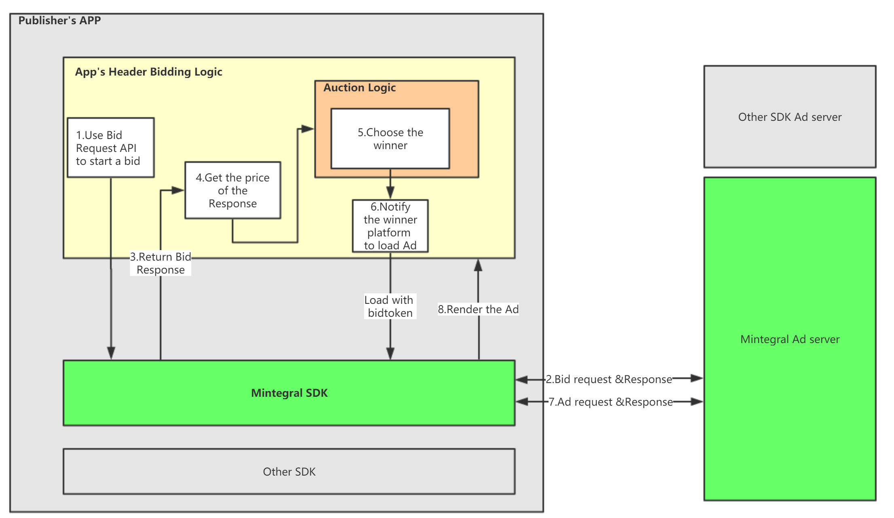
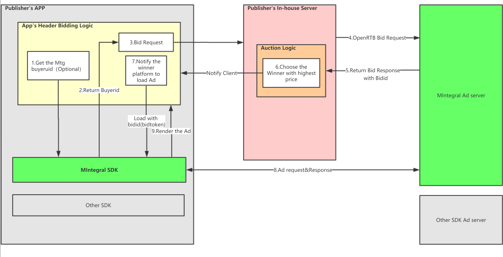

# Mintegral 应用头部竞价集成文档   


Mintegral SDK支持在移动应用中竞价。移动应用竞价集成可以是从移动客户端到我们的服务器。此概述将涵盖应用出价的一般概念，并提供有关如何将应用程序标头与Mintegral SDK集成的说明。<br/>
Mintegral SDK提供6种不同的广告格式，包括横幅，原生，原生视频，奖励视频，插屏视频，开屏，并且可以支持App Head-Bidding。

## 一、介绍

### 1.1 什么是App Head-Bidding
应用头部竞价可以让开发者在展示广告之前，通过竞价请求获取每个广告平台的出价，并通过竞价排序选出胜出者，只有胜出的广告平台才可以获得广告展示机会，进而使得广告展示的收益趋于最大化。

### 1.2 为什么要App Head-Bidding


 - 实时拍卖可以针对每个广告请求进行优化。
 - 提供广告资源真实价格的可见性。
 - 易于维护，并且只需要更少的广告运营资源。    

 

## 二、集成介绍

Mintegral提供两种Header Bidding方式，分别是：客户端到服务端竞价，服务端到服务端竞价。
开发者可根据自身实际情况进行选择，并按照相应流程执行逻辑


### 2.1 客户端到服务端竞价说明
在这种流程中，开发者可通过Mintegral SDK进行竞价请求，并可在客户端进行竞价排序。
      

**关键步骤：**

- 开发者APP在展示机会到来之前完成初始化并调用Mintegral sdk竞价请求接口，Mintegral SDK会与服务端通信获取竞价返回结果。
- 开发者APP通过返回的结果，获取价格和bidtoken（调用广告加载方法时会用到该字段）
- 开发者通过价格排序逻辑判断胜出的平台      
- 若Mintegral竞价成功，开发者可以调用我们sdk的广告加载接口进行广告加载并进行后续展示。     


### 2.2 服务端到服务端竞价
在本流程中，开发者可通过自有服务器（或通过第三方聚合服务器）进行竞价请求，并可在服务端进行竞价排序。

   


**关键步骤：**

- 开发者在展示机会到来之前完成初始化并调用Mintegral SDK的 BidManager.getBuyerUid  接口来获取buyeruid（必须）
- 开发者app可将获取到的buyeruid上报给自己服务器，用于请求Mintegral服务器时进行传递（必须）
- 开发者服务端需构造符合OpenRTB协议标准（参照说明）的请求向Mintegral广告平台服务器发起竞价请求询价
- 我们的广告服务器响应竞价请求并进行出价，开发者可以在自身的服务端进行竞价排序，选出胜出的广告平台，同时下发相关响应参数包括bidid（调用广告加载方法时会用到该字段）
- 开发者服务器通知自己的客户端Mintegral胜出，开发者APP调用Mintegral sdk的广告加载接口进行广告加载。

## 三、SDK集成接入说明

在集成应用头部竞价逻辑之前，请先确保你已经阅读过MTGSDK的[Android集成文档](http://cdn-adn.rayjump.com/cdn-adn/v2/markdown_v2/index.html?file=sdk-m_sdk-android&lang=cn)（[或者iOS集成文档](http://cdn-adn.rayjump.com/cdn-adn/v2/markdown_v2/index.html?file=sdk-m_sdk-ios&lang=cn)）或者已集成MTGSDK到你的项目中。


## 3.1 Android集成说明

#### 3.1.1 获取Mintegral SDK
通过在[MTG SDK集成文档](https://dev.mintegral.com/doc/index.html?file=sdk-m_sdk-android&lang=cn)中获取

#### 3.1.2 初始化SDK
在application中调用初始化方法，传入在Mintergal后台得到的AppID和AppKey。**建议在主线程调用此方法,并且尽量在你应用启动时，越早初始化SDK越好。保证每次重新启动应用的时候都要完成初始化sdk。注意AppId、AppKey及请求广告的unitId都必须填写，不能置空。**   


```java
public void init(Map<String,String> ids,Application application);
```

示例代码：

```java
MBridgeSDK sdk = MBridgeSDKFactory.getMBridgeSDK();
Map<String, String> map = sdk.getMBConfigurationMap("your AppId", "your AppKey");
sdk.init(map, this);
```

#### 3.1.3 创建BidManager对象并竞价请求

_注：若您采用服务端到服务端竞价模式可忽略该步骤_


在你项目里的Activity或者Fragment，创建BidManager对象：

```java
BidManager manager = new BidManager("your placementId", "your unitID"); 

//如果集成Banner类型广告，传入BannerBidRequestParams
manager = new BidManager(new BannerBidRequestParams(String placementId, String mUnitId, int weigh, int height));  

//如果集成Splash类型广告，传入SplashBidRequestParams
manager = new BidManager(new SplashBidRequestParams(String placementId, String mUnitId, boolean ispreload, int orientation, int logoSizeW, int logoSizeH));

```

在BidManager对象创建好了之后，可以通过bid方法来发送竞价请求，并且回调一个BidListennning对象。**注意在调用bid方法前，一定要保证SDK初始化完成。**

Sample code:

```java

BidManager manager = new BidManager("your placementId", "your unitID"); 
//集成Banner类型广告传入BannerBidRequestParams
manager = new BidManager(new BannerBidRequestParams(PLACEMENT_ID,UNIT_ID,bannerW,bannerH));

manager.setBidListener(new BidListennning() {
    @Override
    public void onFailed(String msg) {
        // bid failed
    }

    @Override
    public void onSuccessed(BidResponsed bidResponsed) {
        // bid successeful
    }
});

manager.bid();
```

#### 3.1.4 处理竞价结果

_注：本段落描述内容为在客户端处理竞价结果的示例，若您采用服务端到服务端竞价模式需在服务端进行竞价结果的处理_

在这部分中，我们采用MBridgeSDK的出价响应，并将其与其他买家的CPM价格进行比较，并决定MintegralSDK是赢得并加载广告，还是失败。 当您确定拍卖结果时，请调用方法sendWinNotice（Context context）或sendLossNotice（Context context，BidLossCode bidLossCode）以通知MTG结果。<br>
请注意，拍卖逻辑由应用程序本身实现。 它应该简单地比较投标价格并选择最高出价者作为拍卖获胜者。<br>
以下是如何使用返回的BidResponsed并运行竞价的示例。

```java
...
@Override
public void onSuccessed(BidResponsed bidResponsed) {

    token = bidResponsed.getBidToken();
    final double otherPrice = ...;
    final double price = bidResponsed.getPrice();
    if (price >= otherPrice) {
        // Load the ad from the bid response

        // Notify the bid won
        bidResponsed.sendWinNotice(getApplicationContext());
    } else {
        // Notify the bid lose
        bidResponsed.sendLossNotice(getApplicationContext(),bidLossCode);
        //bidLossCode分为三种，根据实际情况选择
        //BidLossCode.bidPriceNotHighest()  bid价格不是最高的
        //BidLossCode.bidTimeOut()  bid超时
        //BidLossCode.bidWinButNotShow()  bid成功了但是不展示

    }

}
...
```

#### 3.1.5 根据竞价结果，加载对应的广告

- Banner

当Mintegral赢得竞价后，下一步是使用MBBannerView的loadFromBid（String bidToken）方法来请求广告。此部分与普通请求广告很相似，只有一处不同，您需要调用loadFromBid（String bidToken）来请求广告，而不是调用load()方法。其中对于bidToken，对于客户端到服务端集成方式您可以通过这样来获取：bidResponsed.getBidToken()</br>
若您使用服务端到服务端集成方式需将Mintegral返回的bidid作为bidtoken传入进行广告加载 [Object：BidResponse](#4.2.1)  。  

监听器的回调方法与普通请求广告对象监听器是一样的。      


Sample Code:

```java
        
mbBannerView.init(new BannerSize(BannerSize.DEV_SET_TYPE,bannerW,bannerH),UNIT_ID);
//mbBannerView.setAllowShowCloseBtn(false);
mbBannerView.setRefreshTime(10);
mbBannerView.setBannerAdListener(new BannerAdListener() {


    @Override
    public void onLoadSuccessed() {

        showToast("on load successd");
        Log.e(TAG, "on load successed");
    }
    ...
    ...

});

mbBannerView.loadFromBid(token);
```

- Native(NativeVideo)

当MBridgSDK赢得竞价后，下一步是使用MBBidNativeHandler的bidLoad（String bidToken）方法来请求广告。此部分与普通请求广告很相似，只有一处不同，您需要调用bidLoad（String bidToken）来请求广告，而不是调用load()方法。其中对于bidToken，对于客户端到服务端集成方式您可以通过这样来获取：bidResponsed.getBidToken()</br>
若您使用服务端到服务端集成方式需将Mintegral返回的bidId作为bidtoken传入进行广告加载 [Object：BidResponse](#4.2.1)  。  

监听器的回调方法与普通请求广告对象监听器是一样的。      


Sample Code:

```java
Map<String, Object> properties = MBNativeHandler.getNativeProperties("your placementId", "your unitId");
properties.put(MIntegralConstans.PROPERTIES_AD_NUM, AD_NUM);
mNativeHandle = new MBBidNativeHandler(properties, this);
mNativeHandle.setAdListener(new NativeAdListener() {

@Override
public void onAdLoaded(List<Campaign> campaigns, int template) {
   
    ...
    ...

});
mNativeHandle.bidLoad("the bidToken");
...
...
```

- RewardVideo

当MintegralSDK赢得竞价后，下一步是使用MBBidRewardVideoHandler的loadFromBid（String bidToken）方法来请求广告。此部分与普通请求广告很相似，只有一处不同，您需要调用loadFromBid（String bidToken）来请求广告，而不是调用load()方法。其中对于bidToken，客户端到服务端集成方式中您可以通过这样来获取：bidResponsed.getBidToken()</br>
若您使用服务端到服务端集成方式需将Mintegral返回的bidid作为bidtoken传入进行广告加载[Object：BidResponse](#4.2.1) 。      
监听器的回调方法与普通请求广告对象监听器是一样的。<br>

Sample code:

```java
public class TestActivity extends Activity  implements View.OnClickListener{
    @Override
    protected void onCreate(@Nullable Bundle savedInstanceState) {
        super.onCreate(savedInstanceState);
        ...
        ...
        ...
        
    MBBidRewardVideoHandler mMbRewardVideoHandler = new MBBidRewardVideoHandler(this, "your placementId", "your unitId");
	mMbRewardVideoHandler.setRewardVideoListener(new RewardVideoListener() {

		@Override
		public void onLoadSuccess(String placementId, String unitId) {


		}

		@Override
		public void onVideoLoadSuccess(String placementId, String unitId)  {


		}

		...
		...
		
		//如果需要使用RewarPlus，则需要添加以下代码
		mMbRewardVideoHandler.setRewardPlus(true);

	});
}

    ...
    ...
    ...
    @Override
    public void onClick(View v) {
        switch (v.getId()) {
            case R.id.bt_load:
                mMbRewardVideoHandler.loadFromBid("the bidToken");
                break;
            case R.id.bt_show:
                if (mMbRewardVideoHandler.isBidReady()) {
                    mMbRewardVideoHandler.showFromBid("your rewardId");
                }
                break;
        }
    }
}
```

- New IntestitialVideo 


当MTGSDK赢得竞价后，下一步是使用MBBidInterstitialVideoHandler<font color=red>(旧插屏广告对应的是com.mbridge.msdk.interstitialvideo.out下的广告对象，新插屏广告对应的是com.mbridge.msdk.newinterstitial.out下的广告对象，建议用新插屏)</font>的loadFromBid（String bidToken）方法来请求广告。此部分与普通请求广告很相似，只有一处不同，您需要调用loadFromBid（String bidToken）来请求广告，而不是调用load()方法。其中对于bidToken，客户端到服务端集成方式中您可以通过这样来获取：bidResponsed.getBidToken()</br>
若您使用服务端到服务端集成方式需将Mintegral返回的bidId作为bidtoken传入进行广告加载[Object：BidResponse](#4.2.1) 。

监听器的回调方法与普通请求广告对象监听器是一样的。       

Sample code：

```java
public class TestActivity extends Activity  implements View.OnClickListener{
    @Override
    protected void onCreate(@Nullable Bundle savedInstanceState) {
        super.onCreate(savedInstanceState);
        ...
        ...
        ...
        
        MBBidNewInterstitialHandler mMbInterstitalVideoHandler = new MBBidNewInterstitialHandler(this, "your placementId", "your unitId");
		mMbInterstitalVideoHandler.setInterstitialVideoListener(new NewInterstitialListener() {

			@Override
			public void onLoadCampaignSuccess(MBridgeIds ids)  {


			}

			@Override
			public void onResourceLoadSuccess(MBridgeIds ids) {


			}

			...
			...

		});
    }

    ...
    ...
    ...
    @Override
    public void onClick(View v) {
        switch (v.getId()) {
            case R.id.bt_load:
                mMbInterstitalVideoHandler.loadFromBid("the bidToken");
                break;
            case R.id.bt_show:
                if (mMbInterstitalVideoHandler.isBidReady()) {
                    mMbInterstitalVideoHandler.showFromBid("your rewardId");
                }
                break;
        }
    }
}
```

- Splash


当MTGSDK赢得竞价后，下一步是使用MBSplashHandler的preLoadByToken(String token)或者loadAndShowByToken(String token, ViewGroup container)方法来请求广告。此部分与普通请求广告很相似，只有一处不同，您需要调用preLoadByToken(String token)或者loadAndShowByToken(String token, ViewGroup container)来请求广告，而不是调用preLoad()或 loadAndShow( ViewGroup container)方法。其中对于bidToken，客户端到服务端集成方式中您可以通过这样来获取：bidResponsed.getBidToken()</br>
若您使用服务端到服务端集成方式需将Mintegral返回的bidId作为bidtoken传入进行广告加载[Object：BidResponse](#4.2.1) 。

监听器的回调方法与普通请求广告对象监听器是一样的。       

Sample code：

```java
bidManager = new BidManager(new SplashBidRequestParams("your placementId", unitId, true, 2, 30, 30));
mbSplashHandler = new MBSplashHandler("your placementId", unitId);
mbSplashHandler.setLoadTimeOut(loadTimeOut);
Button textView = new Button(this);
textView.setText("logo");
mbSplashHandler.setLogoView(textView, 100, 100);

mbSplashHandler.setSplashLoadListener(new MBSplashLoadListener() {
    @Override
    public void onLoadSuccessed(int reqType) {

    }
    @Override
    public void onLoadFailed(String msg, int reqType) {

    }
}

mbSplashHandler.setSplashShowListener(new MBSplashShowListener() {
    @Override
    public void onShowSuccessed() {

    }

    @Override
    public void onShowFailed(String msg) {

    }
    ...
    ...

}

public void onClick(View v) {
    switch (v.getId()) {
        case R.id.mbridge_demo_splash_ac_bid:
            bidManager.bid();
            break;
        case R.id.mbridge_demo_splash_ac_load_show:

            if(!TextUtils.isEmpty(token)){
                mbSplashHandler.loadAndShowByToken(token,container);
            }else {
                Toast.makeText(BidSplashActivity.this,"Token is empty",Toast.LENGTH_LONG).show();
            }
            break;
        case R.id.mbridge_demo_splash_ac_preload:
            if (!TextUtils.isEmpty(token)) {
                mbSplashHandler.preLoadByToken(token);
            }else {
                Toast.makeText(BidSplashActivity.this,"Token is empty",Toast.LENGTH_LONG).show();
            }
            break;
        case R.id.mbridge_demo_splash_ac_show:
            if (!TextUtils.isEmpty(token)) {
                if (mbSplashHandler.isReady(token)) {
                    mbSplashHandler.show(container,token);
                } else {
                    Log.e(TAG, "isready is false");
                    Toast.makeText(BidSplashActivity.this,"campain is not ready",Toast.LENGTH_LONG).show();
                }
            }else {
                Toast.makeText(BidSplashActivity.this,"Token is empty",Toast.LENGTH_LONG).show();
            }
            break;
    }
}
```

- Automatic Rending Native


当MTGSDK赢得竞价后，下一步是使用MBNativeAdvancedHandler的loadByToken(String token)方法来请求广告。此部分与普通请求广告很相似，只有一处不同，您需要调用loadByToken(String token)来请求广告，而不是调用load()方法。其中对于bidToken，客户端到服务端集成方式中您可以通过这样来获取：bidResponsed.getBidToken()</br>
若您使用服务端到服务端集成方式需将Mintegral返回的bidId作为bidtoken传入进行广告加载[Object：BidResponse](#4.2.1) 。

监听器的回调方法与普通请求广告对象监听器是一样的。       

Sample code：

```java
public class TestActivity extends Activity  implements View.OnClickListener{
    @Override
    protected void onCreate(@Nullable Bundle savedInstanceState) {
        super.onCreate(savedInstanceState);
        mbNativeAdvancedHandler = new MBNativeAdvancedHandler(this,PLACEMENT_ID,UNIT_ID);                           mbNativeAdvancedHandler.setNativeViewSize(advancedNativeH,advancedNativeW);
        mbAdView = mbNativeAdvancedHandler.getAdViewGroup();

        ...
        ...

    }

public void onClick(View v) {
    switch (v.getId()) {
        case R.id.mbridge_demo_h5native_ac_bid:
            if(mbNativeAdvancedHandler != null){
			     mbNativeAdvancedHandler.loadByToken(token);
		      }
            break;
    case R.id.mbridge_demo_h5native_isReady:
           if(mbNativeAdvancedHandler != null){
              mbNativeAdvancedHandler.isReady(token);
           }
            break;    
        }
}
```


#### 3.1.6 获取buyerUID

_注：该步骤主要在服务端到服务端对接模式中用到，若开发者采用客户端到服务端对接模式则无需获取buyeruid。获取并使用该参数有助于更好地让Mintegral算法更好地进行广告优化。_

通过调用静态方法 BidManager.getBuyerUid(Context context) 来获取唯一的buyerUID，并将这个buyerUID告知你自己的服务端，用于执行服务端的竞价请求[Object：User](#4.1.5)，建议您在每次初始化应用后或竞价请求前重新获取buyerUID。

## 3.2 iOS集成说明

#### 3.2.1获取Mintegral SDK

添加MTGSDK.framework 和 MTGBidding.framework到你的项目中。

#### 3.2.2 初始化SDK
在AppDelegate里的如下方法中调用MTGSDK的初始化方法，传入在Mintergal后台得到的AppID和ApiKey。初始化时，MTGSDK会从服务器拉取配置信息。**建议在主线程调用此方法。注意AppId、ApiKey及请求广告的unitId都必须填写，不能置空。** 

```objectivec
//tips:ApiKey and AppKey are the same.
- (void)setAppID:(nonnull NSString *)appID ApiKey:(nonnull NSString *)appKey;
```

示例代码：

```objectivec
- (BOOL)application:(UIApplication *)application didFinishLaunchingWithOptions:(NSDictionary *)launchOptions{
	[[MTGSDK sharedInstance] setAppID:@"your appID" ApiKey:@"your apiKey"];
}
```

#### 3.2.3 创建MTGBiddingRequest对象并竞价请求

_注：若您采用服务端到服务端竞价模式可忽略该步骤_

SDK初始化完成之后，在你的iOS项目中，创建如下代码：**（在调用该方法前一定要保证初始化完成）**

```objectivec
[MTGBiddingRequest getBidWithRequestParameter:param completionHandler:^(MTGBiddingResponse * _Nonnull bidResponse) {
    if (bidResponse.success) {
     //bid successeful
       
    }else{
        //bid failed 
        
    }

}];

```

#### 3.2.4 处理竞价结果

_注：本段落描述内容为在客户端处理竞价结果的示例，若您采用服务端到服务端竞价模式需在服务端进行竞价结果的处理。_

在这部分中，我们采用MintegralSDK的出价响应，并将其与其他买家的CPM价格进行比较，并决定MintegralSDK是赢得并加载广告，还是失败。 当您确定拍卖结果时，请调用方法notifyWin或notifyLoss以通知MTG结果。<br>
请注意，拍卖逻辑由应用程序本身实现。 它应该简单地比较投标价格并选择最高出价者作为拍卖获胜者。<br>
以下是如何使用返回的MTGBiddingResponse并运行竞价的示例。

```objectivec
//如果集成Banner类型广告，创建MTGBiddingBannerRequestParameter
MTGBiddingBannerRequestParameter *bannerParam = [[MTGBiddingBannerRequestParameter alloc]initWithPlacementId:kBannerPlacementId unitId:kBannerUnitID basePrice:@0.1 unitSize:CGSizeMake(320, 50)];

//如果集成Splash类型广告，创建MTGBiddingSplashRequestParameter
MTGBiddingSplashRequestParameter *param = [[MTGBiddingSplashRequestParameter alloc] initWithPlacementId:kSplashPlacementId unitId:kSplashUnitID basePrice:@(0) preload:YES customViewSize:CGSizeMake(100, 100) preferredOrientation:0];


//如果使用Reward Plus     
//This method is used to open RewardPlus for RewardVideo,if you need,defalue NO.
MTGBiddingRequestParameter *requestParameter = [[MTGBiddingRequestParameter alloc]initWithPlacementId:kRewardPlacementId unitId:KRewardUnitID basePrice:@(0.1) openRewardPlus:YES];

//其他广告形式，创建MTGBiddingRequestParameter
MTGBiddingRequestParameter *param = [[MTGBiddingRequestParameter alloc]initWithPlacementId:KNativePlacementId unitId:KNativeUnitID basePrice:nil];


[MTGBiddingRequest getBidWithRequestParameter:param completionHandler:^(MTGBiddingResponse * _Nonnull bidResponse) {
        if (bidResponse.success) {
            self.bidToken = bidResponse.bidToken;
            [self log:@"bid success"];
            [bidResponse notifyWin];
        }else{
            NSString *errorMsg = bidResponse.error.description;
            UIAlertView *alert = [[UIAlertView alloc] initWithTitle:@"Bid Failed" message:errorMsg delegate:nil cancelButtonTitle:@"Got" otherButtonTitles:nil];
            [alert show];
            [self log:@"bid failed"];
        }

    }];

```

#### 3.2.5 根据竞价结果，加载对应的广告

- Banner

当MTGSDK出价赢得竞价后，下一步是使用loadBannerAdWithBidToken 方法来请求广告。

此部分与普通请求广告很相似，只有一处不同，您需要调用loadBannerAdWithBidToken来请求广告，而不是调用loadBannerAd 方法。其中对于bidToken，客户端到服务端集成方式中您可以通过这样来获取：bidResponse.bidToken，若您使用服务端到服务端集成方式需将Mintegral返回的bidid作为bidtoken传入进行广告加载 [Object：BidResponse](#4.2.1)  。         

Delegate的回调方法与普通请求广告是一样的。     

Sample Code:

```objectivec
#import "TestViewController.h"
#import <MTGSDKBanner/MTGBannerAdView.h>
#import <MTGSDKBanner/MTGBannerAdViewDelegate.h>
#import <MTGSDKBidding/MTGBiddingRequest.h>
#import <MTGSDKBidding/MTGBiddingBannerRequestParameter.h>
@interface TestViewController ()<MTGBannerAdViewDelegate>

@property(nonatomic,strong) MTGBannerAdView *bidBannerView;


@end

@implementation TestViewController

- (void)viewDidLoad {
    [super viewDidLoad];

    if (_bidBannerView == nil) {
        _bannerAdView = [[MTGBannerAdView alloc]initBannerAdViewWithAdSize:size placementId:kBannerPlacementId unitId:kBannerUnitID rootViewController:self];
        _bidBannerView.delegate = self;
        _bidBannerView.autoRefreshTime = 0;
        _bidBannerView.hidden = YES;

        [self.view addSubview:_bidBannerView];
        [_bidBannerView loadBannerAdWithBidToken:self.bidToken];
    }
    
}

#pragma mark -- MTGBannerAdViewDelegate
- (void)adViewLoadSuccess:(MTGBannerAdView *)adView {
    
    _bidBannerView.hidden = NO;
    [self log:[NSString stringWithFormat:@"%@",NSStringFromSelector(_cmd)]];
}

- (void)adViewLoadFailedWithError:(NSError *)error adView:(MTGBannerAdView *)adView {
    [self log:[NSString stringWithFormat:@"Load Error:%@",error.debugDescription]];
}

- (void)adViewWillLogImpression:(MTGBannerAdView *)adView {
    [self log:[NSString stringWithFormat:@"%@",NSStringFromSelector(_cmd)]];
}

- (void)adViewDidClicked:(MTGBannerAdView *)adView {
    [self log:[NSString stringWithFormat:@"%@",NSStringFromSelector(_cmd)]];

}

...
...


@end
```

- Native(NativeVideo)


当MTGSDK出价赢得竞价后，下一步是使用loadWithBidToken 方法来请求广告。

此部分与普通请求广告很相似，只有一处不同，您需要调用loadWithBidToken来请求广告，而不是调用loadAd 方法。其中对于bidToken，客户端到服务端集成方式中您可以通过这样来获取：bidResponse.bidToken，若您使用服务端到服务端集成方式需将Mintegral返回的bidid作为bidtoken传入进行广告加载 [Object：BidResponse](#4.2.1)  。         

Delegate的回调方法与普通请求广告是一样的。     

Sample Code:

```objectivec
#import "TestViewController.h"
#import <MTGSDK/MTGSDK.h>
#import <MTGSDK/MTGNativeAdManager.h>
#import <MTGSDKBidding/MTGBiddingRequest.h>
@interface TestViewController ()<MTGMediaViewDelegate,MTGBidNativeAdManagerDelegate>

@property (nonatomic, strong) MTGBidNativeAdManager *bidAdManager;


@end

@implementation TestViewController

- (void)viewDidLoad {
    [super viewDidLoad];
    if (_bidAdManager == nil) {
        _bidAdManager = [[MTGBidNativeAdManager alloc] initWithPlacementId:KNativePlacementId unitID:KNativeUnitID  presentingViewController:nil];
        _bidAdManager.delegate = self;
        [self.bidAdManager loadWithBidToken:self.bidToken];
    }
    
}


#pragma mark AdManger delegate
- (void)nativeAdsLoaded:(NSArray *)nativeAds nativeManager:(nonnull MTGNativeAdManager *)nativeManager {
    // load succesful        
    
  
}

- (void)nativeAdsFailedToLoadWithError:(NSError *)error nativeManager:(nonnull MTGNativeAdManager *)nativeManager {
   
}

...
...


@end
```


- RewardVideo


当MTGSDK出价赢得竞价后，下一步是使用loadVideoWithBidToken 方法来请求广告。

此部分与普通请求广告很相似，只有一处不同，您需要调用loadVideoWithBidToken 来请求广告，而不是调用loadVideoAd 方法。其中对于bidToken，客户端到服务端集成方式中您可以通过这样来获取：bidResponse.bidToken，若您使用服务端到服务端集成方式需将Mintegral返回的bidid作为bidtoken传入进行广告加载[Object：BidResponse](#4.2.1)  。      
         
监听器的回调方法与普通请求广告对象监听器是一样的。      


Sample code:

```objectivec
#import <MTGSDKReward/MTGBidRewardAdManager.h>
#import <MTGSDK/MTGSDK.h>
#import <MTGSDKBidding/MTGBiddingRequest.h>

@interface MTGRewardVideoViewController ()
<MTGRewardAdLoadDelegate,MTGRewardAdShowDelegate>

- (void)viewDidLoad {
 ...
}

- (void)loadVideo{
   //This method is used to open RewardPlus for RewardVideo,if you need,please set this before loadVideo,defalue NO.
   //[MTGBidRewardAdManager sharedInstance].openRewardPlus = YES;
   [[MTGBidRewardAdManager sharedInstance] loadVideoWithBidToken:self.bidToken placementId:kRewardPlacementId unitId:KRewardUnitID delegate:self];
- }


- (void)showVideo{
   //Check whether video has been downloaded successfully before displaying ad
    if ([[MTGBidRewardAdManager sharedInstance] isVideoReadyToPlayWithPlacementId:kRewardPlacementId unitId:KRewardUnitID]) {

        [[MTGBidRewardAdManager sharedInstance] showVideoWithPlacementId:kRewardPlacementId unitId:KRewardUnitID withRewardId:KRewardID userId:@"" delegate:self viewController:self];
    
    } 
}


#pragma mark - MTGRewardAdShowDelegate Delegate

//Show Reward Video Ad Success Delegate
- (void)onVideoAdShowSuccess:(nullable NSString *)placementId unitId:(NSString *)unitId {
    [self log:[NSString stringWithFormat:@"unitId = %@, show success", unitId]];
}


//Show Reward Video Ad Failed Delegate
- (void)onVideoAdShowFailed:(nullable NSString *)placementId unitId:(NSString *)unitId withError:(NSError *)error {
    [self log:[NSString stringWithFormat:@"unitId = %@, show failed, error: %@", unitId, error]];
}


...
...
...


@end
```


- Automatic Rending Native


当MTGSDK出价赢得竞价后，下一步是使用loadAdWithBidToken 方法来请求广告。

此部分与普通请求广告很相似，只有一处不同，您需要调用loadAdWithBidToken 来请求广告，而不是调用loadAd 方法。其中对于bidToken，客户端到服务端集成方式中您可以通过这样来获取：bidResponse.bidToken，若您使用服务端到服务端集成方式需将Mintegral返回的bidid作为bidtoken传入进行广告加载[Object：BidResponse](#4.2.1)  。      
         
监听器的回调方法与普通请求广告对象监听器是一样的。      


Sample code:

```objectivec
#import <MTGSDKNativeAdvanced/MTGNativeAdvancedAd.h>
#import <MTGSDK/MTGSDK.h>
#import <MTGSDKBidding/MTGBiddingRequest.h>

@interface MTGNativeAdvanceAdViewController ()<MTGNativeAdvancedAdDelegate>

- (void)viewDidLoad {
 ...
}

- (void)createNewNativeAd:(CGSize)size {
    
    _adManager = [[MTGNativeAdvancedAd alloc] initWithPlacementID:kNewNativePlacementId unitID:kNewNativeUnitID adSize:CGSizeMake(320, 90) rootViewController:self];
    _adManager.delegate = self;
    
    _adManager.showCloseButton = YES;
    _adManager.mute = NO;
    _adManager.autoPlay = YES;
    ...
}   


- (void)loadButtonAction:(UIButton *)sender {
    [self log:@"start loading"];
    if (self.bidSwitch) {
        if (self.bidToken.length > 0) {
            [self log:@"start loadAd bid"];
            [self.adManager loadAdWithBidToken:self.bidToken];
        }else{
            [self log:@"not token"];
        }
    } else {
        [self.adManager loadAd];
    }
}

- (void)showButtonAction:(UIButton *)sender {
    if (self.bidSwitch) {
        if (self.bidToken.length >0) {
            if ([_adManager isBiddingAdReady]){
                [self addAdView];
            }else{
                [self log:@"not ready"];
            }
        }else{
            [self log:[NSString stringWithFormat:@"not token"]];
        }
    }else{
        if ([_adManager isAdReady]) {
            [self addAdView];
        }
    }    
}

...
...

@end
```


- New IntestitialVideo 

当MTGSDK出价赢得竞价后，下一步是使用loadVideoWithBidToken 方法来请求广告。

此部分与普通请求广告很相似，只有一处不同，您需要调用loadVideoWithBidToken 来请求广告，而不是调用loadVideoAd 方法。其中对于bidToken，客户端到服务端集成方式中您可以通过这样来获取：bidResponse.bidToken，若您使用服务端到服务端集成方式需将Mintegral返回的bidid作为bidtoken传入进行广告加载[Object：BidResponse](#4.2.1)  。            
监听器的回调方法与普通请求广告对象监听器是一样的。      


Sample code：

```objectivec
#import "MTGNewInsterstialViewController.h"
#import <MTGSDKNewInterstitial/MTGNewInterstitialBidAdManager.h>
#import <MTGSDKBidding/MTGBiddingRequest.h>
#import <MTGSDK/MTGSDK.h>


@interface MTGNewInsterstialViewController ()<MTGNewInterstitialBidAdDelegate>

@property (nonatomic, strong) MTGNewInterstitialBidAdManager *ivBidAdManager;

@end

@implementation MTGNewInsterstialViewController.h

- (void)viewDidLoad {
    [super viewDidLoad];
    ...
    ...
  
}


- (void)loadVideo{
    if (!_ivBidAdManager ) {
    _ivBidAdManager = [[MTGNewInterstitialBidAdManager alloc]initWithPlacementId:KInterstitialVideoPlacementId2 unitId:KInterstitialVideoUnitID2 delegate:self];
        _ivBidAdManager.delegate = self;
    }
    [_ivBidAdManager loadAdWithBidToken:@"your bidToken"];

}


- (void)showVideo{
    if ([_ivBidAdManager isAdReady]) {
        [_ivBidAdManager showFromViewController:self];
    }
}


#pragma mark - Interstitial Delegate Methods

- (void)newInterstitialAdLoadSuccess:(MTGNewInterstitialAdManager *_Nonnull)adManager {
    [self log:NSStringFromSelector(_cmd)];

}

- (void)newInterstitialAdResourceLoadSuccess:(MTGNewInterstitialAdManager *_Nonnull)adManager {
    [self log:NSStringFromSelector(_cmd)];

}
...
...


@end

```
- Splash


当MTGSDK出价赢得竞价后，下一步是请求广告。

此部分与普通请求广告很相似，只有一处不同，您需要调用 preloadWithBidToken 或 loadAndShowXXXbidToken来请求广告，而不是调用 preload 或 loadAndShowXXX 方法。其中对于bidToken，客户端到服务端集成方式中您可以通过这样来获取：bidResponse.bidToken，若您使用服务端到服务端集成方式需将Mintegral返回的bidid作为bidtoken传入进行广告加载[Object：BidResponse](#4.2.1)  。      
         
监听器的回调方法与普通请求广告对象监听器是一样的。      


Sample code:

```objectivec

#import "MTGSplashAdViewController.h"
#import <MTGSDKSplash/MTGSplashAD.h>
#import <MTGSDK/MTGSDK.h>
#import <MTGSDKBidding/MTGBiddingSplashRequestParameter.h>
#import <MTGSDKBidding/MTGBiddingRequest.h>

@interface MTGSplashAdViewController () <MTGSplashADDelegate>

@property (nonatomic, strong) MTGSplashAD *splashAD;
@property (nonatomic, strong) UISwitch *useCache;
@property (nonatomic, strong) UISwitch *useLogo;
@property (nonatomic, strong) UISwitch *skip;

@end

@implementation MTGSplashAdViewController 

- (void)createSplashAD {
    if (self.useLogo.on) {
        self.splashAD = [[MTGSplashAD alloc]initWithPlacementID:kSplashPlacementId unitID:kSplashUnitID countdown:10 allowSkip:self.skip.on customViewSize:CGSizeMake(200, 95) preferredOrientation:0];
    } else {
        self.splashAD = [[MTGSplashAD alloc]initWithPlacementID:kSplashPlacementId unitID:kSplashUnitID countdown:10 allowSkip:self.skip.on customViewSize:CGSizeZero preferredOrientation:0];

    }
    self.splashAD.delegate = self;
    if (self.useCache.on) {
        self.splashAD.useCache = MTGBoolYes;
    }
    
    UIImage *splashImage = [UIImage imageNamed:@"bgx"];
    self.splashAD.backgroundImage = splashImage;
    
}

//Load Video
- (IBAction)preloadButtonAction:(id)sender
{
    [self createSplashAD];

    [self log:@"bid splash ad is loading"];
    [self.splashAD preloadWithBidToken:self.bidToken];

}
//isReady
- (void)isReadyButtonAction:(UIButton *)button {
    [self createSplashAD];

    BOOL ready = [self.splashAD isBiddingADReadyToShow];
    [self log:[NSString stringWithFormat:@"isReady : %@", ready ? @"true" : @"false"]];

}

//Show Video
- (IBAction)showButtonAction:(id)sender
{
    [self createSplashAD];
    UIWindow *keyWindow = [UIApplication sharedApplication].keyWindow;
    UIView *logoView = nil;
    if (self.useLogo.on) {
        logoView = [self logoView];
    }
    
    [self.splashAD showBiddingADInKeyWindow:keyWindow customView:logoView];
    
}
//LoadNShow
- (void)LoadNShowButtonAction:(UIButton *)btn {
    
    [self createSplashAD];
    
    UIView *logoView = nil;
    if (self.useLogo.on) {
        logoView = [self logoView];
    }
        
    [self log:@"bid splash ad is loading"];
    UIWindow *keyWindow = [UIApplication sharedApplication].keyWindow;
    [self.splashAD loadAndShowInKeyWindow:keyWindow customView:logoView bidToken:self.bidToken timeout:5000];

}
//logoView
- (UIView *)logoView {
    UIImageView *logo = [[UIImageView alloc] initWithImage:[UIImage imageNamed:@"logo"]];
    logo.frame = CGRectMake(0, 0, 100, 100);
    return logo;
}

#pragma mark - MTGSplashADDelegate

- (void)splashADPreloadSuccess:(MTGSplashAD *)splashAD {
    [self log:[NSString stringWithFormat:@"unitId = %@, preload success", splashAD.unitID]];
}
- (void)splashADPreloadFail:(MTGSplashAD *)splashAD error:(NSError *)error {
    [self log:[NSString stringWithFormat:@"unitId = %@, preload error : %@", splashAD.unitID, error]];
}
// 开屏广告素材加载成功 / 失败
- (void)splashADLoadSuccess:(MTGSplashAD *)splashAD {
    [self log:[NSString stringWithFormat:@"unitId = %@, load success", splashAD.unitID]];
  }
- (void)splashADLoadFail:(MTGSplashAD *)splashAD error:(NSError *)error {
    [self log:[NSString stringWithFormat:@"unitId = %@, load error : %@", splashAD.unitID, error]];
}
// 展示成功 / 失败
- (void)splashADShowSuccess:(MTGSplashAD *)splashAD {
    [self log:[NSString stringWithFormat:@"unitId = %@, show success", splashAD.unitID]];
}
- (void)splashADShowFail:(MTGSplashAD *)splashAD error:(NSError *)error {
    [self log:[NSString stringWithFormat:@"unitId = %@, show error : %@", splashAD.unitID, error]];

}
// 进入后台
- (void)splashADDidLeaveApplication:(MTGSplashAD *)splashAD {
    [self log:[NSString stringWithFormat:@"unitId = %@, leave app", splashAD.unitID]];
}

// 点击
- (void)splashADDidClick:(MTGSplashAD *)splashAD {
    [self log:[NSString stringWithFormat:@"unitId = %@, did click", splashAD.unitID]];
}

// 关闭
- (void)splashADWillClose:(MTGSplashAD *)splashAD {
    [self log:[NSString stringWithFormat:@"unitId = %@, ad will close", splashAD.unitID]];

}
- (void)splashADDidClose:(MTGSplashAD *)splashAD {
    [self log:[NSString stringWithFormat:@"unitId = %@, ad closed", splashAD.unitID]];
}

// countdown
- (void)splashAD:(MTGSplashAD *)splashAD timeLeft:(NSUInteger)time {
    [self log:[NSString stringWithFormat:@"unitId = %@, ad countdown : %@", splashAD.unitID, @(time)]];
}

@end
```

#### 3.2.6 获取buyerUID

_注：该步骤主要在服务端到服务端对接模式中用到，若开发者采用客户端到服务端对接模式则无需获取buyeruid。获取并使用该参数有助于更好地让Mintegral算法更好地进行广告优化。

通过调用静态方法[MTGBiddingSDK buyerUid]来获取Mitegral用户标识buyerUID，并将这个buyerUID告知你自己的服务端，用于执行服务端的竞价请求[Object：User](#4.1.5)，建议您在每次初始化应用后重新获取buyerUID。


## 四、服务端OpenRTB竞价协议说明

若开发者想通过服务端直接与Mintegral服务器进行竞价，需要基于OpenRTB 2.5的协议要求进行请求。

### 4.1 请求参数

请求和返回都是使用基于OpenRTB 2.5的协议做局部自定义调整，使用json的格式描述，需要在Http Header中增加 openrtb:2.5 的键值对

如果使用Curl测试可以使用 -H "openrtb:2.5"

**http请求方式:** POST

**请求接口地址** ：http://hb.rayjump.com/bid

#### 4.1.1 Object：BidRequest

| Attribute | Type | Description |
| --- | --- | --- |
| id | string;required | 请求唯一标识，竞价平台提供 |
| imp | object array; required | Imp object，标记一次广告展示；MTG仅支持一次请求包含一个imp object |
| app | object; required | APP详细信息；详见APP object； |
| device | object;required | 设备详细信息；详见device object； |
| user | object;required | user详细信息；详见user object； |
| at | integer; optional;default 1 | 竞价类型；1-一价；2-二价 |

#### 4.1.2 Object：Imp

| Attribute | Type | Description |
| --- | --- | --- |
| id | string;required | 从1开始自增的展示Id，用于表示一个展示位置 |
| displaymanager | string;optional | 聚合平台名字 |
| placement_id | string;optional | 广告版位ID，您可以在Mintegral开发者后台“版位&广告单元”页面查询到该ID。 |
| displaymanagerver | string;required | 集成的MTG-SDK version |
| tagid | string;required | MTG ad unit ID，即广告单元ID。 |
| bidfloor | float;optional default 0 | 底价 |
| bidfloorcur | string;optional;default "USD" | 底价货币单位，默认美元 |


#### 4.1.2.1 Object：Imp.banner

| Attribute | Type | Description |
| --- | --- | --- |
| w | int;required | 请求Banner广告的宽度|
| h | int;required | 请求Banner广告的高度 |

#### 4.1.2.1.2 Object：Imp.native.ext

| Attribute | Type | Description |
| --- | --- | --- |
| unit_size_w | int;required | 请求H5 native广告的宽度|
| unit_size_h | int;required | 请求H5 native广告的高度 |

#### 4.1.2.1.3 Object：Imp.video.ext

| Attribute | Type | Description |
| --- | --- | --- |
| w | int;required | 请求视频广告的视频宽度|
| h | int;required | 请求视频广告的视频高度|

#### 4.1.2.1.4 Object：Imp.ext

| Attribute | Type | Description |
| --- | --- | --- |
| ext | object;optional | SKAdNetworkIDs|


#### 4.1.2.2 BidRequest.imp.ext.skadn

| Attribute  | Type                  | Description                                                  | Example                                                      |
| :--------- | --------------------- | ------------------------------------------------------------ | ------------------------------------------------------------ |
| version    | String;optional       | 支持SKAdNetwork的版本。<br />通常为“ 2.0”或更高。<br />取决于OS版本和SDK版本。 | "version":"2.0"                                              |
| sourceapp  | String;optional       | 苹果应用商店中发布者应用的ID。<br />与BidRequest.app.bundle一致 | "sourceapp":"880047117"                                      |
| skadnetids | String Array;optional | 发布者APP的info.plist中与DSP<br />相关的SKAdNetworkIdentifier的子集。 | ["SKAdNetwork1.skadnetwork",<br />" SKAdNetwork2.skadnetwork"] |

#### 4.1.3 Object：App

| Attribute | Type | Description |
| --- | --- | --- |
| id | string;required | MTG APP id，即媒体id |
| ver | string;optional | 媒体版本 |
| ext | object;optional | 自定义object，主要包括orientation字段 |

##### 4.1.3.1 Object：Orientation Ext

| Attribute | Type | Description |
| --- | --- | --- |
| orientation | int;required | 应用的横竖屏属性；1-竖屏2-横屏3-未知 |

#### 4.1.4 Object：Device

| Attribute | Type | Description |
| --- | --- | --- |
| ua | string;required | 请求应用的ua |
| ip | string;required | IPv4地址；（与IPv6二选一） |
| ipv6 | string;required | IPv6地址；（与IPv4二选一） |
| devicetype | integer;required | 设备类型；1-phone 2-tablet |
| make | string;required | 设备品牌 |
| model | string;required | 设备型号 |
| os | string;required | 设备操作系统 |
| osv | string;required | 设备操作系统版本 |
| h | integer;required | 设备屏幕高度，单位为pixels |
| w | integer;required | 设备屏幕快递，单位为pixels |
| language | string;required | 设备语言；采用ISO-639-1-alpha-2标准 |
| mccmnc | string;optional | 移动运营商；采用MCC-MNC串接成的代码 |
| connectiontype | integer;required | 网络连接类型；NET_TYPE_UNDEFAAULT = 0；NET_TYPE_UNKNOW = 0; NET_TYPE_WIFI = 9;NET_TYPE_5G = 5;NET_TYPE_4G = 4;NET_TYPE_3G = 3;NET_TYPE_2G = 2; |
| ifa | string;required | iOS-idfa, android-gaid |
| didsha1 | string;optional | IMEI sha1 |
| didmd5 | string;optional | IMEI md5 |
| Dpidsha1 | string;optional | android\_id sha1 |
| dpidmd5 | string;optional | android\_id md5 |
| geo.country | string;optional | 国家码 |

#### 4.1.5 <span id = "4.1.5">Object：User</span>

| Attribute | Type | Description |
| --- | --- | --- |
| buyeruid | string;required | MTG 用于识别用户的buyer id； |

### 4.2 返回数据

以下列举了返回数据结构的各类参数

#### 4.2.1 <span id = "4.2.1">Object：BidResponse</span>

| Attribute | Type | Description |
| --- | --- | --- |
| id | string;required | 返回bidrequest.id |
| seatid | object array | 见seatid object |
| bidid | string;optional | MTG返回的后续竞价胜出后用于加载广告的token id； |
| cur | string;default "USD" | 出价的货币单位，默认美元 |
| nbr | integer;optional | 不出价原因 |

##### 4.2.1.1 Object：SeatBid

| Attribute | Type | Description |
| --- | --- | --- |
| bid | object array;required | 见bid object； |

##### 4.2.1.1.1 Object：Bid

| Attribute | Type | Description | 备注 |
| --- | --- | --- | --- |
| id | string;required | bid id | Bid的唯一标识； |
| impid | string;required | 请求时的[imp.id](http://imp.id/) | 返回bidrequest.imp.id；标识对某个具体的imp object出价； |
| price | float;required | bid的出价 | 广告cpm出价； |
| nurl | string;required | win notice url | 竞价胜出时调用该链接通知MTG |
| lurl | string;required | loss notice url | 竞价失败时调用该链接通知MTG |

##### 4.2.1.1.1.1 Object：BidResponse.seatbid.bid.ext.skadn

| Attribute  | Type            | Description                                                  | Example                           |
| ---------- | --------------- | ------------------------------------------------------------ | --------------------------------- |
| version    | String;optional | SKAdNetwork的版本。<br />必须为2.0或更高。                   | "version":"2.0"                   |
| network    | String;optional | 签名中使用的广告网络标识符。<br />应与请求中skadnetids数组中的一项匹配 | "network":"dsp1.skadnetwork"      |
| campaign   | String;optional | 与Apple规范兼容的广告系列ID。<br />从2.0开始，应为1到100之间的整数，表示为字符串 | "campaign":"45"                   |
| itunesitem | String;optional | 苹果应用商店中广告客户应用的ID。<br />应该匹配BidResponse.seatbid.bid.bundle | "itunesitem":"880047117           |
| nonce      | String;optional | 每个广告响应唯一的ID。<br />有关正确的UUID格式要求，请参阅Apple文档。 | "nonce": "beeeb65e-b3de-02420004" |
| sourceapp  | String;optional | 苹果应用商店中发布者应用的ID。<br />应该匹配BidRequest.imp.ext.skad.sourceapp | "sourceapp":"123456789"           |
| timestamp  | String;optional | 签名时使用的以毫秒为单位的Unix时间                           | "timestamp": "1594406341"         |
| signature  | String;optional | 苹果指定的SKAdNetwork签名                                    | "signature": "MEQCIEQZRRyMyUXg==" |


### 4.3 示例

#### 4.3.1 请求示例
```java
{
	"user": {
		"buyeruid": "NnvFiAV2GaNwx3foiZTTinvFWVRPiUNwNnlMNARPinVMxnxj6deIkjx7xTheiUN2HFHA4+f6LkxIkjx7xTheiUN2HFH0Lb5M+FQ367cMh7eQ67QNL7K/HnjMWafIG+ewL5I2WUN/idMBfaiF4ajeiU5InkK1LkesDZI2WUvlp7QNL7K/HnslN2S5R7QNL7K/HZSyVBvei5Ie+ARlY7Q8HZSfDkiln2ilko3lN+SMY75+HkzWL+NXfUvTWUi/fZvEZTtVnVMsR7euLFVlxF5ULFIuRj2XDrQsHZIefVRBiaR="
	},
	"id": "5cebee04c6c1e276cc8b2e8x",
	"imp": [{
		"id": "1",
		"tagid": "21316",
		"bidfloor": 0.1,
		"bidfloorcur": "USD",
		"ext": {
			"skadn": {
				"version": "2.0",
				"sourceapp": "880047117",
				"skadnetids": [
					"cdkw7geqsh.skadnetwork",
					"qyJfv329m4.skadnetwork"
				]
			}
		},
		#Banner广告添加
		"banner": {
			"w": bannerWidth,
			"h": bannerHeight
		}
		#H5 Native广告添加
		"native": {
            "w": videoWidth,
            "h": videoHeight
		}
        #Video广告添加
        "video": {
            "ext": {
                "w": videoWidth,
                "h": videoHeight
            }
        }
        "ext": {
            "skadn":"..."
        }
	}],
	"app": {
		"id": "92763",
		"ext": {
			"orientation": 0
		},
		"ver": "5.4.0"
	},
	"device": {
		"ua": "Mozilla/5.0 (iPhone; CPU iPhone OS 11_1_2 like Mac OS X) AppleWebKit/604.3.5 (KHTML, like Gecko) Mobile/15B202",
		"ip": "39.109.124.93",
		"devicetype": 4,
		"make": "apple",
		"model": "iPhone10,3",
		"os": "ios",
		"osv": "11.1.2",
		"language": "zh-Hans-US",
		"carrier": "",
		"connectiontype": 2,
		"w": 2436,
		"h": 1125,
		"mccmnc": "460-02",
		"ifa": "A0635584-FCB1-4106-B924-A80C29150E4D",
        "geo":{
            "country":"your country code"
        }
	},
	"at": 1,
	"tmax": 150
}
```

#### 4.3.2返回结果示例

```java
{
	"id": "5cebee04c6c1e276cc8b2e8x",
	"seatbid": [{
		"bid": [{
				"id": "89e3a366-5915-4b3c-87cf-afbf34b0857f",
				"impid": "1",
				"price": 107.2339653968811,
				"lurl": "https://test-adnet.rayjump.com/loss?td=inRTfacIGnRbfUfIiAV9iaJIL7zIYbSQYrcML+euYgxQhgfTL+xuDke6JrQ3HkKILkKA672u+AV/fo9M6aV/fo9M6jtW6aiPidMe6aSIfgM9GkVADniFf0T2Gnj2Wnx0iFiwGaJUH02tHrzriAx0ial2fFD=",
				"nurl": "https://test-adnet.rayjump.com/win?td=inRTfacIGnRbfUfIiAV9iaJIL7zIYbSQYrcML+euYgxQhgfTL+xuDke6JrQ3HkKILkKA672u+AV/fo9M6aV/fo9M6jtW6aiPidMe6aSIfgM9GkVADniFf0T2Gnj2Wnx0iFiwGaJUH02tHrzriAx0ial2fFD=",
				"ext": {
					"skadn": {
						"version": "2.0",
						"network": "cdkw7geqsh.skadnetwork",
						"campaign": "45",
						"itunesitem": "123456789",
						"nonce": "473b1a16-b4ef-43ad-9591-fcf3aefa82a7",
						"sourceapp": "880047117",
						"timestamp": "1594406341",
						"signature": "MEQCIEQlmZRNfYzKBSE8QnhLTIHZZZWCFgZpRqRxHss65KoFAiAJgJKjdrWdkLUOCCjuEx2RmFS7daRzSVZRVZ8RyMyUXg=="
					}
				}
			}

		]
	}],
	"bidid": "89e3a366-5915-4b3c-87cf-afbf34b0857f",
	"cur": "USD"
}
```
## 五、错误码说明
| code  | 含义                                            |
| ----- | ---------------------------------------------- |
| 200   | bid成功                                         |
| 10101 | http extract filter param is not http.Request" |
| 10102 | S2S bid request data empty                     |
| 10103 | Render Common Data error                       |
| 10201 | req_param_filter input error                   |
| 10202 | render bid request data error                  |
| 10203 | Bid Request unit InValidate                    |
| 10204 | Bid Request App InValidate                     |
| 10205 | Bid Request Imp Is Empty                       |
| 10206 | Buyeruid is Empty                              |
| 10207 | Buyeruid data is invalidate                    |
| 10208 | decode bid data error                          |
| 10210 | Bid Request mtg sdk version too low            |
| 10301 | area target filter input is error              |
| 10302 | client_ip is invalidate                        |
| 10303 | query netacuity server error                   |
| 10304 | bid in unit and country code blacklist         |
| 10401 | user agent data filter input error             |
| 10501 | replace brand model filter input error         |
| 10502 | replaceBrand params error                      |
| 10601 | render core data filter input error            |
| 10602 | App not found error                            |
| 10603 | Publisher not found                            |
| 10604 | Unit not found error                           |
| 10605 | Unit ad num set none error                     |
| 10606 | iv orientation invalidate error                |
| 10607 | iv recallnet invalidate error                  |
| 10608 | renderScreenSize input is error                |
| 10609 | unit is not active error                       |
| 10610 | unit not found app                             |
| 10611 | app platform error                             |
| 10612 | ad type not support                            |
| 10613 | current app is disable header bidding          |
| 10614 | illegal sdk version for Google play            |
| 10701 | build as request filter input is invalidate   |
| 10702 | compose ad server request error                |
| 10703 | adserver data json error                       |
| 10801 | traffic sample filter input error              |
| 10901 | bid adx filter input is error                  |
| 10902 | compose adx http request error                 |
| 10903 | afterbid request is not 200                    |
| 10904 | bid response has no ad                         |
| 10905 | bid adx http do error                          |
| 10906 | bid adx read resp error                       |
| 10907 | bid adx decode resp error                      |
| 10908 | decode Dsp ext error                           |
| 10909 | real time bidding price error                  |
| 11001 | bid cache filter input error                   |
| 11002 | bid cache error                                |
| 11003 | bid imp id error                               |
| 11101 | format output filter input error               |


