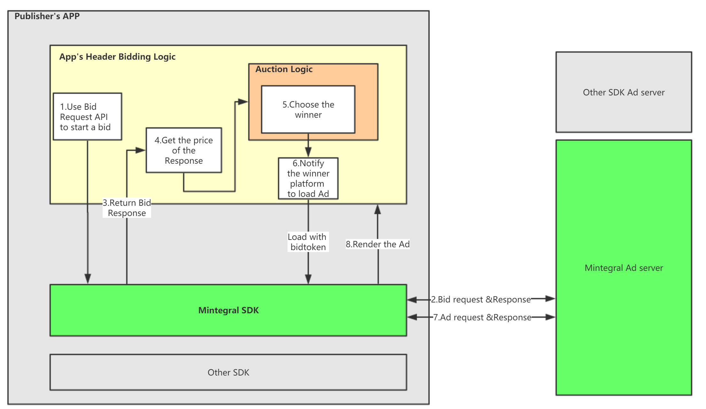
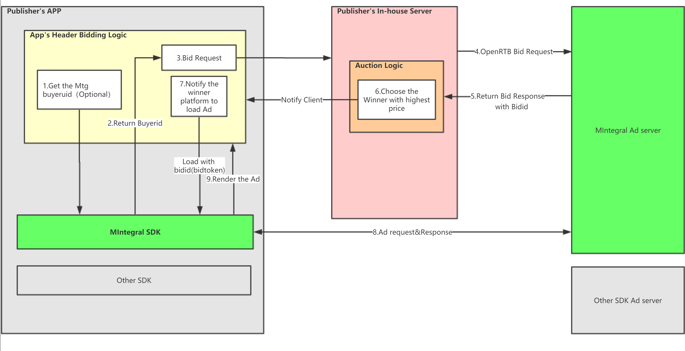

# Mintegral In-app Header Bidding Integration Guide


Mintegral SDK  supports bidding in mobile apps . Mobile app bidding integrations can be from the mobile client to our server . This overview will cover the general concepts of app bidding and  provides instructions on how to integrate the App Head-Bidding in mobile with Mintegral SDK.<br/>
Mintegral SDK provides 6 different Ads formats which are Banner, Native, Native Video, Rewarded Video, Interstitial Video and Splash and which can be supported for App Head-Bidding.

## 1. Introduction

### 1.1 What Is App Head-Bidding
App Head-Bidding is a way for publishers to establish an impartial and open auction over their ad inventory by offering every ad opportunity to multiple demand sources in real time. Every demand source has the opportunity to compete and win every impression, when the value is the highest.

### 1.2 Why App Bidding

- A real-time auction is an opportunity to optimize for every ad request.
- Provides visibility into the true value of your ad inventory.
- Easy to maintain and requires less ad operations resources.      

## 2. Integration Summary

Mintegral provides two types of header bidding, including client-side bidding and server-side bidding.

### 2.1 Client-Side Header Bidding
In this process, developers can request to start bidding through the Mintegral SDK and select the highest bid as the winner, all taking place within the app.
 

  **Key Steps:**

- Before the ad impression is available, the app calls for Mintegral SDK's bid request API, and Mintegral SDK will communicate with the server to retrieve bid responses.
- The app will receive the prices and bidtokens(the token to load the ad) through the returned responses.
- The app will select a winner through the auction price logic.
- .If Mintegral wins the bid, the developer can call for the SDK's loadfrombid API to load the ad.


### 2.2 Server-Side Header Bidding 
In this process, developers can request for bidding within its own server (or through a 3rd party mediation platform’s server) and can select a winner within the server.
  

**Key Steps:**

- Before the ad impression is available, the app calls for Mintegral SDK's BidManager.getBuyerUid API to get the buyer ID.(must)
- Publisher's app can report the buyeruid to its own server so that it can be used when making a request to Mintegral's server.(optional)
- The developer's server needs to send bidding requests that abide to the OpenRTB protocol (Reference) to Mintegral's server.
- After Mintegral ad platform's server responds to the bidding request and begins bidding, the developer can order the bids and select a winner within its own server. Simultaneously, they will send out respective parameters including Bidid.
- The developer's server notifies the app that Mintegral has won the bid, then the app calls for Mintegral SDK's loadfrombid API.         


## 3.SDK Integration Details

The ad formats supported by Mintegral  SDK's header bidding includes native video, rewarded video and interstitial video ads.

Before integrating the In-app Header Bidding logic, make sure you have read the MTGSDK's [Android integration documentation](http://cdn-adn.rayjump.com/cdn-adn/v2/markdown_v2/index.html?file=sdk-m_sdk-android&lang=en) (or [iOS integration documentation](http://cdn-adn.rayjump.com/cdn-adn/v2/markdown_v2/index.html?file=sdk-m_sdk-ios&lang=en)) or have integrated MTGSDK into your project.

## 3.1 Android

#### 3.1.1 Getting the bidding SDK module

By obtaining in the [MTG technical documentation](https://dev.mintegral.com/doc/index.html?file=sdk-m_sdk-android&lang=en)


####  3.1.2 Initialization 

1.Put the initiating codes into Application through the respective App ID and App Key. See below example code for reference. **It is recommended to use the API in the main thread, And Initialize The SDK as soon as your app starts.Ensure that the SDK is initialized each time the application is restarted.Note that the AppId, AppKey, and the unitId of the load ad must be filled,cannot be set null.**

```java
public void init(Map<String,String> ids,Application application);
```

Sample code:

```java
MBridgeSDK sdk = MBridgeSDKFactory.getMBridgeSDK();
Map<String, String> map = sdk.getMBConfigurationMap("your AppId", "your AppKey");
sdk.init(map, this);
```

#### 3.1.3 Sending the bid request

_Note：If you are using server to server bidding method, you can ignore this step._

In your Activity or Fragment, create BidManager object  like this:

```java
BidManager manager = new BidManager("your placementId", "your unitID"); 

//if it is Banner adtype,You need to creat BannerBidRequestParams
manager = new BidManager(new BannerBidRequestParams(String placementId, String mUnitId, int weigh, int height));  

//if it is Splash adtype,You need to creat SplashBidRequestParams

manager = new BidManager(new SplashBidRequestParams(String placementId, String mUnitId, boolean ispreload, int orientation, int logoSizeW, int logoSizeH));

```

After the BidManager object is created, we can send the request by calling the bid method, which takes a BidListenner object to handle the bid response.**Note that before calling the bid method, be sure to the SDK initialization success.**

Sample code:

```java
BidManager manager = new BidManager("your placementId", "your unitID"); 
//if it is Banner adtype,you need to create BannerBidRequestParams
manager = new BidManager(new BannerBidRequestParams(UNIT_ID,bannerW,bannerH));
 
manager.setBidListener(new BidListennning() {
    @Override
    public void onFailed(String msg) {
        // bid failed
    }

    @Override
    public void onSuccessed(BidResponsed bidResponsed) {
        // bid successeful
    }
});
manager.bid();
```

#### 3.1.4 Running the auction

_Note：This section pertains to processing bid response from client-side bidding, if you are using server to server bidding, you must process the bid response within the server._

In this part, we take the bid response from MintegralSDK and compare it with CPM prices from other buyers, and decide whether the MintegralSDK wins and loads the ad, or it loses. When you determine with the result of the auction, call the methods sendWinNotice(Context context) or sendLossNotice(Context context,BidLossCode bidLossCode) to notify MTG about the result.

Note that the auction logic is implemented by the app itself. It should be simply comparing bid prices and choosing the highest bidder as the auction winner.
Here is an example of how to use the returned bidResponse and run an auction in an Android app.

```java
...
@Override
public void onSuccessed(BidResponsed bidResponsed) {

    token = bidResponsed.getBidToken();
    final double otherPrice = ...;
    final double price = bidResponsed.getPrice();
    if (price >= otherPrice) {
        // Load the ad from the bid response

        // Notify the bid won
        bidResponsed.sendWinNotice(getApplicationContext());
    } else {
        // Notify the bid lose
        bidResponsed.sendLossNotice(getApplicationContext(),bidLossCode);
        //bidLossCode is divided into three types, choose according to the actual situation
        //BidLossCode.bidPriceNotHighest()  bid price is not the highest
        //BidLossCode.bidTimeOut()  bid time out
        //BidLossCode.bidWinButNotShow()  The bid is successful but not displayed

    }

}
...
```

#### 3.1.5 Loading the ad with bid response payload

- Banner

When the Mintegral SDK bid wins an auction, the next step is to use the MBBannerView with loadFromBid(String bidToken) method to retrieve an ad and then show it.<br>
Similar to normal ad loading, app side bidding integration you will need to create the ad object  The difference is that instead of calling load() method, you call the loadFromBid(String bidToken) with the bidToken from the BidResponsed, which you can get from bidResponsed.getBidToken().<br>
The callback methods of the listener work the same as normal ad object listeners.

Sample Code:

```java

mbBannerView.init(new BannerSize(BannerSize.DEV_SET_TYPE,bannerW,bannerH),UNIT_ID);
//mbBannerView.setAllowShowCloseBtn(false);
mbBannerView.setRefreshTime(10);
mbBannerView.setBannerAdListener(new BannerAdListener() {


    @Override
    public void onLoadSuccessed() {

        showToast("on load successd");
        Log.e(TAG, "on load successed");
    }
    ...
    ...

});

mbBannerView.loadFromBid(token);
```

- Native(NativeVideo)

When the Mintegral SDK bid wins an auction, the next step is to use the MBBidNativeHandler with bidLoad(String bidToken) method to retrieve an ad and then show it.<br>
Similar to normal ad loading, app side bidding integration you will need to create the ad object  The difference is that instead of calling load() method, you call the bidLoad(String bidToken) with the bidToken from the BidResponsed, which you can get from bidResponsed.getBidToken().<br>
The callback methods of the listener work the same as normal ad object listeners.

Sample Code:

```java
Map<String, Object> properties = MBNativeHandler.getNativeProperties("your placementId", "your unitId");
properties.put(MBridgeConstans.PROPERTIES_AD_NUM, AD_NUM);
mNativeHandle = new MBBidNativeHandler(properties, this);
mNativeHandle.setAdListener(new NativeAdListener() {

@Override
public void onAdLoaded(List<Campaign> campaigns, int template) {
   
   ...
   ...

});
mNativeHandle.bidLoad("the bidToken");
...
...
```

- RewardVideo


When the Mintegral SDK bid wins an auction, the next step is to use the MBRewardVideoHandler with load(String bidToken) method to retrieve an ad and then show it.<br>
Similar to normal ad loading, app side bidding integration you will need to create the ad object  The difference is that instead of calling load() method, you call the loadFromBid(String bidToken) with the bidToken from the BidResponsed, which you can get from bidResponsed.getBidToken().<br>
The callback methods of the listener work the same as normal ad object listeners.

Sample code:

```java
public class TestActivity extends Activity  implements View.OnClickListener{
    @Override
    protected void onCreate(@Nullable Bundle savedInstanceState) {
        super.onCreate(savedInstanceState);
        ...
        ...
        ...
        
            MBBidRewardVideoHandler mMbRewardVideoHandler = new MBBidRewardVideoHandler(this,"your unitId");
			mMbRewardVideoHandler.setRewardVideoListener(new RewardVideoListener() {

				@Override
				public void onLoadSuccess(String placementId, String unitId)  {


				}

				@Override
				public void onVideoLoadSuccess(String placementId, String unitId)  {


				}

				@Override
				public void onVideoLoadFail(String errorMsg) {

				}

				@Override
				public void onShowFail(String errorMsg) {
				
				}

				@Override
				public void onAdShow() {
				
				}

				@Override
				public void onAdClose(boolean isCompleteView, String RewardName, float RewardAmout) {
                
				}

				@Override
				public void onVideoAdClicked(String placementId, String unitId) {

				}
				@Override
				public void onVideoComplete(String placementId, String unitId) {
		
				}

				@Override
				public void onEndcardShow(String placementId, String unitId){

				}

			});
			
		    //If you need to use RewarPlus, you need to add the following code
		    mMbRewardVideoHandler.setRewardPlus(true);
    }

    ...
    ...
    ...
    @Override
    public void onClick(View v) {
        switch (v.getId()) {
            case R.id.bt_load:
                mMbRewardVideoHandler.loadFromBid("the bidToken");
                break;
            case R.id.bt_show:
                if (mMbRewardVideoHandler.iisBidReady()) {
                    mMbRewardVideoHandler.showFromBid("your rewardId");
                }
                break;
        }
    }
}
```

- New IntestitialVideo 


When the Mintegral SDK bid wins an auction, the next step is to use the MBBidInterstitialVideoHandler<font color=red>(The old interstitial ad code corresponds to the ad object with the path com.mbridge.msdk.interstitialvideo.out, and the new interstitial ad code corresponds to the ad object with the path com.mbridge.msdk.newinterstitial.out. It is recommended to use new interstitial)</font> with load(String bidToken) method to retrieve an ad and then show it.
Similar to normal ad loading, app side bidding integration you will need to create the ad object  The difference is that instead of calling load() method, you call the loadFromBid(String bidToken) with the bidToken from the BidResponsed, which you can get from bidResponsed.getBidToken().<br>
The callback methods of the listener work the same as normal ad object listeners.

Sample code：

```java
public class TestActivity extends Activity  implements View.OnClickListener{
    @Override
    protected void onCreate(@Nullable Bundle savedInstanceState) {
        super.onCreate(savedInstanceState);
        ...
        ...
        ...
        
            MBBidNewInterstitialHandler mMbInterstitalVideoHandler = new MBBidNewInterstitialHandler(this, "your placementId", "your unitId");
			mMbInterstitalVideoHandler.setInterstitialVideoListener(new NewInterstitialListener() {

				@Override
				public void onLoadCampaignSuccess(MBridgeIds ids) {


				}

				@Override
				public void onResourceLoadSuccess(MBridgeIds ids) {


				}

				@Override
				public void onResourceLoadFail(MBridgeIds ids, String errorMsg) {

				}

				@Override
				public void onShowFail(MBridgeIds ids, String errorMsg) {
				
				}

				@Override
				public void onAdShow(MBridgeIds ids) {
				
				}

				@Override
				public void onAdCloseWithNIReward(MBridgeIds ids, RewardInfo info) {
                
				}

				@Override
				public void onAdClicked(MBridgeIds ids){

				}
				@Override
				public void onVideoComplete(MBridgeIds ids){
		
				}

				@Override
				public void onEndcardShow(MBridgeIds ids) {

				}

			});
    }

    ...
    ...
    ...
    @Override
    public void onClick(View v) {
        switch (v.getId()) {
            case R.id.bt_load:
                mMbInterstitalVideoHandler.loadFromBid("the bidToken");
                break;
            case R.id.bt_show:
                if (mMbInterstitalVideoHandler.isBidReady()) {
                    mMbInterstitalVideoHandler.showFromBid("your rewardId");
                }
                break;
        }
    }
}
```

- Splash


When the Mintegral SDK bid wins an auction, the next step is to use the MBSplashHandler with preLoadByToken(String token) or loadAndShowByToken(String token, ViewGroup container) method to retrieve an ad and then show it.
Similar to normal ad loading, app side bidding integration you will need to create the ad object. The difference is that instead of calling load() method, you call the preLoadByToken(String token) or loadAndShowByToken(String token, ViewGroup container)with the bidToken from the BidResponsed, which you can get from bidResponsed.getBidToken().<br>
The callback methods of the listener work the same as normal ad object listeners.

Sample code：


```java
bidManager = new BidManager(new SplashBidRequestParams("your placementId", unitId, true, 2, 30, 30));
mbSplashHandler = new MBSplashHandler("your placementId", unitId);
mbSplashHandler.setLoadTimeOut(loadTimeOut);
Button textView = new Button(this);
textView.setText("logo");
mbSplashHandler.setLogoView(textView, 100, 100);

mbSplashHandler.setSplashLoadListener(new MBSplashLoadListener() {
    @Override
    public void onLoadSuccessed(int reqType) {

    }
    @Override
    public void onLoadFailed(String msg, int reqType) {

    }
}

mbSplashHandler.setSplashShowListener(new MBSplashShowListener() {
    @Override
    public void onShowSuccessed() {

    }

    @Override
    public void onShowFailed(String msg) {

    }
    ...
    ...

}

public void onClick(View v) {
    switch (v.getId()) {
        case R.id.mb_demo_splash_ac_bid:
            bidManager.bid();
            break;
        case R.id.mb_demo_splash_ac_load_show:

            if(!TextUtils.isEmpty(token)){
                mbSplashHandler.loadAndShowByToken(token,container);
            }else {
                Toast.makeText(BidSplashActivity.this,"Token is empty",Toast.LENGTH_LONG).show();
            }
            break;
        case R.id.mb_demo_splash_ac_preload:
            if (!TextUtils.isEmpty(token)) {
                mbSplashHandler.preLoadByToken(token);
            }else {
                Toast.makeText(BidSplashActivity.this,"Token is empty",Toast.LENGTH_LONG).show();
            }
            break;
        case R.id.mb_demo_splash_ac_show:
            if (!TextUtils.isEmpty(token)) {
                if (mbSplashHandler.isReady(token)) {
                    mbSplashHandler.show(container,token);
                } else {
                    Log.e(TAG, "isready is false");
                    Toast.makeText(BidSplashActivity.this,"campain is not ready",Toast.LENGTH_LONG).show();
                }
            }else {
                Toast.makeText(BidSplashActivity.this,"Token is empty",Toast.LENGTH_LONG).show();
            }
            break;
    }
}
```

- Automatic Rending Native


When MTGSDK wins the bid, the next step is to use the loadByToken(String token) method of MBNativeAdvancedHandler to request advertisements. This part is very similar to the normal request advertisement, with only one difference, you need to call loadByToken(String token) to request the advertisement instead of calling the load() method. Among them, for bidToken, in the client-to-server integration mode, you can obtain it by: bidResponsed.getBidToken()</br>
If you use the server-to-server integration method, you need to pass in the bidId returned by Mintegral as bidtoken for advertisement loading [Object: BidResponse](#4.2.1).

The callback method of the listener is the same as that of the normal request advertisement object listener.      

Sample code：

```java
public class TestActivity extends Activity  implements View.OnClickListener{
    @Override
    protected void onCreate(@Nullable Bundle savedInstanceState) {
        super.onCreate(savedInstanceState);
        mbNativeAdvancedHandler = new MBNativeAdvancedHandler(this,PLACEMENT_ID,UNIT_ID);                           mbNativeAdvancedHandler.setNativeViewSize(advancedNativeH,advancedNativeW);
        mbAdView = mbNativeAdvancedHandler.getAdViewGroup();

        ...
        ...

    }

public void onClick(View v) {
    switch (v.getId()) {
        case R.id.mbridge_demo_h5native_ac_bid:
            if(mbNativeAdvancedHandler != null){
			     mbNativeAdvancedHandler.loadByToken(token);
		       }
            break;
        }
        case R.id.mbridge_demo_h5native_isReady:
           if(mbNativeAdvancedHandler != null){
              mbNativeAdvancedHandler.isReady(token);
            }
            break;    
        }        
}
```


#### 3.2.6 Obtain buyerUID

_Note: This step is only required for developers using the server to server bidding architecture. If you are using the client to server bidding architecture, you do not need to obtain the buyerUID. By obtaining and using the buyerUID, Mintegral’s algorithms will be able to further optimize your ads’ performances._

Call for static method BidManager.getBuyerUid(Context context) to obtain the unique buyerUID and transfer the buyerUID to your own server. This parameter will be used in the server-side bid requests[Object：User](#4.1.5) and it is recommended that you obtain the buyerUID each time you initialize your app or each time before you request for bids.


## 3.2 iOS
####  3.2.1 Getting the bidding SDK module
Unzip the Mintegral SDK. Drag and drop both MTGSDK.framework and MTGBidding.framework into your project in XCode.


#### 3.2.2 Initialization

Initialize The SDK as soon as your app starts.Call for the MTGSDK initialization method in AppDelegate through the API below and import it to the App ID and App Key from Mintegral dashboard. When initializing, MTGSDK will retrieve configuration information from the server. **It is recommended to use the API in the main thread.Note that the AppId, AppKey, and the unitId of the load ad must be filled,cannot be set null.** 

```objectivec
//tips:ApiKey and AppKey are the same.
- (void)setAppID:(nonnull NSString *)appID ApiKey:(nonnull NSString *)appKey;
```

Sample Code：

```objectivec
- (BOOL)application:(UIApplication *)application didFinishLaunchingWithOptions:(NSDictionary *)launchOptions{
	[[MTGSDK sharedInstance] setAppID:@"your appID" ApiKey:@"your appKey"];
}    
```

#### 3.2.3 Sending the bid request 
_Note: If you are using server to server bidding method, you can ignore this step._

In your iOS code, create a bid request like this:**(Note that before calling the method, be sure to the SDK initialization success.)**


```objectivec

/**
  Get Mintegral Bid for current ad unit
  @param requestParameter
 
  NOTE:requestParameter --You need to construct an MTGBiddingRequestParameter object or his subclass object.
       If it is banner ad, you need to construct an MTGBiddingBannerRequestParameter object.
  */
  
    [MTGBiddingRequest getBidWithRequestParameter:param completionHandler:^(MTGBiddingResponse * _Nonnull bidResponse) {
        if (bidResponse.success) {
         //bid successeful
           
        }else{
            //bid failed 
            
        }

    }];
```

#### 3.2.4 Running the auction

_Note ：This section pertains to processing bid response from client-side bidding, if you are using server to server bidding, you must process the bid response within the server._

In this part, we take the bid response from Mintegral SDK and compare it with CPM prices from other buyers, and decide whether the Mintegral SDK wins and load the ad, or it loses. When you are determined with the result of the auction, call the methods notifyWin or notifyLoss to notify Facebook about the result.<br>
Here is an example of how to use the returned bidResponse and run an auction in an ios app.

```objectivec

// If it is banner ad, you need to construct an MTGBiddingBannerRequestParameter object.
MTGBiddingBannerRequestParameter *bannerParam = [[MTGBiddingBannerRequestParameter alloc]initWithPlacementId:kBannerPlacementId unitId:kBannerUnitID basePrice:@0.1 unitSize:CGSizeMake(320, 50)];

//If it is splash ad, you need to construct an MTGBiddingSplashRequestParameter object.
MTGBiddingSplashRequestParameter *param = [[MTGBiddingSplashRequestParameter alloc] initWithPlacementId:kSplashPlacementId unitId:kSplashUnitID basePrice:@(0) preload:YES customViewSize:CGSizeMake(100, 100) preferredOrientation:0];

//If use Reward Plus     
//This method is used to open RewardPlus for RewardVideo,if you need,defalue NO.
MTGBiddingRequestParameter *requestParameter = [[MTGBiddingRequestParameter alloc]initWithPlacementId:kRewardPlacementId unitId:KRewardUnitID basePrice:@(0.1) openRewardPlus:YES];

//Other ad format,You need to construct an MTGBiddingRequestParameter object or his subclass object.
MTGBiddingRequestParameter *param = [[MTGBiddingRequestParameter alloc]initWithPlacementId:KNativePlacementId unitId:KNativeUnitID basePrice:nil];

MTGBiddingRequest getBidWithRequestParameter:param completionHandler:^(MTGBiddingResponse * _Nonnull bidResponse) {
        if (bidResponse.success) {
            self.bidToken = bidResponse.bidToken;
            [self log:@"bid success"];
            [bidResponse notifyWin];
        }else{
            NSString *errorMsg = bidResponse.error.description;
            UIAlertView *alert = [[UIAlertView alloc] initWithTitle:@"Bid Failed" message:errorMsg delegate:nil cancelButtonTitle:@"Got" otherButtonTitles:nil];
            [alert show];
            [self log:@"bid failed"];
        }

    }];

```

#### 3.2.5 Loading the ad with bid response payload

- Banner

When the Mintegral SDK bid wins an auction, the next step is to use the bid response with loadBannerAdWithBidToken method to retrieve an ad and then show it. Similar to normal ad loading, in client side bidding integration you will need to create the ad object and specify the corresponding ad listener object to handle the callback methods. The difference is that instead of calling loadAd method, you call the loadBannerAdWithBidToken with the payload from the bid response, which you can get from bidResponse.bidToken.<br>
The callback methods of the listener works the same as normal ad object listeners.

Sample Code:

```objectivec
#import "TestViewController.h"
#import <MTGSDKBanner/MTGBannerAdView.h>
#import <MTGSDKBanner/MTGBannerAdViewDelegate.h>
#import <MTGSDKBidding/MTGBiddingRequest.h>
#import <MTGSDKBidding/MTGBiddingBannerRequestParameter.h>
@interface TestViewController ()<MTGBannerAdViewDelegate>

@property(nonatomic,strong) MTGBannerAdView *bidBannerView;


@end

@implementation TestViewController

- (void)viewDidLoad {
    [super viewDidLoad];

    if (_bidBannerView == nil) {

        _bannerAdView = [[MTGBannerAdView alloc]initBannerAdViewWithAdSize:size placementId:kBannerPlacementId unitId:kBannerUnitID rootViewController:self];
        _bidBannerView.delegate = self;
        _bidBannerView.autoRefreshTime = 0;
        _bidBannerView.hidden = YES;

        [self.view addSubview:_bidBannerView];
        [_bidBannerView loadBannerAdWithBidToken:self.bidToken];
    }
    
}

#pragma mark -- MTGBannerAdViewDelegate
- (void)adViewLoadSuccess:(MTGBannerAdView *)adView {
    
    _bidBannerView.hidden = NO;
    [self log:[NSString stringWithFormat:@"%@",NSStringFromSelector(_cmd)]];
}

- (void)adViewLoadFailedWithError:(NSError *)error adView:(MTGBannerAdView *)adView {
    [self log:[NSString stringWithFormat:@"Load Error:%@",error.debugDescription]];
}

- (void)adViewWillLogImpression:(MTGBannerAdView *)adView {
    [self log:[NSString stringWithFormat:@"%@",NSStringFromSelector(_cmd)]];
}

- (void)adViewDidClicked:(MTGBannerAdView *)adView {
    [self log:[NSString stringWithFormat:@"%@",NSStringFromSelector(_cmd)]];

}

...
...


@end
```

- Native(NativeVideo)


When the Mintegral SDK bid wins an auction, the next step is to use the bid response with loadWithBidToken method to retrieve an ad and then show it. Similar to normal ad loading, in client side bidding integration you will need to create the ad object and specify the corresponding ad listener object to handle the callback methods. The difference is that instead of calling loadAd method, you call the loadWithBidToken with the payload from the bid response, which you can get from bidResponse.bidToken.<br>
The callback methods of the listener works the same as normal ad object listeners.


Sample Code:

```objectivec
#import "TestViewController.h"
#import <MTGSDK/MTGSDK.h>
#import <MTGSDK/MTGNativeAdManager.h>
#import <MTGSDKBidding/MTGBiddingRequest.h>
@interface TestViewController ()<MTGMediaViewDelegate,MTGBidNativeAdManagerDelegate>

@property (nonatomic, strong) MTGBidNativeAdManager *bidAdManager;
@property (weak, nonatomic) IBOutlet MTGMediaView *mMediaView;
@property (weak, nonatomic) IBOutlet UIImageView *iconImageView;
@property (weak, nonatomic) IBOutlet UILabel *appNameLabel;
@property (weak, nonatomic) IBOutlet UILabel *appDescLabel;
@property (weak, nonatomic) IBOutlet UIButton *adCallButton;


@end

@implementation TestViewController

- (void)viewDidLoad {
    [super viewDidLoad];
    if (_bidAdManager == nil) {
        _bidAdManager = [[MTGBidNativeAdManager alloc] initWithPlacementId:KNativePlacementId unitID:KNativeUnitID  presentingViewController:nil];
        _bidAdManager.delegate = self;
        [self.bidAdManager loadWithBidToken:self.bidToken];
    }
    
}


#pragma mark AdManger delegate
- (void)nativeAdsLoaded:(NSArray *)nativeAds nativeManager:(nonnull MTGNativeAdManager *)nativeManager
{
    
    if (nativeAds.count > 0) {
        MTGCampaign *campaign=nativeAds[0];
        //Set the camgaign fot the MTGmediaview
        [self.mMediaView setMediaSourceWithCampaign:campaign unitId:@"your unitid"];
        self.appNameLabel.text = campaign.appName;
        self.appDescLabel.text = campaign.appDesc;
        [self.adCallButton setTitle:campaign.adCall forState:UIControlStateNormal];
        [campaign loadIconUrlAsyncWithBlock:^(UIImage *image) {
        if (image) {
                [self.iconImageView setImage:image];
            }
        }];
        
        [ self.nativeVideoAdManager registerViewForInteraction:self.appDescLabel.text withCampaign:campaign];
        
    }
  
}

- (void)nativeAdsFailedToLoadWithError:(NSError *)error nativeManager:(nonnull MTGNativeAdManager *)nativeManager
{
    [self log:[NSString stringWithFormat:@"Failed to load ads, error:%@", error.localizedDescription]];
}

- (void)nativeAdImpressionWithType:(MTGAdSourceType)type nativeManager:(MTGNativeAdManager *)nativeManager
{
    
}


#pragma mark MediaView delegate
- (void)MTGMediaViewWillEnterFullscreen:(MTGMediaView *)mediaView{
    [self log:@"MTGMedia View Will Enter Full Screen"];
}


- (void)MTGMediaViewDidExitFullscreen:(MTGMediaView *)mediaView{
    [self log:@"MTGMedia View Did Exit Full Screen"];
}


#pragma mark MediaView and AdManger Click delegate
- (void)nativeAdDidClick:(MTGCampaign *)nativeAd
{
    [self log:@"Registerview or mediaVie Ad is clicked"];
}

- (void)nativeAdDidClick:(MTGCampaign *)nativeAd nativeManager:(nonnull MTGNativeAdManager *)nativeManager
{
    [self log:@"Registerview Ad is clicked"];
}
- (void)nativeAdDidClick:(MTGCampaign *)nativeAd mediaView:(nonnull MTGMediaView *)mediaView
{
    [self log:@"MTGMediaView Ad is clicked"];
}

@end
```


- RewardVideo


When the Mintegral SDK bid wins an auction, the next step is to use the bid response with loadAdWithBidPayload method to retrieve an ad and then show it. Similar to normal ad loading, in client side bidding integration you will need to create the ad object and specify the corresponding ad listener object to handle the callback methods. The difference is that instead of calling loadVideo method, you call the loadVideoWithBidToken with the payload from the bid response, which you can get from bidResponse.bidToken. The callback methods of the listener works the same as normal ad object listeners.

Sample code:

```objectivec
#import <MTGSDKReward/MTGBidRewardAdManager.h>
#import <MTGSDK/MTGSDK.h>
#import <MTGSDKBidding/MTGBiddingRequest.h>

@interface MTGRewardVideoViewController ()
<MTGRewardAdLoadDelegate,MTGRewardAdShowDelegate>


- (void)viewDidLoad {
    [[MTGBidRewardAdManager sharedInstance] loadVideoWithBidToken:self.bidToken placementId:kRewardPlacementId unitId:KRewardUnitID delegate:self];
}

- (void)loadVideo{
   //This method is used to open RewardPlus for RewardVideo,if you need,please set this before loadVideo,defalue NO.
   //[MTGBidRewardAdManager sharedInstance].openRewardPlus = YES;
   [[MTGBidRewardAdManager sharedInstance] loadVideoWithBidToken:self.bidToken placementId:kRewardPlacementId unitId:KRewardUnitID delegate:self];
- }


- (IBAction)showVideoButtonAction:(id)sender
{
   //Check whether video has been downloaded successfully before displaying ad
    if ([[MTGBidRewardAdManager sharedInstance] isVideoReadyToPlayWithPlacementId:kRewardPlacementId unitId:KRewardUnitID]) {

        [[MTGBidRewardAdManager sharedInstance] showVideoWithPlacementId:kRewardPlacementId unitId:KRewardUnitID withRewardId:KRewardID userId:@"" delegate:self viewController:self];    
    } 
}


#pragma mark - MTGRewardAdShowDelegate Delegate

//Show Reward Video Ad Success Delegate
- (void)onVideoAdShowSuccess:(nullable NSString *)placementId unitId:(NSString *)unitId {
    [self log:[NSString stringWithFormat:@"unitId = %@, show success", unitId]];
}


//Show Reward Video Ad Failed Delegate
- (void)onVideoAdShowSuccess:(nullable NSString *)placementId unitId:(NSString *)unitId {
    [self log:[NSString stringWithFormat:@"unitId = %@, show failed, error: %@", unitId, error]];
}


//About RewardInfo Delegate
- (void)onVideoAdDismissed:(NSString *)unitId withConverted:(BOOL)converted withRewardInfo:(MTGRewardAdInfo *)rewardInfo
{
    if (rewardInfo) {
        [self log:[NSString stringWithFormat:@"unitId = %@, reward : name = %@, amount = %ld", unitId, rewardInfo.rewardName, (long)rewardInfo.rewardAmount]];
    }
    else {
        [self log:[NSString stringWithFormat:@"unitId = %@, there is no reward to you", unitId]];
    }
}

- (void)onVideoAdDidClosed:(nullable NSString *)unitId{
    
    [self log:[NSString stringWithFormat:@"unitId = %@, the ad did closed", unitId]];
}

- (void)onVideoAdClicked:(nullable NSString *)unitId{
    [self log:[NSString stringWithFormat:@"unitId = %@, video ad clicked.", unitId]];
}

- (void) onVideoPlayCompleted:(nullable NSString *)unitId {
    [self log:[NSString stringWithFormat:@"unitId = %@, video play completed.", unitId]];
}

- (void) onVideoEndCardShowSuccess:(nullable NSString *)unitId {
    [self log:[NSString stringWithFormat:@"unitId = %@, endcard show success.", unitId]];
}

...
...
...


@end
```

- New IntestitialVideo 


When the Mintegral SDK bid wins an auction, the next step is to use the bid response with loadAdWithBidPayload method to retrieve an ad and then show it. Similar to normal ad loading, in client side bidding integration you will need to create the ad object and specify the corresponding ad listener object to handle the callback methods. The difference is that instead of calling loadAd method, you call the loadAdWithBidToken with the payload from the bid response, which you can get from bidResponse.bidToken.<br> The callback methods of the listener works the same as normal ad object listeners.


Sample code：

```objectivec
#import "MTGNewInsterstialViewController.h"
#import <MTGSDKNewInterstitial/MTGNewInterstitialBidAdManager.h>
#import <MTGSDKBidding/MTGBiddingRequest.h>
#import <MTGSDK/MTGSDK.h>

@interface MTGNewInsterstialViewController ()<MTGNewInterstitialBidAdDelegate>

@property (nonatomic, strong) MTGNewInterstitialBidAdManager *ivBidAdManager;

@end

@implementation MTGNewInsterstialViewController.h

- (void)viewDidLoad {
    [super viewDidLoad];
    ...
    ...
  
}


- (void)loadVideo{
    if (!_ivBidAdManager ) {
    _ivBidAdManager = [[MTGNewInterstitialBidAdManager alloc]initWithPlacementId:KInterstitialVideoPlacementId2 unitId:KInterstitialVideoUnitID2 delegate:self];
        _ivBidAdManager.delegate = self;
    }
    [_ivBidAdManager loadAdWithBidToken:@"your bidToken"];

}


- (void)showVideo{
    if ([_ivBidAdManager isAdReady]) {
        [_ivBidAdManager showFromViewController:self];
    }
}


#pragma mark - Interstitial Delegate Methods

- (void)newInterstitialAdLoadSuccess:(MTGNewInterstitialAdManager *_Nonnull)adManager {
    [self log:NSStringFromSelector(_cmd)];

}

- (void)newInterstitialAdResourceLoadSuccess:(MTGNewInterstitialAdManager *_Nonnull)adManager {
    [self log:NSStringFromSelector(_cmd)];

}
...
...


@end

```
- Splash


When the Mintegral SDK bid wins an auction, the next step is to use the bid response to retrieve an ad and then show it. Similar to normal ad loading, in client side bidding integration you will need to create the ad object and specify the corresponding ad listener object to handle the callback methods. The difference is that instead of calling preload or loadAndShowXXX method, you call the preloadWithBidToken or loadAndShowXXXbidToken with the payload from the bid response, which you can get from bidResponse.bidToken. The callback methods of the listener works the same as normal ad object listeners.

Sample code:

```objectivec

#import "MTGSplashAdViewController.h"
#import <MTGSDKSplash/MTGSplashAD.h>
#import <MTGSDK/MTGSDK.h>
#import <MTGSDKBidding/MTGBiddingSplashRequestParameter.h>
#import <MTGSDKBidding/MTGBiddingRequest.h>

@interface MTGSplashAdViewController () <MTGSplashADDelegate>

@property (nonatomic, strong) MTGSplashAD *splashAD;
@property (nonatomic, strong) UISwitch *useCache;
@property (nonatomic, strong) UISwitch *useLogo;
@property (nonatomic, strong) UISwitch *skip;

@end

@implementation MTGSplashAdViewController 

- (void)createSplashAD {

    if (self.useLogo.on) {
        self.splashAD = [[MTGSplashAD alloc]initWithPlacementID:kSplashPlacementId unitID:kSplashUnitID countdown:10 allowSkip:self.skip.on customViewSize:CGSizeMake(200, 95) preferredOrientation:0];
    } else {
        self.splashAD = [[MTGSplashAD alloc]initWithPlacementID:kSplashPlacementId unitID:kSplashUnitID countdown:10 allowSkip:self.skip.on customViewSize:CGSizeZero preferredOrientation:0];
    }
    self.splashAD.delegate = self;
    if (self.useCache.on) {
        self.splashAD.useCache = MTGBoolYes;
    }
    
    UIImage *splashImage = [UIImage imageNamed:@"bgx"];
    self.splashAD.backgroundImage = splashImage;
    
}

//Load Video
- (IBAction)preloadButtonAction:(id)sender
{
    [self createSplashAD];

    [self log:@"bid splash ad is loading"];
    [self.splashAD preloadWithBidToken:self.bidToken];

}
//isReady
- (void)isReadyButtonAction:(UIButton *)button {
    [self createSplashAD];

    BOOL ready = [self.splashAD isBiddingADReadyToShow];
    [self log:[NSString stringWithFormat:@"isReady : %@", ready ? @"true" : @"false"]];

}

//Show Video
- (IBAction)showButtonAction:(id)sender
{
    [self createSplashAD];
    UIWindow *keyWindow = [UIApplication sharedApplication].keyWindow;
    UIView *logoView = nil;
    if (self.useLogo.on) {
        logoView = [self logoView];
    }
    
    [self.splashAD showBiddingADInKeyWindow:keyWindow customView:logoView];
    
}
//LoadNShow
- (void)LoadNShowButtonAction:(UIButton *)btn {
    
    [self createSplashAD];
    
    UIView *logoView = nil;
    if (self.useLogo.on) {
        logoView = [self logoView];
    }
        
    [self log:@"bid splash ad is loading"];
    UIWindow *keyWindow = [UIApplication sharedApplication].keyWindow;
    [self.splashAD loadAndShowInKeyWindow:keyWindow customView:logoView bidToken:self.bidToken timeout:5000];

}
//logoView
- (UIView *)logoView {
    UIImageView *logo = [[UIImageView alloc] initWithImage:[UIImage imageNamed:@"logo"]];
    logo.frame = CGRectMake(0, 0, 100, 100);
    return logo;
}

#pragma mark - MTGSplashADDelegate

- (void)splashADPreloadSuccess:(MTGSplashAD *)splashAD {
    [self log:[NSString stringWithFormat:@"unitId = %@, preload success", splashAD.unitID]];
}
- (void)splashADPreloadFail:(MTGSplashAD *)splashAD error:(NSError *)error {
    [self log:[NSString stringWithFormat:@"unitId = %@, preload error : %@", splashAD.unitID, error]];
}

// splashAD assets load success
- (void)splashADLoadSuccess:(MTGSplashAD *)splashAD {
    [self log:[NSString stringWithFormat:@"unitId = %@, load success", splashAD.unitID]];
  }
// splashAD assets load fail  
- (void)splashADLoadFail:(MTGSplashAD *)splashAD error:(NSError *)error {
    [self log:[NSString stringWithFormat:@"unitId = %@, load error : %@", splashAD.unitID, error]];
}
// splashAD show success 
- (void)splashADShowSuccess:(MTGSplashAD *)splashAD {
    [self log:[NSString stringWithFormat:@"unitId = %@, show success", splashAD.unitID]];
}
// splashAD show fail
- (void)splashADShowFail:(MTGSplashAD *)splashAD error:(NSError *)error {
    [self log:[NSString stringWithFormat:@"unitId = %@, show error : %@", splashAD.unitID, error]];

}
// enter background
- (void)splashADDidLeaveApplication:(MTGSplashAD *)splashAD {
    [self log:[NSString stringWithFormat:@"unitId = %@, leave app", splashAD.unitID]];
}

// click splashAD
- (void)splashADDidClick:(MTGSplashAD *)splashAD {
    [self log:[NSString stringWithFormat:@"unitId = %@, did click", splashAD.unitID]];
}

// splashAD will close
- (void)splashADWillClose:(MTGSplashAD *)splashAD {
    [self log:[NSString stringWithFormat:@"unitId = %@, ad will close", splashAD.unitID]];

}
// splashAD did close
- (void)splashADDidClose:(MTGSplashAD *)splashAD {
    [self log:[NSString stringWithFormat:@"unitId = %@, ad closed", splashAD.unitID]];
}

// countdown
- (void)splashAD:(MTGSplashAD *)splashAD timeLeft:(NSUInteger)time {
    [self log:[NSString stringWithFormat:@"unitId = %@, ad countdown : %@", splashAD.unitID, @(time)]];
}


@end
```


- Automatic Rending Native


When MTGSDK bids and wins the auction, the next step is to use the loadAdWithBidToken method to request ads.

This part is very similar to a normal request ad, except for one difference. You need to call loadAdWithBidToken to request an ad instead of calling the loadAd method. For bidToken, you can obtain bidResponse.bidToken in the client-to-server integration method: bidResponse.bidToken. If you use the server-to-server integration method, you need to pass the bidid returned by Mintegral as bidtoken for advertisement loading [Object: BidResponse ](#4.2.1).
         
The callback method of the listener is the same as that of the normal request advertisement object listener.。      


Sample code:

```objectivec
#import <MTGSDKNativeAdvanced/MTGNativeAdvancedAd.h>
#import <MTGSDK/MTGSDK.h>
#import <MTGSDKBidding/MTGBiddingRequest.h>

@interface MTGNativeAdvanceAdViewController ()<MTGNativeAdvancedAdDelegate>

- (void)viewDidLoad {
 ...
}

- (void)createNewNativeAd:(CGSize)size {
    
    _adManager = [[MTGNativeAdvancedAd alloc] initWithPlacementID:kNewNativePlacementId unitID:kNewNativeUnitID adSize:CGSizeMake(320, 90) rootViewController:self];
    _adManager.delegate = self;
    
    _adManager.showCloseButton = YES;
    _adManager.mute = NO;
    _adManager.autoPlay = YES;
    ...
}   


- (void)loadButtonAction:(UIButton *)sender {
    [self log:@"start loading"];
    if (self.bidSwitch) {
        if (self.bidToken.length > 0) {
            [self log:@"start loadAd bid"];
            [self.adManager loadAdWithBidToken:self.bidToken];
        }else{
            [self log:@"not token"];
        }
    } else {
        [self.adManager loadAd];
    }
}

- (void)showButtonAction:(UIButton *)sender {
    if (self.bidSwitch) {
        if (self.bidToken.length >0) {
            if ([_adManager isBiddingAdReady]){
                [self addAdView];
            }else{
                [self log:@"not ready"];
            }
        }else{
            [self log:[NSString stringWithFormat:@"not token"]];
        }
    }else{
        if ([_adManager isAdReady]) {
            [self addAdView];
        }
    }    
}

...
...

@end
```


#### 3.2.6 Obtain buyerUID（must）

_Note: This step is only required for developers using the server to server bidding architecture. If you are using the client to server bidding architecture, you do not need to obtain the buyerUID. By obtaining and using the buyerUID, Mintegral’s algorithms will be able to further optimize your ads’ performances. However, this step is not mandatory._

Call for static method [MTGBiddingSDK buyerUid] to obtain the unique buyerUID and transfer the buyerUID to your own server. This parameter will be used in the server-side bid requests[Object：User](#4.1.5) and it is recommended that you obtain the buyerUID each time you initialize your app or each time before you request for bids.


## 4.Server-Side OpenRTB Protocol 

The developer needs to send bidding requests that abide to the OpenRTB 2.5 protocol if they want to bid directly with Mintegral’s server.


### 4.1 Request Parameters

Bid requests and bid responses will be custom-adjusted according to the OpenRTB 2.5 protocol. Using json format and need add openrtb:2.5 in Http Header.
You can use -H "openrtb:2.5" if you use Curl test.   


**Http request method:** POST

**Request interface address**：http://hb.rayjump.com/bid

#### 4.1.1 Object：BidRequest

| Attribute | Type | Description |
| --- | --- | --- |
| id | string; required | Unique ID of the bid request, provided by the exchange. |
| imp | object array; required | Imp object, represents one impression, MTG only allows one imp object in each request. |
| app | object; required | Details about the developer's app; refer to APP object. |
| device | object;required | Details about the user's device; refer to device object. |
| user | object;required | Details about the user of the device; refer to user object. |
| at | integer; optional;default 1 | Auction type, where 1 = First Price, 2 = Second Price Plus. |

#### 4.1.2 Object：Imp

| Attribute | Type | Description |
| --- | --- | --- |
| id | string;required | A unique identifier for this impression within the context of the bid request, starts with 1 and increments. |
| displaymanager | string;optional | Name of ad mediation partner. |
| placement_id | string;optional | The ID of your ad placement. You can find 'Placement ID' on your Mintegral account dashboard, under the tab "Placements & Units". |
| displaymanagerver | string;required | Name of integrated MTG-SDK version. |
| tagid | string;required | MTG ad unit ID. |
| bidfloor | float;optional default 0 | Minimum bid for this impression expressed in CPM. |
| bidfloorcur | string;optional;default "USD" | Currency of the bid, default is USD. |

#### 4.1.2.1 Object：Imp.banner

| Attribute | Type | Description |
| --- | --- | --- |
| w | int;required | Request the width of the banner ad|
| h | int;required | Request the height of the banner ad |

#### 4.1.2.1.2 Object：Imp.native.ext

| Attribute | Type | Description |
| --- | --- | --- |
| unit_size_w | int;required | Request the width of the H5 native ad|
| unit_size_h | int;required | Request the height of the H5 native ad |

#### 4.1.2.1.3 Object：Imp.video.ext

| Attribute | Type | Description |
| --- | --- | --- |
| w | int;required | video ad width|
| h | int;required | video ad height|

#### 4.1.2.1.4 Object：Imp.ext

| Attribute | Type | Description |
| --- | --- | --- |
| ext | object;optional | SKAdNetworkIDs|

##### 4.1.2.2 BidRequest.imp.ext.skadn

| Attribute  | Type                  | Description                                                  | Example                                                  |
| ---------- | --------------------- | ------------------------------------------------------------ | -------------------------------------------------------- |
| version    | String;optional       | Version of SKAdNetwork supported. <br />Always "2.0" or higher. <br />Dependent on both the OS version and the SDK version. | "version":"2.0"                                          |
| sourceapp  | String;optional       | ID of publisher app in Apple’s App Store. <br />Should match BidRequest.app.bundle | "sourceapp":"880047117"                                  |
| skadnetids | String Array;optional | A subset of SKAdNetworkIdentifier entries<br /> in the publisher app’s info.plist that are relevant to the DSP. | ["SKAdNetwork1.skadnetwork"," SKAdNetwork2.skadnetwork"] |

#### 4.1.3 Object：App

| Attribute | Type | Description |
| --- | --- | --- |
| id | string;required | MTG app ID. |
| ver | string;optional | Application version. |
| ext | object;optional | Self-defined object, includes orientation field. |

##### 4.1.3.1 Object：Orientation Ext

| Attribute | Type | Description |
| --- | --- | --- |
| orientation | int;required | Application's orientation; where 1= portrait and 2 = landscape and 3 = unknown. |

#### 4.1.4 Object：Device

| Attribute | Type | Description |
| --- | --- | --- |
| ua | string;required | Application user agent string. |
| ip | string;required | IPv4 address.must choose between ip and ipv6 |
| ipv6 | string;required | IPv6 address. must choose between ip and ipv6|
| devicetype | integer;required | Type of device where 1 = phone and 2 = tablet. |
| make | string;required | Device make or brand |
| model | string;required | Device model. |
| os | string;required | Device operating system. |
| osv | string;required | Device operating system version. |
| h | integer;required | Physical height of the screen in pixels. |
| w | integer;required | Physical width of the screen in pixels. |
| language | string;required | Browser language using ISO-639-1-alpha-2. |
| mccmnc | string;optional | Mobile carrier, string formed by combining MCC and MNC. |
| connectiontype | integer;required | Network connection type. NET_TYPE_UNDEFAAULT = 0；NET_TYPE_UNKNOW = 0; NET_TYPE_WIFI = 9;NET_TYPE_5G = 5;NET_TYPE_4G = 4;NET_TYPE_3G = 3;NET_TYPE_2G = 2; |
| ifa | string;required | iOS-idfa, android-gaid |
| didsha1 | string;optional | IMEI sha1 |
| didmd5 | string;optional | IMEI md5 |
| Dpidsha1 | string;optional | android\_id sha1 |
| dpidmd5 | string;optional | android\_id md5 |
| geo.country | string;optional | your country code |

#### 4.1.5 <span id = "4.1.5">Object：User</span>

| Attribute | Type | Description |
| --- | --- | --- |
| buyeruid | string;required | Buyer-specific ID for the user as mapped by MTG. |

### 4.2 Response Data

Below are examples of the various parameters of the returned data's data structure.

#### 4.2.1 Object：BidResponse

| Attribute | Type | Description |
| --- | --- | --- |
| id | string;required | Returned bid request ID. |
| seatid | object array | Refer to seat ID object. |
| bidid | string;optional | MTG generated token ID used to load ad. |
| cur | string;default "USD" | Bid currency, default is USD. |
| nbr | integer;optional | Reason for not bidding. |

##### 4.2.1.1 Object：SeatBid

| Attribute | Type | Description |
| --- | --- | --- |
| bid | object array;required | Refer to bid object. |

#### 4.2.1.1.1 Object：Bid

| Attribute | Type | Description | Description |
| --- | --- | --- | --- |
| id | string;required | bid id | Unique bid ID. |
| impid | string;required | [imp.id](http://imp.id/) | Returned bidrequest.imp.id, ID of the Imp object in the related bid request. |
| price | float;required | bid price | Bid price expressed as CPM |
| nurl | string;required | win notice url | Win notice URL called by MTG if the bid wins. |
| lurl | string;required | loss notice url | Loss notice URL called by MTG if the bid loss. |

#### 4.2.1.1.1.1 Object：BidResponse.seatbid.bid.ext.skadn

| Attribute  | Type            | Description                                                  | Example                           |
| ---------- | --------------- | ------------------------------------------------------------ | --------------------------------- |
| version    | String;optional | Version of SKAdNetwork desired. <br />Must be 2.0 or above.  | "version":"2.0"                   |
| network    | String;optional | Ad network identifier used in signature. Should match one of<br /> the items in the skadnetids array in the request | "network":"dsp1.skadnetwork"      |
| campaign   | String;optional | Campaign ID compatible with Apple’s spec. As of 2.0, <br />should be an integer between 1 and 100, <br />expressed as a string | "campaign":"45"                   |
| itunesitem | String;optional | ID of advertiser’s app in Apple’s app store. <br />Should match BidResponse.bid.bundle | "itunesitem":"880047117           |
| nonce      | String;optional | An id unique to each ad response                             | "nonce": "beeeb65e-b3de-02420004" |
| sourceapp  | String;optional | ID of publisher’s app in Apple’s app store. <br />Should match BidRequest.imp.ext.skad.sourceapp | "sourceapp":"123456789"           |
| timestamp  | String;optional | UNIX time in millis string used at the time of signature     | "timestamp": "1594406341"         |
| signature  | String;optional | SKAdNetwork signature as specified by Apple                  | "signature": "MEQCIEQZRRyMyUXg==" |

### 4.3 Bid Request / Response Samples

#### 4.3.1 Bid request sample

```java
{
"user": {
		"buyeruid": "NnvFiAV2GaNwx3foiZTTinvFWVRPiUNwNnlMNARPinVMxnxj6deIkjx7xTheiUN2HFHA4+f6LkxIkjx7xTheiUN2HFH0Lb5M+FQ367cMh7eQ67QNL7K/HnjMWafIG+ewL5I2WUN/idMBfaiF4ajeiU5InkK1LkesDZI2WUvlp7QNL7K/HnslN2S5R7QNL7K/HZSyVBvei5Ie+ARlY7Q8HZSfDkiln2ilko3lN+SMY75+HkzWL+NXfUvTWUi/fZvEZTtVnVMsR7euLFVlxF5ULFIuRj2XDrQsHZIefVRBiaR="
	},
	"id": "5cebee04c6c1e276cc8b2e8x",
	"imp": [{
		"id": "1",
		"tagid": "21316",
		"bidfloor": 0.1,
		"bidfloorcur": "USD",
		"ext": {
			"skadn": {
				"version": "2.0",
				"sourceapp": "880047117",
				"skadnetids": [
					"cdkw7geqsh.skadnetwork",
					"qyJfv329m4.skadnetwork"
				]
			}
		},
		#banner add
		"banner": {
			"w": bannerWidth,
			"h": bannerHeight
		}
		#H5 Native add
		"native": {
			"ext": {
				"unit_size_w": h5nativeWidth,
				"unit_size_h": h5nativeHeight
			}
		}
        #Video Ad add
        "video": {
            "ext": {
                "w": videoWidth,
                "h": videoHeight
            }
        }
        "ext": {
            "skadn":"..."
        }	
	}],
	"app": {
		"id": "92763",
		"ext": {
			"orientation": 0
		},
		"ver": "5.4.0"
	},
	"device": {
		"ua": "Mozilla/5.0 (iPhone; CPU iPhone OS 11_1_2 like Mac OS X) AppleWebKit/604.3.5 (KHTML, like Gecko) Mobile/15B202",
		"ip": "39.109.124.93",
		"devicetype": 4,
		"make": "apple",
		"model": "iPhone10,3",
		"os": "ios",
		"osv": "11.1.2",
		"language": "zh-Hans-US",
		"carrier": "",
		"connectiontype": 2,
		"w": 2436,
		"h": 1125,
		"mccmnc": "460-02",
		"ifa": "A0635584-FCB1-4106-B924-A80C29150E4D"
        "geo":{
            "country":"your country code"
        }
	},
	"at": 1,
	"tmax": 150
}
```

#### 4.3.2 Bid response sample
```java
{
   "id": "5cebee04c6c1e276cc8b2e8x",
	"seatbid": [{
		"bid": [{
				"id": "89e3a366-5915-4b3c-87cf-afbf34b0857f",
				"impid": "1",
				"price": 107.2339653968811,
				"lurl": "https://test-adnet.rayjump.com/loss?td=inRTfacIGnRbfUfIiAV9iaJIL7zIYbSQYrcML+euYgxQhgfTL+xuDke6JrQ3HkKILkKA672u+AV/fo9M6aV/fo9M6jtW6aiPidMe6aSIfgM9GkVADniFf0T2Gnj2Wnx0iFiwGaJUH02tHrzriAx0ial2fFD=",
				"nurl": "https://test-adnet.rayjump.com/win?td=inRTfacIGnRbfUfIiAV9iaJIL7zIYbSQYrcML+euYgxQhgfTL+xuDke6JrQ3HkKILkKA672u+AV/fo9M6aV/fo9M6jtW6aiPidMe6aSIfgM9GkVADniFf0T2Gnj2Wnx0iFiwGaJUH02tHrzriAx0ial2fFD=",
				"ext": {
					"skadn": {
						"version": "2.0",
						"network": "cdkw7geqsh.skadnetwork",
						"campaign": "45",
						"itunesitem": "123456789",
						"nonce": "473b1a16-b4ef-43ad-9591-fcf3aefa82a7",
						"sourceapp": "880047117",
						"timestamp": "1594406341",
						"signature": "MEQCIEQlmZRNfYzKBSE8QnhLTIHZZZWCFgZpRqRxHss65KoFAiAJgJKjdrWdkLUOCCjuEx2RmFS7daRzSVZRVZ8RyMyUXg=="
					}
				}
			}

		]
	}],
	"bidid": "89e3a366-5915-4b3c-87cf-afbf34b0857f",
	"cur": "USD"
}
```
## 5.Error Codes
| code  | Description                                    |
| ----- | ---------------------------------------------- |
| 200   | bid success                                    |
| 10101 | http extract filter param is not http.Request" |
| 10102 | S2S bid request data empty                     |
| 10103 | Render Common Data error                       |
| 10201 | req_param_filter input error                   |
| 10202 | render bid request data error                  |
| 10203 | Bid Request unit InValidate                    |
| 10204 | Bid Request App InValidate                     |
| 10205 | Bid Request Imp Is Empty                       |
| 10206 | Buyeruid is Empty                              |
| 10207 | Buyeruid data is invalidate                    |
| 10208 | decode bid data error                          |
| 10210 | Bid Request mtg sdk version too low            |
| 10301 | area target filter input is error              |
| 10302 | client_ip is invalidate                        |
| 10303 | query netacuity server error                   |
| 10304 | bid in unit and country code blacklist         |
| 10401 | user agent data filter input error             |
| 10501 | replace brand model filter input error         |
| 10502 | replaceBrand params error                      |
| 10601 | render core data filter input error            |
| 10602 | App not found error                            |
| 10603 | Publisher not found                            |
| 10604 | Unit not found error                           |
| 10605 | Unit ad num set none error                     |
| 10606 | iv orientation invalidate error                |
| 10607 | iv recallnet invalidate error                  |
| 10608 | renderScreenSize input is error                |
| 10609 | unit is not active error                       |
| 10610 | unit not found app                             |
| 10611 | app platform error                             |
| 10612 | ad type not support                            |
| 10613 | current app is disable header bidding          |
| 10614 | illegal sdk version for Google play            |
| 10701 | build as request filter input is invalidate   |
| 10702 | compose ad server request error                |
| 10703 | adserver data json error                       |
| 10801 | traffic sample filter input error              |
| 10901 | bid adx filter input is error                  |
| 10902 | compose adx http request error                 |
| 10903 | afterbid request is not 200                    |
| 10904 | bid response has no ad                         |
| 10905 | bid adx http do error                          |
| 10906 | bid adx read resp error                       |
| 10907 | bid adx decode resp error                      |
| 10908 | decode Dsp ext error                           |
| 10909 | real time bidding price error                  |
| 11001 | bid cache filter input error                   |
| 11002 | bid cache error                                |
| 11003 | bid imp id error                               |
| 11101 | format output filter input error               |

