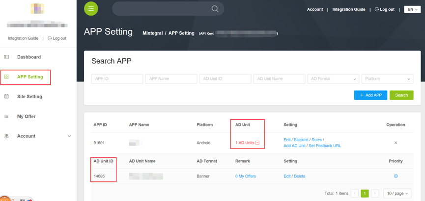

# Admob Cocos2d-x Adapter Development Document
  
##1 Overview
This document describes how Cocos2d-x publishers integrate Mintegral Admob Cocos2d-x Adapter product. Cocos2d-x Adapter will provide a variety of advertising forms: Rewarded Video、Interstitial Video、Interstitial.

###1.1 Documents Provided
**/Adapter/All files/**  
**mintegral_admob.jar**  

###1.2 Integrated Attention

After setting the project of Cocos2d-x, copy the Bridege folder provided above to the specified location in your project, and compile Android and iOS items, then it is done.
  

**/Your projects/proj.ios_mac/frameworks/Adapter/**  
**/Your projects/proj.android-studio/app/src/Mintegral/** 

##2 Integration Prepare
###2.1 Apply an Account
Publishers can acquire the account and password from  [Mintegral OM](http://mmonetization.com/user/login ) to upload to the Mintegral portal.
###2.2 App Key
Every publisher’s accounts will have their relative AppKey. AppKey is needed when request Ads, which can be acquired form Mintegral portal. Log in Mintegral portal, publishers can view the AppKey of this account in AD Unit -> App page. As the picture shows:  
   
###2.3 App Id
The system will automatically create an AppId after publishers creates an App. Publishers can view the created App and its relative AppId in the AD Unit -> App page.  

###2.4 Unit Id
The system will automatically create an UnitId after publishers creates an unit. Publishers can view the created unit and its relative UnitId in the AD Unit -> App Unit page.        
      

## 3 Settings of Cocos2d-x Bridge Developing Surroundings
### 3.1 Development Demands:

cocos2d-x-3.16  
Android Studio  
Xcode 
 
	
### 3.2 Settings:
1、Set up NDK：Android Native SDK  
   Download address：https://developer.android.com/ndk/downloads/index.html    
   Suggested setting address：/Users//your computer/Library/Android/sdk/ndk-bundle/android-ndk-r14b/

2、Set up ANDROIDSDKROOT：Standard Android SDK    
   Download address：N/A， search directly in user’ resource library    
   Address：/Users/your computer/Library/Android/sdk/    

3、Set up ANT_ROOT：package tool for multi-channel publishing     
   Download address：http://ant.apache.org/bindownload.cgi    
   Suggested setting address：  /Users/your computer/Library/Android/sdk/apache-ant-1.10.1/bin/ 
   

## 4 Setting development surroundings

### 4.1 Admob集成
A、Integrate the Adomb environment in the Cocos2dx environment, according to the [Firebase guidance](https://firebase.google.com/docs/admob/cpp/cocos2d-x)  and contain some examples for reference;    

B、Reference documentation: integrating [Firebase into the Android](https://firebase.google.com/docs/android/setup)development environment;  

C、Reference document: [setting up Firebase project](https://console.firebase.google.com/);

### 4.2 iOS
 A、add the framework of MTGSDK to the project Add Files to…, and then add the framework in the system according to [MTGSDK Integration for iOS](http://cdn-adn.rayjump.com/cdn-adn/v2/markdown_v2/index.html?file=sdk-m_sdk-ios&lang=en);    
B、find out Other Linker Flags in the project’s Build Setting, and then add a flag: -ObjC, be careful to the case;      

C、add two Frameworks：GameController.framework and MediaPlayer.framework to reach the working principle of connector;

### 4.3 Android
A、add MTGSDK to the project, and add jar. and res. to the Android project according to [MTGSDK Integration for Android](http://cdn-adn.rayjump.com/cdn-adn/v2/markdown_v2/index.html?file=sdk-m_sdk-android&lang=en);    
    
B、modify the file of your project/proj.android-studio/app/jni/Android.mk, and add the project file needed in Classes folder; 
         
    
C、and then modify the file of AndroidManifest, and add every authority;

            

**Open AndroidManifest.xml and set up according to the following content:**

**Required Authority**

```actionScript
    <uses-permission android:name="android.permission.INTERNET" />
    <uses-permission android:name="android.permission.WRITE_EXTERNAL_STORAGE"/>
    <uses-permission android:name="android.permission.ACCESS_NETWORK_STATE" />
```

**Non-required Authority**

```actionScript
    <uses-permission android:name="android.permission.ACCESS_WIFI_STATE" />
    <uses-permission android:name="android.permission.READ_PHONE_STATE" />
    <uses-permission android:name="android.permission.ACCESS_COARSE_LOCATION" />
    <uses-permission android:name="android.permission.ACCESS_FINE_LOCATION" />
```

## 5 admob normal version setting
（It will take about 1 hour for configuration to be active）

 1、go to https://apps.admob.com/#home</br>
 2、click 'monetize'</br>
 3、click 'monetize new app'</br>
 4、create your ad unit per instructions</br>
 5、click your app</br>
 6、configure ad source</br>    
    
 6.1、click 'new ad network'</br>
 6.2、click 'custom event'</br>      
    
  

## 6 admob beta version setting

1、go to https://apps.admob.com/#home

2、Add applcation and create ads unit, sample as following:     



3、Ads unit setting:    

3.1 Back to home page, and click 'Mediation'.     

3.2 Mediation setting: choose ads format, platform and others setting.      


3.3 Add ads unit, choose your application and the ads unit that  you want to activate.      


3.4 Click 'ADD CUSTOM EVENT' in 'Ad sources' module.      


3.5 parameters setting(reference 'How to set ClassName and Parameter')      
     


##7  Instrucition for EU-GDPR    
 
**Attention**  

1、Android only for sdk version v_8.11.0 and above,The corresponding adapter version is V_1.2.0.      
2、iOS only for sdk version v_3.8.0 and above,The corresponding adapter version is V1.2.0.           
3、If users deny to authorize to collect infomation, it will have impact on delivering ads, might have no ads returned，Please be kindly notified.       
4、For Europe users, should get user authorization before initing SDK. Don't init sdk first，to avoid other conflict.     
 
 

**Android Parameter introduction**   
   
```objectivec
authority_all_info//Main switch（Control all of the following parameters）                
authority_general_data               
authority_device_id               
authority_gps 
authority_imei_mac
authority_android_id
authority_applist
authority_app_download
authority_app_progress       
         
``` 

**iOS Parameter introduction**   
   
```objectivec
authority_all_info//Main switch（Control all of the following parameters）   
authority_general_data               
authority_device_id               
authority_gps          
```   


**Parameter setting（take Android as an example）**   
SDK v_8.11.0 and above versions need to add the above parameters to the admob dashboard. For example:

```objectivec        
{
	"appId":"xxxx",
	"appKey":"xxxx",
	"unitId":"xxxx",         
	"authority_all_info":"1",
	"authority_general_data":"1",
	"authority_device_id":"1",
	"authority_gps":"1",      
	"authority_imei_mac":"1",           
	"authority_android_id":"1",      
	"authority_applist":"1",       
	"authority_app_download":"1",         
	"authority_app_progress":"1"      
	
}       

```

1 is allowed, 0 is prohibited.   


 
## 8 How to set ClassName and Parameter 


###<a name="RewardVideoJump">RewardVideo Ad</a>

**1、 iOS version**

Fill 'Class Name' with: **MintegralCustomEventRewardedVideo**
To fill 'parameter' , for example:   


```objectivec
{
	"appId": "xxxx",
	"appKey": "xxxx",
	"unitId": "xxxx",
	"rewardId": "1"
}
```

**2、 Android version**

Fill 'Class Name' with: **com.mintegral.msdk.adapter.admob.MTGToAdmobRewardVideoAdapter**
To fill 'parameter' , for example:   


```objectivec
{
	"appId": "xxxx",
	"appKey": "xxxx",
	"unitId": "xxxx",
	"rewardId": "1"
}
```

****  


###<a name="InterstitialVideoJump">InterstitialVideo Ad</a>

**1、 iOS version**

Fill 'Class Name' with: **MintegralCustomEventInterstitialVideo**
To fill 'parameter' , for example:   


```objectivec
{
	"appId": "xxxx",
	"appKey": "xxxx",
	"unitId": "xxxx"
}
```

**2、 Android version**

Fill 'Class Name' with: **com.mintegral.msdk.adapter.admob.MintegralCustomEventInterstitialVideoNative**
To fill 'parameter' , for example:   


```objectivec
{
	"appId": "xxxx",
	"appKey": "xxxx",
	"unitId": "xxxx"
}
```

****  


###<a name="InterstitialJump">Interstitial Ad</a>

**1、 iOS version**

Fill 'Class Name' with: **MintegralCustomEventInterstitial**
To fill 'parameter' , for example:   


```objectivec
{
	"appId": "xxxx",
	"appKey": "xxxx",
	"unitId": "xxxx"
}
```

**2、 Android version**

Fill 'Class Name' with: **com.mintegral.msdk.adapter.admob.MintegralCustomEventInterstitial**
To fill 'parameter' , for example:   


```objectivec
{
	"appId": "xxxx",
	"appKey": "xxxx",
	"unitId": "xxxx"
}
```

****  


 **Note**

1、When testing, you should disable Optimize AdMob Network and decrease eCPM as much as you can. 

## 9 ChangeLog 
version | changeLog | date
------|-----------|------
1.3.0|Replace the Mintegral package name | Jul 27,2018
1.2.0 | Supports GDPR functions based on Android 8.11.2 and iOS 3.8.0;  | May 22,2018
1.1.0 | Reward Video、Interstitial Video and Interstitial  Integration is supported on platform.| Mar 30,2018
