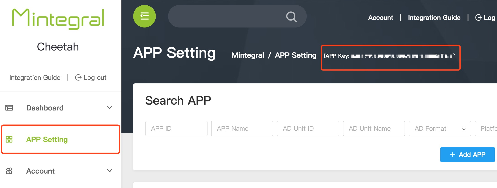
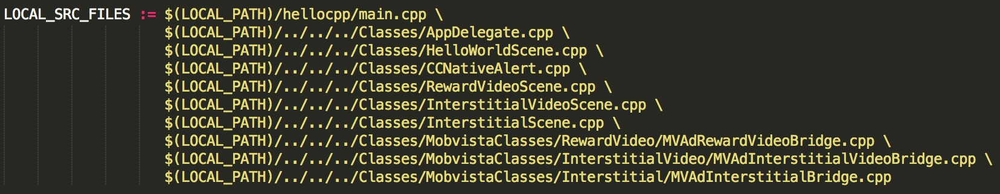

# Cocos2d-x Bridge 开发文档

##1 概述
本文档描述了Cocos2d-x开发者如何集成Mintegral Cocos2d-x Bridge产品。  
Cocos2d-x Bridge 将提供了4种广告形式，包括：RewardVideo（激励性视频）、InterstitialVideo（插页视频）、Interstitial（插屏）、InterActive（交互式广告）。 

###1.1 提供文件([点击下载](https://cdn-adn-https.rayjump.com/cdn-adn/v2/portal/19/08/12/16/02/5d511d1a4e4d2.zip))
**/MintegralClasses/所有文件/**  
**/mtgad/所有文件/**  

###1.2 集成注意

建立好Cocos2d-x工程后，把上面提供的Bridege文件夹拷贝到你的项目中指定位置，编译Android和iOS项目，就可以了。   

**/你的项目/Classes/MintegralClasses/**  
**/你的项目/proj.android-studio/app/src/org/cocos2dx/mtgad/** 

##2 集成准备
###2.1 申请账号
开发者从Mintegral运营人员处获取账号、密码后，登录[M系统后台](http://mmonetization.com/user/login )
###2.2 App Key
开发者每个账号都有对应的AppKey，请求广告时需要用到该参数，它可以从M系统后台获取。  
登录M系统后台，在AD Unit -> App界面，可以查看到该账号的AppKey，如图所示：  
   
###2.3 App Id
开发者每创建一个应用后，系统会自动生成AppId，可在AD Unit -> App界面查看到已创建的应用以及对应的AppId，如图所示：  

###2.4 Unit Id
开发者每创建一个广告位后，系统会自动生成UnitId，可在AD Unit -> AD Unit界面查看到已创建的广告位以及对应的UnitId，如图所示：  

## 3 Cocos2d-x Bridge 开发环境的配置
### 3.1 开发需求 

cocos2d-x-3.16  
AppKeyAndroid Studio  
Xcode 


### 3.2 配置
1、配置NDK：Android 原生的SDK  
   下载地址：https://developer.android.com/ndk/downloads/index.html    
   建议配置地址：/Users/你的电脑/Library/Android/sdk/ndk-bundle/android-ndk-r14b/

2、配置ANDROID_SDK_ROOT：标准的Android SDK    
   下载地址：无，直接在用户的资源库中查找    
   地址：/Users/你的电脑/Library/Android/sdk/    

3、配置ANT_ROOT：多渠道发行打包工具     
   下载地址：http://ant.apache.org/bindownload.cgi    
   建议配置地址：  /Users/你的电脑/Library/Android/sdk/apache-ant-1.10.1/bin/ 


## 4 配置开发环境
### 4.1 iOS
 A、添加mtgsdk的framework到项目工程Add Files to ...，按着 [iOS开发者文档](http://cdn-adn.rayjump.com/cdn-adn/v2/markdown_v2/index.html?file=sdk-m_sdk-ios&lang=cn) 添加系统库的framework；    

B、在工程的Build Settings中，找到Other Linker Flags，增加一个flag：-ObjC，注意大小写。   

C、就是添加两个Frameworks：GameController.framework和MediaPlayer.framework。达到连接器的工作原理

### 4.2 Android
A、添加MTGSDK到项目工程，按着 [Android开发者文档](http://cdn-adn.rayjump.com/cdn-adn/v2/markdown_v2/index.html?file=sdk-m_sdk-android&lang=cn) 把jar包和res文件添加到Android工程;    
    
B、修改 你的项目/proj.android-studio/app/jni/Android.mk  文件，添加Classes文件夹需要的工程文件; 
         
    
C、然后修改AndroidManifest文件，把各种权限添加上;           

**打开 AndroidManifest.xml，配置以下内容：**

**必要权限**

```actionScript
    <uses-permission android:name="android.permission.INTERNET" />
    <uses-permission android:name="android.permission.WRITE_EXTERNAL_STORAGE"/>
    <uses-permission android:name="android.permission.ACCESS_NETWORK_STATE" />
```

**非必要权限**

```actionScript
    <uses-permission android:name="android.permission.ACCESS_WIFI_STATE" />
    <uses-permission android:name="android.permission.READ_PHONE_STATE" />
    <uses-permission android:name="android.permission.ACCESS_COARSE_LOCATION" />
    <uses-permission android:name="android.permission.ACCESS_FINE_LOCATION" />
```

## 5 欧盟GDPR版本须知
从2018年5月25日开始，欧盟的“通用数据保护条例”（GDPR）将生效。 开发者需要更新Mintergal SDK并按以下方法集成，否则会影响广告正常投放。同时，我们更新了[Mintegral隐私政策](https://www.mintegral.com/en/privacy/)。<br>

**注意**      
1、Android仅针对SDK v_8.11.0版本及以上版本，对应plugin版本为V_1.3.0。      
2、iOS仅针对SDK v_3.8.0 版本及以上版本，对应plugin版本为V_1.3.0。      
3、如果不上报用户信息，将会影响广告投放，可能会引起没有广告返回的情况，请知悉。      
4、对于欧盟用户，开发者集成时，建议在征得用户同意之前，先不要初始化SDK，以免引起不必要的麻烦。     

**Mintegral GDPR版本新增接口说明**      
1、设置是否获取用户信息的开关，1为允许，0为拒绝。

```C#
MTGCommonBridge::setConsentStatusInfoType("1");
```

2、获取用户设置的开关状态。

```C#           
MTGCommonBridge::getConsentStatusInfoType();
```

​    


## 6 激励性视频广告接入

###6.1 接入流程 

**1、确保完成Mintegral Cocos2d-x Bridge 初始化**  


**2、请在AndroidManifest.xml文件声明激励性视频的Activity**

``` 
<application android:enabled="true">
 <activity
            android:name="com.mintegral.msdk.reward.player.MTGRewardVideoActivity"
            android:configChanges="orientation|keyboardHidden|screenSize"
            android:theme="@android:style/Theme.NoTitleBar.Fullscreen" />
</application>
```

**3、设置奖励信息，点击设置Virtual Reward,添加激励信息后，会自动生成RewardId**             


**4、创建广告位时设置回调方式，视频播放完成后会给予开发者回调**   
        

**服务器回调方式:**

**声明callbakUrl，只需要开发者修改域名部分**

**例如:http(s)://www.sampleurl.com/mintegral?user_id={user_id}&trans_id={trans_id}&reward_amout={reward_amount}&reward_name={reward_name}&sign={sign}&unit_id={unit_id}**

**客户端回调方式:**
**设置setRewardVideoListener监听，视频播放完成后会回调此方法,请您读取其中event.level中的JSON字符串解析奖励信息。**	

```actionScript
	void onRewardVideoCallBack(string code,string level){
	{
	 printf("RewardName: %s\n", code.c_str());
     printf("RewardAmout: %s\n", level.c_str());
	}
```
**5、初始化RewardVideo广告**  


**导入**  

```actionScript  
#include "MintegralClasses/RewardVideo/MTGAdRewardVideoBridge.h"
```

**初始化**

```actionScript  
MTGAdRewardVideoBridge::initMintegralSDK("92762", "936dcbdd57fe235fd7cf61c2e93da3c4");
```

**6、设置侦听回调**  

```actionScript
void onRewardVideoCallBack(string code,string level){
    printf("code: %s\n", code.c_str());
    printf("level: %s\n", level.c_str());
}

MTGAdRewardVideoBridge::addCallbackRewardVideoAd(onRewardVideoCallBack);

```
**7、调用loadRewardVideo方法**

```actionScript
MTGAdRewardVideoBridge::loadRewardVideoAd("21310");	
```
**8、在播放之前，判断视频是否ready，如果true，则调用show方法**  

```actionScript
isReady = MTGAdRewardVideoBridge::isReadyRewardVideoAd("21310");
if(isReady){
	MTGAdRewardVideoBridge::showRewardVideoAd("21310","8794","123");
}
```
**9、RewardVideo广告形式相关方法的介绍**
<table><tr><td bgcolor=#DCDCDC>initMintegralSDK(string appid,string AppKey)</td></tr></table>

> 用于初始化MTGSDK

|参数名       |		参数信息  |
| ------------- |:-------------:|
| appid  | 应用的ID  |
| AppKey  | 应用的KEY  |

***

<table><tr><td bgcolor=#DCDCDC>addCallbackRewardVideoAd(RewardVideoResultEvent callback)</td></tr></table>

> 设置消息回调方法

|参数名       |		参数信息  |
| ------------- |:-------------:|
| callback  | 消息回调方法  |

> 监听与视频广告有关的状态

|参数名       |		参数信息  |
| ------------- |:-------------:|
| onLoadSuccessRewardVideo  |广告数据加载成功  |
| onLoadFailRewardVideo  | 广告数据加载失败  |
| onShowFailRewardVideo  | 广告播放失败  |
| onAdShowRewardVideo  | 广告正在播放  |
| onAdCloseRewardVideo  | 广告播放完毕获取奖励信息  |
| onAdClickedRewardVideo  | 广告安装界面点击  |

***

<table><tr><td bgcolor=#DCDCDC>loadRewardVideoAd(string unitid)</td></tr></table>

> 用于加载激励性视频广告

|参数名       |		参数信息  |
| ------------- |:-------------:|
| unitId  | M系统创建的广告位ID  |

***


<table><tr><td bgcolor=#DCDCDC>showRewardVideoAd(string unitid,string rewardid,string userid)</td></tr></table>

> 用于预播放激励性视频

|参数名       |		参数信息  |
| ------------- |:-------------:|
| unitId  | M系统创建的广告位ID  |
| rewardId  | 激励ID，对应M系统后台配置的奖励信息  |
| userId  | 用户ID，根据用户信息返回奖励  |

***


<table><tr><td bgcolor=#DCDCDC>isReadyRewardVideoAd(string unitid)</td></tr></table>

> 视频是否准备好播放

|参数名       |		参数信息  |
| ------------- |:-------------:|
| unitId  | M系统创建的广告位ID  |

***

<table><tr><td bgcolor=#DCDCDC>cleanVideoCacheRewardVideoAd()</td></tr></table>

> 清除视频缓存

|参数名       |		参数信息  |
| ------------- |:-------------:|
| 无  | 无  |

***

## 7 插屏视频广告接入

###7.1 接入流程 


1、在后台设置视频可提前关闭。    
2、在客户端集成的引用类有一些变化，展示广告的时候不需要传入奖励ID和用户ID。

**1、初始化Interstitial Video广告**  


**导入**  

```actionScript  
#include "MintegralClasses/InterstitialVideo/MTGAdInterstitialVideoBridge.h"
```

**初始化**

```actionScript  
MTGAdInterstitialVideoBridge::initMintegralSDK("92762", "936dcbdd57fe235fd7cf61c2e93da3c4");
```

**2、设置侦听回调**  

```actionScript
void onInterstitialVideoCallBack(string code,string level){
    printf("code: %s\n", code.c_str());
    printf("level: %s\n", level.c_str());
}

MTGAdInterstitialVideoBridge::addCallbackInterstitialVideoAd(onInterstitialVideoCallBack);

```
**3、调用loadInterstitialVideo方法**

```actionScript
MTGAdInterstitialVideoBridge::loadInterstitialVideoAd("21310");	
```
**4、在播放之前，判断视频是否ready，如果true，则调用show方法**  

```actionScript
isReady = MTGAdInterstitialVideoBridge::isReadyInterstitialVideoAd("21310");
if(isReady){
	MTGAdInterstitialVideoBridge::showInterstitialVideoAd("21310");
}
```
**5、InterstitialVideo广告形式相关方法的介绍**
<table><tr><td bgcolor=#DCDCDC>initMintegralSDK(string appid,string AppKey)</td></tr></table>

> 用于初始化MTGSDK

|参数名       |		参数信息  |
| ------------- |:-------------:|
| appid  | 应用的ID  |
| AppKey  | 应用的KEY  |

***

<table><tr><td bgcolor=#DCDCDC>addCallbackInterstitialVideoAd(InterstitialVideoResultEvent callback)</td></tr></table>

> 设置消息回调方法

|参数名       |		参数信息  |
| ------------- |:-------------:|
| callback  | 消息回调方法  |

> 监听与视频广告有关的状态

|参数名       |		参数信息  |
| ------------- |:-------------:|
| onLoadSuccessInterstitialVideo  | 广告数据加载成功  |
| onLoadFailInterstitialVideo  | 广告数据加载失败  |
| onShowFailInterstitialVideo  | 广告播放失败  |
| onAdShowInterstitialVideo  | 广告正在播放  |
| onAdCloseInterstitialVideo  | 广告播放完毕  |
| onAdClickedInterstitialVideo  | 广告安装界面点击  |

***

<table><tr><td bgcolor=#DCDCDC>loadInterstitialVideoAd(string unitid)</td></tr></table>

> 用于加载插屏视频广告

|参数名       |		参数信息  |
| ------------- |:-------------:|
| unitId  | M系统创建的广告位ID  |

***


<table><tr><td bgcolor=#DCDCDC>showInterstitialVideoAd(string unitid)</td></tr></table>

> 用于预播放插屏视频

|参数名       |		参数信息  |
| ------------- |:-------------:|
| unitId  | M系统创建的广告位ID  |

***


<table><tr><td bgcolor=#DCDCDC>isReadyInterstitialVideoAd(string unitid)</td></tr></table>

> 视频是否准备好播放

|参数名       |		参数信息  |
| ------------- |:-------------:|
| unitId  | M系统创建的广告位ID  |

***

<table><tr><td bgcolor=#DCDCDC>cleanVideoCacheInterstitialVideoAd()</td></tr></table>

> 清除视频缓存

|参数名       |		参数信息  |
| ------------- |:-------------:|
| 无  | 无  |

***

## 8 插屏广告接入

###8.1 接入流程 


**1、初始化Interstitial广告**  


**导入**  

```actionScript  
#include "MintegralClasses/Interstitial/MTGAdInterstitialBridge.h"
```

**初始化**

```actionScript  
MTGAdInterstitialBridge::initMintegralSDK("92763","936dcbdd57fe235fd7cf61c2e93da3c4");
```

**2、设置侦听回调**  

```actionScript
void onInterstitialCallBack(string code,string level){
    printf("code: %s\n", code.c_str());
    printf("level: %s\n", level.c_str());
}

MTGAdInterstitialBridge::addCallbackInterstitialAd(onInterstitialCallBack);

```
**3、调用loadInterstitial方法**

```actionScript
MTGAdInterstitialBridge::loadInterstitialAd("21321");
```
**4、调用showInterstitial方法**  

```actionScript
MTGAdInterstitialBridge::showInterstitialAd();
```
**5、Interstitial广告形式相关方法的介绍**
<table><tr><td bgcolor=#DCDCDC>initMintegralSDK(string appid,string AppKey)</td></tr></table>

> 用于初始化MTGSDK

|参数名       |		参数信息  |
| ------------- |:-------------:|
| appid  | 应用的ID  |
| AppKey  | 应用的KEY  |

***

<table><tr><td bgcolor=#DCDCDC>addCallbackInterstitialAd(InterstitialResultEvent callback)</td></tr></table>

> 设置消息回调方法

|参数名       |		参数信息  |
| ------------- |:-------------:|
| callback  | 消息回调方法  |

> 监听与视频广告有关的状态

|参数名       |		参数信息  |
| ------------- |:-------------:|
| onLoadSuccessInterstitial  | 广告数据加载成功  |
| onLoadFailInterstitial  | 广告数据加载失败  |
| onShowFailInterstitial  | 广告播放失败  |
| onAdShowInterstitial  | 广告正在播放  |
| onAdCloseInterstitial  | 广告播放完毕  |
| onAdClickedInterstitial  | 广告安装界面点击  |

***

<table><tr><td bgcolor=#DCDCDC>loadInterstitialAd(string unitid)</td></tr></table>

> 用于加载插屏视频广告

|参数名       |		参数信息  |
| ------------- |:-------------:|
| unitId  | M系统创建的广告位ID  |

***


<table><tr><td bgcolor=#DCDCDC>showInterstitialAd(string unitid)</td></tr></table>

> 用于预播放插屏视频

|参数名       |		参数信息  |
| ------------- |:-------------:|
| unitId  | M系统创建的广告位ID  |

***

## 9 交互式广告接入

### 9.1 接入流程 

**1、初始化Interactive广告**  

**导入**  

```actionScript  
#include "MintegralClasses/InterActive/MTGAdInterActiveBridge.h"
```

**初始化**

```actionScript  
MTGAdInterActiveBridge::initMintegralSDK("92763","936dcbdd57fe235fd7cf61c2e93da3c4");
```

**2、设置侦听回调**  

```actionScript
void onInterActiveCallBack(string code,string level){
    printf("code: %s\n", code.c_str());
    printf("level: %s\n", level.c_str());
}

MTGAdInterActiveBridge::addCallbackInterActiveAd(onInterActiveCallBack);

```

**3、调用loadInteractive方法**

```actionScript
MTGAdInterActiveBridge::loadInterActiveAd("48127");
```

**4、调用showInteractive方法**  

```actionScript
MTGAdInterActiveBridge::showInterActiveAd();
```

**5、InterActive广告形式相关方法的介绍**

<table><tr><td bgcolor=#DCDCDC>initMintegralSDK(string appid,string AppKey)</td></tr></table>

> 用于初始化MTGSDK

| 参数名 | 参数信息  |
| ------ | :-------: |
| appid  | 应用的ID  |
| AppKey | 应用的KEY |

------

<table><tr><td bgcolor=#DCDCDC>addCallbackInterActiveAd(InterActiveResultEvent callback)</td></tr></table>

> 设置消息回调方法

| 参数名   |   参数信息   |
| -------- | :----------: |
| callback | 消息回调方法 |

> 监听与视频广告有关的状态

| 参数名                           |               参数信息               |
| -------------------------------- | :----------------------------------: |
| onLoadSuccessInterActive         |           广告数据加载成功           |
| onLoadFailInterActive            |           广告数据加载失败           |
| onShowFailInterActive            |             广告播放失败             |
| onAdShowInterActive              |             广告正在播放             |
| onAdCloseInterActive             |             广告播放完毕             |
| onAdClickedInterActive           |           广告安装界面点击           |
| onMaterialLoadSuccessInterActive |           广告物料加载成功           |
| onPlayCompleteInterActive        | 广告播放是否完成，1为完成，0为未完成 |

------

<table><tr><td bgcolor=#DCDCDC>loadInterActiveAd(string unitid)</td></tr></table>

> 用于加载交互式广告

| 参数名 |      参数信息       |
| ------ | :-----------------: |
| unitId | M系统创建的广告位ID |

------


<table><tr><td bgcolor=#DCDCDC>showInterActiveAd()</td></tr></table>

> 用于播放交互式广告

------

## 10 ChangeLog 

版本号   | changeLog | 发布时间
------|-----------|------
1.6.1 | 基于Android9.9.0 ，iOS5.0.0版本SDK，新增2个InterActive广告事件回调：onMaterialLoadSuccessInterActive 素材加载成功；onPlayCompleteInterActive 试玩完成，参数：“0”试玩中断，“1”试玩完成。 | 2019.03.22 
1.6.0 | 基于Android9.0.0，iOS3.4.0版本SDK，增加InterActive广告形式，增加新的GDPR设置获取方法。 | 2018.09.16 
1.5.0	| 基于Android8.12.1 ，iOS4.0.0版本SDK，更换InterstitialVideo内部逻辑;替换Mintegral包名结构。	|2018.7.24
1.4.0	| 基于Android8.11.2 SDK，iOS3.8.0版本SDK，支持GDPR功能。 |	2018.05.22
1.3.0 | 实现插屏(Interstitial)广告平台的接入功能。| 2018.02.28
1.0.2 | 实现插屏视频(InterstitialVideo)广告平台的接入功能。| 2018.01.10
1.0.1 | 实现激励性视频(RewardVideo)广告平台的接入功能。| 2017.12.28

