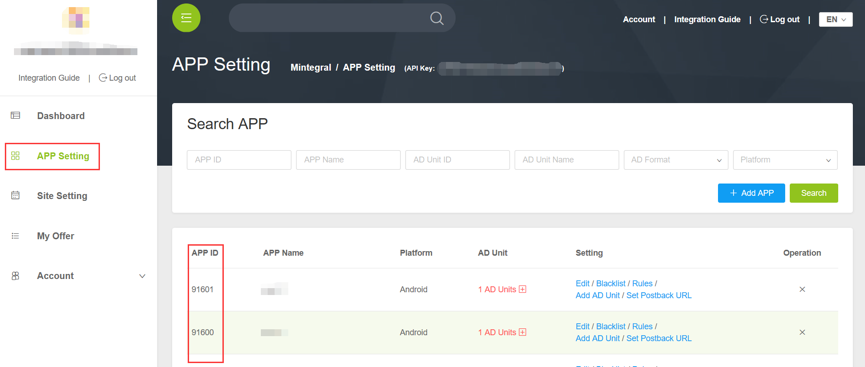

# Cocos2d-x Bridge Development Document

##1 Overview
This document describes how Cocos2d-x publishers integrate Mintegral Cocos2d-x Bridge product. Five types of Ads including Rewarded Video, interstitialVideo, Interstitial, AppWall, offerwall, are provided in Cocos2d-x Bridge. 

###1.1 Documents Provided([Click Download](https://cdn-adn-https.rayjump.com/cdn-adn/v2/portal/19/08/12/16/02/5d511d1a4e4d2.zip))
**/MintegralClasses/All files/**  
**/mtgad/All files/**  

###1.2 Integrated Attention

After setting the project of Cocos2d-x, copy the Bridege folder provided above to the specified location in your project, and compile Android and iOS items, then it is done.


**/Your projects/Classes/MintegralClasses/**  
**/Your projects/proj.android-studio/app/src/org/cocos2dx/mtgad/** 

##2 Integration Prepare
###2.1 Apply an Account
Publishers can acquire the account and password from  [Mintegral OM](http://mmonetization.com/user/login ) to upload to the Mintegral portal.
###2.2 App Key
Every publisher’s accounts will have their relative AppKeys（AppKey）. AppKey is needed when request Ads, which can be acquired form Mintegral portal. Log in Mintegral portal, publishers can view the AppKey of this account in AD Unit -> App page. As the picture shows:  
   
###2.3 App Id
The system will automatically create an AppId after publishers creates an App. Publishers can view the created App and its relative AppId in the AD Unit -> App page.  

###2.4 Unit Id
The system will automatically create an UnitId after publishers creates an unit. Publishers can view the created unit and its relative UnitId in the AD Unit -> App Unit page.  


## 3 Settings of Cocos2d-x Bridge Developing Surroundings
### 3.1 Development Demands:

cocos2d-x-3.16  
Android Studio  
Xcode 


### 3.2 Settings:
1、Set up NDK：Android native SDK  
   Download address：https://developer.android.com/ndk/downloads/index.html    
   Suggested setting address：/Users//your computer/Library/Android/sdk/ndk-bundle/android-ndk-r14b/

2、Set up ANDROIDSDKROOT：Standard Android SDK    
   Download address：N/A， search directly in user’ resource library    
   Address：/Users/your computer/Library/Android/sdk/    

3、Set up ANT_ROOT：package tool for multi-channel publishing     
   Download address：http://ant.apache.org/bindownload.cgi    
   Suggested setting address：  /Users/your computer/Library/Android/sdk/apache-ant-1.10.1/bin/ 


## 4 Setting development surroundings
### 4.1 iOS
A、add the framework of mtgsdk to the project Add Files to…, and then add the framework in the system according to [MTGSDK Integration for iOS](http://cdn-adn.rayjump.com/cdn-adn/v2/markdown_v2/index.html?file=sdk-m_sdk-ios&lang=en);  

B、find out Other Linker Flags in the project’s Build Setting, and then add a flag: -ObjC, be careful to the case;      

C、add two Frameworks：GameController.framework and MediaPlayer.framework to reach the working principle of connector;

### 4.2 Android
A、add MTGSDK to the project, and add jar. and res. to the Android project according to [MTGSDK Integration for Android](http://cdn-adn.rayjump.com/cdn-adn/v2/markdown_v2/index.html?file=sdk-m_sdk-android&lang=en);    
    
B、modify the file of your project/proj.android-studio/app/jni/Android.mk, and add the project file needed in Classes folder; 
         
    
C、and then modify the file of AndroidManifest, and add every authority;

​            

**Open AndroidManifest.xml and set up according to the following content:**

**Required Authority**

```actionScript
    <uses-permission android:name="android.permission.INTERNET" />
    <uses-permission android:name="android.permission.WRITE_EXTERNAL_STORAGE"/>
    <uses-permission android:name="android.permission.ACCESS_NETWORK_STATE" />
```

**Non-required Authority**

```actionScript
    <uses-permission android:name="android.permission.ACCESS_WIFI_STATE" />
    <uses-permission android:name="android.permission.READ_PHONE_STATE" />
    <uses-permission android:name="android.permission.ACCESS_COARSE_LOCATION" />
    <uses-permission android:name="android.permission.ACCESS_FINE_LOCATION" />
```

## 5 Instrucition of EU-GDPR version
Beginning on May 25th, 2018, the European Union’s General Data Protection Regulation (GDPR) will go into effect. Developers need to update the Mintergal SDK and integrate it as follows, otherwise it will affect ads serving. At the same time,  we have updated [Mintegral Privacy Policy.](https://www.mintegral.com/en/privacy/)<br>

**Attention**     
1、only for sdk version v_8.11.0 and above,The corresponding adapter version is V_1.3.0.     
2、only for sdk version v_3.8.0 and above,The corresponding adapter version is V_1.3.0.      
3、If users deny to authorize to collect infomation, it will have impact on delivering ads, might have no ads returned，Please be kindly notified.      
4、For Europe users, should get user authorization before initing SDK. Don't init sdk first，to avoid other conflict.        

**1.New API instrucition**    

Android New API instrucition 

```C#
//Android New API instrucition
	 std::string AUTHORITY_KEY_ALL_INFO = "authority_all_info";//Main switch（Control all of the following parameters）
  
    std::string AUTHORITY_KEY_GENERAL_DATA = "authority_general_data";
    std::string AUTHORITY_KEY_DEVICE_ID = "authority_device_id";
    std::string AUTHORITY_KEY_GPS = "authority_gps";
    std::string AUTHORITY_KEY_IMEI_MAC = "authority_imei_mac";
    std::string AUTHORITY_KEY_ANDROID_ID = "authority_android_id";
    std::string AUTHORITY_KEY_APP_LIST = "authority_applist";
    std::string AUTHORITY_KEY_APP_DOWNLOAD = "authority_app_download";
    std::string AUTHORITY_KEY_APP_PROGRESS = "authority_app_progress";
    
    std::string IS_SWITCH_ON = "ON";//Allow  get user information
    std::string IS_SWITCH_OFF = "OFF";//Rejecting access to user information 
	
```

iOS New API instrucition    

```C#
//iOS New API instrucition
	std::string AUTHORITY_KEY_ALL_INFO = "authority_all_info";//Main switch（Control all of the following parameters）
  
    std::string AUTHORITY_KEY_GENERAL_DATA = "authority_general_data";
    std::string AUTHORITY_KEY_DEVICE_ID = "authority_device_id";
    std::string AUTHORITY_KEY_GPS = "authority_gps";
        
    std::string IS_SWITCH_ON = "ON";//Allow  get user information
    std::string IS_SWITCH_OFF = "OFF";//Rejecting access to user information 
```

**2.display user privacy information protocol dialog**           

set method（Take iOS as an example）  

```C#
//Developers can set which userinfo can be gathered. 
	MTGCommonBridge::setUserPrivateInfoType(HelloWorld::AUTHORITY_KEY_GENERAL_DATA,
                                           HelloWorld::IS_SWITCH_ON);
    MTGCommonBridge::setUserPrivateInfoType(HelloWorld::AUTHORITY_KEY_GPS,
                                           HelloWorld::IS_SWITCH_OFF);
    MTGCommonBridge::setUserPrivateInfoType(HelloWorld:: AUTHORITY_KEY_DEVICE_ID,
                                           HelloWorld::IS_SWITCH_OFF);
    MTGCommonBridge::setUserPrivateInfoType(HelloWorld::AUTHORITY_KEY_ALL_INFO,
                                           HelloWorld::IS_SWITCH_ON);
```

**3.Get user selection result**   

```C#           
   //get GDPR
		printf("userPrivateInfo AUTHORITY_KEY_GPS: %d \n",
           MTGCommonBridge::userPrivateInfo(HelloWorld::AUTHORITY_KEY_GPS));
    printf("userPrivateInfo AUTHORITY_KEY_DEVICE_ID: %d \n",
           MTGCommonBridge::userPrivateInfo(HelloWorld::AUTHORITY_KEY_DEVICE_ID));
    printf("userPrivateInfo AUTHORITY_KEY_ALL_INFO: %d \n",
           MTGCommonBridge::userPrivateInfo(HelloWorld:: AUTHORITY_KEY_ALL_INFO));
    printf("userPrivateInfo AUTHORITY_KEY_GENERAL_DATA: %d \n",
           MTGCommonBridge::userPrivateInfo(HelloWorld:: AUTHORITY_KEY_GENERAL_DATA));
```


## 6 Reward Video Integration

###6.1 Access process 

**1、Please confirm the initialization of Mintegral Cocos2d-x Bridge accomplished.**  


**2、Please announce “Activity” of RewardVideo in AndroidManifest.xml.**

``` 
<application android:enabled="true">
<activity
            android:name="com.mintegral.msdk.reward.player.MTGRewardVideoActivity"
            android:configChanges="orientation|keyboardHidden|screenSize"
            android:theme="@android:style/Theme.NoTitleBar.Fullscreen" />
</application>
```

**3、Set up reward information. Click “Set up Virtual Reward”, the RewardId will be created automatically after reward information is set up.**          


**4、 Set up callback mode when creating units. Publishers can receive callback after video is played.**       


**Sever Callback Mode:**

**To announce Callback Url, publishers can only edit the url.**

**For example:http(s)://www.sampleurl.com/mintegral?user_id={user_id}&trans_id={trans_id}&reward_amout={reward_amount}&reward_name={reward_name}&sign={sign}&unit_id={unit_id}**

**Client Callback Mode:**
**Set up setRewardVideoListener, which will be callback when the video is completed. Please read the JSON string in event.level to parse the reward information.**	

```actionScript
	void onRewardVideoCallBack(string code,string level){
	{
	 printf("RewardName: %s\n", code.c_str());
     printf("RewardAmout: %s\n", level.c_str());
	}
```
**5、Initialize RewardVideo ads**  


**Import**  

```actionScript  
#include "MintegralClasses/RewardVideo/MTGAdRewardVideoBridge.h"
```

**Initialize**

```actionScript  
MTGAdRewardVideoBridge::initMintegralSDK("92762", "936dcbdd57fe235fd7cf61c2e93da3c4");
```

**6、Set up listener callback**  

```actionScript
void onRewardVideoCallBack(string code,string level){
    printf("code: %s\n", code.c_str());
    printf("level: %s\n", level.c_str());
}

MTGAdRewardVideoBridge::addCallbackRewardVideoAd(onRewardVideoCallBack);	

```
**7、The loadRewardVideo Method**

```actionScript
MTGAdRewardVideoBridge::loadRewardVideoAd("21310");	
```
**8、Before playing, please judge whether the video is ready, if it is true, then call the show method and play**  

```actionScript
isReady = MTGAdRewardVideoBridge::isReadyRewardVideoAd("21310");
if(isReady){
	MTGAdRewardVideoBridge::showRewardVideoAd("21310","8794","123");
}
```
**9、Introduction of relative methods for the form of RewardVideo**
<table><tr><td bgcolor=#DCDCDC>initMintegralSDK(string appid,string AppKey)</td></tr></table>

> This type is used to initialize MTGSDK

|Parameter Name       |		Parameter Information  |
| ------------- |:-------------:|
| appid  | app’s ID  |
| AppKey  | app’s KEY  |

***

<table><tr><td bgcolor=#DCDCDC>addCallbackRewardVideoAd(RewardVideoResultEvent callback)</td></tr></table>

> Setting the message callback

|Parameter Name       |		Parameter Information  |
| ------------- |:-------------:|
| callback  | Message callback method |

> This type is used to listen the status related to video Ads.

|Parameter Name       |		Parameter Information  |
| ------------- |:-------------:|
| onLoadSuccessRewardVideo  | Ad data loaded successfully  |
| onLoadFailRewardVideo  | Ad data loaded failed  |
| onShowFailRewardVideo  | Ad playback failed  |
| onAdShowRewardVideo  | The ads are on  |
| onAdCloseRewardVideo  | After the ad is finished, the reward information is   obtained  |
| onAdClickedRewardVideo  | Ad installation interface Click  |

***

<table><tr><td bgcolor=#DCDCDC>loadRewardVideoAd(string unitid)</td></tr></table>

> This type is used to load Reward Video

|Parameter Name       |		Parameter Information  |
| ------------- |:-------------:|
| unitId  | Created by Mintegral  |

***


<table><tr><td bgcolor=#DCDCDC>showRewardVideoAd(string unitid,string rewardid,string userid)</td></tr></table>

> This type is used to pre-play Reward Video

|Parameter Name       |		Parameter Information  |
| ------------- |:-------------:|
| unitId  | Created by Mintegral  |
| rewardId  | Reward Id, corresponding to the reward information  of Mintegral  |
| userId  | User Id, return reward by users’ information  |

***


<table><tr><td bgcolor=#DCDCDC>isReadyRewardVideoAd(string unitid)</td></tr></table>

> Whether the video is ready to play

|Parameter Name       |		Parameter Information |
| ------------- |:-------------:|
| unitId  | Created by Mintegral  |

***

<table><tr><td bgcolor=#DCDCDC>cleanVideoCacheRewardVideoAd()</td></tr></table>

> Scavenging video caching

|Parameter Name       |		Parameter Information  |
| ------------- |:-------------:|
| nothing  | nothing  |

***


## 7 Interstitial Video Integration

###7.1 Access process 

1、Interstitial Video from MTG is essential to Reward Video ads, so there is most same steps to Reward Vdieo.    
2、Ignore reward callback.     
3、set Video ads skippable from dashboard.   
4、There are some changes in the reference class integrated in the client side, and when the advertisement is displayed, you do not need to be introduced to the ID and the UserId.   

**1、Initialize InterstitialVideo ads**  


**Import**  

```actionScript  
#include "MintegralClasses/InterstitialVideo/MTGAdInterstitialVideoBridge.h"
```

**Initialize**

```actionScript  
MTGAdInterstitialVideoBridge::initMintegralSDK("92762", "936dcbdd57fe235fd7cf61c2e93da3c4");
```

**2、Set up listener callback**  

```actionScript
void onInterstitialVideoCallBack(string code,string level){
    printf("code: %s\n", code.c_str());
    printf("level: %s\n", level.c_str());
}

MTGAdInterstitialVideoBridge::addCallbackInterstitialVideoAd(onInterstitialVideoCallBack);

```
**3、The loadInterstitialVideo Method**

```actionScript
MTGAdInterstitialVideoBridge::loadInterstitialVideoAd("21310");	
```
**4、Before playing, please judge whether the video is ready, if it is true, then call the show method and play**  

```actionScript
isReady = MTGAdInterstitialVideoBridge::isReadyInterstitialVideoAd("21310");
if(isReady){
	MTGAdInterstitialVideoBridge::showInterstitialVideoAd("21310");
}
```
**5、Introduction of relative methods for the form of InterstitialVideo**
<table><tr><td bgcolor=#DCDCDC>initMintegralSDK(string appid,string AppKey)</td></tr></table>

> This type is used to initialize MTGSDK

|Parameter Name       |		Parameter Information  |
| ------------- |:-------------:|
| appid  | app’s ID  |
| AppKey  | app’s KEY  |

***

<table><tr><td bgcolor=#DCDCDC> addCallbackInterstitialVideoAd(InterstitialVideoResultEvent callback)</td></tr></table>

> Setting the message callback

|Parameter Name       |		Parameter Information  |
| ------------- |:-------------:|
| callback  | Message callback method |

> This type is used to listen the status related to video Ads.

|Parameter Name       |		Parameter Information  |
| ------------- |:-------------:|
| onLoadSuccessInterstitialVideo  | Ad data loaded successfully  |
| onLoadFailInterstitialVideo  | Ad data loaded failed  |
| onShowFailInterstitialVideo  | Ad playback failed  |
| onAdShowInterstitialVideo  | The ads are on  |
| onAdCloseInterstitialVideo  | The ad is finished |
| onAdClickedInterstitialVideo  | Ad installation interface Click  |

***

<table><tr><td bgcolor=#DCDCDC>loadInterstitialVideoAd(string unitid)</td></tr></table>

> This type is used to load Interstitial Video

|Parameter Name       |		Parameter Information  |
| ------------- |:-------------:|
| unitId  | Created by Mintegral  |

***


<table><tr><td bgcolor=#DCDCDC>showInterstitialVideoAd(string unitid)</td></tr></table>

> This type is used to pre-play Interstitial Video

|Parameter Name       |		Parameter Information  |
| ------------- |:-------------:|
| unitId  | Created by Mintegral  |

***


<table><tr><td bgcolor=#DCDCDC>isReadyInterstitialVideoAd(string unitid)</td></tr></table>

> Whether the video is ready to play

|Parameter Name       |		Parameter Information |
| ------------- |:-------------:|
| unitId  | Created by Mintegral  |

***

<table><tr><td bgcolor=#DCDCDC>cleanVideoCacheInterstitialVideoAd()</td></tr></table>

> Scavenging video caching

|Parameter Name       |		Parameter Information  |
| ------------- |:-------------:|
| nothing  | nothing  |

***

## 8 Interstitial Integration

###8.1 Access process   

**1、Initialize InterstitialVideo ads**  


**Import**  

```actionScript  
#include "MintegralClasses/Interstitial/MTGAdInterstitialBridge.h"
```

**Initialize**

```actionScript  
MTGAdInterstitialBridge::initMintegralSDK("92762", "936dcbdd57fe235fd7cf61c2e93da3c4");
```

**2、Set up listener callback**  

```actionScript
void onInterstitialCallBack(string code,string level){
    printf("code: %s\n", code.c_str());
    printf("level: %s\n", level.c_str());
}

MTGAdInterstitialBridge::addCallbackInterstitialAd(onInterstitialCallBack);

```
**3、The loadInterstitial Method**

```actionScript
MTGAdInterstitialBridge::loadInterstitialAd("21310");	
```
**4、The showInterstitial Method**  

```actionScript	
MTGAdInterstitialBridge::showInterstitialAd("21310");

```
**5、Introduction of relative methods for the form of Interstitial**
<table><tr><td bgcolor=#DCDCDC>initMintegralSDK(string appid,string AppKey)</td></tr></table>

> This type is used to initialize MTGSDK

|Parameter Name       |		Parameter Information  |
| ------------- |:-------------:|
| appid  | app’s ID  |
| AppKey  | app’s KEY  |

***

<table><tr><td bgcolor=#DCDCDC> addCallbackInterstitialAd(InterstitialResultEvent callback)</td></tr></table>

> Setting the message callback

|Parameter Name       |		Parameter Information  |
| ------------- |:-------------:|
| callback  | Message callback method |

> This type is used to listen the status related to video Ads.

|Parameter Name       |		Parameter Information  |
| ------------- |:-------------:|
| onLoadSuccessInterstitial  | Ad data loaded successfully  |
| onLoadFailInterstitial  | Ad data loaded failed  |
| onShowFailInterstitial  | Ad playback failed  |
| onAdShowInterstitial  | The ads are on  |
| onAdCloseInterstitial  | The ad is finished |
| onAdClickedInterstitial  | Ad installation interface Click  |

***

<table><tr><td bgcolor=#DCDCDC>loadInterstitialAd(string unitid)</td></tr></table>

> This type is used to load Interstitial

|Parameter Name       |		Parameter Information  |
| ------------- |:-------------:|
| unitId  | Created by Mintegral  |

***


<table><tr><td bgcolor=#DCDCDC>showInterstitialAd(string unitid)</td></tr></table>

> This type is used to pre-play Interstitial

|Parameter Name       |		Parameter Information  |
| ------------- |:-------------:|
| unitId  | Created by Mintegral  |

***


## 9 ChangeLog 
version | changeLog | date
------|-----------|------
1.6.1 | Based on Android9.9.0,iOS5.0.0 SDK,add the onInterActiveMaterialLoaded method and onInterActivePlayingComplete method of InterActive ad. | Mar 22,2019 
1.6.0 | Based on Android9.0.0,iOS3.4.0 SDK,add interActive ad format and update new method to the GDPR settings. | Sep 16,2018 
1.5.0	| Based on Android8.12.1, iOS4.0.0 SDK,support Interstitial Video; replace the Mintegral package name.	|Jul 24,2018
1.4.0	|Based on  Android8.11.2,iOS3.8.0 SDK, support GDPR function.|	May 22,2018
1.3.0 | Interstitial Integration is supported on platform.| Feb 28,2018
1.0.2 | Interstitial Video Integration is supported on platform.| Jan 10,2018
1.0.1 | Reward Video Integration is supported on platform.| Dec 28,2017
