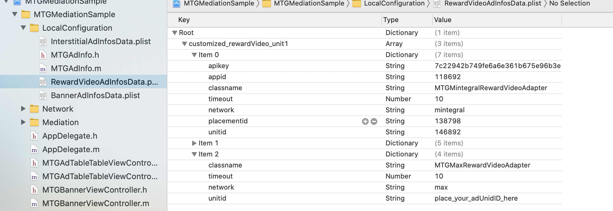

# Mediation Integration Guide(iOS)
[Chinese Document](index_cn_max.md)
## Overview    

This document describes to IOS developers how to aggregate other third-parties' ad SDK, through Mintegral. 
Currently, we only support aggregation of max's Rewarded Video and Interstitial ad formats; ironSource's Interstitial ad corresponds to Mintegral's Interstitial Video.

## Mintegral Setting

### Retrieve Account-Related Information

**App Key**      
Each Mintegral account has a corresponding App Key, and the key will be needed for requesting ads. It can be retreived from your Mintegral account through the following path: **APP Setting -> App Key**:  

   

**App Id**       
The M-system will automatically generate a corresponding App ID for each app created by the developer. Find the App ID(s)  here: **APP Setting -> APP ID**:        
   

**Placements & Units**    
The M-system will automatically generate a corresponding placements for each ad space created by the developer. Find the Placement Id and Unit ID here: **APP Setting -> Placement Management -> Edit Placement & Unit**  
  

### Obtain the SDK


Import the MTGSDK provided by AM, or obtain the SDK from [MTGSDK iOS Integration Document] (https://dev.mintegral.com/doc/index.html?file=sdk-m_sdk-ios&lang=cn).o
      
#### Interstitial
To integrate Interstitial, the MTGSDK.framework and MTGSDKInterstitialVideo.framework files need to be imported.

#### Rewarded Video
To integrate Rewarded Video, the MTGSDK.framework and MTGSDKReward.framework files need to be imported. 

### Parameter configuration before initialization

1.Import basic static libraries

CoreGraphics.framework       
Foundation.framework<br/>
UIKit.framework<br/>
libsqlite3.tbd (It's libsqlite3.dylib below Xcode7)<br/>
libz.tbd (It'slibz.dylib below Xcode7)<br/>
AdSupport.framwork<br/>
StoreKit.framewrok<br/>
QuartzCore.framework<br/>
CoreLocation.framework<br/>
CoreTelephony.framework<br/>
MobileCoreServices.framework<br/>
Accelerate.framework<br/>
AVFoundation.framework<br/>
WebKit.framework<br/>
	
2.Add linker parameter for XCode
Find Other Linker Flags in build settings and add flag: -ObjC (case sensitive).

3.Allow the operation of the HTTP connection  

Due to the App Transport Security regulations of iOS 9, you need to modify the project's info.plist file, allowing HTTP connection. The specific method is below:  
Add an App Transport Security Settings Dictionary in the info.plist file; and add an Allow Arbitrary Loads key with its boolean value (setting as "YES") for this Dictionary.    


## Max Setting

### Create your account
#### [Sign up and sign in](https://dash.applovin.com/login) to your max account.     
#### New App 
Configure the SDK Key under your account into the project, and view it in the background after compiling and running


### Integrating max
Please read [max iOS Intergration document]to add the SDK to Your Project.         


#### CocoaPods

To integrate ironsource SDK with Cocoapods, enter the following line in your podfile:  

    pod 'AppLovinSDK','6.14.4'


### Import Adapter 
Click [Github MTGMediationSample](https://github.com/Mintegral-official/mediation-ios/tree/master/MTGMediationSample/MTGMediationSample) to get the mediation and Network package and copy all the files to your project.


## Interstitial
### Import header file

```java
#import "MTGInterstitialAdManager.h"
```

### Create the MTGInterstitialAdManager

You need to pass the adUnitId when initializing,Create a plist file, and enter your ad ID, adapter class name and other parameters as shown below. The Mintegral network needs to pass the appid, appkey, unitid that you applied in the Mintegral background. The ironsource needs to pass in the appkey that you applied in the ironsource background.**Item 0 is the firest call network.**      
In addition to creating the form of the plist file, you can also set parameters in MTGAdInfo.                    

 

Sample code：        

```java 
-(MTGInterstitialAdManager *)interstitialManager{
    if (_interstitialManager) {
        return _interstitialManager;
    }
    _interstitialManager = [[MTGInterstitialAdManager alloc] initWithAdUnitID:self.adUnitId delegate:self];
    return _interstitialManager;
}
```

### Set MTGInterstitialAdManagerDelegate
```java

#pragma mark - MTGInterstitialAdManagerDelegate

/**
 * This method is called after an ad fails to load.
 *
 * @param error An error indicating why the ad failed to load.
 * Specific error code can be viewed in MTGInterstitialError.h
 */


- (void)manager:(MTGInterstitialAdManager *)manager didFailToLoadInterstitialWithError:(NSError *)error {
    self.showButton.userInteractionEnabled = NO;
    NSString *msg = [NSString stringWithFormat:@"error: %@",error.description];
    [self showMsg:msg];
}

/**
 * This method is called after an ad loads successfully.
 *
 * @param adUnitID The unit of the ad associated with the event.
 */

- (void)managerDidLoadInterstitial:(MTGInterstitialAdManager *)manager {
    
    self.showButton.userInteractionEnabled = YES;
    NSString *msg = [NSString stringWithFormat:@"unit %@ loadSuccess",manager];
    [self showMsg:msg];
}

/**
 * This method is called after an ad show successfully.
 *
 */

- (void)managerDidPresentInterstitial:(MTGInterstitialAdManager *)manager {
    
}

/**
 * This method is called after an ad fails to show ads.
 *
 * @param error An error indicating why the ad failed to load.
 * Specific error code can be viewed in MTGInterstitialError.h.
 */

- (void)manager:(MTGInterstitialAdManager *)manager didFailToPresentInterstitialWithError:(NSError *)error {
    
}

/**
 * This method is called when the user taps on the ad.
 *
 */


- (void)managerDidReceiveTapEventFromInterstitial:(MTGInterstitialAdManager *)manager {
    
}

/**
 * This method is called when a rewarded video ad will be dismissed.
 *
 */

- (void)managerWillDismissInterstitial:(MTGInterstitialAdManager *)manager {
    
}

/**
 * This method is get callbacks for your custom parameters 
 *
 */

-(NSDictionary *)managerReceiveMediationSetting{
    
    NSDictionary *mediationSettings = @{MTG_INTERSTITIAL_USER:@"Your userId"};
    return mediationSettings;
}

@end
```


### Load Interstitial ads


```java
- (void)loadInterstitial;

Sample code：
- (IBAction)loadInterstitialAction:(id)sender {

    if (!self.adUnitId) {
        NSString *msg = @"Your adUnitId is nil";
        [self showMsg:msg];
        return;
    }
    [self.interstitialManager loadInterstitial];
}
```

### Show Interstitial ads
#### Check ads availability
```java
[MTGInterstitialAdManager ready];
```
#### Show ads
```java
- (void)presentInterstitialFromViewController:(UIViewController *)controller;

Sample code：


- (IBAction)showInterstitialAction:(id)sender {

    if ([self.interstitialManager ready]) {
        [self.interstitialManager presentInterstitialFromViewController:self];
    }else{
        NSString *msg = @"video still not ready";
        [self showMsg:msg];
    }
}


```


## Rewarded Video
### Import header file
```java
#import "MTGRewardVideo.h"
```
### Load Rewarded Video
You need to pass the adUnitId when initializing,Create a plist file, and enter your ad ID, adapter class name and other parameters as shown below. The Mintegral network needs to pass the appid, appkey, unitid that you applied in the Mintegral background. The ironsource needs to pass in the appkey that you applied in the ironsource background.**Item 0 is the firest call network.**       
In addition to creating the form of the plist file, you can also set parameters in MTGAdInfo.             



#### Register MTGRewardVideoDelegate
```java
[MTGRewardVideo registerRewardVideoDelegate:self];
    
#pragma mark - MTGRewardVideoDelegate

/**
 * This method is called after an ad loads successfully.
 *
 * @param adUnitID The ad unit ID of the ad associated with the event.
 */

- (void)rewardVideoAdDidLoadForAdUnitID:(NSString *)adUnitID{
    
    self.showButton.userInteractionEnabled = YES;
    NSString *msg = [NSString stringWithFormat:@"unit %@ loadSuccess",adUnitID];
    [self showMsg:msg];
}
/**
 * This method is called after an ad fails to load.
 *
 * @param adUnitID The ad unit ID of the ad associated with the event.
 * @param error An error indicating why the ad failed to load.
 * Specific error code can be viewed in MTGRewardVideoError.h
 */

- (void)rewardVideoAdDidFailToLoadForAdUnitID:(NSString *)adUnitID
                                        error:(NSError *)error{
    self.showButton.userInteractionEnabled = NO;
    NSString *msg = [NSString stringWithFormat:@"error: %@",error.description];
    [self showMsg:msg];
}

/**
 * This method is called when an attempt to play a rewarded video success.
 *
 * @param adUnitID The ad unit ID of the ad associated with the event.
 */
 
-(void)rewardVideoAdDidPlayForAdUnitID:(NSString *)adUnitID{
    
}

/**
 * This method is called when an attempt to play a rewarded video fails.
 *
 * @param adUnitID The ad unit ID of the ad associated with the event.
 * @param error An error describing why the video couldn't play.
 * Specific error code can be viewed in MTGRewardVideoError.h
 */
 
- (void)rewardVideoAdDidFailToPlayForAdUnitID:(NSString *)adUnitID
                                        error:(NSError *)error{
    
}

/**
 * This method is called when a rewarded video ad will be dismissed.
 *
 * @param adUnitID The ad unit ID of the ad associated with the event.
 */
 
- (void)rewardVideoAdWillDisappearForAdUnitID:(NSString *)adUnitID{
    
}

/**
 * This method is called when the user should be rewarded for watching a rewarded video ad.
 *
 * @param adUnitID The ad unit ID of the ad associated with the event.
 * @param reward The object that contains all the information regarding how much you should reward the user.
 */

- (void)rewardVideoAdShouldRewardForAdUnitID:(NSString *)adUnitID
                                      reward:(MTGRewardVideoReward *)reward{
    
}

/**
 * This method is called when the user taps on the ad.
 *
 * @param adUnitID The ad unit ID of the ad associated with the event.
 */

- (void)rewardVideoAdDidReceiveTapEventForAdUnitID:(NSString *)adUnitID{
    
}

@end

```

#### Load RewaredVideo ads
**userId（can only be numbers and charcters） is the Identifier for the server-side callback,if it is in client-callback mode,it can be left empty.**      

```java
+ (void)loadRewardVideoAdWithAdUnitID:(NSString *)adUnitID mediationSettings:(NSDictionary *)mediationSettings;

Sample code：
- (IBAction)loadRewardVideoAction:(id)sender {
  
    if (!self.adUnitId) {
        NSString *msg = @"Your adUnitId is nil";
        [self showMsg:msg];
        return;
    }
    NSDictionary *mediationSettings = @{MTG_REWARDVIDEO_USER:@"Your userId"}; 
    [MTGRewardVideo registerRewardVideoDelegate:self];
    [MTGRewardVideo loadRewardVideoAdWithAdUnitID:self.adUnitId mediationSettings:mediationSettings];
}
```
### Show RewaredVideo ads
#### Check ads availability
```java
+ (BOOL)hasAdAvailableForAdUnitID:(NSString *)adUnitID;
```
#### Show ads

```java
+ (void)presentRewardVideoAdForAdUnitID:(NSString *)adUnitID fromViewController:(UIViewController *)viewController;
```
Sample code：    

```java
- (IBAction)showRewardVideoAction:(id)sender {

    if ([MTGRewardVideo hasAdAvailableForAdUnitID:self.adUnitId]) {
        [MTGRewardVideo presentRewardVideoAdForAdUnitID:self.adUnitId fromViewController:self];
    }else{
        NSString *msg = @"video still not ready";
        [self showMsg:msg];
    }
}
```

## Adapter Version
 you can see the adapter version number in IronSourceAdapterHelper.h and MintegralAdapterVersion.h

## ChangeLog
Version | ChangeLog | Date
------|-----------|------
1.1.0 |Mediate max | 2020.09.27
		 
		 


 
