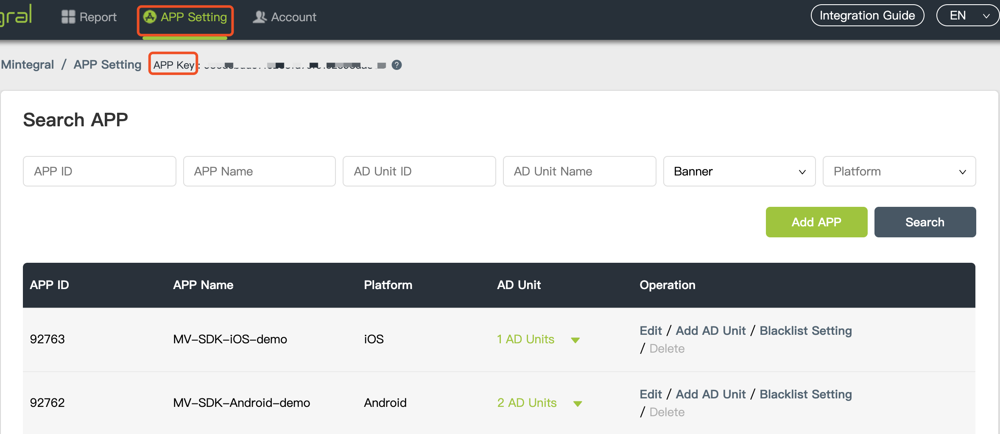
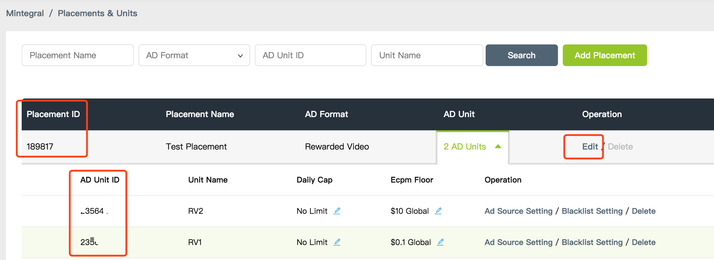

# Mintegral聚合集成指南（iOS）
[英文文档](../README.md)


## 概要

    
本文档介绍了iOS开发者如何通过Mintegral聚合其他第三方的广告SDK，目前仅支持聚合ironsource的Rewarded Video、Interstitial，其中Interstitial对应Mintegral的Interstitial Video。
 

## 配置Mintegral
您也可以通过[MTGSDK iOS 集成文档](https://dev.mintegral.com/doc/index.html?file=sdk-m_sdk-ios&lang=cn)了解更多关于 MTGSDK 的内容。
### 获取账号信息  

**App Key**   
登录Mintegral开发者后台，在**APP Setting -> APP Key**界面，可以查看到该账号的APP Key，如图所示：<br/><br/>
  

**APP ID**   
开发者每创建一个应用后，系统会自动生成App ID，可在**APP Setting -> APP ID**界面查看到已创建的应用以及对应的App ID，如图所示：<br/><br/>
  

 **Placements & Units**
开发者每创建一个广告版位后，系统会自动生成Placement ID，可在**APP Setting -> Placement Management -> Edit Placement & Unit**界面添加或修改该广告版位的Unit Id，如图所示：<br/><br/>
     

### 获取SDK

我们提供两种方式去集成Mintegral iOS-SDK:使用[Cocoapods](https://github.com/Mintegral-official/MintegralAdSDK-iOS-new)和[手动添加方式](https://github.com/Mintegral-official/MintegralAdSDK-iOS-new/releases)。

#### Interstitial
集成Interstitial，需要导入MTGSDK.framework和MTGSDKInterstitialVideo.framework

#### RewardedVideo
集成RewardVideo，需要导入MTGSDK.framework和MTGSDKReward.framework

### 初始化前的参数配置

1、导入基本的静态库      

CoreGraphics.framework <br/>
Foundation.framework<br/>
UIKit.framework<br/>
libsqlite3.tbd (在Xccode7以下是libsqlite3.dylib)<br/>
libz.tbd (在Xcode7以下是libz.dylib)<br/>
AdSupport.framwork<br/>
StoreKit.framewrok<br/>
QuartzCore.framework<br/>
CoreLocation.framework<br/>
CoreTelephony.framework<br/>
MobileCoreServices.framework<br/>
Accelerate.framework<br/>
AVFoundation.framework<br/>
WebKit.framework<br/>


2、增加XCode的链接器参数            

在工程的Build Settings中，找到Other Linker Flags，增加一个flag：-ObjC，注意大小写。

3、允许http连接的操作         

由于iOS9的App Transport Security，还需要修改工程的info.plist文件，使其允许http连接。方法如下：
在info.plist文件里增加一个App Transport Security Settings的Dictionary，并给这个Dictionary添加一个key为Allow Arbitrary Loads的布尔值，设置为YES。


## 配置ironsource
### 创建账号
#### [注册](https://platform.ironsrc.com/partners/signup)并[登录](https://platform.ironsrc.com/partners/tour)您的ironSource帐户。     
#### 创建App 
要将您的应用程序添加到ironSource dashboard，请单击 **New App** 按钮。


#### 进入应用详情

选择**Mobile App**，输入**App Store**，然后点击**Import App Info**。显示应用信息后，单击**Add App**按钮。

如果您的应用程序不可用，请选择 **App Not Live in the Application Store**并提供**Temporary Name**。选择iOS平台，然后单击**Add App**。


#### 广告位配置
记录下您添加应用后得到的**App Key**，初始化SDK时会用到此值。并在此处设置您所需要的广告形式状态，然后单击**Done**。    


### 集成ironsource
您可以通过[IronSource iOS 集成文档](https://developers.ironsrc.com/ironsource-mobile/ios/ios-sdk/)了解更多关于 IronSource 的内容。 

**添加 SDK 至您的项目**       

请在您的 podfile 中输入下行代码：

    pod 'IronSourceSDK','7.0.1.0'


### 导入Adapter文件
您可以在[Github MTGMediationSample](https://github.com/Mintegral-official/mediation-ios/tree/master/MTGMediationSample/MTGMediationSample)中获取Mediation及Network包，并将其中的全部文档拷贝到您的项目中。

## Interstitial接入
### 导入头文件
```java
#import "MTGInterstitialAdManager.h"
```

### 创建 MTGInterstitialAdManager
初始化时需要传入对应广告的adUnitID创建plist文件，按照下图传入您的广告Id，Adapter类名等参数，其中Mintegral network需要传入您在Mintegral后台申请的appid、appkey、pv   lacementid、unitid；ironsource需要传入您在ironsource后台申请的appkey.**Item 0的network为优先请求的广告**       
这里除了创建plist文件的形式，您还可以在MTGAdInfo中设定参数。
          


示例代码：        

```java 
MTGInterstitialAdManager *interstitialManager = [[MTGInterstitialAdManager alloc] initWithAdUnitID:@“your adUnitId" delegate:self];
```

### 设置MTGInterstitialAdManagerDelegate
```java


#pragma mark - MTGInterstitialAdManagerDelegate

//广告加载失败，具体error可在MTGInterstitialError.h中查看

- (void)manager:(MTGInterstitialAdManager *)manager didFailToLoadInterstitialWithError:(NSError *)error {
  
}

//广告加载成功

- (void)managerDidLoadInterstitial:(MTGInterstitialAdManager *)manager {
    
  
}

//广告展示成功

- (void)managerDidPresentInterstitial:(MTGInterstitialAdManager *)manager {
    
}

//广告展示失败

- (void)manager:(MTGInterstitialAdManager *)manager didFailToPresentInterstitialWithError:(NSError *)error {
    
}

//点击广告

- (void)managerDidReceiveTapEventFromInterstitial:(MTGInterstitialAdManager *)manager {
    
}

//关闭广告

- (void)managerWillDismissInterstitial:(MTGInterstitialAdManager *)manager {
    
}

//获取自定义参数

-(NSDictionary *)managerReceiveMediationSetting{
    
    NSDictionary *mediationSettings = @{MTG_INTERSTITIAL_USER:@"Your userId"};
    return mediationSettings;
}

@end
```


### 加载广告


```java
- (void)loadInterstitial;

示例代码：
- (IBAction)loadInterstitialAction:(id)sender {

    if (!self.adUnitId) {
        NSString *msg = @"Your adUnitId is nil";
        [self showMsg:msg];
        return;
    }
    [self.interstitialManager loadInterstitial];
}
```

### 展示广告
#### 判断广告是否可展示
```java
[MTGInterstitialAdManager ready];
```
#### 展示广告
```java
- (void)presentInterstitialFromViewController:(UIViewController *)controller;

示例代码：


- (IBAction)showInterstitialAction:(id)sender {

    if ([self.interstitialManager ready]) {
        [self.interstitialManager presentInterstitialFromViewController:self];
    }else{
        NSString *msg = @"video still not ready";
        [self showMsg:msg];
    }
}


```


## Rewarded Video接入
### 导入头文件
```java
#import "MTGRewardVideo.h"
```
### 加载广告
请求广告时需要传入对应广告的adUnitID。创建plist文件，按照下图传入您的广告Id，Adapter类名（classname）等参数，其中Mintegral network需要传入您在Mintegral后台申请的appid、appkey、unitid；ironsource需要传入您在ironsource后台申请的appkey。**Item 0的network为优先请求的广告。**       
这里除了创建plist文件的形式，您还可以在MTGAdInfo中设定参数。                         


#### 注册MTGRewardVideoDelegate代理
```java
[MTGRewardVideo registerRewardVideoDelegate:self];
    
#pragma mark - MTGRewardVideoDelegate

//广告加载成功

- (void)rewardVideoAdDidLoadForAdUnitID:(NSString *)adUnitID{
    
    self.showButton.userInteractionEnabled = YES;
    NSString *msg = [NSString stringWithFormat:@"unit %@ loadSuccess",adUnitID];
    [self showMsg:msg];
}

//广告加载失败，具体error信息可以在MTGRewardVideoError.h中查看

- (void)rewardVideoAdDidFailToLoadForAdUnitID:(NSString *)adUnitID
                                        error:(NSError *)error{
    self.showButton.userInteractionEnabled = NO;
    NSString *msg = [NSString stringWithFormat:@"error: %@",error.description];
    [self showMsg:msg];
}

//广告展示成功

-(void)rewardVideoAdDidPlayForAdUnitID:(NSString *)adUnitID{
    
}

//广告展示失败

- (void)rewardVideoAdDidFailToPlayForAdUnitID:(NSString *)adUnitID
                                        error:(NSError *)error{
    
}

//广告关闭

- (void)rewardVideoAdWillDisappearForAdUnitID:(NSString *)adUnitID{
    
}

//获得广告奖励

- (void)rewardVideoAdShouldRewardForAdUnitID:(NSString *)adUnitID
                                      reward:(MTGRewardVideoReward *)reward{
    
}

//广告点击

- (void)rewardVideoAdDidReceiveTapEventForAdUnitID:(NSString *)adUnitID{
    
}

@end

```

#### 加载广告
**userId用于服务器端回调（userId只能是数字和字母），如果是客户端回调可以不传**      

```java
+ (void)loadRewardVideoAdWithAdUnitID:(NSString *)adUnitID mediationSettings:(NSDictionary *)mediationSettings;

示例代码：
- (IBAction)loadRewardVideoAction:(id)sender {
  
    if (!self.adUnitId) {
        NSString *msg = @"Your adUnitId is nil";
        [self showMsg:msg];
        return;
    }
    NSDictionary *mediationSettings = @{MTG_REWARDVIDEO_USER:@"Your userId"}; 
    [MTGRewardVideo registerRewardVideoDelegate:self];
    [MTGRewardVideo loadRewardVideoAdWithAdUnitID:self.adUnitId mediationSettings:mediationSettings];
}
```
### 展示广告
#### 判断是否可播放
```java
+ (BOOL)hasAdAvailableForAdUnitID:(NSString *)adUnitID;
```
#### 展示广告
```java
+ (void)presentRewardVideoAdForAdUnitID:(NSString *)adUnitID fromViewController:(UIViewController *)viewController;
```
示例代码：    

```java
- (IBAction)showRewardVideoAction:(id)sender {

    if ([MTGRewardVideo hasAdAvailableForAdUnitID:self.adUnitId]) {
        [MTGRewardVideo presentRewardVideoAdForAdUnitID:self.adUnitId fromViewController:self];
    }else{
        NSString *msg = @"video still not ready";
        [self showMsg:msg];
    }
}
```


## ChangeLog
版本号 | changeLog | 发布时间
------|-----------|------
1.0.0|聚合 ironsource | 2019.02.17


 
