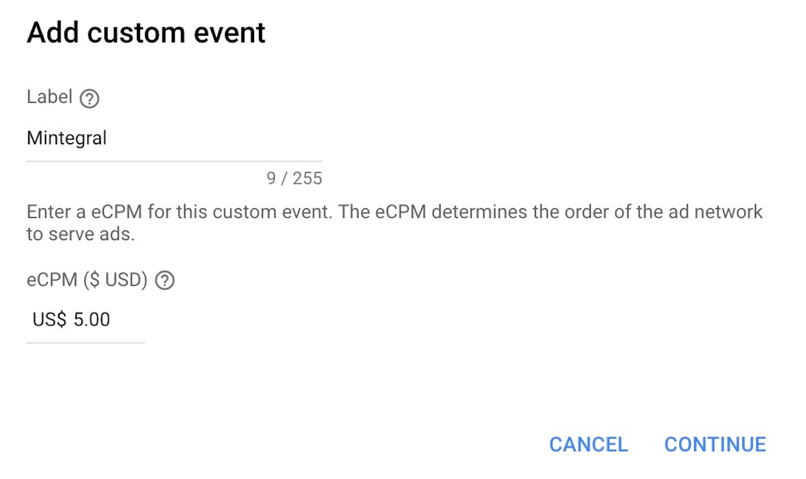

# iOS-Admob聚合文档


## 概要


本文档描述了如何通过Admob聚合Mintegral SDK，目前支持的广告形式有Native、Native Video、Interstitial Video、Rewarded Video。 


## 集成前准备

### 入门指南  

在将Mintegral SDK聚合到Admob之前，请按照以下说明操作：   
1.关于Admob SDK 集成说明，请参考[Admob SDK集成文档](https://developers.google.com/admob/ios/mediation)  
2.请仔细阅读[Mintegral iOS SDK集成文档](http://cdn-adn.rayjump.com/cdn-adn/v2/markdown_v2/index.html?file=sdk-m_sdk-ios&lang=cn)，其中介绍了如何创建AppKey、AppId、UnitId，以及MTGSDK的依赖库、链接器符号等必要集成步骤说明。

## 导入文件
### 导入SDK包
在[Mintegral iOS SDK集成文档](http://cdn-adn.rayjump.com/cdn-adn/v2/markdown_v2/index.html?file=sdk-m_sdk-ios&lang=cn)中获取SDK下载链接，并根据该文档的说明添加所需要的依赖库。   

我们提供两种方式去集成Mintegral Adapter:使用[Cocoapods](https://github.com/Mintegral-official/mintegral_admob_adapter_ios)和[手动添加方式](https://github.com/Mintegral-official/mintegral_admob_adapter_ios)。

### 导入Adapter文件 

#### 公共类               
(不管什么类型的广告，都需要此类)    

MintegralHelper.h   
MintegralHelper.m   
MintegralAdNetworkExtras.h         
MintegralAdNetworkExtras.m  

#### Banner类型广告所需文件 
MintegralCustomEventBannerAd.h      
MintegralCustomEventBannerAd.m


#### Native & NativeVideo类型广告所需文件    
MintegralCustomEventNativeAd.h 
MintegralCustomEventNativeAd.m       
MintegralMediatedNativeAppInstallAd.h        
MintegralMediatedNativeAppInstallAd.m        
MintegralMediatedNativeContentAd.h        
MintegralMediatedNativeContentAd.m        

#### New Rewarded Video类型广告所需文件   

（支持Google Mobile Ads SDK 8.0.0 及以上）

MintegralCustomEventRewardedVideo.h        
MintegralCustomEventRewardedVideo.m            


#### Interstitial Video类型广告所需文件      
MintegralCustomEventInterstitialVideo.h     
MintegralCustomEventInterstitialVideo.m      


## Admob后台配置指南

在Admob用户界面，完成如下操作即可设置Custom SDK Network，生效时间大概一小时左右。

### 创建Mediation
选择Mediation,然后点击Create Mediation Group.
    

### 添加Custom Event
1、进入创建好的Mediation Group，找到最下方Ad sources模块，点击Add Custom Event.    
2、填写"Lable",根据自己需要填写，不能修改。   
3、测试时，需要将默认的AdMob Network 广告源的优化关闭，并将Mintegral的eCPM设置为最高。   

   

### 配置Class Name和Parameter      
1、Class Name填写Mintegral Adapter ClassName.       
2、Parameter使用json格式，参数中不能含有空格，注意大小写，具体格式参考下方各广告形式说明。
    


### 欧盟GDPR版本须知

**注意**     
1、仅针对SDK v_3.8.0版本及以上版本，对应adapter 版本为V1.5.0。      
2、如果不上报用户信息，将会影响广告投放，可能会引起没有广告返回的情况，请知悉。        
3、对于欧盟用户，开发者集成时，建议在征得用户同意之前，先不要初始化SDK，以免引起不必要的麻烦。         

```objectivec
[[MTGSDK sharedInstance] setConsentStatus:YES];
```
YES为允许，FALSE为禁止。


## 测试
您在官网注册的id所获取的广告均为Mintegral的实际投放的广告，我们没有提供测试模式。最快的测试启用方法是使用以下提供的测试unitid。这些测试unitid未与您的 mintegral 帐号相关联，因此在使用这些测试unitid时，您的帐号不会产生无效流量。我们强烈建议您在发布应用程序之前，使用测试unitid进行测试，确保正确集成。

**Banner**
```java
{
	"appId":"118692",
	"appKey":"7c22942b749fe6a6e361b675e96b3ee9",
	"unitId":"146898", 
	"placementId":"138804"   
}
```

**Native**
```java
{
	"appId":"118692",
	"appKey":"7c22942b749fe6a6e361b675e96b3ee9",
	"unitId":"146891",  
	"placementId":"138797"   
}
```

**Reward Video**
```java
{
	"appId":"118692",
	"appKey":"7c22942b749fe6a6e361b675e96b3ee9",
	"unitId":"146892",
	"rewardId":"1" ,  
	"placementId":"138798"  
}
```

**Interstitial Video**
```java
{
	"appId":"118692",
	"appKey":"7c22942b749fe6a6e361b675e96b3ee9",
	"unitId":"146894",  
	"placementId":"138800"    
}
```
将测试unitid的json填写到admob的custom event data处。

**测试后上线前，请确保使用您自己的Mintegral帐户中的ad unitid替换掉测试unitid。** 

## Banner 类型广告
**Banner 最佳大小建议320\*50**         
**unitId需要在Mintegral 后台申请Banner广告样式ID**      
1、在Custom Event Class的部分，输入MintegralCustomEventBannerAd       
2、在Custom Event Class Data部分，输入appId、appKey、unitId、placementId,例如：      

```objectivec
{
	"appId": "xxxx",
	"appKey": "xxxx",
	"unitId": "xxx",
	"placementId": "xxx"    
}
```

## Native

填写 'Class Name': MintegralCustomEventNativeAd       
填写 'parameter' , 示例：

```objectivec
{
	"appId": "xxxx",
	"appKey": "xxxx",
	"unitId": "xxx",
	"adCategory": 0,
	"templateType":2,
	"autoCacheImage":0,
	"placementId": "xxx"   
}
```

**以下参数是可选:**    
1、AdCategory:

```objectivec
typedef NS_ENUM(NSInteger, MTGAdCategory) {
    MTGAD_CATEGORY_ALL  = 0,（默认）
    MTGAD_CATEGORY_GAME = 1,
    MTGAD_CATEGORY_APP  = 2,

};
```

2、AutoCacheImage:（是否自动缓存图片，默认 NO）          


## Native Video    


填写 'Class Name': MintegralCustomEventNativeAd    
填写 'parameter' , 示例：

```objectivec
{
	"appId": "xxxx",
	"appKey": "xxxx",
	"unitId": "xxxx",
	"video_enabled": "0",
	"placementId": "xxx"   
}
```
**以下参数为可选参数：**

video_enabled:（控制是否支持NativeVideo的参数，默认为0）    
 0: 不支持 1: 支持


## New Rewarded Video 

（支持Google Mobile Ads SDK 8.0.0 及以上）

填写 'Class Name': MintegralCustomEventRewardedVideo   
填写 'parameter' , 示例：

```objectivec
{
	"appId": "xxxx",
	"appKey": "xxxx",
	"unitId": "xxxx",
	"rewardId": "1",
	"placementId": "xxx"   
}
```


##  Interstitial Video

填写 'Class Name': MintegralCustomEventNewInterstitial    
填写 'parameter' , 示例：

```objectivec
{
	"appId": "xxxx",
	"appKey": "xxxx",
	"unitId": "xxxx",
	"placementId": "xxx"   
	
}
```

##  ChangeLog

版本号 | ChangeLog | 发布时间
------|-----------|------
7.1.7.0 | 基于iOS MTGSDK 7.1.7版本，支持Admob 9.0.0以上版本 | 2022.07.01
7.1.0.0 | 基于iOS MTGSDK 7.1.0版本，适配Admob 9.0.0版本接口变化 | 2022.04.29 
6.7.6.0 | 基于iOS MTGSDK 6.7.6版本，适配Admob 8.0.0版本接口变化 | 2021.02.24 
**6.5.0.0**|基于iOS MTGSDK 6.5.0版本，提供了对 iOS14 SKAdNetwork的支持|2020.09.04
1.8.0 |基于iOS 5.7.1 sdk,支持banner | 2019.09.19
1.7.0 |基于iOS 4.0.0 sdk，替换Mintegral包名；|2018.07.18
1.6.0 |基于iOS 3.8.0 sdk，InterstitialVideo 内部逻辑替换|2018.05.31
1.5.0	|基于iOS 3.8.0 sdk，支持GDPR功能	|2018.05.09
1.4.0 | 基于Google最新的Admob SDK 7.27.0版本，支持NativeVideo广告| 2018.01.12
1.3.0 | 支持Google最新的Admob SDK 7.27.0版本| 2017.12.29
1.2.4 | 支持 InterstitialVideo 广告，使用MVRewardVideo而不是MVSDKInterstitial | 2017.11.11
1.2.2 | 1.修改了Rewarded Video Adapter的名字，由"MobvistaAdapter"改为"MobvistaCustomEventRewardedVideo"<br/> 2.适用于 iOS 7, 8, 9, 10<br/> 3.适用于 Mintegral SDK v1.6.0 及以上版本| 2017.09.05
1.2.0 | 1.支持 Interstitial 样式广告<br/> 2.add CHANGELOG.md file <br/> 3.适用于 iOS 7, 8, 9, 10<br/> 4.适用于 Mintegral SDK v1.6.0 及以上版本| 2017.06.15
1.1.0 | 1.支持 Native Advance 样式广告<br/> 2.适用于 iOS 7, 8, 9, 10<br/> 3.适用于 Mintegral SDK v1.6.0 及以上版本  | 2017.04.24
1.0.0 | 1.支持 Rewarded Video 样式广告<br/> 2.适用于 iOS 7, 8, 9, 10<br/> 3.适用于 Mintegral SDK v1.6.0 及以上版本| 2017.03.22

