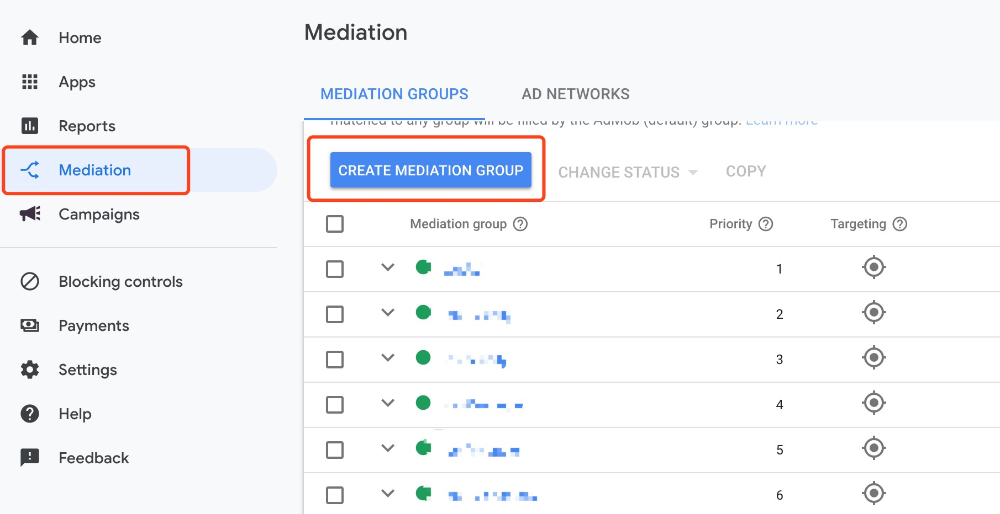
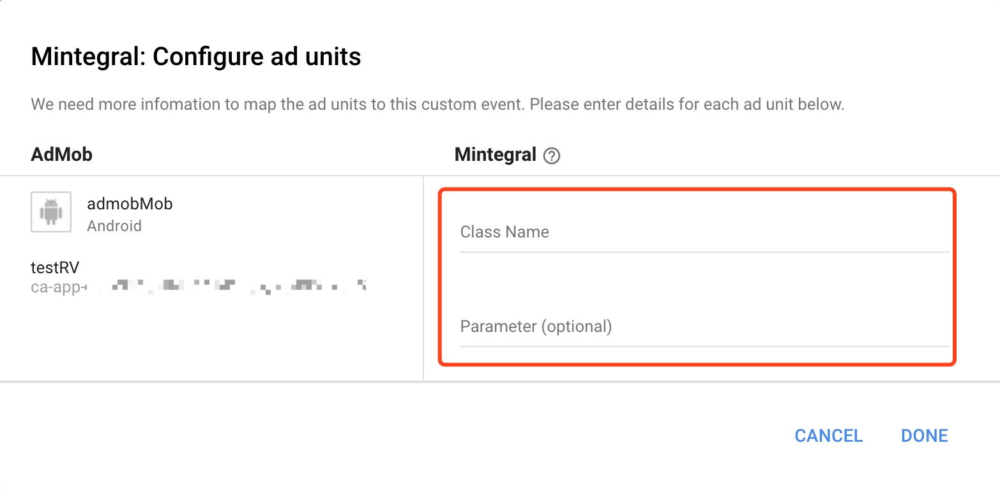

## Overview
The following instructions apply to publishers looking to mediate their Admob inventory to the Mintegral ad platform.
This document provides instructions on how to integrate the Mintegral SDK via Admob. The Mintegral SDK provides ad formats including Native,Native Video, Interstitial Video and Rewarded Video.

## Preparation
### Get Started
Before integrating the Mintegral SDK via Admob, please follow the instructions below:    

1. For Admob SDK integration instructions, please refer to Admob SDK integration documentation [Admob SDK integrate documentation](https://firebase.google.com/docs/admob/ios/quick-start).   
2. Please read [Mintegral's iOS SDK Integration Document](http://cdn-adn.rayjump.com/cdn-adn/v2/markdown_v2/index.html?file=sdk-m_sdk-ios&lang=en). there introduces how to create AppKey, AppId, UnitId, and various ad forms need to be imported which package MTGSDK libraries, Linker Flags and other necessary integration steps.

## Import The Mintegral SDK      
Get the SDK download link from [Mintegral's iOS SDK Integration Document](http://cdn-adn.rayjump.com/cdn-adn/v2/markdown_v2/index.html?file=sdk-m_sdk-ios&lang=en). Add the required SDK packages instructed in the document.

There are two ways to add Mintegral iOS-SDK to your Xcode project: using [Cocoapods](https://github.com/Mintegral-official/mintegral_admob_adapter_ios) or [manual integration](https://github.com/Mintegral-official/mintegral_admob_adapter_ios).

## Import The Admob Adapter Files  

**Common Class**  
(must import this class no matter what type of ads you choose)    

MintegralHelper.h    
MintegralHelper.m
MintegralAdNetworkExtras.h    
MintegralAdNetworkExtras.m     

**Banner**     
MintegralCustomEventBannerAd.h             
MintegralCustomEventBannerAd.m  

**Native、NativeVideo**  

MintegralCustomEventNativeAd.h    
MintegralCustomEventNativeAd.m    
MintegralMediatedNativeAppInstallAd.h    
MintegralMediatedNativeAppInstallAd.m    
MintegralMediatedNativeContentAd.h    
MintegralMediatedNativeContentAd.m    

**New Rewarded Video**    

(Google Mobile Ads SDK 8.0.0 or higher) 

MintegralCustomEventRewardedVideo.h    
MintegralCustomEventRewardedVideo.m   

**Interstitial Video**   

MintegralCustomEventInterstitialVideo.h       
MintegralCustomEventInterstitialVideo.m


## AdMob Configuration Guide
In the Admob dashboard, complete the following operations to set up the Custom SDK Network, which takes about an hour.  
### Create Mediation Group
Select Mediation and click Create Mediation Group.
         

### Add Custom Event
1. Go to the Mediation group you just created and click Add custom event in the ad sources table.
2. Fill in a label for the event. 
3. When testing, you need to turn off the default optimizing setting for AdMob's ad source. Simultaneously, set Mintegral's eCPM as the highest so that it is at the top of the mediation chain.   

    
### Configure Class Name And Parameter
1. For the Class Name, Please enter Mintegral Adapter Class Name. 
2. The parameters are in Json format. Please keep in mind that the parameters cannot contain spaces and is case sensitive. The parameters for each ad format can be found in the descriptions following this section.

     

## Instrucition for GDPR Implementation

1. This instruction is only for SDK version v_3.8.0 and above, and the corresponding adapter version is V1.5.0.         

2. If the users reject to authorize Mintegral SDK to collect information, it will have impacts on delivering ads or might result as no ads returned.

3. For European users, you should get user's consent before initing the Mintegral SDK to avoid other conflicts.    

```objectivec
[[MTGSDK sharedInstance] setConsentStatus:YES];
```
YES means allowed, FALSE means prohibited.   

## Test
Before you publish your app with Mintegral, we strongly recommend that you test your Mintegral integrations to ensure they are operating properly.
The quickest way to enable testing is to use Mintegral-provided test ad units. These ad units are not associated with your Mintegral account, so there's no risk of your account generating invalid traffic when using these ad units. Here are test ad units that point to specific test creatives for each format:

**Banner**
```java
{
	"appId":"118692",
	"appKey":"7c22942b749fe6a6e361b675e96b3ee9",
	"unitId":"146898", 
	"placementId":"138804"    
}
```

**Native**
```java
{
	"appId":"118692",
	"appKey":"7c22942b749fe6a6e361b675e96b3ee9",
	"unitId":"146891",  
	"placementId":"138797"    
}
```

**Reward Video**
```java
{
	"appId":"118692",
	"appKey":"7c22942b749fe6a6e361b675e96b3ee9",
	"unitId":"146892",
	"rewardId":"1",   
	"placementId":"138798"  
}
```

**Interstitial Video**
```java
{
	"appId":"118692",
	"appKey":"7c22942b749fe6a6e361b675e96b3ee9",
	"unitId":"146894",    
	"placementId":"138800" 
}
```

**After testing, be sure to replace the Mintegral test ad units with the production ad unit IDs from your own Mintegral account.**

## Banner
**Best size recommendation 320\*50**  
**UnitId needs to apply for a Banner format id in the dashboard of Mintegral**     
1.Enter the Custom Event Class: **MintegralCustomEventBannerAd**    
2.Enter the appId , appKey and unitId,placementId in the Custom Event Class Data field corresponding to your ad unit. For example:    
```objectivec
{
 "appId": "xxxx",
 "appKey": "xxxx",
 "unitId": "xxx",   
 "placementId":"xxx"    
}
```

## Native
Fill 'Class Name' with: **MintegralCustomEventNativeAd**   
To fill 'parameter' , for example:   

```java
{
 "appId": "xxxx",
 "appKey": "xxxx",
 "unitId": "xxx",
 "adCategory": 0,
 "templateType":2,
 "autoCacheImage":0,
 "placementId":"xxx" 
}
```

**The following parameters are optional parameters.**

1.AdCategory: Controls the advertising apps category, for example game, app, and all. Default setting is MTGAD_CATEGORY_ALL.


```java
typedef NS_ENUM(NSInteger, MTGAdCategory) {
    MTGAD_CATEGORY_ALL  = 0,
    MTGAD_CATEGORY_GAME = 1,
    MTGAD_CATEGORY_APP  = 2,

};
```

1. AutoCacheImage: Controls whether to cache the ads images automatically, default NO.    

## Native Video  

Fill 'Class Name': **MintegralCustomEventNativeAd**    
To fill 'parameter', for example:

```java
{
 "appId": "xxxx",
 "appKey": "xxxx",
 "unitId": "xxxx",
 "video_enabled": "0",
 "placementId"："xxx" 
}
```
**The following parameter is optional:**   
video_enabled:（controls whether use NativeVideoor not,default 0）      
0:not support 1:support

## New Rewarded Video

(Google Mobile Ads SDK 8.0.0 or higher) 

Fill 'Class Name' with: **MintegralCustomEventRewardedVideo**       
To fill 'parameter' , for example:   

```java
{
 "appId": "xxxx",
 "appKey": "xxxx",
 "unitId": "xxxx",
 "rewardId": "1",
 "placementId":"xxx" 
}
```

## Interstitial Video
Fill 'Class Name' with: **MintegralCustomEventNewInterstitial**   
To fill 'parameter' , for example:   

```java
{
 "appId": "xxxx",
 "appKey": "xxxx",
 "unitId": "xxxx" ,
 "placementId":"xxx" 
}
```

## ChangeLog
| Version   | ChangeLog   | Date   |
|:----|:----|:----|
| 7.1.7.0 | Base on MTGSDK 7.1.7, Based on iOS MTGSDK 7.1.7, supports Admob 9.0.0 and above | July 01,2022 |
| 7.1.0.0 | Base on MTGSDK 7.1.0, support Google's latest version of Admob SDK 9.0.0 | April 28,2022 |
| 6.7.6.0 | Base on MTGSDK 6.7.6, support Google's latest version of Admob SDK 8.0.0 | Feb 24,2021 |
|**6.5.0.0**|Update to MTG iOS SDK 6.5.0 with iOS 14 and SKAdNetwork support|Sep 04,2020|
| 1.8.0    |  support Banner ,based on iOS 5.7.1 sdk; | Sep 19,2019 |
| 1.7.0    |  Replace the Mintegral package name ,based on iOS 4.0.0 sdk;   | Jul 18,2018   |
| 1.6.0    |  Support Interstitial Video    | May 09,2018   |
| 1.5.0    |  Supports GDPR function based on iOS 3.8.0 sdk   | May 31,2018   |
| 1.4.0    |  Base on Google's latest version of Admob SDK 7.27.0,support NativeVideo Ad   |  Jan 12,2018   |
| 1.3.0    |  Support Google's latest version of Admob SDK 7.27.0   |  Dec 29,2017   |
| 1.2.4    |  supports InterstitialVideo Ad via Admob Interstitial CustomEvent, and use MVRewardVideo SDK     | Nov 11,2017   |
| 1.2.2    |  1.changed the classname of RewardVideo from "MobvistaAdapter" to "MobvistaCustomEventRewardedVideo"<br/> 2.available on iOS 7, 8, 9, and 10<br/> 3.Using Mintegral SDK v1.6.0 and above   |  Sep 05,2017   |
| 1.2.0    |  1.supports Interstitial Ad<br/> 2.add CHANGELOG.md file <br/> 3.available on iOS 7, 8, 9, and 10<br/> 4.Using Mintegral SDK v1.6.0 and above   |  Jun 15,2017   |
| 1.1.0    |  1.supports Native Advance Ad<br/> 2.available on iOS 7, 8, 9, and 10<br/> 3.Using Mintegral SDK v1.6.0 and above     |  Apr 24,2017   |
| 1.0.0    |  1.supports RewardVideo Ad<br/> 2.available on iOS 7, 8, 9, and 10<br/> 3.Using Mintegral SDK v1.6.0 and above   |  Mar 22,2017   |


