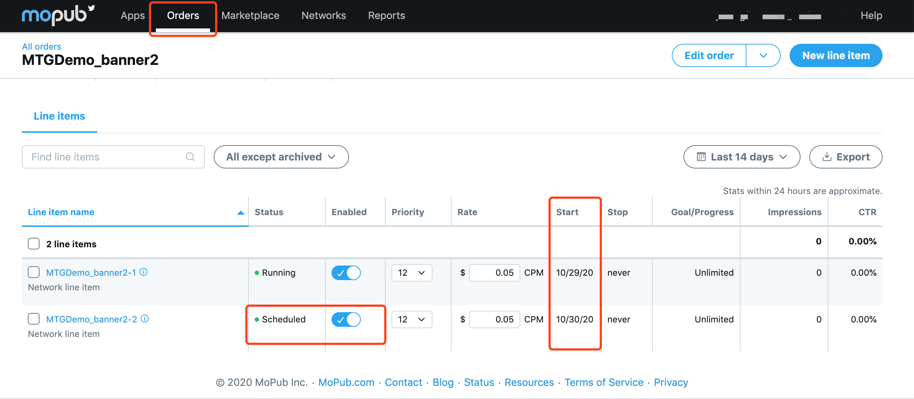

# iOS-Mopub聚合文档


## 概要


本文档描述了如何通过MoPub聚合Mintegral SDK，目前支持的广告形式有Banner、Native、NativeVideo、InterstitialVideo、Rewarded Video。 

## 集成前准备

### 入门指南

在将Mintegral SDK聚合到Mopub之前，请按照以下说明操作：   
1、关于MoPub SDK 集成说明，请参考[Mopub SDK集成文档](https://developers.mopub.com/docs/ios/)。    
2、请仔细阅读[Mintegral iOS SDK集成文档](https://dev.mintegral.com/doc/index.html?file=sdk-m_sdk-ios&lang=cn)，其中介绍了如何创建AppKey、AppId、UnitId，以及MTGSDK的依赖库、链接器符号等必要集成步骤说明。               


### 导入SDK包
我们提供两种方式获取 Mintegral iOS-SDK:          
使用[Cocoapods](https://github.com/Mintegral-official/MintegralAdSDK-iOS-new)或[手动添加方式](https://github.com/Mintegral-official/MintegralAdSDK-iOS-new/releases)        
您可以在[Mintegral iOS SDK集成文档](http://cdn-adn.rayjump.com/cdn-adn/v2/markdown_v2/index.html?file=sdk-m_sdk-ios&lang=cn)中查看MTGSDK所需要添加的依赖库。   

### 导入Adapter文件 

<font color=red>**注：如果使用mopub 5.15.0及以上版本，必须更新Adapter到6.6.8.2及以上，否则会有isready状态判断有误的问题，可能会影响您的收益**</font>

我们提供两种方式获取该 Adapter :          
1、Cocoapods

```objective-c
platform :ios, '10.0'
  
pod 'MintegralAdSDKAdapterForMopub'
```

2、[手动下载Adapter](https://github.com/MTGSDK/mintegral_mopub_adapter_ios)，添加至您的项目


## 后台配置

选择order 或 segment其中一种配置方式。mopub将不再支持segment，新产品建议使用order进行配置。

### Orders配置

您也可以从[Mopub Manage-Orders](https://developers.mopub.com/publishers/ui/manage-orders/)中了解mopub order更多内容。         

1、创建order，或沿用之前的order        
2、New line item       
3、选择Network时，选择Custom SDK Network         
  
4、配置Custom event class及Custom event data.下文会介绍配置规则。         
如：   


### Segment配置
在MoPub用户界面，完成如下操作即可设置Custom SDK Network：   

1、选择Networks一栏，然后点击New network。     
     
      
2、选择Custom SDK network，之后进入network创建界面。     
     

3、找到要实现第三方Network的Mopub unit，然后将Custom Event Class和Data粘贴到其文本框中。下文会介绍配置规则。       
 


## Custom Event Class Name And Data

### Custom Event Class

填写Adapter的类名

**Banner**               
MintegralBannerCustomEvent       

**Native & NativeVideo**

MintegralNativeCustomEvent

**注意：**

Native 集成需要添加如下代码：

#### Renderer中添加Mintegral 

如果您集成Native，需要在MPStaticNativeAdRenderer类中添加该类名“MintegralNativeCustomEvent”，  
如您集成NativeVideo，需要在MOPUBNativeVideoAdRenderer类中添加该类名“MintegralNativeCustomEvent”:   

```objectivec
+ (MPNativeAdRendererConfiguration *)rendererConfigurationWithRendererSettings:(id<MPNativeAdRendererSettings>)rendererSettings
{
    MPNativeAdRendererConfiguration *config = [[MPNativeAdRendererConfiguration alloc] init];
    config.rendererClass = [self class];
    config.rendererSettings = rendererSettings;
    config.supportedCustomEvents = @[@"MintegralNativeCustomEvent"];

    return config;
}
```

**Interstitial Video**

MintegralInterstitialCustomEvent

**Reward Video**

MintegralRewardedVideoCustomEvent


### Custom Event Class Data

使用json格式，参数中不能含有空格，注意大小写，各个广告形式都可以使用如下通用格式，将其中的"xxx"替换为您在MTG后台申请的广告ID：

```json
{"appId":"xxx","appKey":"xxx","unitId":"xxx","placementId":"xxx"}
```

如：

```json
{"appId":"118692","appKey":"7c22942b749fe6a6e361b675e96b3ee9","unitId":"146892","placementId":"138798"
```


## 注意事项和常见问题
1. 确保你的工程里只有一份Mintegral adapter，请勿重复引入；

2. 不要在Adapter内部去调用Mintegral SDK内部的方法，只需要调用Mintegral SDK所提供的API即可。

3. 确保app客户端下发的App ID/Key、 mopub后台填写的App ID/Key、和你在Mintegral 申请的App ID/Key是一致的。

4. 确保你在Mopub后台关于Custom Event Class Name and Data的配置是正确的。


    1) Custom Event Class类名 需要与广告类型正确对应。
    
    2) 如果使用自定义的Adapter类名，请确保在Mopub后台填写的Adapter路径和文件名称正确
    
    3) <font color='red'> Custom Event Data需要使用json格式、不能有空格、要区分大小写、字符标点全英文、数值要与Mintegral后台的AppID/AppKey/UnitID/PlacementID一致。 </font>


###常见error信息和解决方案：

1、返回error信息： EXCEPTION_SERVICE_REQUEST_OS_VERSION_REQUIRED。

---- 解决方案：请参考和检查Mopub上关于 GDPR设置的指导，并打开GDPR开关。

2、ios开发者使用自定义的Adapter类名并检查了mopub后台的配置正确，但返回error信息：could not find adapter。

---- 解决方案：IOS开发者如果使用自定义Adapter类名，更改Adapter类名的时候不能只从文件目录下去改名，必须在程序中Refactor-rename。否则不生效。


## Mopub自测帮助

在看不到MTG广告，且MTG后台无请求数据的情况下，您可以按照如下步骤进行检查。Debug或抓包查看。

###抓包：
请找到"https://ads.mopub.com/m/ad" 域名，看"ad-responses"中是否有x-custom-event-class-data和x-custom-event-class-name 参数是您在mopub后台配置为MTG配置的。        
有的话请看Log输出可以快速定位，或根据如下提示进行检查； 没有的话参考下方'后台配置'进行检查。


      
1、看抓取的"x-custom-event-class-name"和项目中Adapter路径是否一致；       
2、检查json格式是否正确（参数中不能有空格和多余标点符号，id要和MTG后台申请的id对应）    


###Log输出
从[mopub文档](https://developers.mopub.com/publishers/android/test/)中获取打开debug开关方式。


```java
Android：
final SdkConfiguration.Builder configBuilder = new SdkConfiguration.Builder("YOUR_AD_UNIT_ID");

   if (BuildConfig.DEBUG) {
      configBuilder.withLogLevel(DEBUG);
   } else {
      configBuilder.withLogLevel(INFO);
   }

MoPub.initializeSdk(this, configBuilder.build(), initSdkListener());
```
```java
iOS：
    MPMoPubConfiguration * sdkConfig = [[MPMoPubConfiguration alloc] initWithAdUnitIdForAppInitialization: @"YOUR_AD_UNIT_ID"];

    sdkConfig.loggingLevel = MPBLogLevelInfo;

    [[MoPub sharedInstance] initializeSdkWithConfiguration:sdkConfig completion:^{
        NSLog(@"SDK initialization complete");
    }];
```


####Log

一、直接看输出log中 MoPub: [com.mopub.network.MultiAdResponse][parseSingleAdResponse] Ad server responded with:
中是否包含x-custom-event-class-data 及 x-custom-event-class-name 配置。

有的话请检查该类名是否和项目中的Adapter路径匹配；没有的话参考下方'后台配置'进行检查。   
   
二、 看log 错误输出：              

1、1）  
如有ClassNotFoundException：类路径    
     
a）代表您的项目中没有导入Adapter或打包时遗失了（Unity集成要将包放到 Plugin--> Android 路径下），请检查。     
b）代表您项目中的Adapter类路径与配置不符。请检查。        

2）
若仅提醒如下错误，请根据changelog检查Mopub版本与Adapter版本是否兼容。         


2、
[com.mopub.network.MultiAdResponse][<init>] Ad Log - Invalid response item. Error: BAD_HEADER_DATA      
为参数格式配置错误，请检查后台Custom event data配置json是否符合标准。      

3、      
[com.mintegral.adapter.banner.banneradapter.MintegralXBanner][failAdapter][345] Adapter MintegralXBanner failed to load ad: (10,000) Third-party network failed to provide an ad.
10-28 17:21:30.265 28830-28830/com.mintegral.mintegralmopubdemo I/MoPub: [com.mintegral.adapter.banner.banneradapter.MintegralXBanner][failAdapter][345] Adapter MintegralXBanner Log - EXCEPTION_APP_NOT_FOUND       
       
如果有"-party network failed to provide an ad." 错误提示，为数据填写错误，请根据该[文档](https://dev.mintegral.com/doc/index.html?file=sdk-m_sdk-android&lang=cn)找到对应error的注解并检查。 


####后台配置
如果请求中没有MTG的x-custom-event-class-data和x-custom-event-class-name参数配置。请按如下步骤进行检查

1. 找到您项目中的unitid     
log或抓包找到请求中的id字段
[com.mopub.network.AdLoader][fetchAd] Ad requesting from AdServer: https://ads.mopub.com/m/ad         
mopub后台可以在App ----> unitid 处点击View code integration    
      

2. 下拉该界面查看是否有ad source配置。     
**为了保障测试顺利，请将MTG顺位调整到第一优先级（配置ecpm为最高)**    
   
如果已经创建了，没有显示，请到order下的line item中检查status是否是scheduled, 是的话编辑line item 更改配置的生效时间
         
    
 

3. 如果您使用的是Network+segment配置，请参考[MTG-Mopub官方文档](https://dev.mintegral.com/doc/index.html?file=sdk-m_sdk_mopub-android&lang=cn)检查配置。

4. 如果使用order，还没有创建order或line item请根据该指引创建。
您也可以从[Mopub Manage-Orders](https://developers.mopub.com/publishers/ui/manage-orders/)中了解mopub order更多内容。         

    1）创建order，或沿用之前的order        
    2）New line item       
    3）Type & priority 选择Network line item。选择Network时，选择Custom SDK Network             
  
    4）配置Custom event class及Custom event data.

Custom Event Class 填写规则在 Android 及 iOS 平台有所不同，Android 为 Adapter 类全路径，iOS 为 Adapter 类名。      
请根据您集成的广告样式在下文中找到对应的类名或全路径填写在mopub后台。           

Data使用json格式，参数中不能含有空格和其他符号，注意大小写，Android 及 iOS 各个广告形式都可以使用如下通用格式，将其中的"xxx"替换为您在MTG后台申请的广告ID：

```java    
{"appId":"xxx","appKey":"xxx","unitId":"xxx","placementId":"xxx"}
如：
{"appId":"118692","appKey":"7c22942b749fe6a6e361b675e96b3ee9","unitId":"146892","placementId":"138798"}
```

5.检查该line item 配置是否target到您项目中请求的unitid     
创建时， 在Ad unit targeting中勾选您的unitid。            
      
检查时，依次点击order --> 您已创建的line item，下拉可以看到line item target到了哪个unitid       
 


##  ChangeLog

版本号 | ChangeLog | 发布时间
------|-----------|------
6.6.8.2 | 适配Mopub 5.15.0版本解决isready状态判断问题 | 
6.6.8.1 | 修复pod拉取Adapter失败问题 | 2020.12.01 
6.6.8.0 | 基于MTGSDK 6.8.0，Adapter 适配三种SDK | 2020.11.16 
6.5.0.4 | 基于MTGSDK 6.5.0，修改Adapter命名为原官聚包名 | 2020.09.07 
6.5.0.3|基于MTGSDK 6.5.0，修改Adapter命名，支持开发者自动生成自定义Adapter| 2020.09.07
6.5.0.2|1.修改了Adapter命名；2.基于MTGSDK 6.5.0，适配iOS 14|2020.09.04
1.7.0|兼容iOS SDK至5.3.3,新增mopub-banner广告样式|2019.05.14
1.6.0 |基于Mintegral iOS 4.0.0 SDK及以后版本；替换Mintegral包名|2018.07.12
1.5.0 | 基于iOS 3.8.0 sdk，支持 官方 GDPR 功能，替换内部IV逻辑，请求sdk内部IV广告形式| 2018.05.31
1.4.0 | 基于ios 3.8.0 sdk，支持GDPR功能| 2018.5.09
1.3.6 | 支持 InterstitialVideo 广告，使用MVRewardVideo而不是MVSDKInterstitial | 2017.11.09
1.3.2 | 修复与mopub展示数据差异问题| 2017.10.19
1.3.1 | 修改了Rewarded Video的Adapter，与其他家Network保持一致，视频下载完毕以后才通知开发者LoadSuccess | 2017.09.11
1.3.0 | Native Ads 支持 NativeVideo Ad | 2017.07.18
1.2.0 | 为提供性能做了一些优化，并添加了CHANGELOG.md文件| 2017.06.15
1.1.2 | Rewarded Video bug修复| 2017.05.15
1.1.1 | 为兼容 Mopub-UnityPlugin，做了一定修改 | 2017.04.06
1.1.0 | 支持 Rewarded Video，支持ATS | 2017.03.24
1.0.0 | 支持 NativeAd | 2016.12.19

 