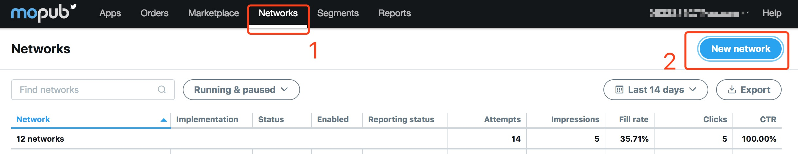
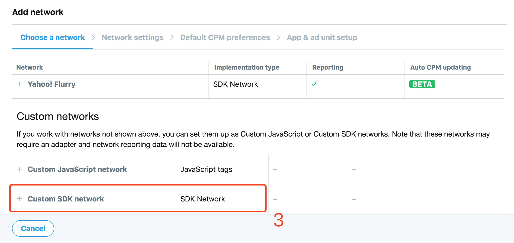
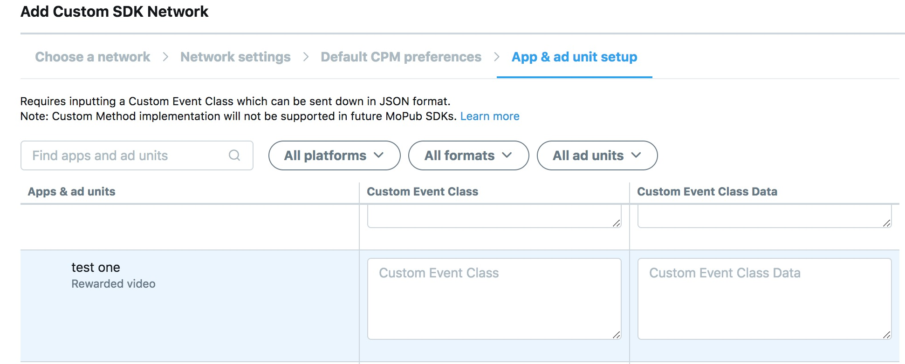
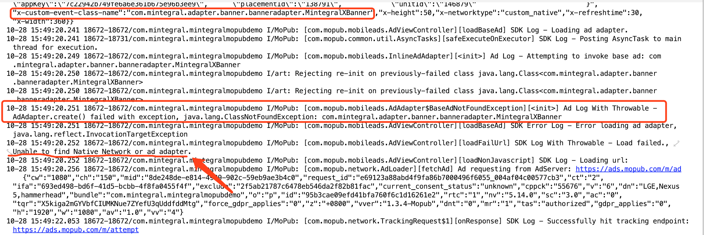
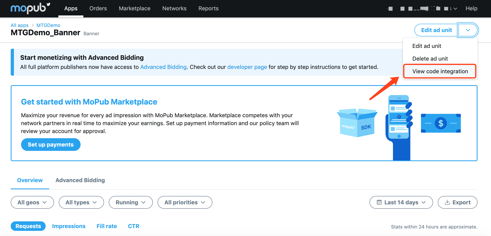
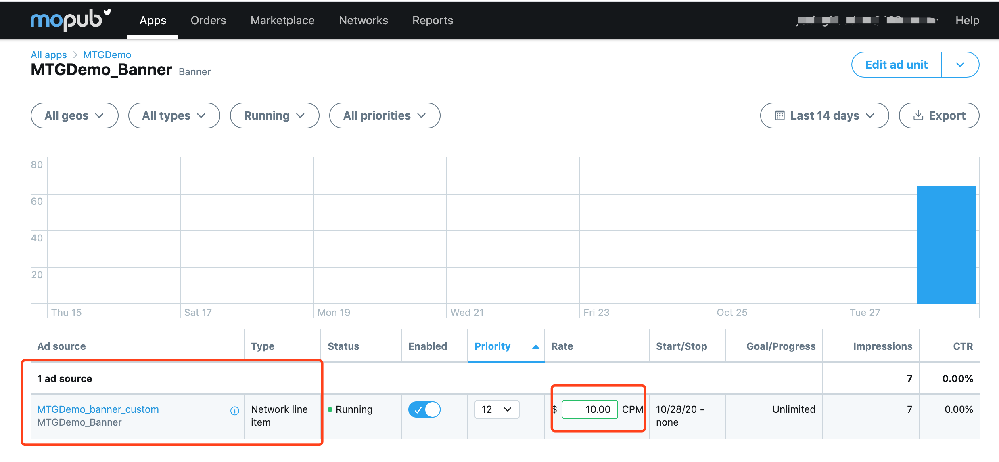
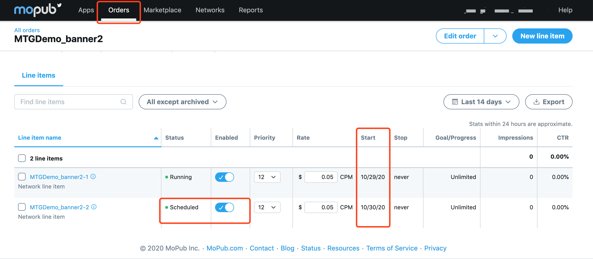
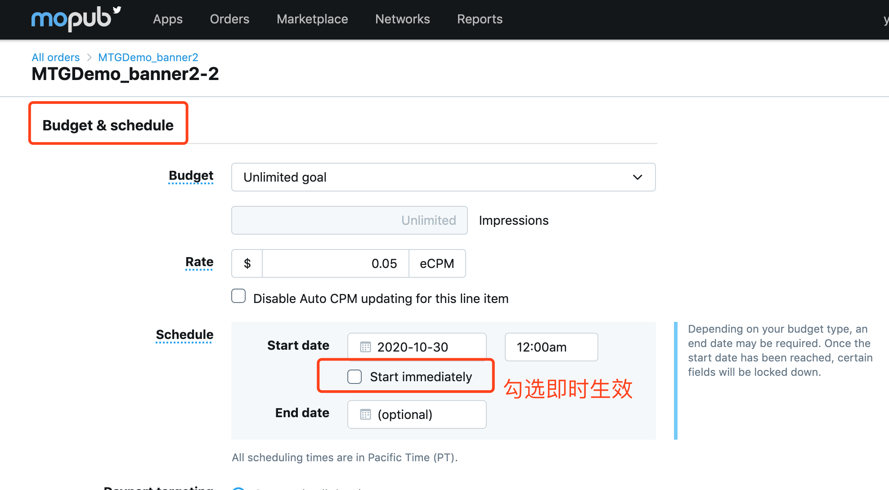
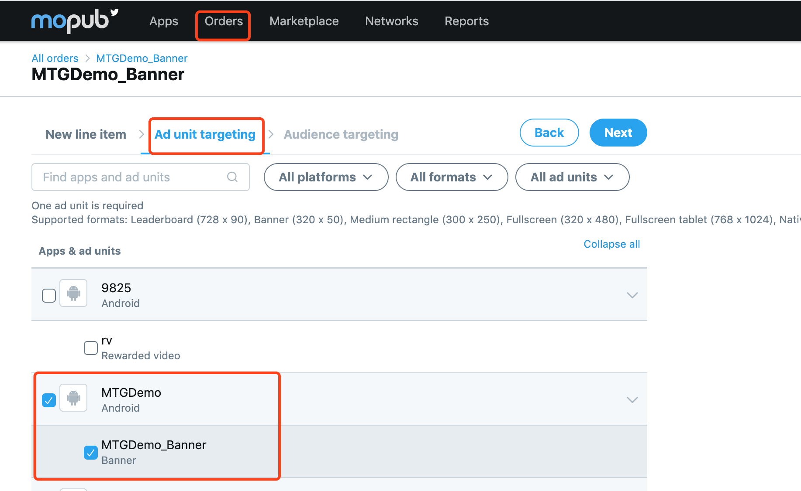
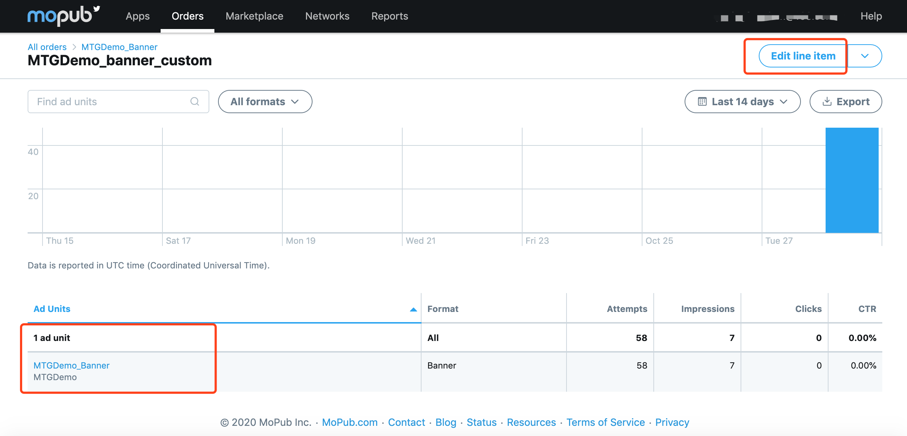

## Overview
The following instructions apply to publishers looking to mediate their mopub inventory to the Mintegral ad platform.
This document provides instructions on how to integrate the Mintegral SDK via mopub. The Mintegral SDK provides ad formats including Banner,Native,Native Video, Interstitial Video and Rewarded Video.

## Preparation
### Getting Started
Before integrating the Mintegral SDK via mopub, please follow the instructions below:    

1. For mopub SDK integration instructions, please refer to mopub SDK integration documentation [mopub SDK integrate documentation](https://developers.mopub.com/docs/ios/).   
2. Please read [Mintegral's iOS SDK Integration Document](http://cdn-adn.rayjump.com/cdn-adn/v2/markdown_v2/index.html?file=sdk-m_sdk-ios&lang=en). there introduces how to create AppKey, AppId, UnitId, and various ad forms need to be imported which package MTGSDK libraries, Linker Flags and other necessary integration steps.

### Integrate MTGSDK 

There are two ways to add Mintegral iOS-SDK to your Xcode project: using [Cocoapods](https://github.com/Mintegral-official/MintegralAdSDK-iOS-new) or [manual integration](https://github.com/Mintegral-official/MintegralAdSDK-iOS-new/releases).

You can view what MTGSDK needs in [Mintegral iOS SDK Integration Document](http://cdn-adn.rayjump.com/cdn-adn/v2/markdown_v2/index.html?file=sdk-m_sdk-ios&lang=cn) dependent libraries added.

### Import The Adapter Files  

<font color=red>Note: If you use mopub 5.15.0 and above, you must update the Adapter to 6.6.8.2 and above, otherwise there will be a problem of incorrect judgment of the isready status, which may affect your income</font>

We provide two ways to obtain the Adapter:
1. Cocoapods

```objective-c
platform :ios, '10.0'
  
pod'MintegralAdSDKAdapterForMopub'
```

2. [Manual download Adapter](https://github.com/MTGSDK/mintegral_mopub_adapter_ios), add it to your project

## Custom Event Setting
Choose either order or segment configuration method.  Mopub will no longer support segment, new products recommend using order. To specify a custom event using the mopub.com webpage.
### Orders
See [Mopub Manage-Orders](https://developers.mopub.com/publishers/ui/manage-orders/) to learn more.       
Please complete the following steps:  

1. Create order, or use the previous order.
2. New line item
3. When selecting Network, select Custom SDK Network.     


4. Configure Custom event class and Custom event data.   The configuration rules will be introduced below.
Such as:   


### Segment

1.Go to the Networks tab, then click New network.  

  

2.Select Custom SDK network and enter the network creation interface. 

   

3.Configure Custom event class and Custom event data.   The configuration rules will be introduced below.

  


## Custom Event Class Name And Data

### Custom Event Class Name

**Banner**               
MintegralBannerCustomEvent       

**Native & NativeVideo**

<font color=red>**If you want to integrate Native, the following code needs to be added to your project**</font>

**Add Mintegral to Renderer**

If you integrate native ads, you need to add the class name "MintegralNativeCustomEvent" to the MPStaticNativeAdRenderer class.   
If you integrate NativeVideo, you need to add the class name "MintegralNativeCustomEvent" to the MOPUBNativeVideoAdRenderer class:    

```java
+ (MPNativeAdRendererConfiguration *)rendererConfigurationWithRendererSettings:(id<MPNativeAdRendererSettings>)rendererSettings
{
    MPNativeAdRendererConfiguration *config = [[MPNativeAdRendererConfiguration alloc] init];
    config.rendererClass = [self class];
    config.rendererSettings = rendererSettings;
    config.supportedCustomEvents = @[@"MintegralNativeCustomEvent"];

    return config;
}
```


MintegralNativeCustomEvent

**Interstitial Video**

MintegralInterstitialCustomEvent

**Reward Video**

MintegralRewardedVideoCustomEvent

### Custom Event Class Name Data

Custom Event Data uses the json format, and the parameters cannot contain spaces. Pay attention to the capitalization.  Replace "xxx" with the ADs ID you applied for in the MTG dashboard:

```json
{"appId":"xxx","appKey":"xxx","unitId":"xxx","placementId":"xxx"}
```

e.g：

```json
{"appId":"118692","appKey":"7c22942b749fe6a6e361b675e96b3ee9","unitId":"146892","placementId":"138798"}
```

## Notes and best practices
1. make sure there’s only ONE copy of  Mintegral -adapter in your project；

2. make sure in the adapter you don’t call the methods within Minteral sdk, actually you just need to use the API provided by Mintegral SDK。

3. make sure the Mintegral App ID/Key on APP client-side and on Mopub dash are aligned with App ID/Key on Mintegral dash。

4. make sure your configuration for Custom Event Class Name and Data on MoPub dash is correct.。


    1) make sure you enter Custom Event Class Name correctly corresponding with ad format。
    
    2) If you customize the class name of adapter, please make sure you implement correct path and file name of the adapter into Mopub dash
    
    3) <font color='red'> make sure you enter Custom Event Data using the json format, NO spaces between the parameters, uppercase and lowercase sensitive, all under English language, data value aligned with IDs on Mintegral dash。 </font>


###Error msg and solution：

1、Error message: EXCEPTION_SERVICE_REQUEST_OS_VERSION_REQUIRED。

---- tip: please refer to Mopub's GDPR setup guide, and turn ON the status of GDPR。

2、IOS developer customizes the class name of adapter, and see this error in the log: could not find adapter。

---- tip: when you want to change/ customize the class name of adapter, it’s required to Refactor-rename related files in the program. It doesn’t work if you just change the class name from the file directory.。


## Test Guides

In case you don’t see Mintegral ads show AND Mintegral don’t receive any ad-requests, you can follow the steps to check via debug or capture the log。

###capture the data：
Please check under the domain name of  (https://ads.mopub.com/m/ad)  and see if there’re values for parameter of  ‘x-custom-event-class-data’ and ‘x-custom-event-class-name’ aligned with your configuration on the Mopub dash。        
If YES, please check more details in the log, or check the following:。

      
1、Check and see if the value for ‘x-custom-event-class-name’in the capture is aligned with the path of adapter in your project；       
2、Check if the json format is correct, specifically NO spaces, no extra punctuation and IDs should be aligned with the ones on Mintegral dash    


###Log -output
On [Mopub documentation] (https://developers.mopub.com/publishers/android/test/) you can check how to open the ‘debug’ model。


```java
Android：
final SdkConfiguration.Builder configBuilder = new SdkConfiguration.Builder("YOUR_AD_UNIT_ID");

   if (BuildConfig.DEBUG) {
      configBuilder.withLogLevel(DEBUG);
   } else {
      configBuilder.withLogLevel(INFO);
   }

MoPub.initializeSdk(this, configBuilder.build(), initSdkListener());
```
```java
iOS：
    MPMoPubConfiguration * sdkConfig = [[MPMoPubConfiguration alloc] initWithAdUnitIdForAppInitialization: @"YOUR_AD_UNIT_ID"];

    sdkConfig.loggingLevel = MPBLogLevelInfo;

    [[MoPub sharedInstance] initializeSdkWithConfiguration:sdkConfig completion:^{
        NSLog(@"SDK initialization complete");
    }];
```


####Log

First step:Check the log and see if it includes the configuration for ‘x-custom-event-class-data’ and ‘x-custom-event-class-name’ under ‘MoPub: [com.mopub.network.MultiAdResponse][parseSingleAdResponse] Ad server responded with’.。

If YES, please check if the class name is aligned with the  path of adapter in your project；IF NO, please refer to the part -- configuration on Mopub dash。   
   
Second step: check error messages in the log：              

1、1）  
In case it includes ‘ClassNotFoundException’, that means    
     
a）You fail to import the adpter into your project or it’s missed when building the packages. Please note that you should put the package under the path of  ‘Plugin--> Android’ for Unity dev。     
b）the  path of adapter in your project is not aligned with the configuration on Mopub dash。        

2）
In case of the following error messages, please chekc if Mintegral adapter you’re using is compatible with the version of Mopub SDK。         


2、
[com.mopub.network.MultiAdResponse][<init>] Ad Log - Invalid response item. Error: BAD_HEADER_DATA      
It means the format of parameter is incorrect, please check if the configuration for Custom event data on Mopub dash is correctly set。      

3、      
[com.mintegral.adapter.banner.banneradapter.MintegralXBanner][failAdapter][345] Adapter MintegralXBanner failed to load ad: (10,000) Third-party network failed to provide an ad.
10-28 17:21:30.265 28830-28830/com.mintegral.mintegralmopubdemo I/MoPub: [com.mintegral.adapter.banner.banneradapter.MintegralXBanner][failAdapter][345] Adapter MintegralXBanner Log - EXCEPTION_APP_NOT_FOUND       
       
In case of the error msg of ‘Third-party network failed to provide an ad’, it indicates that the data is not correctly filled. Please check the documentation [here](https://dev.mintegral.com/doc/index.html?file=sdk-m_sdk-android&lang=en) and find corresponding error msg and explanation。 


####Configuration on Mopub dash
In the ad-request, in case you don’t see value for Mintegral’s ‘x-custom-event-class-data’ and ‘x-custom-event-class-name’ , please follow the steps below

1. find the Mopub unit ID in your project     
You can find Mopub unit id in the log or in the ad-request you capture
[com.mopub.network.AdLoader][fetchAd] Ad requesting from AdServer: https://ads.mopub.com/m/ad         
And then go to the Mopub dash, you can click “View code integration” under App --> unitid    
      

2. Check if there’s configuration for ad-source in this page。     
**note: make sure you put Mintegral unit/ placment in top1 priority of your waterfall**    
   
If there’s configuration for ad-source in this page but it dosen’t show, please go to the tab of Order and check the status of line item is ‘scheduled’. In case of ‘scheduled’, please edit the line item and change the effective time
         
    
 

1. If you use ‘Network+segment’, please refer to the [documentation](https://dev.mintegral.com/doc/index.html?file=sdk-m_sdk_mopub-android&lang=en) and check your configuration。

2. If you use ‘Order’ but hasn’t created order or line item, please go ahead under this instruction. More details could be viewed about Mopub order in the page of Mopub Manage-Orders  [Mopub Manage-Orders](https://developers.mopub.com/publishers/ui/manage-orders/)。         

    1）Create Order, or use existing order        
    2）New line item       
    3）Choose ‘Network line item’ for Type & priority, and “Custom SDK Network for Network             
  
    4）Configuration for Custom event class and Custom event data.

Custom Event Class for android should be full path of adapter class, Custom Event Class for ios should be the name of adapter class. And put them in Mopub dash。           

make sure you enter Custom Event Data using the json format, NO spaces between the parameters, uppercase and lowercase sensitive, all under English language, data value aligned with IDs on Mintegral dash：

```java    
{"appId":"xxx","appKey":"xxx","unitId":"xxx","placementId":"xxx"}
如：
{"appId":"118692","appKey":"7c22942b749fe6a6e361b675e96b3ee9","unitId":"146892","placementId":"138798"}
```

5.Check and make sure the line item has targeted the unitid included in the ad-request in your project。            
      
When doing the creation, you can click and choose the unitid in Ad unit targeting,When doing the check, you can click order -->line item, and see which untid that your line item is targeting       


## ChangeLog

| Version | ChangeLog                                                    | Date        |
| ------- | ------------------------------------------------------------ | ----------- |
| 6.6.8.2 | Adapt to Mopub 5.15.0 version to solve the problem of isready status judgment | Dec 03,2020 |
| 6.6.8.1 | Fix the problem that pod fails to pull adapter               | Dec 01,2020 |
| 6.6.8.0 | Using Mintegral SDK v6.8.0 and above，Support 3 kind type of sdk | Nov 16,2020 |
| 6.5.0.4 | Using Mintegral SDK v6.5.0 and above，Renew all the adapter class fileame | Sep 08,2020 |
| 6.5.0.3 | Based on MTGSDK 6.5.0, renew all the adapter class fileame   | Sep 08,2020 |
| 6.5.0.2 | 1.Based on MTGSDK 6.5.0,support iOS 14 and SKAdNetwork 2.Changed the name of the custom event class | Sep 04,2020 |
| 1.7.0   | Based on Mintegral iOS 5.2.0 SDK and later; add mopub-banner adtype | May 14,2019 |
| 1.6.0   | Based on Mintegral iOS 4.0.0 SDK and later; replace Mintegral package name | Jul 12,2018 |
| 1.5.0   | Support InterstitialVideo                                    | May 31,2018 |
| 1.4.0   | Support GDPR-EU                                              | May 09,2018 |
| 1.3.7   | Bug fixed                                                    | Dec 05,2017 |
| 1.3.6   | Support InterstitialVideo Ad via Mopub Interstitial CustomEvent，and use MTGRewardVideo SDK | Sep 09,2017 |
| 1.3.2   | Fixed the impression gap problem between MTG and MoPub       | Oct 19,2017 |
| 1.3.1   | Modify Adapter of RewardVideo                                | Sep 11,2017 |
| 1.3.0   | Supports NativeVideo Ad                                      | Jul 18,2017 |
| 1.2.0   | Some optimizations were made to improve stability，and add CHANGELOG.md file in the adapter file | Jun 15,2017 |
| 1.1.2   | Bug fixes about Rewarded Video                               | May 15,2017 |
| 1.1.1   | Modify the CustomEvent of RewardVideo because of Unity       | Apr 06,2017 |
| 1.1.0   | Supports RewardVideo，full support for ATS enabled           | Mar 24,2017 |
| 1.0.0   | Supports NativeAd                                            | Dec 19,2016 |


