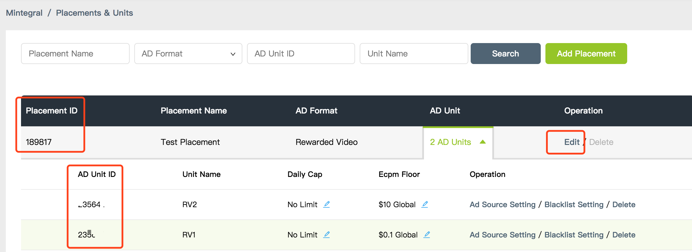

# iOS 开发文档

## 概要

本文档描述了iOS开发者如何集成Mintegral SDK产品，通过集成Mintegral SDK 展示广告创造收益
Mintegral SDK提供了8种广告形式，包括：Banner(横幅广告)、Native(原生广告)、NativeVideo(原生视频)、Auto Rending Native(自动渲染原生广告)、RewardVideo（激励性视频）、Interstitial（插屏  **7.1.0已废弃**）、Interstitial Video（插屏视频  **7.1.0已废弃** ）、NewInterstitial（新插屏广告 **7.1.0版本新增**）InterActive(试玩广告  **7.1.0版本已移除**)、Splash（开屏广告）。 

## 集成前准备

### 获取账号信息  

**App Key**   
登录Mintegral开发者后台，在**APP Setting -> APP Key**界面，可以查看到该账号的APP Key，如图所示：<br/><br/>
  

**APP ID**   
开发者每创建一个应用后，系统会自动生成App ID，可在**APP Setting -> APP ID**界面查看到已创建的应用以及对应的App ID，如图所示：<br/><br/>
  

 **Placements & Units**

开发者每创建一个广告版位后，系统会自动生成Placement ID，可在**APP Setting -> Placement Management -> Edit Placement & Unit**界面添加或修改该广告版位的Unit Id，如图所示：<br/><br/>


**数据统计接口**

参考MTG后台账户管理下接口工具中的文档


### 虚拟货币概念
MTG平台为开发者提供管理部分虚拟货币的能力，使存在内部货币机制的产品可以运用自己的虚拟货币更好地激励用户。             
后台增加“虚拟货币”管理模块，用于管理开发者的虚拟货币信息（Reward Info），Reward info设置信息可以与各种奖励性广告类型Placement ID进行同步，方便开发者管理自己的虚拟货币。        
      
**创建虚拟货币**        
在后台右侧菜单栏中找到虚拟货币，进行创建。      
     

**新建货币类型**       
       
      
**配置虚拟货币**   
在Placement下配置虚拟货币        
     


### 开发环境

开发工具：
**MTGSDK 从6.3.3版本开始不再支持XCode11以下版本archive; </br>**

**6.9.0版本需要使用Xcode12.5及以上版本;  6.9.1版本开始解除了对Xcode12.5的依赖**

### iOS SDK支持微信小程序/小游戏跳转 接入方案
推更小程序版本，需要开发者有第一步["注册appid"](https://open.weixin.qq.com/cgi-bin/frame?t=home/app_tmpl&lang=zh_CN)
是指用户点击广告后，将跳转至微信打开微信小程序/小游戏，在微信内部发生后续的行为转化。
在移动端嵌入最新版微信[openSDK](https://open.weixin.qq.com/)（按照微信开发文档指引集成,注意不要遗漏向微信注册API:[WXApi registerApp:APP_ID
universalLink:UNIVERSAL_LINK]），并确认版本为1.8.6及以上。 


## 获取SDK

我们提供两种方式去集成Mintegral iOS-SDK:使用[Cocoapods](https://github.com/Mintegral-official/MintegralAdSDK-iOS-new)和[手动添加方式](https://github.com/Mintegral-official/MintegralAdSDK-iOS-new/releases).根据以下方式获取SDK。

<iframe data-src="show_code.html" id="iframe_show_code_android"></iframe>

**关于SDK的文件大小：**</br>
SDK基础公共包，增加2.2M 左右</br>
集成全部广告样式，最大增加0.3M 左右，共2.5M</br>   

### 获取SDK版本号
搜索MTGSDK.h文件，找到MTGSDKVersion


## SDK的初始化    

作为集成的第一步，你需要先将Mintegral的SDK进行初始化。

### 手动集成需做的初始化前的参数配置

1、手动集成需导入基本的静态库      

CoreGraphics.framework <br/>
Foundation.framework<br/>
UIKit.framework<br/>
libsqlite3.tbd (在Xccode7以下是libsqlite3.dylib)<br/>
libz.tbd (在Xcode7以下是libz.dylib)<br/>
AdSupport.framework<br/>
StoreKit.framework<br/>
QuartzCore.framework<br/>
CoreTelephony.framework<br/>
MobileCoreServices.framework<br/>
AVFoundation.framework<br/>
WebKit.framework<br/>


2、增加XCode的链接器参数            

在工程的Build Settings中，找到Other Linker Flags，增加一个flag：-ObjC，注意大小写。


### 初始化

在AppDelegate里的如下方法中调用MTGSDK的初始化方法，传入在Mintergal后台得到的AppID和AppKey。初始化时，MTGSDK会从服务器拉取配置信息。**建议在主线程调用此方法。** 

```objectivec
//ApiKey 和 AppKey是一样的
- (void)setAppID:(nonnull NSString *)appID ApiKey:(nonnull NSString *)appKey;
```

示例代码：

```objectivec
- (BOOL)application:(UIApplication *)application didFinishLaunchingWithOptions:(NSDictionary *)launchOptions{
	[[MTGSDK sharedInstance] setAppID:@"your appID" ApiKey:@"your appKey"];
}
```


## 横幅广告接入

横幅广告是在应用布局中占据一处位置的矩形图片文字广告。用户与应用互动时，这类广告会停留在屏幕上，并且可在一段时间后自动刷新。

**广告效果示意：**


### 导入头文件  


```objectivec
#import <MTGSDK/MTGSDK.h>
#import <MTGSDKBanner/MTGBannerAdView.h>
#import <MTGSDKBanner/MTGBannerAdViewDelegate.h>
```

### 初始化MTGBannerAdView
```objectivec
/**
 初始化bannerview
 
 @param adSize 期望返回banner素材大小值，例如CGSizeMake(320, 50)
 @param placementId 版位id，您可以从后台创建。
 @param unitId 广告单元id，您可以在后台PlacementId下创建。
 @param rootViewController 显示广告的Controller
 @return
 */
- (nonnull instancetype)initBannerAdViewWithAdSize:(CGSize)adSize
                                       placementId:(nullable NSString *)placementId
                                       unitId:(nonnull NSString *) unitId
                               				 rootViewController:(nullable UIViewController *)rootViewController;

/**
 初始化bannerview
 
 @param MTGBannerSizeType 参考下方BannerSizeType
 @param placementId 版位id，您可以从后台创建。
 @param unitId 广告位id，您可以在后台PlacementId下创建。
 @param rootViewController 显示广告的Controller
 @return
 */
- (nonnull instancetype)initBannerAdViewWithBannerSizeType:(MTGBannerSizeType)bannerSizeType
                                               placementId:(nullable NSString *)placementId
                                               unitId:(nonnull NSString *) unitId
                                       				 rootViewController:(nullable UIViewController *)rootViewController;
```

bannerSizeType 介绍:             
我们建议使用320*50，该尺寸的填充率会更能得到保障，调整尺寸可能一定程度影响收入。

```objectivec
typedef NS_ENUM(NSInteger,MTGBannerSizeType) {
    /*表示固定横幅广告尺寸-320pt x 50pt */
    MTGStandardBannerType320x50,
    
    /*表示固定横幅广告尺寸 - 320pt by 90pt.*/
    MTGLargeBannerType320x90,
    
    /*表示固定横幅广告尺寸 - 300pt by 250pt.*/
    MTGMediumRectangularBanner300x250,
    
    /*如果设备高度 <=720,表示固定横幅广告尺寸 - 320pt by 50pt;
      如果设备高度 > 720,表示固定横幅广告尺寸 - 728pt by 90pt*/
    MTGSmartBannerType
};
```

### 请求广告

```objectivec
- (void)loadBannerAd;
```

### 销毁BannerAdView

```objectivec
/**
此方法将清除MTGBannerAdView的所有变量和属性。
 
注意：调用此方法后，如果需要继续使用MTGBannerAdView，则必须重新初始化MTGBannerAdView
 */
- (void)destroyBannerAdView;
```

### 其他功能API介绍

```objectivec
/**
  自动刷新时间（以秒为单位）设置在10s〜180s的范围内。
  如果设置为0，将不会自动刷新。
  需要在load广告之前调用
 */
@property(nonatomic,assign) NSInteger autoRefreshTime;

/**
	是否显示关闭按钮
	No表示关闭，Yes表示启用，默认为 MTGBool Unknown
 */
@property(nonatomic,assign) MTGBool showCloseButton;


/**
* 在adViewLoadSuccess回调之后调用，获取此次请求广告的requestId
*/
@property(nonatomic,copy,readonly) NSString * _Nullable requestId;


```

### 示例代码


```objectivec
#import "TestViewController.h"
#import <MTGSDK/MTGSDK.h>
#import <MTGSDKBanner/MTGBannerAdView.h>
#import <MTGSDKBanner/MTGBannerAdViewDelegate.h>
@interface TestViewController ()<MTGBannerAdViewDelegate>

@property (nonatomic, strong) MTGBannerAdView *bannerAdView;


@end

@implementation TestViewController

- (void)viewDidLoad {
    [super viewDidLoad];
    if (_bannerAdView == nil) {
        _bannerAdView = [[MTGBannerAdView alloc]initBannerAdViewWithAdSize:size placementId:kBannerPlacementId unitId:kBannerUnitID rootViewController:self];
    _bannerAdView.frame = CGRectMake(10, 100, size.width,size.height);
    _bannerAdView.delegate = self;
        
        _bannerAdView.autoRefreshTime = 0;
        _bannerAdView.delegate = self;
        [self.view addSubview:_bannerAdView];
        [_bannerAdView loadBannerAd];
        
    }

}

- (IBAction)destroyButtonAction:(id)sender
{
   [_bannerAdView destroyBannerAdView];
}

#pragma mark MTGBannerAdViewDelegate
- (void)adViewLoadSuccess:(MTGBannerAdView *)adView
{
    //成功加载adView广告位
    [self log:@"adViewLoadSuccess"];
}

- (void)adViewLoadFailedWithError:(NSError *)error adView:(MTGBannerAdView *)adView
{
    //广告加载失败
    [self log:[NSString stringWithFormat:@"Failed to load ads, error:%@", error.localizedDescription]];
}


- (void)adViewWillLogImpression:(MTGBannerAdView *)adView
{
    //广告将要展示
    [self log:@"adViewWillLogImpression"];
}

- (void)adViewDidClicked:(MTGBannerAdView *)adView
{
    //广告被点击
    [self log:@"adViewDidClicked"];
}

- (void)adViewWillLeaveApplication:(MTGBannerAdView *)adView
{
    //当用户由于点击要离开您的应用程序时触发该回调,您的应用程序将移至后台
    [self log:@"adViewWillLeaveApplication"];
}
- (void)adViewWillOpenFullScreen:(MTGBannerAdView *)adView
{
    //将打开全屏视图。在打开storekit或在应用程序中打开网页时触发
    [self log:@"adViewWillOpenFullScreen"];
}
- (void)adViewCloseFullScreen:(MTGBannerAdView *)adView
{
    //将关闭全屏视图。关闭storekit或关闭应用程序中的网页时发送
    [self log:@"adViewCloseFullScreen"];
}

@end
```


## 原生（视频）广告接入

原生广告是时下非常流行的广告类型之一，广告SDK会将素材信息返回给您的app，您可以根据需要对元素进行组装和渲染，进而使得广告内容更贴近您的产品风格，用户体验更好。

**注：该广告类型仅对部分开发者提供，如有需要请联系您的AM 或 致信developer@mintegral.com**

**广告效果示意：**<br/>


### 导入头文件  


```objectivec
#import <MTGSDK/MTGSDK.h>
```

### 初始化MTGNativeAdManager

```objectivec
/*
	初始化MTGNativeAdManager
 
 @param unitId广告单元的ID。您可以从我们的后台创建您的广告单元ID。
 @param fbPlacementId Facebook PlacementID用于向Facebook请求广告。目前已废弃，可传nil 
 @param videoSupport DEPRECATED_ATTRIBUTE 后台可配置：https://www.mintegral.net
 @param numAdsRequested 您希望拉取到的最大的广告数。最大数字为10。如果传递的数字大于10，它将默认为10。
 @param viewController 将用于呈现SKStoreProductViewController的UIViewController
 （iTunes Store产品信息）或应用程序内浏览器。如果未设置，它将是当前UIWindow的根viewController。但是，如果您的rootViewController正在显示其他视图控制器，则可能无法显示我们的视图控制器。因此设置此属性是必要的。
*/
- (nonnull instancetype)initWithPlacementId:(nullable NSString *)placementId
                                     unitID:(nonnull NSString *)unitId
                              fbPlacementId:(nullable NSString *)fbPlacementId
                               videoSupport:(BOOL)videoSupport
                         forNumAdsRequested:(NSUInteger)numAdsRequested
                   presentingViewController:(nullable UIViewController *)viewController;
```

示例代码：

```objectivec
[[MTGNativeAdManager alloc] initWithPlacementId:KNativeUnitID unitID:KNativeUnitID fbPlacementId:KPlacementID videoSupport:YES forNumAdsRequested:1 presentingViewController:self];
```

<font color=#ff0000 >预加载广告（强烈建议）</font>

我们对Native(NativeVideo)广告形式提供预加载功能（可选），可以在初始化环节调用以下代码进行预加载，提高你的广告加载效率。示例代码如下： 

```objectivec
/**
  *
  @method
 
  @abstract 预加载原生广告
 
  @param placementId 广告版位ID。 您可以从后台创建它。
  @param unitId广告单元的ID。 您可以从后台PlacementID下创建。
  @param fbPlacementId Facebook PlacementID用于请求来自Facebook的广告，目前已废弃，可传nil 
  @param videoSupport 是否加载视频广告，如果希望展示视频广告，请将videoSupport设置为yes
  @param numAdsRequested您要预加载的广告数量。 最大数字为10。如果传递的数字大于10，将默认为10
  */
- (void)preloadNativeAdsWithPlacementId:(nullable NSString *)placementId
                                 unitId:(nonnull NSString *)unitId
                          fbPlacementId:(nullable NSString *)fbPlacementId
                           videoSupport:(BOOL)videoSupport
                     forNumAdsRequested:(NSUInteger)numAdsRequested;

```

### 请求广告   
Mintegral SDK调用此方法时会优先从缓存里读取广告，如果缓存里有广告，则直接返回，进而提升展示效率；如果缓存里没有，则会向服务器发送广告请求获取广告。 请求方法如下：
```objectivec
- (void)loadAds;
```


### 渲染广告      
您可以根据nativeAdsLoaded的回调去渲染广告，同时我们提供MTGMediaView去展示图片（视频）广告，调用以下方法去展示广告。**MTGMediaView的最佳设置展示比例大小为16：9。**  

```objectivec
- (void)setMediaSourceWithCampaign:(MTGCampaign *)campaign unitId:(NSString*)unitId;
```


#### 获取Request ID
若广告展示过程中发现问题，可以通过该方法将 Request ID 记录并反馈到MTG.**需要在 load success 之后调用**       

```objectivec
/**
* 在nativeAdsLoaded回调之后调用，获取此次请求广告的requestId
*/
@property (nonatomic, readonly) NSString *_Nullable requestId;

```

### Adchoice标记
我们提供MTGAdChoicesView来渲染广告标记（Adchoice）。对其两个属性进行赋值即可完成广告标记。
<br>
**Tip:我们强烈建议开发者规划合适位置展示此图标，若未展示，会影响您后续的广告收益。**

```objectivec
/**
	初始化View

 @param 为了获得最佳的用户体验，请将该视图的大小与AdChoiceIcon的大小保持相同，可以从MTGCampaign的-adChoiceIconSize中提取该视图的大小。如果该Size值为0，可以不展示Adchoice
 */
- (instancetype)initWithFrame:(CGRect)frame;

/**
 campaign对象将提供 AdChoices信息,如image url 和 click url
 */
@property (nonatomic, weak, readwrite, nullable) MTGCampaign *campaign;
```


### 对view设置广告点击跳转事件     

```objectivec
- (void)registerViewForInteraction:(UIView *)view withViewController:(UIViewController *)viewController withClickableViews:(NSArray *)clickableViews;
- (void)registerViewForInteraction:(UIView *)view withViewController:(UIViewController *)controller;
```


### MTGMediaView一些功能API介绍

```objectivec
#import <UIKit/UIKit.h>
#import "MTGCampaign.h"
NS_ASSUME_NONNULL_BEGIN

@protocol MTGMediaViewDelegate;
@class MTGNativeAdManager;

@interface MTGMediaView : UIView

/* 为了获得最佳的用户体验，请将mediaView的宽高比保持为16：9 */
- (instancetype)initWithFrame:(CGRect)frame;

/**
	可以再次设置Media Source以重复使用此视图。
*/
- (void)setMediaSourceWithCampaign:(MTGCampaign *)campaign unitId:(NSString*)unitId;


@property (nonatomic, weak, nullable) id<MTGMediaViewDelegate> delegate;

// 是否同意广告点击后为全屏模式，默认为YES
@property (nonatomic, assign) BOOL  allowFullscreen;

// 是否允许在视频ready后从静态图像变更为播放视频，默认为YES
@property (nonatomic, assign) BOOL  videoRefresh;

// 是否允许自动播放视频，默认为YES
@property (nonatomic, assign) BOOL  autoLoopPlay;
/* 是否展示进度条，默认为YES */
@property (nonatomic, assign) BOOL  showVideoProcessView;
/* 是否显示声音指示器视图，默认为YES */
@property (nonatomic, assign) BOOL  showSoundIndicatorView;
/* 是否静音， 默认为YES，表示视频播放器已静音*/
@property (nonatomic, assign) BOOL mute;

@property (nonatomic, strong, readonly) MTGCampaign *campaign;

@property (nonatomic, readonly) NSString *unitId;

/**
 在调用'setMediaSourceWithCampaign:(MTGCampaign *)campaign unitId:(NSString*)unitId'之后，
 您可以根据需要通过isVideoContent检查此MediaView是否有视频内容
 */
@property (nonatomic,readonly,getter = isVideoContent) BOOL videoContent;

@end

@protocol MTGMediaViewDelegate <NSObject>

@optional

/**
 @method
 
 @abstract
 在MTGMediaView进入全屏视图之前发送
 
 @param mediaView：针对MTGMediaView的回调
 */
- (void)MTGMediaViewWillEnterFullscreen:(MTGMediaView *)mediaView;

/**
 @method
 
 @abstract
 在MTGMediaView退出全屏视图时发送
 
 @param mediaView: 针对MTGMediaView的回调
 */
- (void)MTGMediaViewDidExitFullscreen:(MTGMediaView *)mediaView;


/**
 *  当视频广告开始播放时发送
 *
 *  @param mediaView: 针对MTGMediaView的回调
 */
- (void)MTGMediaViewVideoDidStart:(MTGMediaView *)mediaView;

/**
*  当视频播放完成后发送
*
*  @param mediaView: 针对MTGMediaView的回调
*/
- (void)MTGMediaViewVideoPlayCompleted:(MTGMediaView *)mediaView;

/**
 @method
 
 @abstract
 当用户点击广告时发送
 
 */
- (void)nativeAdDidClick:(nonnull MTGCampaign *)nativeAd;
- (void)nativeAdDidClick:(nonnull MTGCampaign *)nativeAd mediaView:(MTGMediaView *)mediaView;


/**
 @method
 
 @abstract
广告开始跳转时发送
 
 @param clickUrl 广告的clickurl
 */
- (void)nativeAdClickUrlWillStartToJump:(nonnull NSURL *)clickUrl;
- (void)nativeAdClickUrlWillStartToJump:(nonnull NSURL *)clickUrl mediaView:(MTGMediaView *)mediaView;

/**
 @method
 
 @abstract
 当广告跳转到新的url之后发送
 @param jumpUrl 跳跃时的URL
 
 @discussion 如果广告的最终跳转网址已被缓存，则不会调用该方法
 */
- (void)nativeAdClickUrlDidJumpToUrl:(nonnull NSURL *)jumpUrl;
- (void)nativeAdClickUrlDidJumpToUrl:(nonnull NSURL *)jumpUrl  mediaView:(MTGMediaView *)mediaView;

/**
 @method
 
 @abstract
在广告网址到达最终跳转网址后发送
 
@param finalUrl为最终跳转URL
@param error跳转过程中产生的错误
 */
- (void)nativeAdClickUrlDidEndJump:(nullable NSURL *)finalUrl
                             error:(nullable NSError *)error;
- (void)nativeAdClickUrlDidEndJump:(nullable NSURL *)finalUrl
                             error:(nullable NSError *)error  mediaView:(MTGMediaView *)mediaView;

- (void)nativeAdImpressionWithType:(MTGAdSourceType)type mediaView:(MTGMediaView *)mediaView;

@end
```


### 示例代码

```objectivec
#import "TestViewController.h"
#import <MTGSDK/MTGSDK.h>
#import <MTGSDK/MTGNativeAdManager.h>
@interface TestViewController ()<MTGNativeAdManagerDelegate,MTGMediaViewDelegate>

@property (nonatomic, strong) MTGNativeAdManager *nativeVideoAdManager;
@property (weak, nonatomic) IBOutlet MTGMediaView *mMediaView;
@property (weak, nonatomic) IBOutlet UIImageView *iconImageView;
@property (weak, nonatomic) IBOutlet UILabel *appNameLabel;
@property (weak, nonatomic) IBOutlet UILabel *appDescLabel;
@property (weak, nonatomic) IBOutlet UIButton *adCallButton;
@property (weak, nonatomic) IBOutlet MTGAdChoicesView *adChoicesView;
@property (weak, nonatomic) IBOutlet NSLayoutConstraint *adChoicesViewWithConstraint;
@property (weak, nonatomic) IBOutlet NSLayoutConstraint *adChoicesViewHeightConstraint;

@end

@implementation TestViewController

//Init MTGNativeAdManager
- (IBAction)initAdManagerButtonAction:(id)sender
{
    //clean old demo view
    [self cleanAllDemoView];
    if (self.currentStyleIndex == 0) {
        _nativeAdManager1 = [[MTGNativeAdManager alloc] initWithPlacementId:KNativePlacementId unitID:KNativeUnitID fbPlacementId:KPlacementID supportedTemplates:@[[MTGTemplate templateWithType:MTGAD_TEMPLATE_BIG_IMAGE adsNum:1]] autoCacheImage:NO adCategory:0 presentingViewController:self];
        _nativeAdManager1.showLoadingView = YES;
        
        _nativeAdManager1.delegate = self;
    }
    else if (self.currentStyleIndex == 1){
        _nativeAdManager2 = [[MTGNativeAdManager alloc] initWithPlacementId:PlacementId unitID:KNativeUnitID fbPlacementId:KPlacementID videoSupport:NO forNumAdsRequested:1 presentingViewController:self];
        
        _nativeAdManager3.delegate = self;
    }
    
    [self log:@"MTGNativeAdManager init"];
}


#pragma mark AdManger delegate
- (void)nativeAdsLoaded:(NSArray *)nativeAds nativeManager:(nonnull MTGNativeAdManager *)nativeManager
{
    
    if (nativeAds.count > 0) {
        MTGCampaign *campaign=nativeAds[0];
        self.mMediaView.delegate = self;
        //Set the camgaign for the MTGmediaview
        [self.mMediaView setMediaSourceWithCampaign:campaign unitId:@"your unitid"];
        self.appNameLabel.text = campaign.appName;
        self.appDescLabel.text = campaign.appDesc;
        [self.adCallButton setTitle:campaign.adCall forState:UIControlStateNormal];
        [campaign loadIconUrlAsyncWithBlock:^(UIImage *image) {
        if (image) {
                [self.iconImageView setImage:image];
            }
        }];
        // MTGAdchoiceview 配置
        if (CGSizeEqualToSize(campaign.adChoiceIconSize, CGSizeZero)) { 
				//当campaign.adChoiceIconSize 为0时，建议将该adChoicesView隐藏
        self.adChoicesView.hidden = YES;
    } 
        else {
        self.adChoicesView.hidden = NO;
        // 建议根据广告参数设置adChoicesView的大小
        self.adChoicesViewWithConstraint.constant = campaign.adChoiceIconSize.width;
        self.adChoicesViewHeightConstraint.constant = campaign.adChoiceIconSize.height;
    }    
        self.adChoicesView.campaign = campaign;
        [ self.nativeVideoAdManager registerViewForInteraction:self.appDescLabel.text withCampaign:campaign];
        
    }
  
}

- (void)nativeAdsFailedToLoadWithError:(NSError *)error nativeManager:(nonnull MTGNativeAdManager *)nativeManager
{
    [self log:[NSString stringWithFormat:@"Failed to load ads, error:%@", error.localizedDescription]];
}

- (void)nativeAdImpressionWithType:(MTGAdSourceType)type nativeManager:(MTGNativeAdManager *)nativeManager
{
    
}


#pragma mark MediaView delegate
- (void)MTGMediaViewWillEnterFullscreen:(MTGMediaView *)mediaView{
    [self log:@"MTGMedia View Will Enter Full Screen"];
}


- (void)MTGMediaViewDidExitFullscreen:(MTGMediaView *)mediaView{
    [self log:@"MTGMedia View Did Exit Full Screen"];
}


#pragma mark MediaView and AdManger Click delegate
- (void)nativeAdDidClick:(MTGCampaign *)nativeAd
{
    [self log:@"Registerview or mediaVie Ad is clicked"];
}

- (void)nativeAdDidClick:(MTGCampaign *)nativeAd nativeManager:(nonnull MTGNativeAdManager *)nativeManager
{
    [self log:@"Registerview Ad is clicked"];
}
- (void)nativeAdDidClick:(MTGCampaign *)nativeAd mediaView:(nonnull MTGMediaView *)mediaView
{
    [self log:@"MTGMediaView Ad is clicked"];
}

- (void)MTGMediaViewVideoPlayCompleted:(MTGMediaView *)mediaView {
    [self log:NSStringFromSelector(_cmd)];
}

@end
```

##自动渲染原生广告
自动渲染原生广告集成比普通原生广告更加简单，开发者只需提供宽高区域，MTG会自动展示与之契合的广告模板和素材。减少开发者对接成本的同时，更高效地利用MTG算法输出广告创意，进而提升开发者收入水平。


**广告效果示意：**<br/>


### 导入头文件  


```objectivec
#import "MTGNativeAdvancedAd.h"
```


### MTGNativeAdvancedAd 初始化   


```objectivec
/**
	初始化NativeAdvancedAd

@param adSize nativeAdvanced广告尺寸。我们建议您将尺寸设置为320 * 250。
@param placementId 广告版位ID。 您可以从后台创建。
@param unitId广告单元的ID。 您可以从后台PlacementID下创建它。
@param rootViewController用于显示全屏广告的视图控制器。
@end
*/
- (nonnull instancetype)initWithPlacementID:(nullable NSString *)placementID
                                 unitID:(nonnull NSString *)unitID
                                 adSize:(CGSize)adSize
                     rootViewController:(nullable UIViewController *)rootViewController NS_DESIGNATED_INITIALIZER;

```
**可设置项**
**设置Style**
可设置的target有title、subTitle、button、icon、container、mediaContent.
如图：


```objectivec
/**

 修改广告内容元素的方法
 
  @param style 设置广告内容元素
  @param target 可以设置标题，子标题，按钮，图标，container，mediaContent
  @param values 可以设置view的背景颜色，字体大小，字体，颜色和元素间的距离

  例如：
 
     NSDictionary *styles = @{
        @"list": @[
                @{
                    // 目标元素
                    @"target": @"container",
                    // 样式值
                    @"values": @{
                    
                            @"paddingTop": @(0),
                            @"paddingRight": @(0),
                            @"paddingBottom": @(0),
                            @"paddingLeft": @(0),
                            
                            @"backgroundColor": @"#FC2E02",
                            @"fontSize": @(20),
                            @"color": @"#060602",
                            @"fontFamily": @"Apple Symbols"
                    }
               
                }
            ]
    };
      
*/
- (void)setAdElementsStyle:(NSDictionary *)style;
```
####静音设置
```objectivec
/**
  是否使视频播放器静音。
  如果要使视频播放器静音，则应设置为“Yes”，否则为“False”。
*/
@property(nonatomic,assign) BOOL mute;

```
####自动化播放设置
```objectivec
/** 用于控制广告视频播放的类型。 */
@property(nonatomic,assign) MTGNativeAdvancedAdVideoPlayType autoPlay;

```

####关闭按钮设置
```objectivec
/**
	是否显示关闭按钮。
  如果要显示关闭按钮，则应设置为“YES”，否则为“False”。
*/
@property(nonatomic,assign) BOOL showCloseButton;

```

#### 获取Request ID
若广告展示过程中发现问题，可以通过该方法将 Request ID 记录并反馈到MTG.      

**需要在 load success 之后调用**       

```objectivec
/**
* 在nativeAdvancedAdLoadSuccess回调之后调用，获取此次请求广告的requestId
*/
@property(nonatomic,copy,readonly) NSString *_Nullable requestId;
```


###加载及展示广告
####加载广告
```objectivec
/**
 请求广告
*/
- (void)loadAd;
```
####判断是否加载完成
```objectivec
/**
	广告是否加载完成
  @return YES表示有一个可用的广告，否则为NO
*/
- (BOOL)isAdReady;
```
####展示广告
```objectivec
/**
 	展示adView
  @note 需要将该View在loadSuccess之后附加上广告，如果在loadSuccess之前获取adView，将获得不带广告的UIView
*/
- (UIView *)fetchAdView;
```
####销毁广告
```objectivec
/**
 	销毁广告，然后adView将从您的展示视图中移除
  @note 调用此方法后，如果需要继续使用MTGNativeAdvancedAd，则必须重新初始化MTGNativeAdvancedAd	
*/
- (void)destroyNativeAd;
```
### MTGNativeAdvancedAdDelegate 介绍
```objectivec
@protocol MTGNativeAdvancedAdDelegate <NSObject>


/**
 广告加载完成
 */
- (void)nativeAdvancedAdLoadSuccess:(MTGNativeAdvancedAd *)nativeAd;
 
/**
 广告加载失败
 */
- (void)nativeAdvancedAdLoadFailed:(MTGNativeAdvancedAd *)nativeAd error:(NSError *)error;

/**
 广告将要展示
 */
- (void)nativeAdvancedAdWillLogImpression:(MTGNativeAdvancedAd *)nativeAd;
 
/**
 广告被点击
 */
- (void)nativeAdvancedAdDidClicked:(MTGNativeAdvancedAd *)nativeAd;
 
/**
 当用户由于点击要离开您的应用程序时触发该回调,您的应用程序将移至后台。
 */
- (void)nativeAdvancedAd	WillLeaveApplication:(MTGNativeAdvancedAd *)nativeAd;
 
/**
 将打开全屏视图。在打开storekit或在应用程序中打开网页时触发。
 */
- (void)nativeAdvancedAdWillOpenFullScreen:(MTGNativeAdvancedAd *)nativeAd;
 
/**
 将关闭全屏视图。关闭storekit或关闭应用程序中的网页时发送。
 */
- (void)nativeAdvancedAdCloseFullScreen:(MTGNativeAdvancedAd *)nativeAd;

/**
 当广告关闭时发送。
 */
- (void)nativeAdvancedAdClosed:(MTGNativeAdvancedAd *)nativeAd;

@end

```

###示例代码
```objectivec
- (void)createNewNativeAd:(CGSize)size {
    
    _adManager = [[MTGNativeAdvancedAd alloc] initWithPlacementID:kNewNativePlacementId unitID:kNewNativeUnitID adSize:CGSizeMake(320, 90) rootViewController:self];
    _adManager.delegate = self;
    
    _adManager.showCloseButton = YES;
    _adManager.mute = NO;
    _adManager.autoPlay = YES;

    NSDictionary *styles = @{
        @"list": @[
                @{
                    // 目标元素
                    @"target": @"container",
                    // 样式值
                    @"values": @{
                    
                            @"paddingTop": @(0),
                            @"paddingRight": @(0),
                            @"paddingBottom": @(0),
                            @"paddingLeft": @(0),
                            
                            @"backgroundColor": @"#FC2E02",
                            @"fontSize": @(20),
                            @"color": @"#060602",
                            @"fontFamily": @"Apple Symbols"
                    }
               
                }
            ]
    };
   
   
    [_adManager setAdElementsStyle:styles];
    
}
- (void)loadButtonAction:(UIButton *)sender {
    [self log:@"start loading"];
    [self.adManager loadAd];

}
- (void)showButtonAction:(UIButton *)sender {
    
        if ([_adManager isAdReady]) {
            [self addAdView];
        }
}


```


## 激励视频接入

激励视频是Mintegral平台效果非常好的广告形式，用户可以通过观看一段广告视频而获取奖励，由于广告视频素材非常具有创意和吸引力，因此会引起很多用户的兴趣，进而点击广告产生转化收入。

**广告效果示意：** 


   


### 导入头文件

  集成激励视频广告，需要导入以下头文件：

```objectivec
#import <MTGSDK/MTGSDK.h>
#import <MTGSDKReward/MTGRewardAdManager.h>
```


### 静音处理
**必须在load之前调用**

```objectivec
/* 开始时是否播放视频静音，默认为NOT。 设置为True表示静音*/
@property (nonatomic, assign) BOOL  playVideoMute;
```

### 计时设置
**必须在load之前调用**

```objectivec
/**

* 如果要更改关闭广告二次确认弹窗文本，调用该方法
*
* @param title 弹窗标题
* @param content 弹窗内容
* @param ConfirmText 确认按钮文本
* @param cancelText 取消按钮文本
*/
- (void)setAlertWithTitle:(NSString *_Nullable)title
                        content:(NSString *_Nullable)content
                    confirmText:(NSString *_Nullable)confirmText
                     cancelText:(NSString *_Nullable)cancelText;
```
### Reward Plus设置
**必须在load之前调用**             
该API仅表示接受投放Reward plus的广告，下发奖励依然依赖SDK中 onVideoAdDismissed 回调的奖励数量货币信息参数(MTGRewardAdInfo)进行奖励发放。

```objectivec      
/* 
此方法用于为RewardVideo打开RewardPlus，如果需要，请在loadVideo之前进行设置，默认为No。
*/
@property (nonatomic,assign) BOOL openRewardPlus;
示例：
[MTGRewardAdManager sharedInstance].openRewardPlus = YES;
```

### 获取Request ID
若广告展示过程中发现问题，可以通过该方法将 Request ID 记录并反馈到MTG.**需要在 load success 之后调用**       

```objectivec
/**
* 在onAdLoadSuccess 回调之后调用，获取此次请求广告的requestId
*/
- (NSString *_Nullable)getRequestIdWithUnitId:(nonnull NSString *)unitId;
```

### 请求广告   
请求广告时，需传入对应的广告版位placementId和广告单元unitId。建议开发者在展示广告之前，提前进行广告请求，进而给素材等资源的下载提供时间，减少用户在展示广告时等待的时间，提高用户体验和广告时间。<br>

```objectivec
/**
*  加载广告
 
*  @param placementId 广告版位ID。 您可以从后台创建。
*  @param unitId 广告单元的ID。 您可以从后台PlacementID下创建它。
*  @param delegate 引用实现MTGRewardAdLoadDelegate的对象，将接收指定unitId的load事件。
*/
- (void) loadVideoWithPlacementId:(nullable NSString *)placementId
           unitId:(nonnull NSString *)unitId
         delegate:(nullable id <MTGRewardAdLoadDelegate>)delegate;
```


### 展示广告  

展示广告之前建议先判断广告是否已经下载成功，如果视频可以播放SDK会返回成功信息，然后再传入对应的PlacementId、UntiId和viewController展示视频广告；如果返回失败，就放弃这次视频展示机会。      
**注意：userId用于服务器端回调（userId只能是数字和字母），如果是客户端回调<font color="#EE1111">可以不传</font>**

```objectivec
/**
 * 将返回指定的unitId是否已缓存完成可展示的状态。
 *
 * @param placementId 广告版位ID。 您可以从后台创建。
 * @param unitId 广告单元的ID。 您可以从后台PlacementID下创建它。
 *
 * @return - 如果缓存已完成达到可展示状态，则为YES，否则为NO。
 */
- (BOOL) isVideoReadyToPlayWithPlacementId:(nullable NSString *)placementId unitId:(nonnull NSString *)unitId;


/**
*  展示广告
*
*  @param placementId 广告版位ID。 您可以从后台创建。
*  @param unitId 广告单元的ID。 您可以从后台PlacementID下创建它。
*  @param rewardId  已废弃，默认传1
*  @param userId    用于服务端回调
*  @param userExtra 自定义参数，用于服务端回调。
*  @param delegate  引用实现 MTGRewardAdShowDelegate的对象，接收指定unitid的展示事件
*  @param viewController 应将viewController设置为根视图控制器 UIViewController
*/
- (void)showVideoWithPlacementId:(nullable NSString *)placementId
                          unitId:(nonnull NSString *)unitId
                          userId:(nullable NSString *)userId
                       userExtra:(nullable NSString *)userExtra
                        delegate:(nullable id <MTGRewardAdShowDelegate>)delegate
                  viewController:(nonnull UIViewController*)viewController;
```

### Delegate介绍
#### MTGRewardAdLoadDelegate
```objectivec
/**
 *  Load事件的Delegate
 */
@protocol MTGRewardAdLoadDelegate <NSObject>
@optional

/**
*  广告加载成功但视频尚未完全缓存完成，需要等待缓存素材时调用
*
*/
- (void)onAdLoadSuccess:(nullable NSString *)placementId unitId:(nullable NSString *)unitId;

/**
 *  广告加载完成且准备好展示时调用
 */
- (void)onVideoAdLoadSuccess:(nullable NSString *)placementId unitId:(nullable NSString *)unitId;

/**
 *  广告加载失败时调用
 *  @param error  - 加载失败原因
 */
- (void)onVideoAdLoadFailed:(nullable NSString *)placementId unitId:(nullable NSString *)unitId error:(nonnull NSError *)error;

@end
```
#### MTGRewardAdShowDelegate
```objectivec
/**
 *  show事件的Delegate
 */
@protocol MTGRewardAdShowDelegate <NSObject>
@optional

/**
 *  广告展示时调用
 */
- (void)onVideoAdShowSuccess:(nullable NSString *)placementId unitId:(nullable NSString *)unitId;

/**
 *  广告展示成功，只有接入HB才会触发该回调。
 *  @param bidToken - 当前被展示的广告的Token
 */
- (void)onVideoAdShowSuccess:(nullable NSString *)placementId unitId:(nullable NSString *)unitId bidToken:(nullable NSString *)bidToken;

/**
 *  广告展示失败
 *  @param error - 展示失败原因
 */
- (void)onVideoAdShowFailed:(nullable NSString *)placementId unitId:(nullable NSString *)unitId withError:(nonnull NSError *)error;

/**
 *  视频播放完成
 */
- (void) onVideoPlayCompleted:(nullable NSString *)placementId unitId:(nullable NSString *)unitId;

/**
 *  视频播放结束后，广告结果页Endcard展示成功
 */
- (void) onVideoEndCardShowSuccess:(nullable NSString *)placementId unitId:(nullable NSString *)unitId;

/**
 *  广告被点击
 */
- (void)onVideoAdClicked:(nullable NSString *)placementId unitId:(nullable NSString *)unitId;

/**
 *  在取消展示广告后并将控件返回到您的应用时调用

 *  @param converted   - BOOL 视频是否播放完整
 *  @param rewardInfo  - 返回包括用户奖励信息的rewardInfo对象
 *  rewardInfo.rewardName 为货币名称，(long)rewardInfo.rewardAmount 为货币数量。
 */
- (void)onVideoAdDismissed:(nullable NSString *)placementId unitId:(nullable NSString *)unitId withConverted:(BOOL)converted withRewardInfo:(nullable MTGRewardAdInfo *)rewardInfo;

/**
 *  广告被关闭
 */
- (void)onVideoAdDidClosed:(nullable NSString *)placementId unitId:(nullable NSString *)unitId;

/**
 *  聚合平台使用竞价广告时使用
 */
- (void)onVideoAdShowSuccess:(nullable NSString *)placementId unitId:(nullable NSString *)unitId bidToken:(nullable NSString *)bidToken;

@end
```

### 示例代码   


```objectivec
#import "MTGRewardVideoViewController.h"
#import <MTGSDKReward/MTGRewardAdManager.h>
#import <MTGSDK/MTGSDK.h>

@interface MTGRewardVideoViewController ()
<MTGRewardAdLoadDelegate,MTGRewardAdShowDelegate>


- (void)viewDidLoad {
   [[MTGRewardAdManager sharedInstance] loadVideoWithPlacementId:KRewardPlacementID unitId:KRewardUnitID delegate:self];    
}


- (IBAction)showVideoButtonAction:(id)sender
{
   //检测在广告展示之前，广告是否缓存成功
if ([[MTGRewardAdManager sharedInstance] isVideoReadyToPlayWithPlacementId:@"your placementId" unitId:@"your unitId"]) {

     [[MTGRewardAdManager sharedInstance] showVideoWithPlacementId:@"your placementId"  unitId:@"your unitId"] withRewardId:@"your rewardid"] userId:@"" delegate:self viewController:self];
    
    } 
}
```
### 设置服务端回调（可选）     

您可以根据需要选择通过SDK或者服务端回调信息。若需要设置服务端回调，可以在后台添加callbackURL，Mintegral会在视频播放完成后调用callbackurl给予信息的回调。    

1.创建广告位时设置回调方式<br/><br/>        


当Mintegral服务端获知用户完成任务后，通过Callback URL通知开发者服务端，为用户增加积分，对开发者来说，该方式实现起来稍微复杂，但安全性高。<br/><br/>

2 声明callbackUrl，**只需要修改域名部分**

<https://www.sampleurl.com/mintegral?user_id={user_id}&trans_id={trans_id}&reward_amount={reward_amount}&reward_name={reward_name}&sign={sign}&unit_id={unit_id}&extra={extra}>

3 Mintegral Server获知获知到该user_id增加积分后，通过callback url通知开发者服务端。callback url附加的参数如下：

参数 | 说明
------|-------
user_id | 用户ID，由开发者设置
trans_id | 传输ID，Mintegral服务端生成，具有唯一性
reward_amount | 用户应该获得的积分
reward_name | 积分的名称
sign | 加密标识 MD5(user_id_reward_amount_trans_id_security_key)
unit_id | 广告位ID
extra | (String)自定义参数 

4 开发者服务端一旦收到postback后，需给MTG服务端返回200或403

```objectivec
200 means：User has been rewarded successfully.

403 means：abnormal 

1.sign does not match

2.user_id does not exist

```

5 Mintegral Server发起Postback后，若超时（20秒）无响应，则在24小时内每隔5分钟重试一次。  


## 新插屏广告

新插屏广告是插屏广告的升级版，开发者可以在后台选择广告大小：分为全屏和插屏，全屏和插屏场景下开发者都可以选择投放的广告类型，分别为图片+视频、仅视频、仅图片。适用于更多应用场景切换时使用，如：应用内视图切换、游戏过关或失败、图书翻页、应用退出等。

**广告效果示意：** 


### 导入头文件

```c
#import "MTGNewInsterstialViewController.h"
#import <MTGSDKNewInterstitial/MTGSDKNewInterstitial.h>
#import <MTGSDKNewInterstitial/MTGNewInterstitialAdManager.h>
```

### 初始化MTGNewInterstitialAdManager

初始化MTGNewInterstitialAdManager，并且传入Placementid,UnitId，然后设置MTGNewInterstitialAdManager 的 delegate。

```c
/**
*   初始化MTGNewInterstitialAd

*  @param placementId 广告版位ID。 您可以从后台创建。
*  @param unitId 广告单元的ID。 您可以从后台PlacementID下创建它。
*  @param delegate  - 引用实现 MTGNewInterstitialAdDelegate 的对象
*/
- (nonnull instancetype)initWithPlacementId:(nonnull NSString *)placementId
                                     unitId:(nonnull NSString *)unitId
                                   delegate:(nullable id<MTGNewInterstitialAdDelegate>)delegate;
```

### 请求和展示广告

```c
/** 加载新插屏广告 */
- (void)loadAd;

/**
*  判断广告是否加载完成达到可展示状态
*  @return- 如果已加载完成可播放，则为YES，否则为NO。
*/
- (BOOL)isAdReady;

/** @name 展示插页式视频广告
 
  *从指定的视图控制器显示NewinterstitialVideo广告
  * @param viewController应该用于展示NewinterstitialVideo广告的视图控制器
 	*/
- (void)showFromViewController:(UIViewController *_Nonnull)viewController;


```

### 设置静音

```c
/** 播放视频一开始是否静音，默认为NO，No表示非静音 */
@property (nonatomic, assign) BOOL  playVideoMute;
```

### 新插屏奖励模式接口

**必须在load之前调用**

```c
/**
   * 根据需要设置NewInterstitial 奖励，在loadAd 之前调用。
   * @param rewardMode {@link MTGNIRewardMode} 获取受支持类型的列表
   * @param playRate设置奖励alertView的时间，范围为0〜1（例如：设置为0.6，表示60％）。
   注意：在 MTGNIRewardPlayMode 中，playRate 值表示当播放达到设置的 playRate 时会出现一个奖励 alertView。
        在MTGNIRewardCloseMode中，playRate值表示当点击关闭按钮时，如果视频播放时间小于设置的playRate，就会出现reward alertView。
  */
- (void)setRewardMode:(MTGNIRewardMode)rewardMode playRate:(CGFloat)playRate;

/**
   * 设置 NewInterstitial 奖励，需要在 loadAd 之前调用。
   * @param rewardMode {@link MTGNIRewardMode} 获取受支持类型的列表
   * @param playTime 设置奖励alertView的时间，范围0~100s。
   注意：在 MTGNIRewardPlayMode 中，playTime 值表示当播放达到设置的playTime时会出现一个奖励alertView。
        在MTGNIRewardCloseMode中，playTime 值表示当点击关闭按钮时，如果视频播放时间小于设置的playTime，就会出现reward alertView。
*/
- (void)setRewardMode:(MTGNIRewardMode)rewardMode playTime:(NSInteger)playTime;


/**
* 当您想要自定义广告关闭二次确认弹窗，调用此方法。
*
* @param title 弹窗标题
* @param 弹窗内容
* @param confirmText 确认按钮文本
* @param cancelText 取消按钮文本
 
  注意：必须在 loadAd 之前调用
*/
- (void)setAlertWithTitle:(NSString *_Nullable)title
                  content:(NSString *_Nullable)content
              confirmText:(NSString *_Nullable)confirmText
               cancelText:(NSString *_Nullable)cancelText;

```

###  获取Request ID

若广告展示过程中发现问题，可以通过该方法将 Request ID 记录并反馈到MTG.

**需要在 load success 之后调用**       

```objectivec
/**
* 在 onInterstitialAdLoadSuccess 回调之后调用，获取此次请求广告的requestId
*/
- (NSString *_Nullable)getRequestIdWithUnitId:(nonnull NSString *)unitId;
```

### 示例代码

```c
#import "MTGNewInsterstialViewController.h"
#if __has_include(<MTGSDK/MTGSDK.h>)
#import <MTGSDKNewInterstitial/MTGSDKNewInterstitial.h>
#import <MTGSDKNewInterstitial/MTGNewInterstitialAdManager.h>


@property (nonatomic,strong)  MTGNewInterstitialAdManager *ivAdManager;


- (void)viewDidLoad {
    [super viewDidLoad];
    
    self.view.backgroundColor = [UIColor whiteColor];
    
    [self createDemoButtons];
//    [self createMoreUnit];
    
    _ivAdManager = [[MTGNewInterstitialAdManager alloc] initWithPlacementId:KInterstitialVideoPlacementId2 unitId:KInterstitialVideoUnitID2 delegate:self];
}


- (IBAction)initAdManagerButtonAction:(id)sender
{
    if (!_ivAdManager) {
        _ivAdManager = [[MTGNewInterstitialAdManager alloc]initWithPlacementId:KInterstitialVideoPlacementId unitId:KInterstitialVideoUnitID delegate:self];
        [self log:@"MTGNewInterstitialAdManager init"];

    }
}

- (IBAction)loadInsterstialButtonAction:(id)sender
{
    if (self.bidSwitch) {
       // [AppDelegate setCustomInfo:@"iv bid load" type:1 unitId:KInterstitialVideoUnitID];
        [_ivBidAdManager setRewardMode:MTGNIRewardPlayMode playTime:8];
        [_ivBidAdManager loadAdWithBidToken:self.bidToken];
    } else {
      //  [AppDelegate setCustomInfo:@"iv load" type:0 unitId:KInterstitialVideoUnitID];
        [_ivAdManager setRewardMode:MTGNIRewardCloseMode playRate:0.5];
        [_ivAdManager loadAd];
    }
}

//Show Video
- (IBAction)showVideoButtonAction:(id)sender
{
    MTGNewInterstitialAdManager *manager = nil;
    if (!self.bidSwitch) {
        manager = _ivAdManager;
    } else {
        manager = (MTGNewInterstitialAdManager *)_ivBidAdManager;
    }
    //Check isReady before you show a reward video
    if ([manager isAdReady]) {
        [self log:@"Show iv video"];
        [manager showFromViewController:self];
    } else {
        //We will help you to load automatically when isReady is NO
        [self log:[NSString stringWithFormat:@"No ad to show"]];
    }
}


- (void)isReadyButtonAction:(UIButton *)button {
    
    MTGNewInterstitialAdManager *manager = nil;
    if (!self.bidSwitch) {
        manager = _ivAdManager;
    } else {
        manager = (MTGNewInterstitialAdManager *)_ivBidAdManager;
    }
    if ([manager isAdReady]) {
        [self log:[NSString stringWithFormat:@"video ready: true"]];
    } else {
        [self log:[NSString stringWithFormat:@"video ready: false"]];
    }
    
}


#pragma mark - MTGNewInterstitialAdDelegate

//广告加载成功
- (void)newInterstitialAdLoadSuccess:(MTGNewInterstitialAdManager *_Nonnull)adManager {
    [self log:NSStringFromSelector(_cmd)];

}

//资源加载成功， 表示可播放状态
- (void)newInterstitialAdResourceLoadSuccess:(MTGNewInterstitialAdManager *_Nonnull)adManager {
    [self log:NSStringFromSelector(_cmd)];

}

//广告加载失败
- (void)newInterstitialAdLoadFail:(nonnull NSError *)error adManager:(MTGNewInterstitialAdManager *_Nonnull)adManager {
    [self log:NSStringFromSelector(_cmd)];

}

//广告展示成功
- (void)newInterstitialAdShowSuccess:(MTGNewInterstitialAdManager *_Nonnull)adManager {
    [self log:NSStringFromSelector(_cmd)];

}

//广告展示失败
- (void)newInterstitialAdShowFail:(nonnull NSError *)error adManager:(MTGNewInterstitialAdManager *_Nonnull)adManager {
    [self log:NSStringFromSelector(_cmd)];

}

//广告播放完全播放回调
- (void)newInterstitialAdPlayCompleted:(MTGNewInterstitialAdManager *_Nonnull)adManager {
    [self log:NSStringFromSelector(_cmd)];

}

//视频播放完成后展示结果页
- (void)newInterstitialAdEndCardShowSuccess:(MTGNewInterstitialAdManager *_Nonnull)adManager {
    [self log:NSStringFromSelector(_cmd)];

}


//广告被点击
- (void)newInterstitialAdClicked:(MTGNewInterstitialAdManager *_Nonnull)adManager {
    [self log:NSStringFromSelector(_cmd)];

}

/**
 *  在取消展示广告后并将控件返回到您的应用时调用

 *  @param converted   - BOOL 视频是否播放完整
 */
- (void)newInterstitialAdDismissedWithConverted:(BOOL)converted adManager:(MTGNewInterstitialAdManager *_Nonnull)adManager {
    [self log:NSStringFromSelector(_cmd)];

}

//广告被关闭
- (void)newInterstitialAdDidClosed:(MTGNewInterstitialAdManager *_Nonnull)adManager {
    [self log:NSStringFromSelector(_cmd)];

}

/**
	*如果设置了插屏奖励，您将收到此回调
	*@param rewardedOrNot 是否达到了可奖励状态
	*@param alertWindowStatus {@link MTGNIAlertWindowStatus}支持的类型列表
   注意：您可以根据该回调决定是否给予奖励
  */
- (void)newInterstitialAdRewarded:(BOOL)rewardedOrNot alertWindowStatus:(MTGNIAlertWindowStatus)alertWindowStatus adManager:(MTGNewInterstitialAdManager *_Nonnull)adManager {
    [self log:NSStringFromSelector(_cmd)];

}
@end
```


## 开屏广告接入
开屏式广告是目前比较流行的广告形式之一。这种类型比较适合投放电商、品牌类广告，流量接入上也很适合接入应用类流量。用户可以点击广告跳转到广告落地页，或者点击右上角的“跳过”按钮，跳转到app内容首页。支持定义logo图片，同时也支持横竖屏。开屏广告会在您的应用开启时加载，展示完毕后自动关闭并进入您的应用主界面。

**广告效果示意：**<br/>

 

### 导入头文件   

```objectivec
#import <MTGSDK/MTGSDK.h>
#import <MTGSDKSplash/MTGSplashAD.h>
```
### 初始化MTGSplashAD  
初始化MTGSplashAD时，可以进行倒计时设置（传0时，为5s）、是否允许跳过设置（不设置时，默认为允许跳过）、半屏全屏设置（设置半屏时可自定义logo的视图大小）、横竖屏设置（传0时，取开发者当前的设备方向）


```objectivec
/**
 初始化 MTGSplashAD
@param placementId 广告版位ID。 您可以从后台创建。
@param unitId 广告单元的ID。 您可以从后台PlacementID下创建它。
@param countdown 广告展示倒计时，值为 2-10s.
@param allowSkip 是否允许跳过.
 
 */
- (instancetype)initWithPlacementID:(nullable NSString *)placementID
                             unitID:(NSString *)unitID
                          countdown:(NSUInteger)countdown
                          allowSkip:(BOOL)allowSkip;

/**
 初始化MTGSplashAD方法的其他构造函数

@param placementId 广告版位ID。 您可以从后台创建。
@param unitId 广告单元的ID。 您可以从后台PlacementID下创建它。
@param countdown 广告展示倒计时，值为 2-10s
@param allowSkip 是否允许跳过
@param customViewSize 如果要在广告区域上显示自己的自定义视图，需要传入自定义视图的相应CGSize
@param preferredOrientation 方向设置
 
@note 1.在纵向模式下展示广告时，customViewSize的高度不应大于设备高度的25％
      2.在横向模式下展示广告时，customViewSize的宽度不应大于设备宽度的25％
 */
- (instancetype)initWithPlacementID:(nullable NSString *)placementID
                             unitID:(NSString *)unitID
                          countdown:(NSUInteger)countdown
                          allowSkip:(BOOL)allowSkip
                     customViewSize:(CGSize)customViewSize
               preferredOrientation:(MTGInterfaceOrientation)preferredOrientation;
```
**注：customViewSize 的大小不能超过屏幕的 0.25**


### 设置代理

```objectivec
@property (nonatomic, weak) id <MTGSplashADDelegate> delegate;
```

#### 开屏浮球设置

您可以在Mintegral后台开屏广告位开启浮球样式，当广告跳过或自动关闭后将默认自动收缩为小球出现在屏幕的右下方且可以拖动。您也可以自定义浮窗大小及位置。该功能将提升您的收益，建议开启。

```objectivec
@protocol MTGSplashADDelegate <NSObject>
  
/** 该方法将显示圆形浮球，默认收缩到屏幕右下角 */
- (CGPoint)pointForSplashZoomOutADViewToAddOn:(MTGSplashAD *)splashAD;

/**
自定义浮球
使用此方法需要返回您指定的 frame 和 custom layout.
建议View宽不小于屏幕宽的80%，高度请查看MTGSplashZoomOutViewCustomLayoutType
 */
- (UIView *)superViewForSplashZoomOutADViewToAddOn:(MTGSplashAD *)splashAD;

/* 当广告展示时回调该方法 */
- (void)splashZoomOutADViewDidShow:(MTGSplashAD *)splashAD;

/* 当广告关闭时回调该方法 */
- (void)splashZoomOutADViewClosed:(MTGSplashAD *)splashAD;
```

**MTGSplashZoomOutViewCustomLayoutType**

目前只支持以下三种高度

| 枚举值                                           | 数值 |
| ------------------------------------------------ | ---- |
| MTGSplashZoomOutViewCustomLayoutTypeSmallHeight  | 28   |
| MTGSplashZoomOutViewCustomLayoutTypeMediumHeight | 50   |
| MTGSplashZoomOutViewCustomLayoutTypeLargeHeight  | 250  |

#### 销毁浮球

```objectivec
/* release splashZoomOutView */
- (void)destroySplashZoomOutView;
```

### 背景图和背景颜色设置

```objectivec
/* 在加载广告时显示您自己的背景图片 */
@property (nonatomic, strong) UIImage *backgroundImage;

/* 在加载广告时显示的背景色*/
@property (nonatomic, copy) UIColor *backgroundColor;
```

### 获取Request ID
若广告展示过程中发现问题，可以通过该方法将 Request ID 记录并反馈到MTG.

**需要在 load success 之后调用**       

```objectivec
/* 在splashADPreloadSuccess || splashADLoadSuccess 回调之后调用，获取此次请求广告的requestId*/ 
@property (nonatomic, readonly, copy) NSString *requestID;
```


### 我们提供两种请求展示广告方式：
**1、（推荐）预先请求广告，再在合适的时机去展示广告<br>**
我们建议您在合适的时机调用preload，生命周期内preload时机最好不要距离show时间过长，建议不超过30分钟。调用preload后，在show场景时可以通过isADReadyToShow判断，如果为Yes则调用show。如果为No则调用loadAndShowInKeyWindow。<br>
**2、实时请求并展示广告<br>**

### 预先请求广告，再在合适的时机去展示广告

**注：**

1. 展示广告前可以调用isADReadyToShow方法，来检测本地是否有缓存广告。  
2. customView可传入自定义logo的视图，（customView的视图大小应该与初始化时设置的customViewSize大小一致，不一致时以customViewSize这个为logo试图预留的大小为准）

```objectivec
/**
 预加载广告然后调用`[MTGSplashAD showInKeyWindow:customView:]` 来展示广告
 @note  请在主线程调用该方法
 */
- (void)preload;

/**
 广告是否可展示

 @return YES表示有一个可用的广告，否则为NO。
 */
- (BOOL)isADReadyToShow;

/**
  如果有ready的广告，则可以调用此方法来展示广告。
 
  @param window 必须是application的 key window
  @param customView 显示您自己的自定义视图，例如logo

  @note 您需要始终在主线程上调用此方法。
 */
- (void)showInKeyWindow:(UIWindow *)window customView:(nullable UIView *)customView;

```

### 实时请求并展示广告

timeout：SDK在指定时间内没有完成广告加载（即加载超时），则直接关闭。单位是ms。传0时，值为5000ms。

```objectivec
/**

 加载成功后显示广告

  @param window 必须是application的 key window
  @param customView 显示您自己的自定义视图，例如logo
  @param timeout 加载超时，单位为毫秒。 如果传入0，则将默认为5000ms
 
  @note 需要在主线程上调用此方法
 
 */
- (void)loadAndShowInKeyWindow:(UIWindow *)window
                   customView:(nullable UIView *)customView
                    timeout:(NSInteger)timeout;
```

每次preload都会刷新缓存。preload之后可以调用showInKeyWindow:customView，也可以调用showloadAndShowInKeyWindow:customView:timeout：，这两种都会优先使用preload之后的缓存。

### MTGSplashAD回调

```objectivec
/* 广告预加载成功 */
- (void)splashADPreloadSuccess:(MTGSplashAD *)splashAD;
/* 广告预加载失败 */
- (void)splashADPreloadFail:(MTGSplashAD *)splashAD error:(NSError *)error;
/* 广告加载成功 */
- (void)splashADLoadSuccess:(MTGSplashAD *)splashAD;
/* 广告加载失败 */
- (void)splashADLoadFail:(MTGSplashAD *)splashAD error:(NSError *)error;
/* 广告展示成功 */
- (void)splashADShowSuccess:(MTGSplashAD *)splashAD;
/* 广告展示失败 */
- (void)splashADShowFail:(MTGSplashAD *)splashAD error:(NSError *)error;
/* 当应用程序由于点击事件而即将离开时调用，调用此方法后不久，您的应用程序将移至后台。 */
- (void)splashADDidLeaveApplication:(MTGSplashAD *)splashAD;
/* 广告被点击*/
- (void)splashADDidClick:(MTGSplashAD *)splashAD;
/* 广告即将关闭 */
- (void)splashADWillClose:(MTGSplashAD *)splashAD;
/* 广告已经关闭 */
- (void)splashADDidClose:(MTGSplashAD *)splashAD;
/* 在剩余的倒计时更新时调用*/
- (void)splashAD:(MTGSplashAD *)splashAD timeLeft:(NSUInteger)time;
```

### 示例代码

```objectivec

#import "MTGSplashAdViewController.h"
#import <MTGSDKSplash/MTGSplashAD.h>
#import <MTGSDK/MTGSDK.h>

@interface MTGSplashAdViewController () <MTGSplashADDelegate>

@property (nonatomic, strong) MTGSplashAD *splashAD;
@property (nonatomic, strong) UISwitch *useLogo;
@property (nonatomic, strong) UISwitch *skip;

- (void)createSplashAD {

    if (self.useLogo.on) {
        self.splashAD = [[MTGSplashAD alloc]initWithPlacementID:kSplashPlacementID unitID:kSplashUnitID countdown:10 allowSkip:self.skip.on customViewSize:CGSizeMake(200, 95) preferredOrientation:0];
    } else {
        self.splashAD = [[MTGSplashAD alloc]initWithPlacementID: kSplashPlacementID unitID:kSplashUnitID countdown:10 allowSkip:self.skip.on customViewSize:CGSizeZero preferredOrientation:0];

    }    
}

//Load Video
- (IBAction)preloadButtonAction:(id)sender{
    [self createSplashAD];

    [self log:@"splash ad is loading"];
    [self.splashAD preload];
    
}
//isReady
- (void)isReadyButtonAction:(UIButton *)button {
    [self createSplashAD];

    BOOL ready = [self.splashAD isADReadyToShow];
    [self log:[NSString stringWithFormat:@"isReady : %@", ready ? @"true" : @"false"]];

}

//Show Video
- (IBAction)showButtonAction:(id)sender
{
    [self createSplashAD];

    UIWindow *keyWindow = [UIApplication sharedApplication].keyWindow;
    UIView *logoView = nil;

    if (self.useLogo.on) {
        logoView = [self logoView];
    }
    
    [self.splashAD showInKeyWindow:keyWindow customView:logoView];
    
}
//LoadNShow
- (void)LoadNShowButtonAction:(UIButton *)btn {
    
    [self createSplashAD];
    
    UIView *logoView = nil;
    if (self.useLogo.on) {
        logoView = [self logoView];
    }
    
    [self log:@"splash ad is loading"];
    UIWindow *keyWindow = [UIApplication sharedApplication].keyWindow;
    [self.splashAD loadAndShowInKeyWindow:keyWindow customView:logoView timeout:5000];

}
//logoView
- (UIView *)logoView {

    UIImageView *logo = [[UIImageView alloc] initWithImage:[UIImage imageNamed:@"logo"]];
    logo.frame = CGRectMake(0, 0, 100, 100);
    return logo;
}

#pragma mark - MTGSplashADDelegate

- (void)splashADPreloadSuccess:(MTGSplashAD *)splashAD {
    [self log:[NSString stringWithFormat:@"unitId = %@, preload success", splashAD.unitID]];
}
- (void)splashADPreloadFail:(MTGSplashAD *)splashAD error:(NSError *)error {
    [self log:[NSString stringWithFormat:@"unitId = %@, preload error : %@", splashAD.unitID, error]];
}

// 开屏广告素材加载成功
- (void)splashADLoadSuccess:(MTGSplashAD *)splashAD {
    [self log:[NSString stringWithFormat:@"unitId = %@, load success", splashAD.unitID]];
  }
// 开屏广告素材加载失败
- (void)splashADLoadFail:(MTGSplashAD *)splashAD error:(NSError *)error {
    [self log:[NSString stringWithFormat:@"unitId = %@, load error : %@", splashAD.unitID, error]];
}
// 展示成功
- (void)splashADShowSuccess:(MTGSplashAD *)splashAD {
    [self log:[NSString stringWithFormat:@"unitId = %@, show success", splashAD.unitID]];
}
// 展示失败
- (void)splashADShowFail:(MTGSplashAD *)splashAD error:(NSError *)error {
    [self log:[NSString stringWithFormat:@"unitId = %@, show error : %@", splashAD.unitID, error]];

}
// 离开应用
- (void)splashADDidLeaveApplication:(MTGSplashAD *)splashAD {
    [self log:[NSString stringWithFormat:@"unitId = %@, leave app", splashAD.unitID]];
}

// 点击
- (void)splashADDidClick:(MTGSplashAD *)splashAD {
    [self log:[NSString stringWithFormat:@"unitId = %@, did click", splashAD.unitID]];
}

// 将要关闭
- (void)splashADWillClose:(MTGSplashAD *)splashAD {
    [self log:[NSString stringWithFormat:@"unitId = %@, ad will close", splashAD.unitID]];

}
// 已经关闭
- (void)splashADDidClose:(MTGSplashAD *)splashAD {
    [self log:[NSString stringWithFormat:@"unitId = %@, ad closed", splashAD.unitID]];
}

// 倒计时
- (void)splashAD:(MTGSplashAD *)splashAD timeLeft:(NSUInteger)time {
    [self log:[NSString stringWithFormat:@"unitId = %@, ad countdown : %@", splashAD.unitID, @(time)]];
}

- (UIView *)superViewForSplashZoomOutADViewToAddOn:(MTGSplashAD *)splashAD {
    //返回父类View 指定浮球的大小和位置
    if (self.customView.on) {
        return self.floatContainerView;
    }
    return nil;
}

- (CGPoint)pointForSplashZoomOutADViewToAddOn:(MTGSplashAD *)splashAD {
    return CGPointZero;
    // 自定义浮球位置
    CGSize size = CGSizeMake(100, 100);
    CGFloat bottom = 450;
    CGFloat right = 16;
    CGFloat screenW = [UIScreen mainScreen].bounds.size.width;
    CGFloat screenH = [UIScreen mainScreen].bounds.size.height;
    return CGPointMake(screenW - size.width - right, screenH - size.height - bottom);
}

/* 浮球展示回调 */
- (void)splashZoomOutADViewDidShow:(MTGSplashAD *)splashAD {
    
}
/* 浮球关闭回调 */
- (void)splashZoomOutADViewClosed:(MTGSplashAD *)splashAD {
    [self log:[NSString stringWithFormat:@"unitId = %@, float ad closed", splashAD.unitID]];
}

@end
```


## Test ID
您在测试期间所获取的广告均为Mintegral的正式广告，因此会受到算法智能优化的影响，如果测试期间经常load失败返回EXCEPTION_RETURN_EMPTY，可使用以下测试id进行测试。

| AppKey              | 7c22942b749fe6a6e361b675e96b3ee9 |                        |                |
| ------------------- | -------------------------------- | ---------------------- | -------------- |
| **AppID**           | **150180**                       |                        |                |
| **Ad Format**       | **Placement ID**                 | **Traditional Unitid** | **Bid Unitid** |
| Banner              | 328859                           | 1541917                | 1541918        |
| Rewarded Video      | 328865                           | 1541933                | 1541935        |
| New Interstitial  | 328874                           | 1541950                | 1541952        |
| Splash              | 328894                           | 1541984                | 1541983        |
| Custom Native       | 328861                           | 1541925                | 1541926        |
| Native H5           | 328863                           | 1541929                | 1592866         |
| Static Interstitial(已废弃) | 328870                           | 1541943                | 不支持         |


## 数据对比
当开发者通过广告接口回调方式来计算填充数量和展示数量的情况时，如果与Portal上的数据产生较大的偏差，请先确保统计回调与下方表格中的回调接口保持一致。

| 广告形式   | 填充  | 展示  | 备注  |
|:------:|:---:|:---:|:---:|
| 激励视频   |   - (void)onAdLoadSuccess  |  - (void)onVideoAdShowSuccess   |   此填充回调代表有offer下发，不代表满足可播状态  |
| 插屏视频   |  - (void) onInterstitialAdLoadSuccess   |   - (void) onInterstitialVideoShowSuccess  |  此填充回调代表有offer下发，不代表满足可播状态   |
| 原生广告   |   - (void)nativeAdsLoaded  |     - (void)nativeAdImpressionWithType|     |
| 自动渲染广告 |   - (void)nativeAdvancedAdLoadSuccess  |   - (void)nativeAdvancedAdWillLogImpression  |     |
| 插屏图片广告 |  - (void) onInterstitialLoadSuccess   |   - (void) onInterstitialShowSuccess  |     |
| 开屏广告   |   - (void)splashADLoadSuccess  |  - (void)splashADShowSuccess   |     |
|  横幅广告 |  - (void)adViewLoadSuccess   |  - (void)adViewWillLogImpression   |     |

## 接口状态返回说明
状态码 | msg | 含义
------|-----------|--------
-1 | EXCEPTION_RETURN_EMPTY | 没有广告填充，可能导致的原因：1.您在测试期间所获取的广告均为Mintegral的正式广告，因此会受到算法智能优化的影响，若一段时间内大量加载和展示广告，可能导致一段时间后没有广告填充的现象。
-10 | EXCEPTION_SIGN_ERROR | appID和appKey不匹配，解决方案：检查APPkey和APPID是否填写正确，APPkey可以在应用设置（APP Setting）模块顶部获取
-9 | EXCEPTION_TIMEOUT | 请求超时
-1201 | EXCEPTION_UNIT_NOT_FOUND | 该unitID不存在/填写错误
-1202 | EXCEPTION_UNIT_ID_EMPTY | unitID没传
-1203 | EXCEPTION_UNIT_NOT_FOUND_IN_APP | 在该appID和unitID不匹配
-1205 | EXCEPTION_UNIT_ADTYPE_ERROR | 传入的unitID广告类型不符
-1208| EXCEPTION_UNIT_BIDDING_TYPE_ERROR| UnitID竞价模式和请求API不匹配，UnitID竞价模式一旦创建不可更改，需要重新创建新的UnitID
-1301 | EXCEPTION_APP_ID_EMPTY| appID没有传入
-1302 | EXCEPTION_APP_NOT_FOUND | 该appID不存在/填写错误
-1904 | EXCEPTION_IV_RECALLNET_INVALIDATE | 请求时的网络状态不对，一般是SDK初始化还未完成就去请求导致的
-1915|EXCEPTION_FILTER_BY_PLACEMENTID_INCONSISTENT|PlacementId 填写错误
-2102 | EXCEPTION_SERVICE_REQUEST_OS_VERSION_REQUIRED | 无法取得osVersion，一般是GDPR开关导致的
-129300060 |  kMTGErrorCodeUnknownError |未知错误
-129300061 |  kMTGErrorCodeRewardVideoFailedToLoadVideoData|无效广告
-129300068 |  kMTGErrorCodeRewardVideoFailedToLoadMd5Invalid|MD5校验失败
-129300001 |  KMTGErrorCodeEmptyUnitId|unit id 为空
-129300002 |  KMTGErrorCodeEmptyBidToken|BidToken 为空
-12930001  |  kMTGErrorCodeNoAds|没有广告返回
-12930003  |  kMTGErrorCodeURLisEmpty|返回的URL为空
-12930004  |  kMTGErrorCodeNoAdsAvailableToPlay|没有可播放的广告
-12930006  |  kMTGErrorCodeFailedToLoad|请求广告失败
-12930007  |  kMTGErrorCodeFailedToShow|展示失败
-12930009  |  kMTGErrorCodeDailyLimit|展示量达到限制
-12930010  |  kMTGErrorCodeLoadAdsTimeOut|请求超时
-12930011  |  kMTGErrorCodeMaterialLoadFailed|资源加载失败
-12940001  |  kMTGErrorCodeNoSupportPopupWindow|不支持GDPR弹窗
-1004            |    kCFURLErrorCannotConnectToHost | 连接失败，因为无法与主机建立连接。
-999             |    kCFURLErrorCancelled | 连接已取消
-1000            |   kCFURLErrorBadURL  |  由于 URL 格式错误，连接失败。
-1200           |   kCFURLErrorSecureConnectionFailed | 由于未知原因，安全连接失败
-1001           |   kCFURLErrorTimedOut  | 连接超时


​             
## SDK隐私合规说明
**ios 14 指引**</br>
MTGSDK 6.6.0 版本提供了对 iOS SKAdNetwork 的支持。         
为您的应用适配iOS14，请按照以下步骤集成：        
    
1、升级 MTGSDK 至 6.6.0 或以上版本。     
2、将 MTGSDK 的 SKAdNetwork ID 添加到 info.plist 中。   


### SKAdNetwork IDs
SKAdNetwork 是 Apple 针对iOS 14 的归因解决方案，可在保护用户隐私的同时完成广告归因。 使用 SKAdNetwork 后，即使 IDFA 不可用，也可以正确获得应用安装的归因结果。 您可以访问 [SKAdNetwork](https://developer.apple.com/documentation/storekit/skadnetwork) 了解更多信息。

#### 添加SKAdNetwork ID到Info.plist

请MTGSDK的SKAdnetwork ID清单添加到您的文件中。

可以根据 [Xcode documentation](https://help.apple.com/xcode/mac/current/#/dev3f399a2a6)参考以下步骤来配置您的 SKAdNetworkIDs :

1. 在Xcode，您的工程中，打开 Info.plist 文件。
2. 在Info.plist文件中，点击在一个key旁的加号 (**+**) 来创建一个新的属性的key。
3. 录入 SKAdNetworkItems 并选择 **Array**。
4. 添加dictionary，并在dictionary中添加一个String。
5. 每一个String项，请添加 SKAdNetworkIdentifier 为 key, ad network identifier 为其数值。

MTG SKAdnetwork ID列表中包含了Mintegral和DSP合作方ID。列表有两种形式：JSON 和 XML 。请将全部ID添加至您的 Info.plist中。请注意，该SKAdNetwork ID列表是定期更新的：

[List of SKAdNetwork IDs in JSON](https://dev.mintegral.com/skadnetworkids.json)

[List of SKAdNetwork IDs in XML](https://dev.mintegral.com/skadnetworkids.xml)

**App Tracking Transparency**

App Tracking Transparency(ATT) 框架向用户提出应用程序跟踪授权请求，并提供跟踪授权状态。自iOS14.5 开始，在应用程序调用 ATT 向用户提跟踪授权请求之前，IDFA 将不可用。如果应用未提出此请求，应用获取到的 IDFA 将为0，可能会导致您的广告收入的降低。您可以访问 [ATT](https://developer.apple.com/documentation/apptrackingtransparency) 了解更多信息。                 
**建议您在应用启动时调用，以便我们能够提供更精准的进行广告投放和收入优化。**         

要获取 ATT 权限，请更新您的 Info.plist，添加 NSUserTrackingUsageDescription 字段和自定义文案描述。        
Sample：    

```objectivec
<key>NSUserTrackingUsageDescription</key>
<string>This identifier will be used to deliver personalized ads to you.</string>
```
向用户申请权限时，请调用  requestTrackingAuthorizationWithCompletionHandler:
建议您申请权限后再请求广告，以便MTG能准确获得用户的授权。

```objectivec
#import <AppTrackingTransparency/AppTrackingTransparency.h>
#import <AdSupport/AdSupport.h>

- (void)requestIDFA {
  [ATTrackingManager requestTrackingAuthorizationWithCompletionHandler:^(ATTrackingManagerAuthorizationStatus status) {
    // 跟踪授权已完成，在这里开始加载广告。
    // [self loadAd];
  }];
}
```

**1. Apple App隐私信息说明**</br>
从2020年12月8日开始，Apple App Store要求App更新和新App上架都必须披露[App隐私信息](https://developer.apple.com/app-store/app-privacy-details/)，即需要开发者提供App以及App中所有第三方SDK使用的隐私信息。

为了帮助您回答有关mintegralSDK收集信息的调查表，请参阅下表。

注：此表仅介绍mintegralSDK数据收集，未介绍APP或其他SDK的数据收集和使用。

| 数据类型 | 数据 | 是否用于追踪 | 数据用途 |
|---|:--|---|---|
| Identifiers | 广告商标识符(IDFA) | YES | Third-Party Advertising |
| Identifiers | 应用开发商标识符(IDFV) | YES | Third-Party Advertising |
| Location | IP地址 | YES | Third-Party Advertising |
| Location | 国家 | NO | Third-Party Advertising |
| Location | 时区和区域设置 (国家和首选语言) | NO | Third-Party Advertising |
| Usage Data | 浏览、点击信息 | NO | Third-Party Advertising |
| Diagnostics | 设备事件信息（如系统崩溃，系统活动），设备生产商，设备型号，设备的操作系统信息，设备类型，设备屏幕信息，设备电池信息，设备音量及字体大小，是否为模拟器，设备网络信息，设备硬件信息，限制广告追踪（LAT）状态，手机开机时间，设备存储容量信息 | NO | Third-Party Advertising |
| Other Data | Mintegral合作方的应用包名，应用版本和特性，是否为App Store下载，SDK版本 | NO | Third-Party Advertising |
| Other Data | 用户代理 | YES | Third-Party Advertising |

**2. 欧盟GDPR合规指引**</br>
[欧盟的“通用数据保护条例”（GDPR）](https://gdpr-info.eu/)已于2018年5月25日起生效。 依据该法规以及开发者与Mintegral签订的合作协议的约定，开发者需要在征得用户的同意（同意的内容、范围以双方签订的合作协议之约定为准）后再初始化mintegral SDK。如开发者在2018年5月25日前已经集成过mintegral SDK，需要更新Mintergal SDK并按以下方法集成，否则会影响广告正常投放。同时，我们更新了[Mintegral隐私政策](https://www.mintegral.com/cn/privacy/)。<br>

### 接口介绍

（1）弹出关于隐私政策的弹窗，此方法需在SDK初始化之前调用。

```objectivec
- (void)showConsentInfoTips:(nullable void (^)(BOOL consentStatus, NSError *_Nullable error))callback;
```


示例代码：

```objectivec
  [[MTGSDK sharedInstance] showConsentInfoTips:^(BOOL consentStatus, NSError * _Nullable error) {
        if (error == nil) {
            BOOL status = consentStatus;
            NSString * info = [NSString stringWithFormat: @"consentStatus = %d", status];
            [self log:info];
            _authorizationUserPrivate = YES;
        }else{
            [self log:error.localizedDescription];
        }
    }];
```

（2）设置是否获取用户信息的开关,此方法也需要在SDK初始化之前调用

```objectivec
- (void)setConsentStatus:(BOOL)agree;
```

示例代码：

```objectivec
  [[MTGSDK sharedInstance] setConsentStatus:YES];//表示用户同意收取信息
```

### 注意事项  

> ① 如果不收集用户信息，将会影响广告投放，**可能会引起没有广告返回的情况**，请知悉。   
> ② 对于欧盟用户，开发者集成时，建议在征得用户同意之前，**先不要初始化SDK**，以免引起不必要的麻烦。
   
**3. 美国加州CCPA合规指引**</br>
2018年6月28日，美国加利福尼亚州（“加州”）颁布了[《2018年加州消费者隐私法案》（"CCPA"）](https://oag.ca.gov/privacy/ccpa)，旨在加强消费者隐私权和数据安全保护，CCPA已于2020年1月1日生效。对于美国加州用户，如用户提出禁止销售其个人信息（Do not sell my data）的请求，开发者可通过setDoNotTrackStatus接口进行设置。设置完成后，Mintegral将不再基于用户的个人信息向该用户展示个性化推荐广告。</br>
```objectivec
@property (nonatomic, assign) BOOL doNotTrackStatus;
```

示例代码

```objectivec
[[MTGSDK sharedInstance] setDoNotTrackStatus:NO];
```
**4. 中国个人信息保护法合规指引**</br>
2021年11月1日，[《中华人民共和国个人信息保护法》](http://www.npc.gov.cn/npc/c30834/202108/a8c4e3672c74491a80b53a172bb753fe.shtml)生效。根据该法及相关个人信息保护法律法规（“中国个保法规”）要求，请开发者注意遵守以下义务：

• SDK初始化时机与用户授权：

开发者需要在向mintegral SDK发送广告请求前，应当明确告知用户包括但不限于以下事项：（a）您选择了Mintegral作为您的合作伙伴并使用Mintegral的服务；（b）Mintegral的相关信息，包括Mintegral的公司名称和联系信息；（c）以合理的方式告知用户Mintegral处理用户个人信息的细节。开发者还应以合法的方式获得用户对上述事项的有效同意，并在获得同意后再初始化Mintegral的SDK。

常见的获取用户有效同意的方法如下（仅供参考，具体合规方案请自行咨询您的法律顾问或监管机构）：

（1）隐私弹窗：

&emsp; &emsp; a.APP首次运行应当有隐私弹窗，弹窗内容应当明确提示用户阅读隐私政策；</br>
&emsp; &emsp; b.隐私弹窗中应当有用户协议、隐私政策链接；</br>
&emsp; &emsp; c.隐私弹窗应有拒绝同意的按钮。
</br>

（2）隐私政策：

&emsp; &emsp; a.APP应当有独立的隐私政策；</br>
&emsp; &emsp; b.隐私政策应当包含SDK清单（包括mintegral SDK），并介绍各SDK所有者的名称、联系方式、个人信息的处理目的、处理方式，处理的个人信息种类、保存期限等，并展示SDK提供者隐私政策链接，参考示例：</br>
&emsp; &emsp; &emsp; <em>SDK名称：mintegralSDK</br>
&emsp; &emsp; &emsp;公司名称：北京市汇量山河信息技术有限公司</br>
&emsp; &emsp; &emsp;数据收集详情可参考： Mintegral隐私政策https://www.mintegral.com/cn/privacy/</br>
&emsp; &emsp; &emsp;数据使用目的：在用户设备上投放广告，包括基于我们收集的信息建立用户画像以投放基于兴趣的广告；监控流量并统计广告的表现及有效性，包括防止欺诈行为；理解和分析用户使用趋势和爱好；提高Mintegral服务质量，开发新产品；保证系统及流程的安全。</em></br>
&emsp; &emsp; c.提供给用户撤回上述同意的方式，并及时将该撤回内容通知给Mintegral。
     
**• 退出个性化广告**</br>
<div style="word-break: break-all">
根据中国个人信息保护的相关法规要求，通过自动化决策方式或推荐算法向用户进行信息推送、商业营销，应当同时提供不针对其个人特征的选项，或者向用户提供便捷的拒绝方式。基于上述要求，开发者须基于用户的选择通过setDoNotTrackStatus接口进行设置，通过该接口将用户拒绝通过自动化决策方式向其提供针对其个人特征的选项的相关信息反馈给Mintegral。如设置为“是”，Mintegral将不根据其唯一标识符提供针对其个人特征的个性化信息推送。</div>

***setDoNotTrackStatus接口介绍**</br>
对于美国加州地区，该接口是关于设置是否获取到关于美国加州用户禁止销售其个人信息（Do not sell my data）的请求的开关。</br>
</br>
对于中华人民共和国大陆地区，该接口是关于设置是否获取到该地区用户拒绝通过自动化决策方式向其进行个性化推荐的开关。
```objectivec
  /**
		在收到用户的请求为YES时，将不再通过自动化决策方式向其进行个性化推荐；
		不会将用户的信息同步给其他第三方合作伙伴。
 		默认为No
 */
@property (nonatomic, assign) BOOL doNotTrackStatus;
```
示例代码
```objectivec
[[MTGSDK sharedInstance] setDoNotTrackStatus:NO];
```

***Coppa接口介绍**

是否属于面向13周岁以下儿童的APP并需适用及遵守COPPA规定。如选择"是"，则关于持久标识符的数据处理将严格遵守COPPA，并且不会用于投放指向行为的广告或者用于追踪用户以实现该目的(建议放在SDK初始化代码之前)

### 示例代码

```objectivec
[[MTGSDK sharedInstance] setCoppa:MTGBoolYes];
```

## ChangeLog   


版本号 | changeLog | 发布时间
------|-----------|------
7.3.7 | Bug 修复以及性能优化| 2023.05.29 
7.3.6 | 性能优化。| 2023.05.16 
7.3.5 | 1. 支持 SKADNetwork 4.0 归因 2. 修复开屏广告在灵动岛设备上无法点击跳过按钮的问题 | 2023.04.26 
7.3.4 | 修复bug。| 2023.03.17 
7.3.3 | SDK优化| 2023.03.07 
7.3.1 | SDK优化| 2023.03.06 
7.3.0 | 性能优化| 2023.02.21 
7.2.9 | 支持设置 COPPA 流量属性| 2023.01.09 
7.2.8 | 性能优化| 2022.12.09 
7.2.7 | 性能优化| 2022.12.05 
7.2.6 | 修复admob聚合MTGMediaView时无法展示图片的问题| 2022.11.11 
7.2.5 | 性能优化| 2022.11.09 
7.2.4 | 性能优化| 2022.10.20 
7.2.3 | 1.打开微信小程序功能优化 2.修复已知问题 | 2022.10.11 
7.2.1 | 开屏广告优化（切后台继续倒计时；增加关闭广告接口）| 2022.09.01 
7.1.9 | 1.性能优化 2.修复已知问题 | 2022.08.02 
7.1.8 | 1.支持打开微信小程序 2.修复已知问题 | 2022.07.06 
7.1.7 | 1.性能优化 2.修复已知问题 | 2022.06.14 
7.1.6 | 修复已知问题| 2022.05.30 
7.1.5 | 修复已知问题| 2022.05.17 
7.1.4 | 1.修复已知问题 | 2022.05.09 
7.1.3 | 1.Splash广告渲染优化 2.bug fixed.| 2022.04.07 
7.1.2 | 性能优化| 2022.03.20 
7.1.1 | 1.补充异常埋点上报。 2.SDK优化. | 2022.02.28
7.1.0 | 1. SDK 增加新插屏广告样式，支持展示半屏图片，半屏视频 </br>2.废弃 Interstitial 广告样式和 Interstitial video 广告样式</br>3. 移除 Interactive 广告样。 | 2022.01.11 
7.0.6 | 1.补充异常埋点上报。 2.bug fixed. | 2021.12.15 
7.0.5 | 1.SDK 增加广告异常反馈入口 2.激励视频奖励时机更改为观看固定时长后 | 2021.12.01 
7.0.4 | 性能优化| 2021.11.04 
7.0.3 | 1.Bug 修复 | 2021.09.28
7.0.2 | 1.修复集成SDK RV HB 时未实现 onVideoAdShowSuccess:unitId:bidToken 回调导致的crash问题。 | 2021.09.13
7.0.1 | 1.支持max hb 多缓存 2.rewardVideo,InterstitialVideo新增回调接口 | 2021.09.01 
7.0.0 | 开屏支持浮球功能| 2021.08.31 
6.9.6 | Bug fixed | 2021.08.03 
6.9.5 | 1.对外输出为 XCFramework 格式 2. 性能优化 | 2021.07.09 
6.9.4 | RewardVideo 服务端回调支持开发者传递自定义参数 | 2021.06.17 
6.9.3 | 支持广告单子维度下发奖励信息 | 2021.06.04 
6.9.1 | 解除了对Xcode12.5的依赖 | 2021.05.07 
6.9.0 | 1.支持 SKAdImpression 归因 2.Bug fixed | 2021.04.27 
6.8.0 | 性能优化 | 2021.04.08 
6.7.9 | SKAdNetwork ID 上报优化 | 2021.03.30 
6.7.7 | 1.优化banner卡顿问题；2. Bug fixed | 2021.03.11 
6.7.6 | 1.新增对 SKAdNetwork v2.1 版本支持 2.性能优化 | 2021.01.15 
6.7.5 | 支持Apple 新的 SKOverlay | 2021.01.05 
6.7.4 | 修复NativeAd 遗漏Impression回调的问题 | 2020.12.24 
6.7.3 | 1. 替换废弃API  2. 修复RewardVideo广告类型unitId传nil crash的问题 | 2020.12.20 
6.7.2 | 性能优化 | 2020.12.10 
6.7.1 | 修复NativeVideo  bug | 2020.12.09 
6.7.0 | 1、适配 ios14 放大视图模式 2、Bug fixed | 2020.12.02 
6.6.9 | 基于sonar服务扫描后给出的优化建议，进行了代码优化 | 2020.11.18 
6.6.8 | 移除手机剩余内存、设备用户名等信息 | 2020.11.13 
6.6.6|SDK 添加识别5G网络状态|2020.10.30
6.6.5|Bug fixed|2020.10.22
6.6.3| 优化开屏广告 show 方法对开发者传入参数的限制|2020.09.25
6.6.2|1.新增支持开发者获取requestId 2.SDK优化 |2020.09.23
6.6.1|新增setting 备用域名|2020.09.17
6.6.0|1.优化GDPR,删除GDPR弹窗；2.优化支持iOS14,删除skoverlay；3.bug fixed.|2020.09.10
6.5.0|适配 iOS 14,支持 SKNetwork 归因|2020.09.03
6.4.1|1、性能优化 2、bug fixed|2020.08.26
6.4.0|1.RV 新增Reward Plus，奖励优化 2.NV支持播放完成回调 3.bid framework add reward plus 4.bug fixed|2020.08.13
6.3.7|修复某些场景下偶现因丢失onVideoAdDismissed回调中的reward信息导致的崩溃|2020.08.04
6.3.5|修复广告播放完毕后无法恢复应用声音问题|2020.07.16
6.3.4|Banner Header Bidding模式取消自动刷新功能|2020.07.08
6.3.3|1.升级GDPR 2.更新OMSDK(彻底移除OMSDK相关的以UIWebView命名的方法名) 3.MTGSDK不再支持XCode11以下版本archive 4.Bug fixed.|2020.06.24
6.3.2 | 1.优化sdk日志上报 2.Bug fixed |2020.05.29
6.3.1 | 1.新增原生自动渲染广告类；2.Bug fixed |2020.05.26
6.2.0|新增Placement id|2020.04.16
6.1.3|bug 修复|2020.04.14
6.1.2|兼容穿山甲 WKWebView bug|2020.03.19
6.1.1|优化Header Bidding buyeruid参数|2020.03.13
6.1.0|修复5.9.0以上版本某特定场景下请求失败|2020.03.09
6.0.0|1、H5模板优化；2、打包 sdk 的 xcode 升级为9.2；3、新增支持 Splash 类型广告|2020.03.03
5.9.0|1.IV新增奖励模式; 2.InterstitialVideo、RewardVideo、Interactive新增计时设置|2020.02.14
5.8.8|1.Banner广告新增关闭回调API; 2.开发者提前销毁BannerAdView，内存释放优化|2020.01.09
5.8.7|1. 为CCPA法案，MTGSDK类新增开发者设置doNotTrackStatu; 2. Bid接口添加idfv参数上报|2019.12.26
5.8.6|1.Banner形式支持外部DSP流量；2.Banner内存性能优化（web及时释放）|2019.12.20
5.8.5 | 1.视频资源下载优化 | 2019.12.12
5.8.4 | 1.移除UIWebView 2.兼容iOS 13.1 sk和xcode11.1 | 2019.11.11
5.8.3 | 1.banner支持header bidding 2.bid framework新增bid request API | 2019.10.17
5.8.2 | 1.SDK优化 | 2019.10.12
5.8.1 | 1.InterstitialVideo优化 | 2019.10.02
5.8.0 | 1.集成Open Measurement SDK 2.banner支持mraid expend | 2019.09.26
5.7.1 | 1.banner接口优化 | 2019.09.16
5.7.0 | 1.ios 13 适配，SDK最低支持iOS8 | 2019.09.06 
5.6.1 | 1.逻辑优化 | 2019.08.30
5.6.0 | 1.新增banner广告类型 | 2019.08.27
5.5.3 | 1.修正header bidding的异常| 2019.07.24
5.5.2 | 1.支持Marid协议| 2019.07.18
5.4.2 | 1.性能优化 2.新增Head-bidding功能| 2019.06.13
5.3.3 | 1.性能优化  | 2019.05.08
5.3.2 | 1.storekit优化 2.激励视频和插屏视频新增onVideoAdDidClosed 回调| 2019.04.28
5.3.1 | 移除定位相关代码| 2019.04.19
5.3.0 | 1.storekit优化 2.解决已知的一些bug| 2019.04.10
5.2.0 | 1.优化了RV和IV广告的逻辑| 2019.03.22
5.1.0 | 1.Nativevideo功能优化| 2019.03.12
5.0.0 | 1.性能优化 | 2019.03.06
4.9.4 | 1.修复bug | 2019.02.26
4.9.3 | 1.性能优化 | 2019.02.22 
4.9.2 | 1.修复bug | 2019.02.20 
4.9.1 | 1.修复bug | 2019.01.13 
4.9.0 | 1.新增AdchoiceView | 2019.01.10 
4.8.0 | 1.修复bug | 2018.12.08 
4.7.0 | 1.修复bug | 2018.10.23 
4.5.0 | 1.新增视频广告请求返回回调接口 | 2018.9.18 
4.4.0 | 1.修复主要的crash | 2018.9.13 


##  


#  


