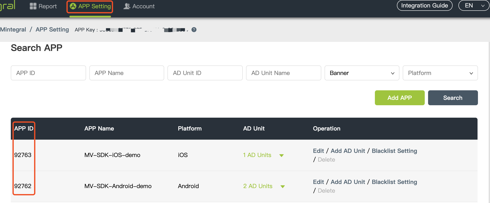
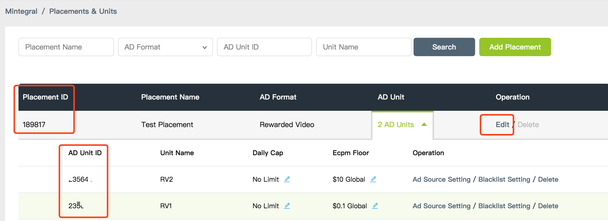
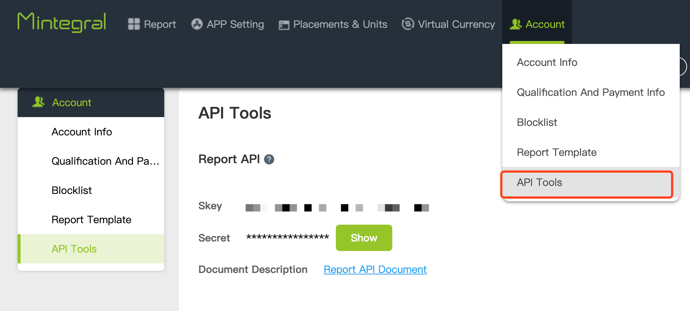
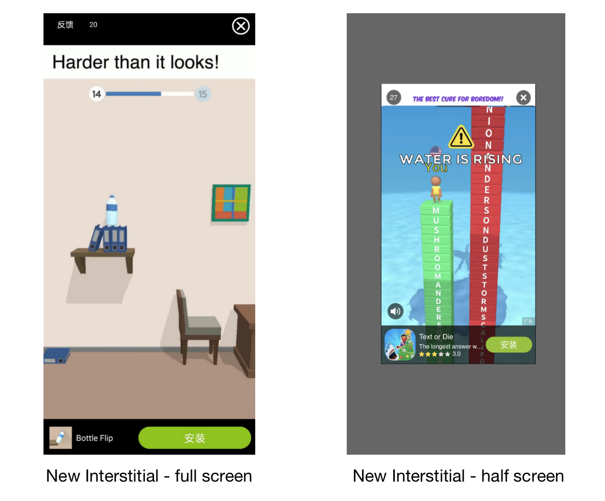
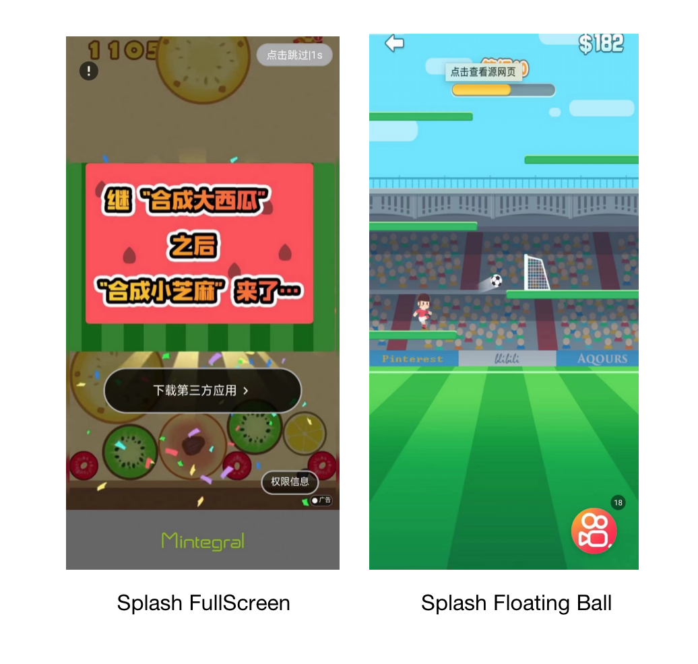

# MTGSDK Integration for iOS

## Overview
This document provides instructions on how to integrate the Mintegral SDK for iOS developers.  
The Mintegral SDK provides eight different advertisement formats: Banner, Native, Native Video,Automatic Rending Native, Rewarded Video,**New Interstitial ( New ad format )**, Interstitial(**Deprecated**), Interstitial Video(**Deprecated**), Interactive(**Remove in 7.1.0 sdk**) and Splash.


## Preparation

### Retrieve Account-Related Information


**App Key**      
Each Mintegral account has a corresponding App Key, and the key will be needed for requesting ads. It can be retreived from your Mintegral account through the following path: **APP Setting -> App Key**:  
     

**App Id**       
The M-system will automatically generate a corresponding App ID for each app created by the developer. Find the App ID(s)  here: **APP Setting -> APP ID**:        
   

**Placements & Units**    
The M-system will automatically generate a corresponding placements for each ad space created by the developer. Find the Placement Id and Unit ID here: **APP Setting -> Placement Management -> Edit Placement & Unit**  
  

**Report API**

It can be retreived from your Mintegral account through the following path: Account -> API Tools:



### Virtual Currency
MTG provides the ability to manage some virtual currencies, so that products with internal currency mechanisms can use their own virtual currencies to better motivate users. </br>
A "virtual currency" management module is added in the background to manage the developer's virtual currency information (reward information). The reward setting can be synchronized with the Placement Id of various ads types, which is convenient for developers to manage their own virtual currency.         

**Create virtual currency**      
Find the virtual currency on the right side menu bar of the dashboard and create it.         
    

**Add Currency**       

         
**Setting Currency**       
set the currency under placement id.      


### Requirements

Xcode 11.0 or higher (SDK V_6.3.3+）

Xcode 12.5 or higher (SDK V_6.9.0)

Xcode 12.0 or higher (SDK V_6.9.1+)

## Import SDK

There are two ways to add Mintegral iOS-SDK to your Xcode project: using [Cocoapods](https://github.com/Mintegral-official/MintegralAdSDK-iOS-new) or [manual integration](https://github.com/Mintegral-official/MintegralAdSDK-iOS-new/releases).Please follow the tips below to choose your integration method, click "Start Integration" to get SDK.
<iframe data-src="show_code_en.html" id="iframe_show_code_android"></iframe>


**About the SDK file size:**</br>
The common base framework will increase by about 2.2M.</br>
Integrate all ad types, the maximum increase is about 0.3M, a total of 2.5M.</br>

### Get SDK version
Search "MTGSDK.h" on MTGSDK.h file  

### iOS SDK Support WeChat Mini Program/Mini Game Jump Access Solution
Pushing a WeChat Mini Program requires developers to take the first step["register appid"](https://open.weixin.qq.com/cgi-bin/frame?t=home/app_tmpl&lang=en_US)
It means that after the user clicks on the advertisement, the user will jump to WeChat to open the WeChat applet/mini game, and the subsequent behavior conversion will occur within WeChat.
Embed the latest version of WeChat on the mobile terminal [openSDK](https://open.weixin.qq.com/)（Follow the WeChat development documentation guidelines to integrate,Be careful not to omit to register API with wechat:[WXApi registerApp:APP_ID
universalLink:UNIVERSAL_LINK]）,And confirm the version is 1.8.6 and above。 


## SDK Initialization

### Parameter configuration before initialization on manual integration

1.Import basic static libraries on manual integration

CoreGraphics.framework <br/>
Foundation.framework<br/>
UIKit.framework<br/>
libsqlite3.tbd (It's libsqlite3.dylib below Xcode7)<br/>
libz.tbd (It'slibz.dylib below Xcode7)<br/>
AdSupport.framework<br/>
StoreKit.framework<br/>
QuartzCore.framework<br/>
CoreTelephony.framework<br/>
MobileCoreServices.framework<br/>
AVFoundation.framework<br/>
WebKit.framework<br/>
	
2.Add linker parameter for XCode
Find Other Linker Flags in build settings and add flag: -ObjC (case sensitive).   

### Initialization

Initialize The SDK as soon as your app starts.Call for the MTGSDK initialization method in AppDelegate through the API below and import it to the App ID and App Key from Mintegral dashboard. When initializing, MTGSDK will retrieve configuration information from the server. **It is recommended to use the API in the main thread.** 

```objectivec
//tips:ApiKey and AppKey are the same.
- (void)setAppID:(nonnull NSString *)appID ApiKey:(nonnull NSString *)appKey;
```

Sample Code：

```objectivec
- (BOOL)application:(UIApplication *)application didFinishLaunchingWithOptions:(NSDictionary *)launchOptions{
	[[MTGSDK sharedInstance] setAppID:@"your appID" ApiKey:@"your appKey"];
}    
```

## Banner

Banner ads are rectangular image or text ads that occupy a spot within an app's layout. They stay on screen while users are interacting with the app, and can refresh automatically after a certain period of time. 

Banner sample：     


### Import the head file

```objectivec
#import <MTGSDK/MTGSDK.h>
#import <MTGSDKBanner/MTGBannerAdView.h>
#import <MTGSDKBanner/MTGBannerAdViewDelegate.h>
```

### Create MTGBannerAdView

```objectivec
/**
 /**
 This is a method to initialize an MTGBannerAdView with the given unit id
 
 @param adSize The size of the banner view.
 @param placementId The id of the ad placement id. You can create your ad placement from our Portal.
 @param unitId The id of the ad unit. You can create your unit id from our Portal.
 @param rootViewController The view controller that will be used to present full screen ads.
 @return
 */
- (nonnull instancetype)initBannerAdViewWithAdSize:(CGSize)adSize
                                       placementId:(nullable NSString *)placementId
                                            unitId:(nonnull NSString *) unitId
                                rootViewController:(nullable UIViewController *)rootViewController;

/**
 This is a method to initialize an MTGBannerAdView with the given unit id
 
 @param bannerSizeType please refer to enum MTGBannerSizeType.
 @param placementId The id of the ad placement id. You can create your ad placement from our Portal.
 @param unitId The id of the ad unit. You can create your unit id from our Portal.
 @param rootViewController The view controller that will be used to present full screen ads.
 @return
 */
- (nonnull instancetype)initBannerAdViewWithBannerSizeType:(MTGBannerSizeType)bannerSizeType
                                               placementId:(nullable NSString *)placementId
                                                    unitId:(nonnull NSString *) unitId
                                        rootViewController:(nullable UIViewController *)rootViewController;
```

The code below lists the standard banner sizes in MTGBannerSizeType.       
We recommend using 320*50, the filling rate of this size will be more guaranteed, and adjusting the size may affect income to a certain extent.

```objectivec
typedef NS_ENUM(NSInteger,MTGBannerSizeType) {
    /*Represents the fixed banner ad size - 320pt by 50pt.*/
    MTGStandardBannerType320x50,
    
    /*Represents the fixed banner ad size - 320pt by 90pt.*/
    MTGLargeBannerType320x90,
    
    /*Represents the fixed banner ad size - 300pt by 250pt.*/
    MTGMediumRectangularBanner300x250,
    
    /*if device height <=720,Represents the fixed banner ad size - 320pt by 50pt;
      if device height > 720,Represents the fixed banner ad size - 728pt by 90pt*/
    MTGSmartBannerType
};
```

### Load Ads

```objectivec
- (void)loadBannerAd;
```

### Destroy the MTGBannerAdView

```objectivec
/**
 This method will clear all the variables and properties of the MTGBannerAdView.
 
 NOTE: After calling this method, if you need to continue using the MTGBannerAdView, you must reinitialize a MTGBannerAdView
 */
- (void)destroyBannerAdView;
```

### Refreshing Ads

The MTGBannerAdView will automatically refresh your ad unit at a time interval when you set the autoRefreshTime.

```objectivec
/**
 Automatic refresh time, in seconds, is set in the range of 10s~180s.
 If set to 0, it will not be automatically refreshed.
 You need to set it before loading ad.
 */
@property(nonatomic,assign) NSInteger autoRefreshTime;
```

### Show the Close Button

```objectivec
/**
 Whether to show the close button
 MTGBoolNo means off,MTGBoolYes means on
 defalut MTGBoolUnknown
 */
@property(nonatomic,assign) MTGBool showCloseButton;
```

### Get Request ID 

If you find a problem during the ad display, you can use this method to get the Request ID and feed it back to MTG. **It needs to be called after load success**

```objectivec
/**
* get the id of this request ad,call  after adViewLoadSuccess
*/
@property(nonatomic,copy,readonly) NSString * _Nullable requestId;
```


### Sample Code

```objectivec
#import "TestViewController.h"
#import <MTGSDK/MTGSDK.h>
#import <MTGSDKBanner/MTGBannerAdView.h>
#import <MTGSDKBanner/MTGBannerAdViewDelegate.h>
@interface TestViewController ()<MTGBannerAdViewDelegate>

@property (nonatomic, strong) MTGBannerAdView *bannerAdView;


@end

@implementation TestViewController

- (void)viewDidLoad {
    [super viewDidLoad];
    if (_bannerAdView == nil) {
        _bannerAdView = [[MTGBannerAdView alloc]initBannerAdViewWithAdSize:size placementId:kBannerPlacementId unitId:kBannerUnitID rootViewController:self];
    _bannerAdView.frame = CGRectMake(10, 100, size.width,size.height);
    _bannerAdView.delegate = self;
        
        _bannerAdView.autoRefreshTime = 0;//Automatic refresh time, in seconds, is set in the range of 10s~180s.If set to 0, it will not be automatically refreshed.
      
        _bannerAdView.delegate = self;
        [self.view addSubview:_bannerAdView];
        [_bannerAdView loadBannerAd];
        
    }

}

- (IBAction)destroyButtonAction:(id)sender
{
   [_bannerAdView destroyBannerAdView];
}

#pragma mark MTGBannerAdViewDelegate
- (void)adViewLoadSuccess:(MTGBannerAdView *)adView
{
    //This method is called when adView ad slot loaded successfully.
    [self log:@"adViewLoadSuccess"];
}

- (void)adViewLoadFailedWithError:(NSError *)error adView:(MTGBannerAdView *)adView
{
    //This method is called when adView ad slot failed to load.
    [self log:[NSString stringWithFormat:@"Failed to load ads, error:%@", error.localizedDescription]];
}


- (void)adViewWillLogImpression:(MTGBannerAdView *)adView
{
    //This method is called before the impression of an MTGBannerAdView object.
    [self log:@"adViewWillLogImpression"];
}


- (void)adViewDidClicked:(MTGBannerAdView *)adView
{
    //This method is called when ad is clicked.
    [self log:@"adViewDidClicked"];
}

- (void)adViewWillLeaveApplication:(MTGBannerAdView *)adView
{
    //Sent when a user is about to leave your application as a result of tapping.Your application will be moved to the background shortly after this method is called.
    [self log:@"adViewWillLeaveApplication"];
}
- (void)adViewWillOpenFullScreen:(MTGBannerAdView *)adView
{
    //Would open the full screen view.Sent when openning storekit or openning the webpage in app.
    [self log:@"adViewWillOpenFullScreen"];
}
- (void)adViewCloseFullScreen:(MTGBannerAdView *)adView
{
    //Would close the full screen view.Sent when closing storekit or closing the webpage in app.
    [self log:@"adViewCloseFullScreen"];
}

@end
```


##  Native

Native advertisement is currently one of the most popular advertisement types. The Mintegral SDK will report back creative material information to your app. You will then be able to assemble and adjust the creative elements as needed to ensure the creative material is compatible to your product style and in turn create the best user experience.They are ad assets that are presented to users via UI components that are native to the platform. When an ad loads, your app receives an ad object that contains its assets, and your app is then responsible to assemble and format them, according to your app’s visual design. 

**Note: This ad format is only available to certain developers, please contact your AM or write to developer@mintegral.com if needed.**

**Native Ads sample：**<br/><br/>


### Import the header file

```objectivec
#import <MTGSDK/MTGSDK.h>
```

### Create MTGNativeAdManager   

```objectivec
/*
 
 Initialize the native ads manager which is for loading ads. (MTGCampaign)
 
 @param unitId The id of the ad unit. You can create your unit id from our Portal.
 @param fbPlacementId The Facebook PlacementID is used to request ads from Facebook. You can also set the placementID in our portal. The ID you set in our web portal will replace the ID you set here in future.
 @param videoSupport DEPRECATED_ATTRIBUTE Mintegral support configuration： https://www.mintegral.net
 @param numAdsRequested The number of ads you would like the native ad manager to retrieve. Max number is 10. If you pass any number bigger than 10, it will be reset to 10.
 @param viewController The UIViewController that will be used to present SKStoreProductViewController
 (iTunes Store product information) or the in-app browser. If not set, it will be the root viewController of your current UIWindow. But it may failed to present our view controller if your rootViewController is presenting other view controller. So set this property is necessary.
 */
- (nonnull instancetype)initWithPlacementId:(nullable NSString *)placementId
                                     unitID:(nonnull NSString *)unitId
                              fbPlacementId:(nullable NSString *)fbPlacementId
                               videoSupport:(BOOL)videoSupport
                         forNumAdsRequested:(NSUInteger)numAdsRequested
                   presentingViewController:(nullable UIViewController *)viewController;
```

Sample code:

```objectivec
[[MTGNativeAdManager alloc] initWithPlacementId:KNativeUnitID unitID:KNativeUnitID fbPlacementId:KPlacementID videoSupport:YES forNumAdsRequested:1 presentingViewController:self];
```

###<font color=#ff0000 >Preload Ads（Recommendation）</font>

We provide preloading  for Native (NativeVideo). You can use the following code to preload in the initialization process to improve your ad loading efficiency. The sample code is as follows:

```objectivec
/**
 *
 @method
 
 @abstract The method that kicks off the preloading of native ads. It may be called again in the future to refresh the ads manually.
 
 @param placementId The id of the ad placement. You can create your placement id from our Portal.
 @param unitId The id of the ad unit. You can create your unit id from our Portal.
 
 @param fbPlacementId The Facebook PlacementID is used to request ads from Facebook. You can also set the placementID in our portal. The ID you set in our web portal will replace the ID you set here in future.
 
 @param videoSupport If the support video ads, set videoSupport  to yes.
 
 @param numAdsRequested The number of ads you would like to preload. Max number is 10. If you pass any number bigger than 10, it will be reset to 10.
 */
- (void)preloadNativeAdsWithPlacementId:(nullable NSString *)placementId
                                 unitId:(nonnull NSString *)unitId
                          fbPlacementId:(nullable NSString *)fbPlacementId
                           videoSupport:(BOOL)videoSupport
                     forNumAdsRequested:(NSUInteger)numAdsRequested;
```

### Load Ads

When the Mintegral SDK calls this method, it will first read the advertisement from the cache. If there is an advertisement in the cache, it will return directly, which will improve the display efficiency. If there is no cache, it will send an advertisement request to the server to obtain the advertisement. The request method is as follows:

```objectivec
//request ad
- (void)loadAds;
```

### Design Ads

You can design the ad based on the callback of onAdLoaded and we provide MTGMediaView to display the image (video) ad. Call the following method to display the ad.**The best size of MTGMediaView is 16:9.**  

```objectivec
- (void)setMediaSourceWithCampaign:(MTGCampaign *)campaign unitId:(NSString*)unitId;
```
### Get Request ID 

If you find a problem during the ad display, you can use this method to get the Request ID and feed it back to MTG. **It needs to be called after load success**

```objectivec
/**
* get the id of this request ad,call  after nativeAdsLoaded.
*/
@property (nonatomic, readonly) NSString *_Nullable requestId;
```

### Adchoice
We provider MTGAdChoicesView to design the AdChoice.There are two properties of the MTGAdChoicesView.<br>
**Tip:We strongly suggest that developers can show this MTGAdChoicesView(icon) in the right location in your app, if not, it will affect your ad revenue.**


```objectivec
/**
 Initialize this view with a given frame.

 @param frame For best user experience, keep the size of this view the same as AdChoiceIcon's, which can be pulled from MTGCampaign's -adChoiceIconSize
 */
- (instancetype)initWithFrame:(CGRect)frame;

/**
 The campaign obj that provides AdChoices info, such as the image url, and click url.
 */
@property (nonatomic, weak, readwrite, nullable) MTGCampaign *campaign;
```

### Register click-event for views 


```objectivec
- (void)registerViewForInteraction:(UIView *)view withViewController:(UIViewController *)viewController withClickableViews:(NSArray *)clickableViews;
- (void)registerViewForInteraction:(UIView *)view withViewController:(UIViewController *)controller;
```


### Introduction of MTGMediaView APIs

```objectivec
#import <UIKit/UIKit.h>
#import "MTGCampaign.h"
NS_ASSUME_NONNULL_BEGIN

@protocol MTGMediaViewDelegate;
@class MTGNativeAdManager;

@interface MTGMediaView : UIView

/* For best user experience, keep the aspect ratio of the mediaView at 16:9 */
- (instancetype)initWithFrame:(CGRect)frame;
/**
the media source, can be set again to reuse this view.
*/
- (void)setMediaSourceWithCampaign:(MTGCampaign *)campaign unitId:(NSString*)unitId;


@property (nonatomic, weak, nullable) id<MTGMediaViewDelegate> delegate;

// Whether to allow full-screen playback, default YES
@property (nonatomic, assign) BOOL  allowFullscreen;

// Whether update to video from static image when video is ready to be played, default YES
@property (nonatomic, assign) BOOL  videoRefresh;

// Auto replay, default YES
@property (nonatomic, assign) BOOL  autoLoopPlay;
/* show video process view or not. Default to be YES. */
@property (nonatomic, assign) BOOL  showVideoProcessView;
/* show sound indicator view or not. Default to be YES. */
@property (nonatomic, assign) BOOL  showSoundIndicatorView;
/* mute audio output of the video player or not. Default to be YES, means video player is muted. */
@property (nonatomic, assign) BOOL mute;

@property (nonatomic, strong, readonly) MTGCampaign *campaign;

@property (nonatomic, readonly) NSString *unitId;

/**
 After called 'setMediaSourceWithCampaign:(MTGCampaign *)campaign unitId:(NSString*)unitId',
 you can check this MediaView whether has video content via isVideoContent if needed;
 */
@property (nonatomic,readonly,getter = isVideoContent) BOOL videoContent;

@end

@protocol MTGMediaViewDelegate <NSObject>

@optional

/*!
 @method
 
 @abstract
 Sent just before an MTGMediaView will enter the fullscreen layout.
 
 @param mediaView: An mediaView object sending the message.
 */
- (void)MTGMediaViewWillEnterFullscreen:(MTGMediaView *)mediaView;

/*!
 @method
 
 @abstract
 Sent after an FBMediaView has exited the fullscreen layout.
 
 @param mediaView: An mediaView object sending the message.
 */
- (void)MTGMediaViewDidExitFullscreen:(MTGMediaView *)mediaView;


/**
 *  Called when the native video was starting to play.
 *
 *  @param mediaView: An mediaView object sending the message.
 */
- (void)MTGMediaViewVideoDidStart:(MTGMediaView *)mediaView;

/**
*  Called when  the video play completed.
*
*  @param mediaView: An mediaView object sending the message.
*/
- (void)MTGMediaViewVideoPlayCompleted:(MTGMediaView *)mediaView;


/*!
 @method
 
 @abstract
 Sent after an ad has been clicked by a user.
 
 @param nativeAd An MTGCampaign object sending the message.
 */
- (void)nativeAdDidClick:(nonnull MTGCampaign *)nativeAd;
- (void)nativeAdDidClick:(nonnull MTGCampaign *)nativeAd mediaView:(MTGMediaView *)mediaView;


/*!
 @method
 
 @abstract
 Sent after an ad url did start to resolve.
 
 @param clickUrl The click url of the ad.
 */
- (void)nativeAdClickUrlWillStartToJump:(nonnull NSURL *)clickUrl;
- (void)nativeAdClickUrlWillStartToJump:(nonnull NSURL *)clickUrl mediaView:(MTGMediaView *)mediaView;

/*!
 @method
 
 @abstract
 Sent after an ad url has jumped to a new url.
 
 @param jumpUrl The url during jumping.
 
 @discussion It will not be called if a ad's final jump url has been cached
 */
- (void)nativeAdClickUrlDidJumpToUrl:(nonnull NSURL *)jumpUrl;
- (void)nativeAdClickUrlDidJumpToUrl:(nonnull NSURL *)jumpUrl  mediaView:(MTGMediaView *)mediaView;

/*!
 @method
 
 @abstract
 Sent after an ad url did reach the final jump url.
 
 @param finalUrl the final jump url of the click url.
 @param error the error generated between jumping.
 */
- (void)nativeAdClickUrlDidEndJump:(nullable NSURL *)finalUrl
                             error:(nullable NSError *)error;
- (void)nativeAdClickUrlDidEndJump:(nullable NSURL *)finalUrl
                             error:(nullable NSError *)error  mediaView:(MTGMediaView *)mediaView;

- (void)nativeAdImpressionWithType:(MTGAdSourceType)type mediaView:(MTGMediaView *)mediaView;

@end
```

### Sample code


```objectivec
#import "TestViewController.h"
#import <MTGSDK/MTGSDK.h>
#import <MTGSDK/MTGNativeAdManager.h>
@interface TestViewController ()<MTGNativeAdManagerDelegate,MTGMediaViewDelegate>

@property (nonatomic, strong) MTGNativeAdManager *nativeVideoAdManager;
@property (weak, nonatomic) IBOutlet MTGMediaView *mMediaView;
@property (weak, nonatomic) IBOutlet UIImageView *iconImageView;
@property (weak, nonatomic) IBOutlet UILabel *appNameLabel;
@property (weak, nonatomic) IBOutlet UILabel *appDescLabel;
@property (weak, nonatomic) IBOutlet UIButton *adCallButton;
@property (weak, nonatomic) IBOutlet MTGAdChoicesView *adChoicesView;
@property (weak, nonatomic) IBOutlet NSLayoutConstraint *adChoicesViewWithConstraint;
@property (weak, nonatomic) IBOutlet NSLayoutConstraint *adChoicesViewHeightConstraint;

@end

@implementation TestViewController

//Init MTGNativeAdManager
- (IBAction)initAdManagerButtonAction:(id)sender
{
    //clean old demo view
    [self cleanAllDemoView];
    if (self.currentStyleIndex == 0) {
        _nativeAdManager1 = [[MTGNativeAdManager alloc] initWithPlacementId:KNativePlacementId unitID:KNativeUnitID fbPlacementId:KPlacementID supportedTemplates:@[[MTGTemplate templateWithType:MTGAD_TEMPLATE_BIG_IMAGE adsNum:1]] autoCacheImage:NO adCategory:0 presentingViewController:self];
        _nativeAdManager1.showLoadingView = YES;
        
        _nativeAdManager1.delegate = self;
    }
    else if (self.currentStyleIndex == 1){
        _nativeAdManager2 = [[MTGNativeAdManager alloc] initWithPlacementId:PlacementId unitID:KNativeUnitID fbPlacementId:KPlacementID videoSupport:NO forNumAdsRequested:1 presentingViewController:self];
        
        _nativeAdManager3.delegate = self;
    }
    
    [self log:@"MTGNativeAdManager init"];
}


#pragma mark AdManger delegate
- (void)nativeAdsLoaded:(NSArray *)nativeAds nativeManager:(nonnull MTGNativeAdManager *)nativeManager
{
    
    if (nativeAds.count > 0) {
        MTGCampaign *campaign=nativeAds[0];
        self.mMediaView.delegate = self;
        //Set the camgaign fot the MTGmediaview
        [self.mMediaView setMediaSourceWithCampaign:campaign unitId:@"your unitid"];
        self.appNameLabel.text = campaign.appName;
        self.appDescLabel.text = campaign.appDesc;
        [self.adCallButton setTitle:campaign.adCall forState:UIControlStateNormal];
        [campaign loadIconUrlAsyncWithBlock:^(UIImage *image) {
        if (image) {
                [self.iconImageView setImage:image];
            }
        }];
        // Set the MTGAdchoiceview with frame and campaign
        if (CGSizeEqualToSize(campaign.adChoiceIconSize, CGSizeZero)) { // Suggest to hide the adChoicesView when the campaign.adChoiceIconSize equals to zero
        self.adChoicesView.hidden = YES;
    } 
        else {
        self.adChoicesView.hidden = NO;
        // Suggest to set the adChoicesView'size depends on  campaign.adChoiceIconSize
        self.adChoicesViewWithConstraint.constant = campaign.adChoiceIconSize.width;
        self.adChoicesViewHeightConstraint.constant = campaign.adChoiceIconSize.height;
    }    
        self.adChoicesView.campaign = campaign;
        [ self.nativeVideoAdManager registerViewForInteraction:self.appDescLabel.text withCampaign:campaign];
        
    }
  
}

- (void)nativeAdsFailedToLoadWithError:(NSError *)error nativeManager:(nonnull MTGNativeAdManager *)nativeManager
{
    [self log:[NSString stringWithFormat:@"Failed to load ads, error:%@", error.localizedDescription]];
}

- (void)nativeAdImpressionWithType:(MTGAdSourceType)type nativeManager:(MTGNativeAdManager *)nativeManager
{
    
}


#pragma mark MediaView delegate
- (void)MTGMediaViewWillEnterFullscreen:(MTGMediaView *)mediaView{
    [self log:@"MTGMedia View Will Enter Full Screen"];
}


- (void)MTGMediaViewDidExitFullscreen:(MTGMediaView *)mediaView{
    [self log:@"MTGMedia View Did Exit Full Screen"];
}


#pragma mark MediaView and AdManger Click delegate
- (void)nativeAdDidClick:(MTGCampaign *)nativeAd
{
    [self log:@"Registerview or mediaVie Ad is clicked"];
}

- (void)nativeAdDidClick:(MTGCampaign *)nativeAd nativeManager:(nonnull MTGNativeAdManager *)nativeManager
{
    [self log:@"Registerview Ad is clicked"];
}
- (void)nativeAdDidClick:(MTGCampaign *)nativeAd mediaView:(nonnull MTGMediaView *)mediaView
{
    [self log:@"MTGMediaView Ad is clicked"];
}
- (void)MTGMediaViewVideoPlayCompleted:(MTGMediaView *)mediaView {
    [self log:NSStringFromSelector(_cmd)];
}


@end
```

##Auto Rending Native
The Automatic Rending Native launched is simpler than ordinary Native ads. Developers only need to provide a wide and high area, and MTG will automatically display the ad templates and materials that match it. While reducing developer docking costs, more efficiently use the MTG algorithm to output advertising ideas, thereby improving developer income levels.


**NativeAdvanced Ad sample：**<br/><br/>


### Import the header file
```objectivec
#import "MTGNativeAdvancedAd.h"
```
### Create MTGNativeAdvancedAd

```objectivec
/**
This is a method to initialize.

@param adSize The nativeAdvanced ad size.We recommend that your size is set to 320 * 250.
@param placementId The id of the ad placement id. You can create your ad placement from the portal of mintegral.
@param unitId The id of the ad unit. You can create your unit id from the portal of mintegral.
@param rootViewController The view controller that will be used to present full screen ads.
@return
*/
- (nonnull instancetype)initWithPlacementID:(nullable NSString *)placementID
                                 unitID:(nonnull NSString *)unitID
                                 adSize:(CGSize)adSize
                     rootViewController:(nullable UIViewController *)rootViewController NS_DESIGNATED_INITIALIZER;
                     
```
###NativeAdvance Setting
#### Setting Style
You can set below targets：title、subTitle、button、icon、container and mediaContent.


```objectivec
/**
 This is a method to decorate the elements for the ad content.
 you can set background Color,font Size,font Family,Color and padding of the container.
 
 @param style  The setting for the elements of the ad content.
 @param target you can set title、subTitle、button、icon、container、mediaContent.
 @param values you can set background Color,font Size,font Family,Color and padding of the view.
 
 For example:
 
     NSDictionary *styles = @{
        @"list": @[
                @{
                    // target
                    @"target": @"container",
                    // values
                    @"values": @{
                    
                            @"paddingTop": @(0),
                            @"paddingRight": @(0),
                            @"paddingBottom": @(0),
                            @"paddingLeft": @(0),
                            
                            @"backgroundColor": @"#FC2E02",
                            @"fontSize": @(20),
                            @"color": @"#060602",
                            @"fontFamily": @"Apple Symbols"
                    }
               
                }
            ]
    };
      
*/
- (void)setAdElementsStyle:(NSDictionary *)style;
```
#### Mute setting
```objectivec
/**
 Whether or not to mute the video player.
 You should set YES if you want to mute the video player, otherwise NO.
*/
@property(nonatomic,assign) BOOL mute;

```
#### Auto play setting
```objectivec
/** The type to control ad video play. */
@property(nonatomic,assign) MTGNativeAdvancedAdVideoPlayType autoPlay;
```

#### Close button setting
```objectivec
/**
 Whether or not to show the close button.
 You should set YES if you want to show the close button, otherwise NO.
*/
@property(nonatomic,assign) BOOL showCloseButton;
```

### Get Request ID 

If you find a problem during the ad display, you can use this method to get the Request ID and feed it back to MTG. **It needs to be called after load success**

```objectivec
/**
* get the id of this request ad,call  after nativeAdvancedAdLoadSuccess.
*/
@property(nonatomic,copy,readonly) NSString *_Nullable requestId;
```


###Load & Show ads
####Load ads
```objectivec
/**
 Request a NativeAdvanced Ad.
*/
- (void)loadAd;
```
####Check if ads has been fully cached by calling
```objectivec
/**
 Whether or not if there was a available ad to show.

 @return YES means there was a available ad, otherwise NO.
*/
- (BOOL)isAdReady;
```
####Show ads
```objectivec
/**
 Fetch the adView

 @note If get the adView before loadSuccess, you will get a UIView without a ad, which will be  attached a ad after loadSuccess
*/
- (UIView *)fetchAdView;
```
####Destroy ads
```objectivec
/**
 Call this method when you want to relase the ad, and the adView will be removed from your presenting view.
 
 @note After calling this method, if you need to continue using the MTGNativeAdvancedAd, you must reinitialize a MTGNativeAdvancedAd
*/
- (void)destroyNativeAd;
```

### Set the MTGNativeAdvancedAdDelegate to Receive Ads Events
```objectivec
@protocol MTGNativeAdvancedAdDelegate <NSObject>


/**
 This method is called when ad is loaded successfully.
 */
- (void)nativeAdvancedAdLoadSuccess:(MTGNativeAdvancedAd *)nativeAd;
 
/**
 This method is called when ad failed to load.
 */
- (void)nativeAdvancedAdLoadFailed:(MTGNativeAdvancedAd *)nativeAd error:(NSError *)error;

/**
 Sent immediately before the impression of an MTGNativeAdvancedAd object will be logged.
 */
- (void)nativeAdvancedAdWillLogImpression:(MTGNativeAdvancedAd *)nativeAd;
 
/**
 This method is called when ad is clicked.
 */
- (void)nativeAdvancedAdDidClicked:(MTGNativeAdvancedAd *)nativeAd;
 
/**
 Called when the application is about to leave as a result of tapping.
 Your application will be moved to the background shortly after this method is called.
 */
- (void)nativeAdvancedAdWillLeaveApplication:(MTGNativeAdvancedAd *)nativeAd;
 
/**
 Will open the full screen view
 Called when opening storekit or opening the webpage in app

 */
- (void)nativeAdvancedAdWillOpenFullScreen:(MTGNativeAdvancedAd *)nativeAd;
 
/**
 Close the full screen view
 Called when closing storekit or closing the webpage in app
 */
- (void)nativeAdvancedAdCloseFullScreen:(MTGNativeAdvancedAd *)nativeAd;

/**
 This method is called when ad is Closed.
 */
- (void)nativeAdvancedAdClosed:(MTGNativeAdvancedAd *)nativeAd;

@end

```
### Sample code
```objectivec
- (void)createNewNativeAd:(CGSize)size {
    
    _adManager = [[MTGNativeAdvancedAd alloc] initWithPlacementID:kNewNativePlacementId unitID:kNewNativeUnitID adSize:CGSizeMake(320, 90) rootViewController:self];
    _adManager.delegate = self;
    
    _adManager.showCloseButton = YES;
    _adManager.mute = NO;
    _adManager.autoPlay = YES;

    NSDictionary *styles = @{
        @"list": @[
                @{
                    
                    @"target": @"container",
                   
                    @"values": @{
                    
                            @"paddingTop": @(0),
                            @"paddingRight": @(0),
                            @"paddingBottom": @(0),
                            @"paddingLeft": @(0),
                            
                            @"backgroundColor": @"#FC2E02",
                            @"fontSize": @(20),
                            @"color": @"#060602",
                            @"fontFamily": @"Apple Symbols"
                    }
               
                }
            ]
    };
   
    
    
   
    [_adManager setAdElementsStyle:styles];
    
}
- (void)loadButtonAction:(UIButton *)sender {
    [self log:@"start loading"];
    [self.adManager loadAd];

}
- (void)showButtonAction:(UIButton *)sender {
    
        if ([_adManager isAdReady]) {
            [self addAdView];
        }
}

```


## Rewarded Video 


Rewarded Video is one of the best performing advertisement formats on the Mintegral platform. Users can get rewards by watching a video advertisement. The creativity and attention-grabbing nature of the video content attracts users to download the advertised product. 

**Sample video in landscape view:**


### Import header file

To integrate rewarded videos, it is required to import the below header file:


```objectivec
#import <MTGSDK/MTGSDK.h>
#import <MTGSDKReward/MTGRewardAdManager.h>
```


### Mute
**NOTE:Must be called before loadAd**

```objectivec
/* Play the video mute or not in the beginning, defult is NO.  set true means mute*/
@property (nonatomic, assign) BOOL  playVideoMute;
```


### Setting alertView
**NOTE:Must be called before loadAd**

```objectivec
/**
*  Set alertView text,if you want to change the alertView text.
*
* @param title  alert title
* @param content    alertcontent
* @param confirmText    confirm button text
* @param cancelText     cancel button text
 
 
*/
- (void)setAlertWithTitle:(NSString *_Nullable)title
                        content:(NSString *_Nullable)content
                    confirmText:(NSString *_Nullable)confirmText
                     cancelText:(NSString *_Nullable)cancelText;
```
### Setting Reward Plus 
**NOTE:Must be called before loadAd**                
The API only means accepting the advertisement of Reward plus, and issuing rewards still depends on the reward currency parameters (MTGRewardAdInfo) of the onVideoAdDismissed callback in the SDK for reward distribution.

```objectivec
/* This method is used to open RewardPlus for RewardVideo,if you need,please set this before loadVideo,defalue NO.
*/
@property (nonatomic,assign) BOOL openRewardPlus;

sample：
[MTGRewardAdManager sharedInstance].openRewardPlus = YES;
```


### Get Request ID 

If you find a problem during the ad display, you can use this method to get the Request ID and feed it back to MTG. **It needs to be called after load success**

```objectivec
/**
* get the id of this request ad,call  after onAdLoadSuccess.
*/
- (NSString *_Nullable)getRequestIdWithUnitId:(nonnull NSString *)unitId;
```

### Load Ads

When requesting an ad, you need to pass in the UnitID of the corresponding ad slot. To allow videos to be preloaded, we recommend making your load request call as early as possible after the SDK is started. This will reduce the time users waiting for an ad to display and improve user experiences.<br>

```objectivec
/**
*  Called when load the video
 
*  @param placementId   - the placementId string of the Ad that display.
*  @param unitId      - the unitId string of the Ad that was loaded.
*  @param delegate    - reference to the object that implements MTGRewardAdLoadDelegate protocol; will receive load events for the given unitId.
*/
- (void) loadVideoWithPlacementId:(nullable NSString *)placementId
           unitId:(nonnull NSString *)unitId
         delegate:(nullable id <MTGRewardAdLoadDelegate>)delegate;
```


### Display Ads

Before displaying the advertisement, it is recommended to determine whether the ad has been successfully downloaded. If the video can play, the SDK will return the message that it is ready, and then pass the corresponding Unit ID and viewController to display the video advertisement. If the return fails, the video will be abandoned.         
**Attention: userId（can only be numbers and charcters） is the Identifier for the server-side callback,if it is in client-callback mode,it can be left <font color="#EE1111">empty.</font>**


```objectivec
/**
 *  Will return whether the given unitId is loaded and ready to be shown.
 *
 *  @param placementId - adPositionId value in Self Service
 *  @param unitId - adPositionId value in Self Service
 *
 *  @return - YES if the unitId is loaded and ready to be shown, otherwise NO.
 */
- (BOOL) isVideoReadyToPlayWithPlacementId:(nullable NSString *)placementId unitId:(nonnull NSString *)unitId;


/**
*  Called when show the video
*
*  @param placementId         - the placementId string of the Ad that display.
*  @param unitId         - the unitId string of the Ad that display.
*  @param userId       - The user's unique identifier in your system
*  @param delegate       - reference to the object that implements MTGRewardAdShowDelegate protocol; will receive show events for the given unitId.
*  @param userExtra    Optional userExtra string to include in the  reward server-to-server callback. 
*  @param viewController - UIViewController that shouold be set as the root view controller for the ad
*/
- (void)showVideoWithPlacementId:(nullable NSString *)placementId
                          unitId:(nonnull NSString *)unitId
                          userId:(nullable NSString *)userId
                       userExtra:(nullable NSString *)userExtra
                        delegate:(nullable id <MTGRewardAdShowDelegate>)delegate
                  viewController:(nonnull UIViewController*)viewController;
```


###Set up the Reward Delegate
#### MTGRewardAdLoadDelegate
```objectivec
/**
 *  This protocol defines a listener for ad video load events.
 */
@protocol MTGRewardAdLoadDelegate <NSObject>
@optional

/**
*  Called when the ad is loaded , but not ready to be displayed,need to wait load video
completely
 
*  @param placementId - the placementId string of the Ad that was loaded.
*  @param unitId - the unitId string of the Ad that was loaded.
*/
- (void)onAdLoadSuccess:(nullable NSString *)placementId unitId:(nullable NSString *)unitId;

/**
 *  Called when the ad is successfully load , and is ready to be displayed
 
 *  @param placementId - the placementId string of the Ad that was loaded.
 *  @param unitId - the unitId string of the Ad that was loaded.
 */
- (void)onVideoAdLoadSuccess:(nullable NSString *)placementId unitId:(nullable NSString *)unitId;

/**
 *  Called when there was an error loading the ad.
 
 *  @param placementId - the placementId string of the Ad that was loaded.
 *  @param unitId      - the unitId string of the Ad that failed to load.
 *  @param error       - error object that describes the exact error encountered when loading the ad.
 */
- (void)onVideoAdLoadFailed:(nullable NSString *)placementId unitId:(nullable NSString *)unitId error:(nonnull NSError *)error;

@end
```
#### MTGRewardAdShowDelegate
```objectivec
/**
 *  This protocol defines a listener for ad video show events.
 */
@protocol MTGRewardAdShowDelegate <NSObject>
@optional

/**
 *  Called when the ad display success
 
 *  @param placementId - the placementId string of the Ad that display success.
 *  @param unitId - the unitId string of the Ad that display success.
 */
- (void)onVideoAdShowSuccess:(nullable NSString *)placementId unitId:(nullable NSString *)unitId;

/**
 * Used when the integrated platform uses bidding ads
 */
- (void)onVideoAdShowSuccess:(nullable NSString *)placementId unitId:(nullable NSString *)unitId bidToken:(nullable NSString *)bidToken;
    
/**
 *  Called when the ad display success,It will be called only when bidding is used.
 
 *  @param placementId - the placementId string of the Ad that display success.
 *  @param unitId - the unitId string of the Ad that display success.
 *  @param bidToken - the bidToken string of the Ad that display success.
 */
- (void)onVideoAdShowSuccess:(nullable NSString *)placementId unitId:(nullable NSString *)unitId bidToken:(nullable NSString *)bidToken;

/**
 *  Called when the ad failed to display for some reason
 
 *  @param placementId      - the placementId string of the Ad that failed to be displayed.
 *  @param unitId      - the unitId string of the Ad that failed to be displayed.
 *  @param error       - error object that describes the exact error encountered when showing the ad.
 */
- (void)onVideoAdShowFailed:(nullable NSString *)placementId unitId:(nullable NSString *)unitId withError:(nonnull NSError *)error;

/**
 *  Called only when the ad has a video content, and called when the video play completed.
 
 *  @param placementId - the placementId string of the Ad that video play completed.
 *  @param unitId - the unitId string of the Ad that video play completed.
 */
- (void) onVideoPlayCompleted:(nullable NSString *)placementId unitId:(nullable NSString *)unitId;

/**
 *  Called only when the ad has a endcard content, and called when the endcard show.
 
 *  @param placementId - the placementId string of the Ad that endcard show.
 *  @param unitId - the unitId string of the Ad that endcard show.
 */
- (void) onVideoEndCardShowSuccess:(nullable NSString *)placementId unitId:(nullable NSString *)unitId;

/**
 *  Called when the ad is clicked
 *
 *  @param placementId - the placementId string of the Ad clicked.
 *  @param unitId - the unitId string of the Ad clicked.
 */
- (void)onVideoAdClicked:(nullable NSString *)placementId unitId:(nullable NSString *)unitId;

/**
 *  Called when the ad has been dismissed from being displayed, and control will return to your app
 *
 *  @param placementId      - the placementId string of the Ad that has been dismissed
 *  @param unitId      - the unitId string of the Ad that has been dismissed
 *  @param converted   - BOOL describing whether the ad has converted
 *  @param rewardInfo  - the rewardInfo object containing the info that should be given to your user.
 */
- (void)onVideoAdDismissed:(nullable NSString *)placementId unitId:(nullable NSString *)unitId withConverted:(BOOL)converted withRewardInfo:(nullable MTGRewardAdInfo *)rewardInfo;

/**
 *  Called when the ad  did closed;
 *
 *  @param unitId - the unitId string of the Ad that video play did closed.
 *  @param placementId - the placementId string of the Ad that video play did closed.
 */
- (void)onVideoAdDidClosed:(nullable NSString *)placementId unitId:(nullable NSString *)unitId;

@end
```


### Sample code

```objectivec
#import "MTGRewardVideoViewController.h"
#import <MTGSDKReward/MTGRewardAdManager.h>
#import <MTGSDK/MTGSDK.h>

@interface MTGRewardVideoViewController ()
<MTGRewardAdLoadDelegate,MTGRewardAdShowDelegate>


- (void)viewDidLoad {
   [[MTGRewardAdManager sharedInstance] loadVideoWithPlacementId:KRewardPlacementID unitId:KRewardUnitID delegate:self];    
}


- (IBAction)showVideoButtonAction:(id)sender
{
   //Check whether video has been downloaded successfully before displaying ad
if ([[MTGRewardAdManager sharedInstance] isVideoReadyToPlayWithPlacementId:@"your placementId" unitId:@"your unitId"]) {

     [[MTGRewardAdManager sharedInstance] showVideoWithPlacementId:@"your placementId"  unitId:@"your unitId"] withRewardId:@"your rewardid"] userId:@"" delegate:self viewController:self];
    
    } 
}
```


### Set up "Server to Server" to return the Ad reward        

Based on your needs, you can choose to set up callback through SDK or through server to server. If you set up callback through server to server, Mintegral will use the callback URL to return reward information after a video ad is played.   

1.Set up the callback URL in the dashboard<br/><br/>    
   

When the user watches the video completely, Mintegral's server will request the callback URL to send the reward infomation to your server.

2.For the callback URL, only need to change the domain name.

<https://www.sampleurl.com/mintegral?user_id={user_id}&trans_id={trans_id}&reward_amount={reward_amount}&reward_name={reward_name}&sign={sign}&unit_id={unit_id}&extra={extra}>   

3.When the Mintegral server recognizes that a user_id has earned a reward, it will inform the developer's server through the callback URL.<br><br>
**Additional parameters of the callback URL are as follow:**

Parameter    |	Description   
-------------|---------------
 user_id | User ID，set by developer 
 reward_amount | Amount of reward users should receive 
 reward_name | Reward name 
 unit_id | Unit ID 
 trans_id | Transmission ID, generated by Mintegral server, therefore is a unique ID 
 sign | Encryption identifier MD5(user_id_reward_amount_trans_id_security_key) 
 extra | An optional string custom data 

4.Once the developer's server receives the postback, it will need to return 200 or 403 to the Mintegral server.


```java
200 means：User has been rewarded successfully.

403 means：abnormal 

1.sign does not match

2.user_id does not exist

```

5.If no response is received from the developer's server 20 seconds after the Mintegral server initiates a postback, Mintegral will retry every 5 minutes for the next 24 hours.

## New Interstitial

The new interstitial ad is an upgraded version of the interstitial ad. You can choose the size of the ad in the dashboard. it is divided into full-screen and half-screen. In both full-screen and half-screen scenarios, developers can choose the type of ads to run, which are image + video, Video only, image only. It is suitable for use when switching more application scenarios.

**Sample video in portrait view：**




### Import the header file   

```c
#import "MTGNewInsterstialViewController.h"
#import <MTGSDKNewInterstitial/MTGSDKNewInterstitial.h>
#import <MTGSDKNewInterstitial/MTGNewInterstitialAdManager.h>
```

### Create the MTGNewInterstitialAdManager

When initializing, you need to pass in the ad's Placement Id and Unit Id. 

```c
/**
*   Initialize the MTGNewInterstitialAdManager ads manager.
*  @param placementId     The id of the ad placement. You can create your placement id from our Portal.
*  @param unitId         The id of the ad unit. You can create your unit id from our Portal.
*  @param delegate       - reference to the object that implements. 
*/
- (nonnull instancetype)initWithPlacementId:(nonnull NSString *)placementId
                                     unitId:(nonnull NSString *)unitId
                                   delegate:(nullable id<MTGNewInterstitialAdDelegate>)delegate;
```

### Load and show Ads

```c
/** Begins loading ad content. */
- (void)loadAd;

/**
*  Whether or not if there was an available ad to show.
 @return YES means there was a available ad, otherwise NO.
*/
- (BOOL)isAdReady;

/**
 * Presents the NewInterstitial ad modally from the specified view controller.
 *
 * @param viewController The view controller that should be used to present the  ad.
 */
- (void)showFromViewController:(UIViewController *_Nonnull)viewController;

```

### Mute

**Make sure make this call before load**

```objectivec
/** Play the video is mute in the beginning ,defult is NO */
@property (nonatomic, assign) BOOL  playVideoMute;
```

### Setting Interstitial Video RewardMode

**Make sure make this call before load**

```c
/**
  * Set NewInterstitial  reward if you need，call before loadAd.
  * @param rewardMode  {@link MTGNIRewardMode} for list of supported types
  * @param playRate Set the timing of the reward alertView,range of 0~1(eg:set 0.6,indicates 60%).
  NOTE:In MTGNIRewardPlayMode, playRate value indicates that a reward alertView will appear when the playback reaches the set playRate.
       In MTGNIRewardCloseMode, playRate value indicates that when the close button is clicked, if the video playback time is less than the set playRate, reward alertView will appear.
 */
- (void)setRewardMode:(MTGNIRewardMode)rewardMode playRate:(CGFloat)playRate;

/**
 * Set NewInterstitial reward if you need，call before loadAd.
 * @param rewardMode  {@link MTGNIRewardMode} for list of supported types
 * @param playTime Set the timing of the reward alertView,range of 0~100s.
 NOTE:In MTGNIRewardPlayMode, playTime value indicates that a reward alertView will appear when the playback reaches the set playTime.
      In MTGNIRewardCloseMode, playTime value indicates that when the close button is clicked, if the video playback time is less than the set playTime, reward alertView will appear.
*/
- (void)setRewardMode:(MTGNIRewardMode)rewardMode playTime:(NSInteger)playTime;

/**
*  Call this method when you want custom the reward alert  display text.
*
* @param title  alert title
* @param content    alertcontent
* @param confirmText    confirm button text
* @param cancelText     cancel button text
 
 NOTE:Must be called before loadAd
*/
- (void)setAlertWithTitle:(NSString *_Nullable)title
                  content:(NSString *_Nullable)content
              confirmText:(NSString *_Nullable)confirmText
               cancelText:(NSString *_Nullable)cancelText;

```

### Get Request ID 

If you find a problem during the ad display, you can use this method to get the Request ID and feed it back to MTG. **It needs to be called after load success**

```objectivec
/**
* get the id of this request ad,call  after onInterstitialAdLoadSuccess.
*/
- (NSString *_Nullable)getRequestIdWithUnitId:(nonnull NSString *)unitId;

```

### Sample code  

```c
#import "MTGNewInsterstialViewController.h"
#if __has_include(<MTGSDK/MTGSDK.h>)
#import <MTGSDKNewInterstitial/MTGSDKNewInterstitial.h>
#import <MTGSDKNewInterstitial/MTGNewInterstitialAdManager.h>


@property (nonatomic,strong)  MTGNewInterstitialAdManager *ivAdManager;


- (void)viewDidLoad {
    [super viewDidLoad];
    
    self.view.backgroundColor = [UIColor whiteColor];
    
    [self createDemoButtons];
//    [self createMoreUnit];
    
    _ivAdManager = [[MTGNewInterstitialAdManager alloc] initWithPlacementId:KInterstitialVideoPlacementId2 unitId:KInterstitialVideoUnitID2 delegate:self];
}


- (IBAction)initAdManagerButtonAction:(id)sender
{
    if (!_ivAdManager) {
        _ivAdManager = [[MTGNewInterstitialAdManager alloc]initWithPlacementId:KInterstitialVideoPlacementId unitId:KInterstitialVideoUnitID delegate:self];
        [self log:@"MTGNewInterstitialAdManager init"];

    }
}

- (IBAction)loadInsterstialButtonAction:(id)sender
{
    if (self.bidSwitch) {
       // [AppDelegate setCustomInfo:@"iv bid load" type:1 unitId:KInterstitialVideoUnitID];
        [_ivBidAdManager setRewardMode:MTGNIRewardPlayMode playTime:8];
        [_ivBidAdManager loadAdWithBidToken:self.bidToken];
    } else {
      //  [AppDelegate setCustomInfo:@"iv load" type:0 unitId:KInterstitialVideoUnitID];
        [_ivAdManager setRewardMode:MTGNIRewardCloseMode playRate:0.5];
        [_ivAdManager loadAd];
    }
}

//Show Video
- (IBAction)showVideoButtonAction:(id)sender
{
    MTGNewInterstitialAdManager *manager = nil;
    if (!self.bidSwitch) {
        manager = _ivAdManager;
    } else {
        manager = (MTGNewInterstitialAdManager *)_ivBidAdManager;
    }
    //Check isReady before you show a reward video
    if ([manager isAdReady]) {
        [self log:@"Show iv video"];
        [manager showFromViewController:self];
    } else {
        //We will help you to load automatically when isReady is NO
        [self log:[NSString stringWithFormat:@"No ad to show"]];
    }
}


- (void)isReadyButtonAction:(UIButton *)button {
    
    MTGNewInterstitialAdManager *manager = nil;
    if (!self.bidSwitch) {
        manager = _ivAdManager;
    } else {
        manager = (MTGNewInterstitialAdManager *)_ivBidAdManager;
    }
    if ([manager isAdReady]) {
        [self log:[NSString stringWithFormat:@"video ready: true"]];
    } else {
        [self log:[NSString stringWithFormat:@"video ready: false"]];
    }
    
}


#pragma mark - MTGNewInterstitialAdDelegate


- (void)newInterstitialAdLoadSuccess:(MTGNewInterstitialAdManager *_Nonnull)adManager {
    [self log:NSStringFromSelector(_cmd)];

}


- (void)newInterstitialAdResourceLoadSuccess:(MTGNewInterstitialAdManager *_Nonnull)adManager {
    [self log:NSStringFromSelector(_cmd)];

}


- (void)newInterstitialAdLoadFail:(nonnull NSError *)error adManager:(MTGNewInterstitialAdManager *_Nonnull)adManager {
    [self log:NSStringFromSelector(_cmd)];

}


- (void)newInterstitialAdShowSuccess:(MTGNewInterstitialAdManager *_Nonnull)adManager {
    [self log:NSStringFromSelector(_cmd)];

}


- (void)newInterstitialAdShowFail:(nonnull NSError *)error adManager:(MTGNewInterstitialAdManager *_Nonnull)adManager {
    [self log:NSStringFromSelector(_cmd)];

}


- (void)newInterstitialAdPlayCompleted:(MTGNewInterstitialAdManager *_Nonnull)adManager {
    [self log:NSStringFromSelector(_cmd)];

}


- (void)newInterstitialAdEndCardShowSuccess:(MTGNewInterstitialAdManager *_Nonnull)adManager {
    [self log:NSStringFromSelector(_cmd)];

}


- (void)newInterstitialAdClicked:(MTGNewInterstitialAdManager *_Nonnull)adManager {
    [self log:NSStringFromSelector(_cmd)];

}


- (void)newInterstitialAdDismissedWithConverted:(BOOL)converted adManager:(MTGNewInterstitialAdManager *_Nonnull)adManager {
    [self log:NSStringFromSelector(_cmd)];

}


- (void)newInterstitialAdDidClosed:(MTGNewInterstitialAdManager *_Nonnull)adManager {
    [self log:NSStringFromSelector(_cmd)];

}

	 /**
	*  If iv reward is set, you will receive this callback
	*  @param rewardedOrNot  A sign to judge whether a reward can be given
	* @param alertWindowStatus MTGIVAlertWindowStatus
	*/
- (void)newInterstitialAdRewarded:(BOOL)rewardedOrNot alertWindowStatus:(MTGNIAlertWindowStatus)alertWindowStatus adManager:(MTGNewInterstitialAdManager *_Nonnull)adManager {
    [self log:NSStringFromSelector(_cmd)];

}
@end
```


## Splash Ads

SplashAD is one of the most popular forms of advertising. This type is more suitable for placing e-commerce and brand advertisements, and traffic access is also very suitable for accessing application-type traffic. Users can click on the ad to jump to the ad landing page, or click on the "skip" button in the upper right corner to jump to the app content home page. It will load when your app is opened, and automatically close and enter your app's main interface after the display is complete. It supports the definition of logo images, and also supports vertical and horizontal screens.

**Splash Ad UI sample:**    

 

### Import the header file   

```objectivec
#import <MTGSDK/MTGSDK.h>
#import <MTGSDKSplash/MTGSplashAD.h>
```
### Initialize the MTGSplashAD  

When initializing MTGSplashAD, you can set the countdown (if not set, the default is 5s), whether to allow the setting to be skipped (if not set, the default is to allow skipping), half screen and full screen settings (customizable Size), horizontal and vertical screen settings (if not set, the default is using the current orientation of the device)


```objectivec
/**
 Initialize a MTGSplashAD instance.
 @param placementId placementId String.
 @param unitID unitID String.
 @param countdown time duration of the ad can be showed. Should be range of 2-10s.
 @param allowSkip Whether or not to allow user to skip ad when showing.
 
 */
- (instancetype)initWithPlacementID:(nullable NSString *)placementID
                             unitID:(NSString *)unitID
                          countdown:(NSUInteger)countdown
                          allowSkip:(BOOL)allowSkip;

/**
 Initialize a MTGSplashAD instance with more detailed info.

 @param placementId placementId String.
 @param unitID unitID String.
 @param countdown time duration of the ad can be showed. Should be range of 2-10s.
 @param allowSkip whether or not to allow user to skip ad when showing.
 @param customViewSize if you want to display your own custom view on the ad area, you should pass the corresponding CGSize of your custome view.
 @param preferredOrientation specify preferred orientation to show the ad.
 
 @note  1. when you showing ad on the portrait mode, the height of the customViewSize should not           greater than 25% of the device's height.
        2. when you showing ad on the landscape mode, the width of the customViewSize should not greater than 25% of the device's width.
 */
- (instancetype)initWithPlacementID:(nullable NSString *)placementID
                             unitID:(NSString *)unitID
                          countdown:(NSUInteger)countdown
                          allowSkip:(BOOL)allowSkip
                     customViewSize:(CGSize)customViewSize
               preferredOrientation:(MTGInterfaceOrientation)preferredOrientation;
```

**Note：customViewSize should not greater than 25% of the device's size**

### Set delegate

```objectivec
/* Set delegate to receive protocol event.  */
@property (nonatomic, weak) id <MTGSplashADDelegate> delegate;
```

#### Set Splash Floating Ball

You can enable the splash floating ball at Splash placementid setting in the Mintegral dashboard. When the AD is skipped or automatically closed, the ball will automatically shrink to the bottom right of the screen and can be dragged. You can also customize the size and location of the float ad view. This function will increase your income. We strongly suggest that you can enable it.

```objectivec
@protocol MTGSplashADDelegate <NSObject>

  /** Default SplashZoomOutView will zoomed out to bottom right corner,
   Use this method to give another specific origin. */
- (CGPoint)pointForSplashZoomOutADViewToAddOn:(MTGSplashAD *)splashAD;

/** Default SplashZoomOutView will zoomed out to bottom right corner,
   Use this method to give another specific frame and custom layout.
   @note: see MTGSplashZoomOutViewCustomLayoutType for more details.
 */
- (UIView *)superViewForSplashZoomOutADViewToAddOn:(MTGSplashAD *)splashAD;

/* Called when splash zoomout view did show. */
- (void)splashZoomOutADViewDidShow:(MTGSplashAD *)splashAD;

/* Called when splash zoomout view closed. */
- (void)splashZoomOutADViewClosed:(MTGSplashAD *)splashAD;

```

#### MTGSplashZoomOutViewCustomLayoutType

```objectivec
/** Currently, we only support these three kinds of height to layout custom SplashZoomOutView, other height will results unexpected behavior. */
typedef NS_ENUM(NSInteger, MTGSplashZoomOutViewCustomLayoutType) {
    /*Represents 28pt height.*/
    MTGSplashZoomOutViewCustomLayoutTypeSmallHeight = 28,
    
    /*Represents 50pt height.*/
    MTGSplashZoomOutViewCustomLayoutTypeMediumHeight = 50,
    
    /*Represents 250pt height.*/
    MTGSplashZoomOutViewCustomLayoutTypeLargeHeight = 250
};
```

#### Destroy SplashZoomOutView

```objectivec
/** Call this method when you want to relase splashZoomOutView. */
- (void)destroySplashZoomOutView;
```


### Background image & color

```objectivec
/* Set this to show your own background image when loading ad. */
@property (nonatomic, strong) UIImage *backgroundImage;

/* Set this to show your own background color when loading ad. */
@property (nonatomic, copy) UIColor *backgroundColor;
```

### There are two ways to load and show ads
**（Recommend）Load ads first, and then show at the right time, which two steps are separated.<br>**
Please call preload at an appropriate time. The interval between preload and show should not be too long during the life cycle of the app. It is recommended that it should not exceed 30 minutes. After calling preload, when you need to call show method, you can use isADReadyToShow to determine whether it can be displayed. If it is YEs, call show method. If it is No, you can call loadAndShowInKeyWindow.
**Load and show ads, which two steps are done by one method.<br>**

### Load first, and then show at the right time 

**Note:**
1. You can call the isADReadyToShow method before show ads to detect whether there are cached ads locally.  
2. The customView parameter can pass the custom pictures. (The customView's size should be the same as the customSize set when initializing splashAD, and in case of inconsistency is based on the customView size, which was previously reserved for the logo.)

```objectivec
/**
 Preload a ad and then use `[MTGSplashAD showInKeyWindow:customView:]` to show the ad.
 @note  You should always call this method on the main thread.
 */
- (void)preload;

/**
 Whether or not if there was a available ad to show.

 @return YES means there was a available ad, otherwise NO.
 */
- (BOOL)isADReadyToShow;

/**
 if there was a available ad to show, you can call this method to show the ad.
 
 @param window must be the key window of the application.
 @param customView display your own custom view, e.g. logo view.

 @note  You should always call this method on the main thread.
 */
- (void)showInKeyWindow:(UIWindow *)window customView:(nullable UIView *)customView;

```

### Load and show ads

timeout: If the SDK does not complete the ad loading (i.e. the load times out) within a specified time, it closes directly. The unit is ms. If passed 0, the value is 5000ms. 
```objectivec
/**
 Show the ad after load successfully.

 @param window must be the key window of the application.
 @param customView display your own custom view, e.g. logo view.
 @param timeout load timeout, unit should be millisecond. If you passed 0 then 5000ms would be used.
 
 @note  You should always call this method on the main thread.
 */
- (void)loadAndShowInKeyWindow:(UIWindow *)window
                   customView:(nullable UIView *)customView
                    timeout:(NSInteger)timeout;
```

The cache is flushed every time preload is called. You can call preload, then showInKeyWindow: customView, or preload, then showloadShowShowInKeyWindows:customView:timeout:, Both calls take precedence over the cache after the call to preload. 

### MTGSplashAD callback

```objectivec
/* Called when preloading ad successfully. */
- (void)splashADPreloadSuccess:(MTGSplashAD *)splashAD;
/* Called when preloading ad failed. */
- (void)splashADPreloadFail:(MTGSplashAD *)splashAD error:(NSError *)error;
/* Called when loading ad successfully. */
- (void)splashADLoadSuccess:(MTGSplashAD *)splashAD;
/* Called when loading ad failed. */
- (void)splashADLoadFail:(MTGSplashAD *)splashAD error:(NSError *)error;
/* Called when showing ad successfully. */
- (void)splashADShowSuccess:(MTGSplashAD *)splashAD;
/* Called when showing ad failed. */
- (void)splashADShowFail:(MTGSplashAD *)splashAD error:(NSError *)error;
/* Called when the application is about to leave as a result of tap event.
   Your application will be moved to the background shortly after this method is called. */
- (void)splashADDidLeaveApplication:(MTGSplashAD *)splashAD;
/* Called when click event occured. */
- (void)splashADDidClick:(MTGSplashAD *)splashAD;
/* Called when ad is about to close. */
- (void)splashADWillClose:(MTGSplashAD *)splashAD;
/* Called when ad did close. */
- (void)splashADDidClose:(MTGSplashAD *)splashAD;
/* Called when remaining countdown update. */
- (void)splashAD:(MTGSplashAD *)splashAD timeLeft:(NSUInteger)time;
/* Default SplashZoomOutView will zoomed out to bottom right corner,
   Use this method to give another specific origin. */
- (CGPoint)pointForSplashZoomOutADViewToAddOn:(MTGSplashAD *)splashAD;
/* Default SplashZoomOutView will zoomed out to bottom right corner,
   Use this method to give another specific frame and custom layout.
   @note: see MTGSplashZoomOutViewCustomLayoutType for more details.
 */
- (UIView *)superViewForSplashZoomOutADViewToAddOn:(MTGSplashAD *)splashAD;
/* Called when splash zoomout view did show. */
- (void)splashZoomOutADViewDidShow:(MTGSplashAD *)splashAD;
/* Called when splash zoomout view closed. */
- (void)splashZoomOutADViewClosed:(MTGSplashAD *)splashAD;
```

### Sample code

```objectivec

#import "MTGSplashAdViewController.h"
#import <MTGSDKSplash/MTGSplashAD.h>
#import <MTGSDK/MTGSDK.h>

@interface MTGSplashAdViewController () <MTGSplashADDelegate>

@property (nonatomic, strong) MTGSplashAD *splashAD;
@property (nonatomic, strong) UISwitch *useLogo;
@property (nonatomic, strong) UISwitch *skip;

- (void)createSplashAD {

    if (self.useLogo.on) {
        self.splashAD = [[MTGSplashAD alloc]initWithPlacementID:kSplashPlacementID unitID:kSplashUnitID countdown:10 allowSkip:self.skip.on customViewSize:CGSizeMake(200, 95) preferredOrientation:0];
    } else {
        self.splashAD = [[MTGSplashAD alloc]initWithPlacementID: kSplashPlacementID unitID:kSplashUnitID countdown:10 allowSkip:self.skip.on customViewSize:CGSizeZero preferredOrientation:0];

    }    
}

//Load Video
- (IBAction)preloadButtonAction:(id)sender{
    [self createSplashAD];

    [self log:@"splash ad is loading"];
    [self.splashAD preload];
    
}
//isReady
- (void)isReadyButtonAction:(UIButton *)button {
    [self createSplashAD];

    BOOL ready = [self.splashAD isADReadyToShow];
    [self log:[NSString stringWithFormat:@"isReady : %@", ready ? @"true" : @"false"]];

}

//Show Video
- (IBAction)showButtonAction:(id)sender
{
    [self createSplashAD];

    UIWindow *keyWindow = [UIApplication sharedApplication].keyWindow;
    UIView *logoView = nil;

    if (self.useLogo.on) {
        logoView = [self logoView];
    }
    
    [self.splashAD showInKeyWindow:keyWindow customView:logoView];
    
}
//LoadNShow
- (void)LoadNShowButtonAction:(UIButton *)btn {
    
    [self createSplashAD];
    
    UIView *logoView = nil;
    if (self.useLogo.on) {
        logoView = [self logoView];
    }
    
    [self log:@"splash ad is loading"];
    UIWindow *keyWindow = [UIApplication sharedApplication].keyWindow;
    [self.splashAD loadAndShowInKeyWindow:keyWindow customView:logoView timeout:5000];

}
//logoView
- (UIView *)logoView {

    UIImageView *logo = [[UIImageView alloc] initWithImage:[UIImage imageNamed:@"logo"]];
    logo.frame = CGRectMake(0, 0, 100, 100);
    return logo;
}

#pragma mark - Delegate
- (void)splashADPreloadSuccess:(MTGSplashAD *)splashAD {
    [self log:[NSString stringWithFormat:@"unitId = %@, preload success", splashAD.unitID]];
    if (splashAD.splashZoomOutView) {
        [self createFloatContainer];
    }
    [self showButtonAction:nil];
}
- (void)splashADPreloadFail:(MTGSplashAD *)splashAD error:(NSError *)error {
    [self log:[NSString stringWithFormat:@"unitId = %@, preload error : %@", splashAD.unitID, error]];
    //self.window.hidden = YES;
}

- (void)splashADLoadSuccess:(MTGSplashAD *)splashAD {
    [self log:[NSString stringWithFormat:@"unitId = %@, load success", splashAD.unitID]];
    if (splashAD.splashZoomOutView) {
        [self createFloatContainer];
    }
  }
- (void)splashADLoadFail:(MTGSplashAD *)splashAD error:(NSError *)error {
    [self log:[NSString stringWithFormat:@"unitId = %@, load error : %@", splashAD.unitID, error]];
}

- (void)splashADShowSuccess:(MTGSplashAD *)splashAD {
    [self log:[NSString stringWithFormat:@"unitId = %@, show success", splashAD.unitID]];
}
- (void)splashADShowFail:(MTGSplashAD *)splashAD error:(NSError *)error {
    [self log:[NSString stringWithFormat:@"unitId = %@, show error : %@", splashAD.unitID, error]];

}

- (void)splashADDidLeaveApplication:(MTGSplashAD *)splashAD {
    [self log:[NSString stringWithFormat:@"unitId = %@, leave app", splashAD.unitID]];
}


- (void)splashADDidClick:(MTGSplashAD *)splashAD {
    [self log:[NSString stringWithFormat:@"unitId = %@, did click", splashAD.unitID]];
}


- (void)splashADWillClose:(MTGSplashAD *)splashAD {
    [self log:[NSString stringWithFormat:@"unitId = %@, ad will close", splashAD.unitID]];

}
- (void)splashADDidClose:(MTGSplashAD *)splashAD {
    [self log:[NSString stringWithFormat:@"unitId = %@, ad closed", splashAD.unitID]];
    UIWindow *fK = [[UIApplication sharedApplication] keyWindow];
    if (self.window != fK) {
        //self.window.hidden = YES;
    }
}

// countdown
- (void)splashAD:(MTGSplashAD *)splashAD timeLeft:(NSUInteger)time {
    [self log:[NSString stringWithFormat:@"unitId = %@, ad countdown : %@", splashAD.unitID, @(time)]];
}

- (UIView *)superViewForSplashZoomOutADViewToAddOn:(MTGSplashAD *)splashAD {
    
    if (self.customView.on) {
        return self.floatContainerView;
    }
    return nil;
}

- (CGPoint)pointForSplashZoomOutADViewToAddOn:(MTGSplashAD *)splashAD {
    return CGPointZero;
    // custom zoomview location
    CGSize size = CGSizeMake(100, 100);
    CGFloat bottom = 450;
    CGFloat right = 16;
    CGFloat screenW = [UIScreen mainScreen].bounds.size.width;
    CGFloat screenH = [UIScreen mainScreen].bounds.size.height;
    return CGPointMake(screenW - size.width - right, screenH - size.height - bottom);
}


/* Called when splash zoomout view did show. */
- (void)splashZoomOutADViewDidShow:(MTGSplashAD *)splashAD {
    
}

/* Called when splash zoomout view is about to close. */
- (void)splashZoomOutADViewClosed:(MTGSplashAD *)splashAD {
    [self log:[NSString stringWithFormat:@"unitId = %@, float ad closed", splashAD.unitID]];
}

@end
```


## Test ID
The Ads you get during the test is the official Ads of Mintegral, so it will be affected by the intelligent optimization of the algorithm. If the loading fails frequently during the test and returns EXCEPTION_RETURN_EMPTY, you can use the following test id for testing.

| AppKey              | 7c22942b749fe6a6e361b675e96b3ee9 |                        |                   |
| ------------------- | -------------------------------- | ---------------------- | ----------------- |
| **AppID**           | **150180**                       |                        |                   |
| **Ad Format**       | **Placement ID**                 | **Traditional Unitid** | **Bid Unitid**    |
| Banner              | 328859                           | 1541917                | 1541918           |
| Rewarded Video      | 328865                           | 1541933                | 1541935           |
| New Interstitial| 328874                           | 1541950                | 1541952           |
| Splash              | 328894                           | 1541984                | 1541983           |
| Custom Native       | 328861                           | 1541925                | 1541926           |
| Native H5           | 328863                           | 1541929                | 1592866 |
| Static Interstitial(Deprecated) | 328870                           | 1541943                | Don't Support Bid |


## Data comparison
When developers use the advertising interface callback method to calculate the number of fills and impressions, if there is a large deviation from the data on the Portal, please make sure that the statistical callback is consistent with the callback interface in the table below.

| advertisement form   | filling  | show  | remark  |
|:------:|:---:|:---:|:---:|
| Rewarded Video   |   - (void)onAdLoadSuccess  |  - (void)onVideoAdShowSuccess   |   This fill callback means that an offer is issued, but it does not mean that the broadcast status is satisfied  |
| Interstitial Video   |  - (void) onInterstitialAdLoadSuccess   |   - (void) onInterstitialVideoShowSuccess  |  This fill callback means that an offer is issued, but it does not mean that the broadcast status is satisfied   |
| Native   |   - (void)nativeAdsLoaded  |     - (void)nativeAdImpressionWithType|     |
| Automatic Rending Native |   - (void)nativeAdvancedAdLoadSuccess  |   - (void)nativeAdvancedAdWillLogImpression  |     |
| Static Interstitial |  - (void) onInterstitialLoadSuccess   |   - (void) onInterstitialShowSuccess  |     |
| Splash   |   - (void)splashADLoadSuccess  |  - (void)splashADShowSuccess   |     |
|  Banner |  - (void)adViewLoadSuccess   |  - (void)adViewWillLogImpression   |     |       

## The description of return-status 
code of status | message | description
------|-----------|------
-1 | EXCEPTION_RETURN_EMPTY | ads no fill
-10 | EXCEPTION_SIGN_ERROR | AppID and appKey do not match correctly
-9 | EXCEPTION_TIMEOUT | request timeout
-1201 | EXCEPTION_UNIT_NOT_FOUND | Can not find the unitID in dashboard
-1202 | EXCEPTION_UNIT_ID_EMPTY | unitID is empty
-1203 | EXCEPTION_UNIT_NOT_FOUND_IN_APP | Can not find the unitID of the appID
-1205 | EXCEPTION_UNIT_ADTYPE_ERROR | The adtype of the unitID is wrong
-1208| EXCEPTION_UNIT_BIDDING_TYPE_ERROR| The UnitID bidding type does not match the request API. The UnitID  cannot be changed bidding type, need creat a new UnitID again
-1301 | EXCEPTION_APP_ID_EMPTY| appID is empty
-1302 | EXCEPTION_APP_NOT_FOUND | Can not find the appId
-1904 | EXCEPTION_IV_RECALLNET_INVALIDATE | The network status at the time of the request is incorrect. Generally， because of the SDK initialization is not completed yet when the request has been sent .
-1915| EXCEPTION_FILTER_BY_PLACEMENTID_INCONSISTENT|PlacementID is wrong
-2102 | EXCEPTION_SERVICE_REQUEST_OS_VERSION_REQUIRED | Unable to get os_version, usually caused by GDPR configuration returning false 
-129300060 |  kMTGErrorCodeUnknownError |Unknown Error
-129300061 |  kMTGErrorCodeRewardVideoFailedToLoadVideoData|Invalid Ads
-129300068 |  kMTGErrorCodeRewardVideoFailedToLoadMd5Invalid|MD5 checked failed
-129300001 |  KMTGErrorCodeEmptyUnitId|unit id is empty
-129300002 |  KMTGErrorCodeEmptyBidToken|BidToken is empty
-12930001  |  kMTGErrorCodeNoAds|No Ads fill
-12930003  |  kMTGErrorCodeURLisEmpty|Url is Empty
-12930004  |  kMTGErrorCodeNoAdsAvailableToPlay|No available ads to play
-12930006  |  kMTGErrorCodeFailedToLoad|Load ads failed
-12930007  |  kMTGErrorCodeFailedToShow|Show ads failed
-12930009  |  kMTGErrorCodeDailyLimit|video play reach daily limit,please check unit setting on dashboard
-12930010  |  kMTGErrorCodeLoadAdsTimeOut|Load timeout
-12930011  |  kMTGErrorCodeMaterialLoadFailed|load resource failed
-12940001  |  kMTGErrorCodeNoSupportPopupWindow|not support PopupWindow with GDPR
-1004            |    kCFURLErrorCannotConnectToHost | The connection failed because a connection can’t be made to the host.
-999             |    kCFURLErrorCancelled | The connection was cancelled.
-1000            |   kCFURLErrorBadURL  |  The connection failed due to a malformed URL
-1200           |   kCFURLErrorSecureConnectionFailed | The secure connection failed for an unknown reason.
-1001           |   kCFURLErrorTimedOut  | The connection timed out.


## SDK Privacy Compliance Statement
**iOS 14 Publisher Guide**</br>
The intention of this guide is to help publishers streamline changes coming with Apple’s release of iOS 14.

### Checklist

1. Update to MTG iOS SDK 6.6.0 with iOS 14 and SKAdNetwork support
2. Incorporate MTGSDK’s SKAdNetwork IDs into your apps’ Info.plist


### SKAdNetwork IDs
SKAdNetwork is Apple's attribution solution for iOS 14, which can complete advertising attribution while protecting user privacy. After using SKAdNetwork, even if IDFA is not available, the attribution results of app installation can be correctly obtained. See Apple’s [SKAdNetwork](https://developer.apple.com/documentation/storekit/skadnetwork) to learn more.         

#### Update your plist with SKAdNetwork identifiers

Refer to [Apple’s documentation](https://developer.apple.com/documentation/storekit/skadnetwork/configuring_the_participating_apps) on configuring the Info.plist properly for ad campaigns to be served. Refer also to the [Xcode documentation](https://help.apple.com/xcode/mac/current/#/dev3f399a2a6) for help on editing property lists.

Follow these steps to configure your app with SKAdNetworkIDs :

1. Inside the Xcode Project navigator, open Info.plist file.
2. Click the add button (**+**) next to a key in a property list inside the Info.plist file in order to create a new property key. 
3. Enter SKAdNetworkItems and select **Array** in the type column.
4. Add a dictionary item, then add a single String item inside the dictionary.
5. For each String item, add SKAdNetworkIdentifier as the key and the ad network identifier as the value.

Mintegral hosts the MTG SKAdNetwork ID and the list of our buyers' SKAdNetwork IDs in both JSON and XML formats on our website. Note that our lists are updated periodically:

[List of SKAdNetwork IDs in JSON](https://dev.mintegral.com/skadnetworkids.json)

[List of SKAdNetwork IDs in XML](https://dev.mintegral.com/skadnetworkids.xml)

### App Tracking Transparency
The AppTrackingTransparency(ATT) framework presents an app-tracking authorization request to the user and provides the tracking authorization status.            
Starting from iOS 14, IDFA will be unavailable until your app calls the ATT framework to present the app-tracking authorization request to the end user. If your app does not present this request, the IDFA will automatically be zeroed out which may lead to a significant loss in ad revenue.Read more on Apple’s [ATT](https://developer.apple.com/documentation/apptrackingtransparency).         
**We recommended that you call it when the app launch, so that we can more personalized and relevant advertisements can be presented to the users.**

To display the ATT authorization request for accessing the IDFA, update your Info.plist to add the NSUserTrackingUsageDescription key with a custom message describing your usage.        
Sample：     

```objectivec
<key>NSUserTrackingUsageDescription</key>
<string>This identifier will be used to deliver personalized ads to you.</string>
```
To present the authorization request, call below code before load ads.              `requestTrackingAuthorizationWithCompletionHandler:`           
```objectivec
#import <AppTrackingTransparency/AppTrackingTransparency.h>
#import <AdSupport/AdSupport.h>

- (void)requestIDFA {
  [ATTrackingManager requestTrackingAuthorizationWithCompletionHandler:^(ATTrackingManagerAuthorizationStatus status) {
    // Tracking authorization completed. Start loading ads here.
    // [self loadAd];
  }];
}
```

**1. Apple's app privacy questionnaire**</br>
According to [Apple’s privacy details on the App Store](https://developer.apple.com/app-store/app-privacy-details/) requirements, starting December 8, 2020, app developers need to define which data is collected by their apps and SDKs integrated in their apps.

To help you answer the questionnaire about the information collected by mintegralSDK, please refer to the following table. Here is all the information mintegralSDK collected.

Tips: The list only describes mintegralSDK’s data collection. The list does not describe developers’ overall app data collection and use, or that of any other SDK.

| Types of data | Data | Used for tracking? | Data use |
|---|:--|---|---|
| Identifiers | IDFA | YES | Third-Party Advertising |
| Identifiers | IDFV | YES | Third-Party Advertising |
| Location | IP address | YES | Third-Party Advertising |
| Location | Country | NO | Third-Party Advertising |
| Location | Time Zone and Locale Setting (include country information and preferred language) | NO | Third-Party Advertising |
| Usage Data | click or view history | NO | Third-Party Advertising |
| Diagnostics | device event information such as crashes, system activity, device make, device model,  information of operating system, device type, information of screen, information of battery,  device volume and font size,  whether the it is an emulator, information o | NO | Third-Party Advertising |
| Other Data | package name of the app of  Mintegral’s Business Partners,  whether it is downloaded from  App Store, version and characteristic of the app used by you  when you interact with Mintegral’s Service, SDK version | NO | Third-Party Advertising |
| Other Data | user-agent | YES | Third-Party Advertising |

**2. Instruction for EU-GDPR version**</br>
On May 25th, 2018, the [General Data Protection Regulation (GDPR)](https://gdpr-info.eu/) went into effect. According to the GDPR and the cooperation agreement signed between the publishers and Mintegral, the publishers needs to obtain the consent of the user (the content and scope of the consent is subject to the cooperation agreement) before initializing the mintegral SDK. If you have already integrated mintegral SDK before May 25, 2018, you need to update all Mintergal SDKs and integrate following the below descriptions; otherwise, your ad serving will be affected. At the same time, we have updated the [Mintegral Privacy Policy](https://www.mintegral.com/en/privacy/).<br>

### API Introduction

(1) This API allows the privacy policy to pop up. If you would like this type of presentation, you will need to use the below code before SDK initialization.

```objectivec
- (void)showConsentInfoTips:(nullable void (^)(BOOL consentStatus, NSError *_Nullable error))callback;
```


Sample Code

```objectivec
  [[MTGSDK sharedInstance] showConsentInfoTips:^(BOOL consentStatus, NSError * _Nullable error) {
        if (error == nil) {
            BOOL status = consentStatus;
            NSString * info = [NSString stringWithFormat: @"consentStatus = %d", status];
            [self log:info];
            _authorizationUserPrivate = YES;
        }else{
            [self log:error.localizedDescription];
        }
    }];
```

(2) To set up the on and off switch to allow SDKs to retrieve users' information, you will need to adopt the below code before SDK initialization.

```objectivec
- (void)setConsentStatus:(BOOL)agree;
```

Sample Code

```objectivec
  [[MTGSDK sharedInstance] setConsentStatus:YES];//it means users allow the SDK to collect information.
```

### Attention  

> ① Please be aware that if you do not enable the SDK to gather users' information, it will affect overall ad serving and **possibly result in no ad returns**.   
> ② When integrating the SDKs for apps used by EU users, it is recommended that developers **obtain users' consent before initializing the SDK** to avoid unnecessary trouble.
   
**3. Instruction for US-CCPA version**</br>
The State of California of the U.S. has issued [the California Consumer Privacy Act of 2018 (“CCPA”)](https://oag.ca.gov/privacy/ccpa) on June 28th, 2018, which aims to strengthen the protection of consumer privacy and data rights. The CCPA has been effective on January 1st, 2020. If a user in the State of California of the U.S requests the right of “Do not sell my data”, publisher can satisfy his requests through setting “setDoNotTrackStatus” API. Mintegral will no longer show personalized recommendation ads to users based on their personal information.</br></br>

```objectivec
@property (nonatomic, assign) BOOL doNotTrackStatus;
```

示例代码

```objectivec
[[MTGSDK sharedInstance] setDoNotTrackStatus:NO];
```

**4. Instruction for CN-PIPL version**</br>
[The Personal Information Protection Law of the People’s Republic of China (PIPL)](http://www.npc.gov.cn/npc/c30834/202108/a8c4e3672c74491a80b53a172bb753fe.shtml) has been effective on November 1st, 2021. In accordance with the requirements of the PIPL and related personal information protection regulations, publihsers are reminded to comply with the following obligations.


• **SDK initialization timing and user authorization**

Before sending advertising requests to mintegral SDK, Publishers are required to clearly inform users that: (a) you choose Mintegral as your partner and use Mintegral's services; (b) relevant information about Mintegral, including Mintegral's company name and contact information; (c) inform users of the details of Mintegral's processing of users' personal information in a reasonable manner. The publihsers shall also obtain valid consent from the user for the above matters in a lawful manner and initialize Mintegral's SDK after obtaining the consent.

Common methods of obtaining valid user consent are as follows (for reference only, please consult your own legal counsel or authorities for specific compliance options).

(1) Privacy pop-up

&emsp; &emsp; a. There should be a privacy pop-up on the first run of APPs, and the content of the pop-up should clearly lead users to read the privacy policy;</br>
&emsp; &emsp; b. Privacy pop-up should have links to user agreements and privacy policy;</br>
&emsp; &emsp; c. The privacy pop-up should have a “DO NOT AGREE” button.
</br>

（2）Privacy policy

&emsp; &emsp; a. Each app should have a separate privacy policy.</br>
&emsp; &emsp; b. The privacy policy should contain a list of SDK (including mintegral SDK) and introduce the name of each SDK’s provider, contact information, the purpose of processing personal information, the way of processing, the type of personal information processed, the retention period, etc., and show a link to the privacy policy of the SDK’s provider, with reference to the following example (we suggest you to provide such information in Chinese because you are mainly facing Chinese users in this case).</br>
&emsp; &emsp; &emsp; <em>SDK名称：mintegralSDK</br>
&emsp; &emsp; &emsp;公司名称：北京市汇量山河信息技术有限公司</br>
&emsp; &emsp; &emsp;数据收集详情可参考： Mintegral隐私政策https://www.mintegral.com/cn/privacy/</br>
&emsp; &emsp; &emsp;数据使用目的：在用户设备上投放广告，包括基于我们收集的信息建立用户画像以投放基于兴趣的广告；监控流量并统计广告的表现及有效性，包括防止欺诈行为；理解和分析用户使用趋势和爱好；提高Mintegral服务质量，开发新产品；保证系统及流程的安全。</em></br>
&emsp; &emsp; c. Provide the user with the means to withdraw the above consent and promptly notify Mintegral of the withdrawal.
     
**• Opt-out personalized ads**</br>
<div style="word-break: break-all">
According to Chinese data protection laws, testimonial advertising and commercial marketing to Chinese users through automated decision-making methods should be accompanied by options that do not target their personal characteristics or provide Chinese users with a way to reject them. Based on the above requirements, You must set the user's choice through the 'setDoNotTrackStatus' API, through which you will send Mintegral information about that user has refused to the option based on his personal characteristics through automated decision-making. If set to 'Yes', Mintegral will no longer provide the user with personalized information based on its persistent identifiers.</div>

***Introduction of API setDoNotTrackStatus**</br>
For users located in the state of California in the U.S., it is an API about setting whether a user has opted-out to sell his personal data.</br>
</br>
For users located in the mainland China, it is an API about setting whether an user has refused to be provided personalized information.
```objectivec
  /**
		If set to YES, the server will not display personalized ads based on the user's personal information
      Default is NO
 */
@property (nonatomic, assign) BOOL doNotTrackStatus;
```
### Sample Code
```objectivec
[[MTGSDK sharedInstance] setDoNotTrackStatus:NO];
```

***Coppa Interface introduction**

Whether it is an APP for children under the age of 13 and is subject to and comply with COPPA regulations. If you select "Yes", the data processing of persistent identifiers will strictly comply with COPPA, and will not be used to serve behavior-oriented ads or track users for this purpose (it is recommended to be placed before the SDK initialization code)

### Sample Code

```objectivec
[[MTGSDK sharedInstance] setCoppa:MTGBoolYes];
```
## Change Log   


Version| Change Log | Publish Date
-----|-----------|------
7.3.7| Bug fix and performance improvements| May 29,2023 
7.3.6| Performance improvements.| May 16,2023 
7.3.5| 1. Support SKADNetwork 4.0 attribution 2. Fix the issue where skip button cannot be clicked on the Splash ad on devices with Dynamic Island | April 26,2023 
7.3.4| Fixed bug.| March 17,2023 
7.3.3| SDK optimization| March 07,2023 
7.3.1| SDK optimization| March 06,2023 
7.3.0| Performance improvements| February 21,2023 
7.2.9| COPPA API support| January 09,2023 
7.2.8| Performance improvements| December 09,2022 
7.2.7| Performance improvements| December 05,2022 
7.2.6| Fix the problem that admob integrated MTGMediaView will not be able to display image| November 11,2022 
7.2.5| Performance improvements| November 09,2022 
7.2.4| Performance improvements| October 20,2022 
7.2.3| 1.Open the weixin mini program function optimization 2.Fix known issues | October 11,2022 
7.2.1| Splash Ad improvement (continue countdown on background, and new method to close ad)| September 01,2022 
7.1.9| 1.Performance improved 2.Fix known issue | August 02,2022 
7.1.8| 1.support  open weixin mini program 2.Fix known issue | Jul06 06,2022 
7.1.7| 1.Performance improved 2.Fix known issue | June 14,2022 
7.1.6| Fix known issue| May 30,2022 
7.1.5| Fix known issue| May 17,2022 
7.1.4 | 1.Fix known issues. | May 09,2022 
7.1.3 | 1.Splash ad rendering optimization. 2.bug fixed.| April 07,2022 
7.1.2| Performance improvement| March 20,2022 
7.1.1| 1.Supplementary burial point report. 2.sdk optimization. | February 28,2022 
7.1.0| 1. Add NewInterstitial ad type, which can display half screen ad content.</br> 2. Interstitial and Interstitial video ad types are deprecated, and will be removed in the future release.</br>3.  Interactive ad type is now removed. | January 11, 2022 
7.0.6| 1.Supplementary reporting of abnormal buried points. 2.bug fixed. | December 15,2021 
7.0.5| 1.The timing to get reward adjust to a fixed duration from this version on.  2.Users can now submit unexpected ad issues to us to improve experience. | December 01,2021 
7.0.4| Performance improvement| November 04,2021 
7.0.3| 1.Bug Fix | September 28,2021 
7.0.2| 1.Fix the crash problem caused by not implementing the onVideoAdShowSuccess:unitId:bidToken callback when integrating SDK RV HB. | September 13,2021 
7.0.1| 1.Add callback for rewardvideo and InterstitialVideo. 2.Support max hb multi-cache | September 01,2021 
7.0.0| Splash floating ball support| August 31,2021 
6.9.6| Bug fixed | Aug 03,2021 
6.9.5| 1.The output format is XCFramework 2. Performance optimization | Jul 09,2021 
6.9.4| RewardVideo server callback supports passing in extra data | Jun 17,2021 
6.9.3| Support the reward info in the campaign | Jun 04,2021 
6.9.1| Removed the dependency on Xcode12.5,do not need to use Xcode12.5 or higher to build your project | May 07,2021 
6.9.0| 1. Support for SKAdNetwork conversion events using SKAdImpression; 2. Bug fixed. | Apr 27,2021 
6.8.0| SDK Performance optimization | Apr 08,2021 
6.7.9| Optimize the reporting of SKAdNetwork ID | Mar 30,2021 
6.7.7| 1.Optimize the banner display lag problem 2. Bug fixed | Mar 11,2021 
6.7.6| 1. Support for SKAdNetwork V_2.1  2. SDK Performance optimization | Jan 15,2021 
6.7.5| Support SKOverlay: Using Apple's new SKOverlay to improve user's ad experience with a seamless presentation of the app store for app recommendation | Jan 05,2021 
6.7.4| Fix a bug where NativeAd Impression callback did not fire | Dec 24,2020 
6.7.3| 1. Replace the obsolete API 2. Fix a bug where the RewardVideo unitid passes nil crash | Dec 20,2020 
6.7.2| SDK Performance optimization | Dec 10,2020 
6.7.1| Fixed NativeVideo  bug | Dec 09,2020 
6.7.0| 1. Support for iOS 14 display zoomed mode  2. Bug fixed | Dec 01,2020 
6.6.9| Based on the optimization suggestions put forward after the sonar service scan, code optimization | Nov 18,2020 
6.6.8| Remove the remaining phone memory and device user name etc. | Nov 13,2020 
6.6.6|SDK added to recognize 5G network status |Oct 30,2020
6.6.5|Bug fix|Oct 22,2020
6.6.3|Optimize the parameter restrictions in the show method of the Splash adformat |Sep 25,2020
6.6.2|1. Support for publishers to obtain requestId 2. Optimize SDK |Sep 23,2020
6.6.1|Add setting alternate domain name|Sep,18 2020
6.6.0|1. Optimize GDPR, delete GDPR pop-up window; 2. Optimize support for iOS14,remove skoverlay;3. Bug fixed|Sep,10 2020
6.5.0|iOS 14 compatible version and support SKAdNetwork |Sep,03 2020
6.4.1|1.Performance optimization 2.bug fixed |Aug 26,2020
6.4.0|1. RV add reward plus for reward optimization 2. NV support play complete callback 3. bid framework add reward plus 4. bug fix|Aug 13,2020
6.3.7|Fixed crash that occasionally caused by missing reward information on VideoAdDismissed callback in certain scenarios|Aug 04,2020
6.3.5|Fix the application sound cannot be restored after ads played|Jul 16,2020 
6.3.4|Cancel auto refresh at Banner Header Bidding mode|Jul 08,2020
6.3.3 | 1. Upgrade GDPR 2. Update OMSDK (Thorough removed UIWebView from the SDK) 3. MTGSDK only supports XCode11 and after versions. 4. Bug fixed. | Jun 24,2020
6.3.2 | 1.Optimize SDK log reporting 2. Bug fixed| May 29,2020
6.3.1|Automatic Rending Native；2. Bug fixed| May 26,2020
6.2.0|Add Placement id |Apr 16,2020
6.1.3|Bug fixed|Apr 14,2020
6.1.2| Compatible BUAdSDK WKWebView bug| Mar 19,2020
6.1.1| Optimized Header Bidding buyeruid parameters|Mar 13,2020
6.1.0|Fixed request failure in a specific scenario from version 5.9.0 or later|Mar 09,2020
6.0.0|1. H5 template optimization; 2. Used Xcode 9.2 to build sdk 3. Added Splash Ad format|Mar 03,2020
5.9.0|1.Add Interstitial Video Rewardmode; 2.Interstitial Video、RewardVideo、Interactive supports setting AlterView|Feb 14,2020
5.8.8|1. Added the shutdown callback API in Banner; 2. Optimized the memory release of BannerAdView when the developer destroyed it in advance|Jan 09,2020
5.8.7|1. MTGSDK adds doNotTrackStatu API for CCPA; 2.  Add idfv parameter to bid interface to report;|Dec 26,2019
5.8.6|1. Banner supports external DSP traffic; 2.  Banner memory performance optimization (web timely release)|Dec 20, 2019
5.8.5 | 1.Performance improvement | Dec 12, 2019
5.8.4 | 1.Remove UIWebView; 2. Be compatible with ios13.1 storekit and xcode11.1 | Nov 11, 2019
5.8.3 | 1.Support HB for Banner | Oct 17, 2019
5.8.2 | 1.Sdk improvement | Oct 12, 2019
5.8.1 | 1.InterstitialVideo Improvement | Oct 02, 2019
5.8.0 | 1.Added Open Measurement SDK;  2.Supported mraid expend on Banner ad format | Sep 26, 2019
5.7.1 | 1.Banner callbacks improvement | Sep 16, 2019
5.7.0 | 1.Added support for iOS 13;  2.Updated the minimum required iOS version to 8.0 | Sep 06, 2019 
5.6.1 | 1.HB internal optimization | Aug 30, 2019 
5.6.0 | 1.Added Banner ad format | Aug 27, 2019 
5.5.3 | 1.Fix header bidding exception| Jul 24, 2019
5.5.2 | 1.Support Marid  | Jul 18, 2019
5.4.2 | 1.Optimized the SDK 2.Add Head-Bidding  | Jun 13, 2019
5.3.3 | 1.Optimized the SDK 2.Remove Geolocation related code | May 08, 2019
5.3.2 | 1.Optimized the storekit 2.Added onVideoAdDidClosed of Rewardvideo and Interstitialvideo | Apr 10, 2019
5.3.1 | Remove Geolocation related code| Apr 19, 2019
5.3.0 | 1.Optimized the storekit 2.Fixed some bugs| Apr 10, 2019
5.2.0 | 1.Optimized the logic of RV and IV advertising| Mar 22, 2019
5.1.0 | 1.Optimized the Nativevideo| Mar 12, 2019
5.0.0 | 1.Optimized SDK | Mar 06, 2019
4.9.4 | 1.Optimized SDK | Feb 26, 2019
4.9.3 | 1.Optimized SDK | Feb 22, 2019 
4.9.2 | 1.Fixed bugs | Feb 20, 2019
4.9.1 | 1.Fixed bugs | Jan 13, 2019
4.9.0 | 1.Added AdchoiceView | Jan 10, 2019
4.8.0 | 1.Fixs bugs | Dec 09, 2018
4.7.0 | 1.Fixs bugs | Oct 23, 2018
4.5.0 | 1.Callback method of Video-type advertisement optimization | Sep 18, 2018
4.4.0 | 1.Fixed bugs | Sep 13, 2018
4.3.0 | 1.Redirect optimization | Jul 30, 2018 
4.2.0 | 1.Added Interactive Ad status callback<br/>2.Added isReady method for Interactive Ad format | Jul 20, 2018 
4.1.0 | 1.Interactive Ad optimization<br/>2.Reduced framework size | Jul 10, 2018
3.9.0 | 1.Added Interactive Ad format | Jun 8, 2018 
3.8.0 | 1.In compliant with GDPR | May 7, 2018 
3.6.0 | 1.Added Interstitial Video<br/>2.Removed third party ad source for Rewarded Videos | Apr 28, 2018 
3.5.0 | 1.Native Video optimization<br/>2.Error callback optimization<br/>3.App Wall reminders optimization | Apr 10, 2018 
3.4.2 | 1.Preload optimization | Mar 28, 2018 
3.4.0 | 1.Added Native Video template<br/>2.Fixed AppWall status bar black screen issue<br/>3.Rewarded Video optimization | Mar 13, 2018 
3.3.5 | 1.Network request optimization | Feb  26, 2018 
3.3.4 | 1.Fixed occasional crash issue when concurrently loading multiple ad units | Feb  11, 2018 
3.3.3 | 1.Redirect optimization | Feb  9, 2018 
3.3.2 | 1.xCode8 adaptation<br/>2.Fixed firebase conflict<br/> | Feb  1, 2018 
3.3.0 | 1.Rewarded Video orientation optimization<br/>2.Native Video template optimization<br/> | Jan 29, 2018 
3.2.1 | 1. Optimized the play mode performance of Rewarded Videos;<br/>2. Added the feature of filling the entire MideaView when Native Video displays large images<br/>3. Fixed crash issue that can be caused by image loading | Jan 22, 2018 
3.2.0 | 1.Native Video optimization<br/>2.Rewarded Video optimization | Jan 12, 2018 
3.1.0 | 1.Rewarded Video can be set as mute by developers<br/>2.Rewarded Video optimization | Dec 22, 2017
2.9.0 | 1. A setting was created that allows videos to be played even when it is not yet fully downloaded on to the user's phone. The percentage of download required for the video to start playing is set through the dashboard.<br/>2. Mediaview now supports auto replay and when a new video is ready it will automatically play.<br/>3. VideoSupport parameter is discarded for Native ads, either static or video ads is available and determined by backend server.<br/>4. UI is optimized for MediaView feeds and full screen ad format.<br/>5. MTGSDK now supports uploading user information. | Dec 1, 2017
2.8.0 | 1. MTGSDK adds autoSetAudioCategory property which can be set by developers. It is set as disabled by default. The function allows publishers to allow SDK to auto-set the audio mode. When enabled, the audio will be played through mix mode when phone is on silent mode and exclusive mode when phone is not on silent mode. | Nov 23, 2017
2.7.0 | 1.StoreKit optimization<br/> 2.Bug fix | Sep 11, 2017
2.6.0 | 1.Updated style of the Rewarded Video playback interface.<br/> 2.Publishers can now set Rewarded Video daily cap.<br/> 3.Publishers can now configure when to show the close button for Rewarded Video.<br/> 4.Publishers can now set the Rewarded Video's orientation.<br/> 5.Added viewController property to the MTGNativeAdManager.<br/> 6.Extended callback for MTGNativeAdManager,MTGOfferWallAdManager,MTGInterstitialAdManager，and added admanage parameter.<br/> 7.Added currentUnitId property to MTGNativeAdManager,MTGOfferWallAdManager,MTGInterstitialAdManager. | Aug 22, 2017
2.5.0 | 1. Fixed the occasional black screen issue with Native Videos. | Jul 14, 2017
2.4.0 | 1. New function: MTGSDK supports Native Videos. | Jul 3, 2017
2.3.0 | 1.Fixed bugs and functionalities optimized. | Jun 15, 2017
2.2.0 | 1.Fixed the white screen issue that occurs when you click twice to install the store kit while in horizontal view. Fixed bug where the page jumps out of the app when preloading store kit in horizontal view.(Both issues occured in iOS 9 and above and iPhone 6+ phones). | Jun 7, 2017
2.1.0 | 1.Fixed Rewarded Video showSuccess callback problem in iOS 9.2.1. | May 25, 2017
2.0.0 | 1.Performance and stabilization optimization. | May 12, 2017

##  

