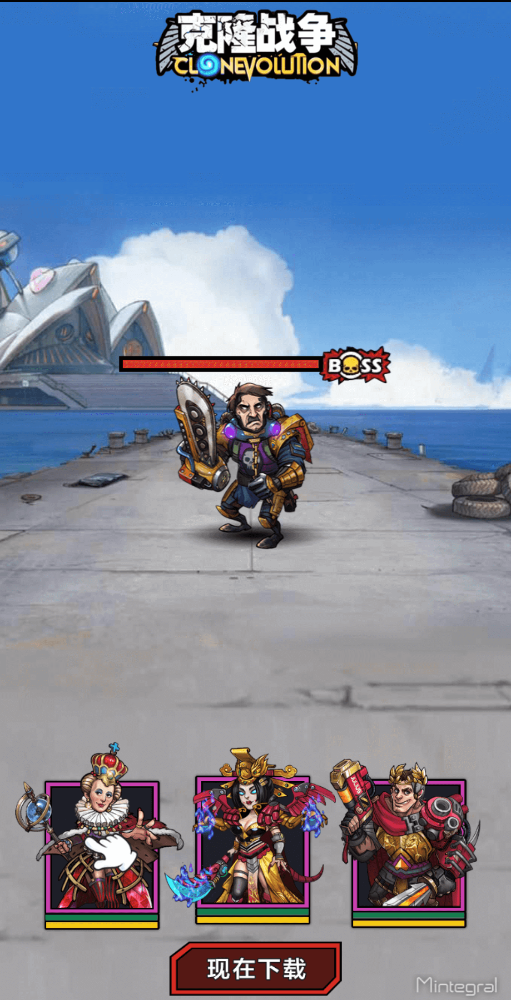

# UnityPlugin 接入文档


​    
## 概要 

本文档描述了开发者如何集成Mintegral SDK产品，通过集成Mintegral sdk展示广告创造收益。 
Mintegral SDK提供了6种广告形式，包括：Native(原生广告)、AppWall（广告墙）、Rewarded Video（激励性视频）、Interstitial（插屏）、Interstitial Video（插屏视频）、InterActive(试玩广告)。   


## 集成前准备

### 获取账户信息    


 App Key    

开发者每个账号都有对应的App Key，请求广告时需要用到该参数，它可以从Mintegral开发者后台获取，在 APP Setting -> App Key 界面，可以查看到该账号的App Key，如图所示：  
     

 App Id         

开发者每创建一个应用后，系统会自动生成App Id，可在 APP Setting -> App Id 界面查看到已创建的应用以及对应的App Id，如图所示：    
       

     
 
Placements & Units

开发者每创建一个广告版位后，系统会自动生成Placement ID，可在**APP Setting -> Placement Management -> Edit Placement & Unit**界面添加或修改该广告版位的Unit Id，如图所示：<br/><br/>
    


### 获取SDK及Mintegral Unity Plugin   

1、在[Mintegral Android SDK集成文档](http://cdn-adn.rayjump.com/cdn-adn/v2/markdown_v2/index.html?file=sdk-m_sdk-android&lang=cn)中获取SDK下载链接，并根据该文档的说明添加所需要的SDK包及AndroidManifest，混淆规则等其他配置。

2、在[Mintegral iOS SDK集成文档](http://cdn-adn.rayjump.com/cdn-adn/v2/markdown_v2/index.html?file=sdk-m_sdk-ios&lang=cn)中获取SDK下载链接，并根据该文档的说明添加所需要的SDK包。    
3、[此处下载](https://github.com/Mintegral-official/mintegral-unity-sdk/archive/master.zip)最新版本的Unity_Plugin,并将Unity Plugin中的文件全部导入到工程中。**这里需要注意如果更新最新的plugin需要同时更新最新版本的SDK。**   
4、演示demo[此处参考](https://github.com/Mintegral-official/mintegral_unity_demo) **demo仅供参考，更新较慢，demo中所依赖的双端SDK并非最新版本，请及时更新SDK**


##  初始化MTGSDK    

在程序的入口方法中调用MTGSDK的初始化方法，传入在M系统后台得到的AppID和AppKey。初始化时，MTGSDK会从服务器拉取配置信息。

```C#
Mintegral.initMTGSDK (MTGSDKAppID,MTGSDKAppKey);       
```

### Mintegral GDPR版本新增接口说明

1、设置是否获取用户信息的开关,此方法也需要在SDK初始化之前调用。    
1为允许，0为拒绝。   
    
```C#
Mintegral.setConsentStatusInfoType(int GDPR_key);
```

2、获取用户设置的开关状态。     
    
```C#
Mintegral.getConsentStatusInfoType();
```

###CCPA 接口说明
设置是否获取用户信息的开关，调用此方法时，要保证已经调用了SDK初始化

```C#
  /**
 If set to 1, the server will not display personalized ads based on the user's personal information
 When receiving the user's request, and will not synchronize the user's information to other third-party partners.
 Default is 0
 */
Mintegral.setDoNotTrackStatus(0);
```

## 横幅广告接入
横幅广告是在应用布局中占据一处位置的矩形图片文字广告。用户与应用互动时，这类广告会停留在屏幕上，并且可在一段时间后自动刷新。

### 广告位初始化  

#### 初始化MTGSDK，请参考MTGSDK的初始化部分 

#### 广告位的初始化
广告位的初始化
初始化时，需要传入对应的广告位的UnitId。

```C#
		MTGBannerInfo bannerInfo;
        bannerInfo.adUnitId = MTGBannerUnitID;
        bannerInfo.adPlacementId = MTGBannerPlacementID;
        MTGBannerInfo[] bannerAdInfos = { bannerInfo };
        Mintegral.loadBannerPluginsForAdUnits(bannerAdInfos)
```
### 创建Banner
```C#
/**
* adUnitID means your unitid for your ad unit.
* bannerAdPosition means the position you put the banner.
* width means the width of the banner view(320 recommanded).
* height means the height of the banner view(50 recommanded).
* isShowCloseBtn means whether to show the close button, the value is true or false.
*/
Mintegral.createBanner(MTGBannerPlacementID, MTGBannerUnitID, Mintegral.BannerAdPosition.TopCenter, 320, 50, false);	
```

bannerAdPosition提供以下几种：

```C#
public enum BannerAdPosition
	{
        TopLeft,
        TopCenter,
        TopRight,
        Centered,
        BottomLeft,
        BottomCenter,
        BottomRight
	}
```

### 销毁Banner
```C#
Mintegral.destroyBanner(MTGBannerPlacementID, MTGBannerUnitID);	
```

### 相关的回调Event 
```C#
	//Banner
    void onBannerLoadedEvent (string msg)
    {
		this.mtgLog("onBannerLoadedEvent" + msg);

	}
    void onBannerFailedEvent (string msg)
    {
		this.mtgLog("onBannerFailedEvent" + msg);
    }
    void onBannerLoggingImpressionEvent (string msg)
    {
		this.mtgLog("onBannerLoggingImpressionEvent" + msg);
    }

    void onBannerDidClickEvent (string msg)
    {
		this.mtgLog("onBannerDidClickEvent" + msg);
    }
    void onBannerShowFullScreenEvent (string msg)
    {
		this.mtgLog("onBannerShowFullScreenEvent" + msg);

	}
    void onBannerCloseFullScreenEvent (string msg)
    {
		this.mtgLog("onBannerCloseFullScreenEvent" + msg);

	}

    void onBannerLeaveAppEvent (string msg)
    {
		this.mtgLog("onBannerLeaveAppEvent" + msg);
	}

```


## 原生广告接入    


原生广告是时下非常流行的广告类型之一，广告sdk会将素材信息返回给您的app，您可以根据需要对元素进行组装和渲染，进而更贴近您的产品风格，用户体验更好

### 广告位初始化  

#### 初始化MTGSDK，请参考MTGSDK的初始化部分 

#### 广告位的初始化   

初始化时，需要传入对应的广告位的 PlacementId 和 UnitId


 **注意**：    
1、目前Plugin暂不支持NativeVideo，所以在创建广告位时需要选择大图模式，No Video Ads的模式。     
2、adCategory参数控制广告类型，如果对广告类型没有特殊要求，填MTGAD_CATEGORY_ALL(或者数字0)即可。      
3、autoCacheImage参数控制是否自动缓存图片，仅针对iOS平台。

4、libMTGNativeAdBridge.a 文件增加 bitcode模式，可解决开发者采用这种方式打包问题，仅针对iOS平台。

```C#
//初始化
        MTGNativeInfo nativeInfo;
        nativeInfo.adUnitId = MTGNativeUnitID;
        nativeInfo.adPlacementId = MTGNativePlacementID;
        nativeInfo.adCategory = MTGAdCategory.MTGAD_CATEGORY_ALL;
        nativeInfo.autoCacheImage = false;
        MTGTemplate[] supportedTemplates = new MTGTemplate[1];
        supportedTemplates[0] = new MTGTemplate() { templateType = MTGAdTemplateType.MTGAD_TEMPLATE_BIG_IMAGE, adsNum = 3 };
        nativeInfo.supportedTemplate = supportedTemplates;
        MTGNativeInfo[] nativeAdInfos = { nativeInfo };
        Mintegral.loadNativePluginsForAdUnits(nativeAdInfos);//载入native类型组件
```

### 预加载      

```C#
//预加载Native类型广告
public static void preRequestNativeAd (string adPlacementId, string adUnitId, string fb_placement_id, string categoryType, MTGTemplate[] supportedTemplate);
```

### 加载     

```C#
//加载Native类型广告
Mintegral.requestNativeAd (placementId, unitId);
```

### 注册广告位(Android)

```C#
//注册Native
Mintegral.registerViewNativeAd(placementId, unitId,40, 60, 605, 428,this.campaignForCurrentAdView.index);
```

### 取消注册广告位(Android)

```C#
//取消注册Native
Mintegral.unRegisterViewNativeAd(placementId,unitId,this.campaignForCurrentAdView.index);
```

### 相关的回调Event    
展示Native类型广告必须实现的代理。

```java
	
	//广告加载成功的回调  
	public void onNativeLoadedEvent(String json)
	{
		this.mtgLog ("onNativeLoadedEvent: " + json);
		//sample code
		MTGCampaignArrayWrapper wrapper = JsonUtility.FromJson<MTGCampaignArrayWrapper> (json);
		MTGCampaign[] campaigns = wrapper.objects;
		MTGCampaign campaign = null;

		if(campaigns.Length > 0){

			campaign = campaigns[0];
			this.campaignForCurrentAdView = campaign;

			StartCoroutine (LoadIconImage (campaign.iconUrl));
			StartCoroutine (LoadCoverImage (campaign.imageUrl));

			title.text = campaign.appName;
			socialContext.text = campaign.appDesc;
			InstallButtonText.text = campaign.adCall;
		}

		this.Log ("Ad loaded OK");

		#if  UNITY_IPHONE || UNITY_IOS

			if(campaigns.Length > 0){

				if(coverViewButtonForiOS != null){
					coverViewButtonForiOS = null;
				}
				
				DrwaMVButtonJustForiOS ();

				// Binding the campaign to the CoverViewButton when you get the campaign or your adView will show.
				string jsonStr = JsonUtility.ToJson(campaign);

				if(Mintegral.nativeMobManager != IntPtr.Zero){
					coverViewButtonForiOS.RegistCampaign (Mintegral.nativeMobManager,jsonStr);
				}
			}
		#endif
		
	}
	//广告加载失败的回调   
	public void onNativeFailedEvent(String errorMessage)
	{
		this.Log ("AdLoadError :" + errorMessage);
	}
	//广告展示成功的回调
	public void onNativeLoggingImpressionEvent(String adSource)
	{
		this.Log ("onLoggingImpression adSource:" + adSource);
	}
	//广告点击的回调
	public void onNativeDidClickEvent(String message)
	{
		MTGCampaign mtgCampaign = new MTGCampaign ();
			mtgCampaign = JsonUtility.FromJson<MTGCampaign> (message);

		if (mtgCampaign != null) {
			this.Log ("AdClick:" + mtgCampaign.imageUrl);

		}
	}
	//广告开始跳转的回调
	public void onNativeRedirectionStartEvent(String message)
	{
		this.Log ("StartRedirection:" + message);
	}
	//广告跳转完成的回调
	public void onNativeRedirectionFinishedEvent(String message)
	{
		this.Log ("FinishRedirection:" + message);
	}
```


##  激励视频接入

激励视频是Mintegral平台效果非常好的广告形式，用户可以通过观看一段广告视频而获取奖励，由于广告视频素材非常具有创意和吸引力，因此会引起很多用户的兴趣，进而下载广告产品

**广告效果示意：**


  

### 广告位初始化

#### 初始化MTGSDK，请参考MTGSDK的初始化部分 

#### 初始化MTGRewarded Video 

```C#
        MTGRewardVideoInfo rvInfo;
        rvInfo.adUnitId = MTGRVUnitID;
        rvInfo.adPlacementId = MTGRVPlacementID;
        MTGRewardVideoInfo[] rewardVideoAdInfos = { rvInfo };
        Mintegral.loadRewardedVideoPluginsForAdUnits(rewardVideoAdInfos);//载入Reward Video类型组件
```
#### 请求视频广告   

请求视频广告，需传入对应广告位的PlacementID和UnitId。  

```C#
Mintegral.requestRewardedVideo(MTGRVPlacementID, MTGRVUnitID);
```

#### 展示视频广告   
展示广告之前先判断广告是否已经下载成功,如果返回失败，则放弃这次视频展示机会。

 RewardId激励信息里创建的奖励信息,UserId用于服务器端回调，如果是客户端回调可以不传 

```C#
        if (Mintegral.isVideoReadyToPlay(MTGRVPlacementID, MTGRVUnitID)) 
        {

            Mintegral.showRewardedVideo(MTGRVPlacementID, MTGRVUnitID);
        }
        else
        {

            this.mtgLog("Reward Unit:" + MTGRVUnitID + "Not Ready");
        }
```


#### 清除本地缓存   
如有需要，可通过该方法清除本地缓存的视频文件。

```C#
public static void cleanAllVideoFileCache (string adPlacementId, string adUnitId);
```

#### 相关的回调Event 

```java
	// Rewarded Video Events

	void onRewardedVideoLoadSuccessEvent(string adUnitId)
    {
        this.mtgLog("onRewardedVideoLoadSuccessEvent: " + adUnitId);
    }

    void onRewardedVideoLoadedEvent (string adUnitId)
	{
		this.mtgLog ("onRewardedVideoLoadedEvent: " + adUnitId);
	}

	void onRewardedVideoFailedEvent (string errorMsg)
	{
		this.mtgLog ("onRewardedVideoFailedEvent: " + errorMsg);
	}

	void onRewardedVideoShownFailedEvent (string adUnitId)
	{
		this.mtgLog ("onRewardedVideoShownFailedEvent: " + adUnitId);
	}

	void onRewardedVideoShownEvent ()
	{
		this.mtgLog ("onRewardedVideoShownEvent");
	}

	void onRewardedVideoClickedEvent (string errorMsg)
	{
		this.mtgLog ("onRewardedVideoClickedEvent: " + errorMsg);
	}

	void onRewardedVideoClosedEvent (MintegralManager.MTGRewardData rewardData)
	{
		if (rewardData.converted) {
			this.mtgLog ("onRewardedVideoClosedEvent: " + rewardData.ToString ());
		} else {
			this.mtgLog ("onRewardedVideoClosedEvent: No Reward"  );
		}
	}

	void onRewardedVideoPlayCompletedEvent(string adUnitId)
    {
        this.mtgLog("onRewardedVideoPlayCompletedEvent: " + adUnitId);
    }

    void onRewardedVideoEndCardShowSuccessEvent(string adUnitId)
    {
        this.mtgLog("onRewardedVideoEndCardShowSuccessEvent: " + adUnitId);
    }

	
```
### 配置AndroidManifest.xml

```xml 
<activity
    android:name="com.mintegral.msdk.reward.player.MTGRewardVideoActivity"
    android:configChanges="orientation|keyboardHidden|screenSize"
    android:exported="false"
    android:theme="@android:style/Theme.NoTitleBar.Fullscreen" />
```

### 硬件加速   
在application节点下修改"android:hardwareAccelerated"的属性值：

```xml
<application
        ...
        android:hardwareAccelerated="true">
        ...
        ...
        ...
        ...

</application>
```


## 插屏图片广告接入   

插屏图片广告会在屏幕上展示一条大图广告，用户可以通过关闭按钮来关闭广告。

**注：MIntegral推出了全新的InterstitalVideo广告类型，相比普通Interstital广告会有更好的视觉效果和体验。**   

**广告效果示意**：

    
  
        

### 广告位初始化

#### 初始化MTGSDK，请参考MTGSDK的初始化部分 

#### 广告位的初始化   

初始化时，需要传入对应的广告位的 PlacementID 和 UnitId，还可以通过adCategory参数控制广告类型，如果对广告类型没有特殊要求，填MTGInterstitial_AD_CATEGORY_ALL(或者数字0)即可。

```C#
//初始化
        //Interstitial
        MTGInterstitialInfo interstitialInfo;
        interstitialInfo.adUnitId = MTGInterstitialUnitID;
        interstitialInfo.adPlacementId = MTGInterstitialPlacementID;
        interstitialInfo.adCategory = MTGAdCategory.MTGAD_CATEGORY_ALL;
        MTGInterstitialInfo[] interstitialAdInfos = { interstitialInfo };
        Mintegral.loadInterstitialPluginsForAdUnits(interstitialAdInfos);//载入Interstitial类型组件
```

#### 加载   

```C#
//加载Interstitial类型广告
Mintegral.requestInterstitialAd(MTGInterstitialPlacementID, MTGInterstitialUnitID);
```

#### 展示   

```C#
//展示Interstitial
Mintegral.showInterstitialAd(MTGInterstitialPlacementID, MTGInterstitialUnitID);
```

#### 相关的回调Event      
展示Interstitial类型广告必须实现的代理。

```java

   void onInterstitialLoadedEvent ()
	{
		this.mtgLog ("onInterstitialLoadedEvent");
	}

	void onInterstitialFailedEvent (string errorMsg)
	{
		this.mtgLog ("onInterstitialFailedEvent: " + errorMsg);
	}

	void onInterstitialShownEvent ()
	{
		this.mtgLog("onInterstitialShownEvent");
	}

	void onInterstitialShownFailedEvent (string adUnitId)
	{
		this.mtgLog ("onInterstitialShownFailedEvent: " + adUnitId);
	}

	void onInterstitialClickedEvent ()
	{
		this.mtgLog ("onInterstitialClickedEvent");
	}

	void onInterstitialDismissedEvent ()
	{
		this.mtgLog ("onInterstitialDismissedEvent");
	}		
```


### 配置AndroidManifest.xml


```java
<activity
    android:name="com.mintegral.msdk.interstitial.view.MTGInterstitialActivity"
    android:screenOrientation="portrait"
    android:exported="false"
    android:configChanges="orientation|screenSize"/>

```


## 插屏视频广告接入 

插屏视频广告是插屏图片广告的升级版本，展示广告时会给用户展示一个全屏或半屏的视频，通过更有吸引力的视频提高用户的兴趣。

**广告效果示意**：


      

### 广告位初始化     

#### 初始化MTGSDK，请参考MTGSDK的初始化部分 

#### 广告位的初始化   

初始化时，需要传入对应的广告位的 PlacementID 和 UnitId     

```C#
		//初始化
        
        MTGInterstitialVideoInfo ivInfo;
        ivInfo.adUnitId = MTGIVUnitID;
        ivInfo.adPlacementId = MTGIVPlacementID;
        MTGInterstitialVideoInfo[] interstitialVideoAdInfos = { ivInfo };
        Mintegral.loadInterstitialVideoPluginsForAdUnits(interstitialVideoAdInfos);//载入InterstitialVideo类型组件
```

#### 加载   

```C#
//加载Interstitial Video类型广告
	
        Mintegral.requestInterstitialVideoAd(MTGIVPlacementID, MTGIVUnitID);
```

#### 展示   

```C#
        if (Mintegral.isReady(MTGIVPlacementID, MTGIVUnitID))
        {
            Mintegral.showInterstitialVideoAd(MTGIVPlacementID, MTGIVUnitID);
        }
        else
        {
            this.mtgLog("intersitial video Unit:" + MTGIVUnitID+ "Not Ready");
        }
```


#### 自定义奖励弹窗的展示内容

最好在调用load之前调用API     

```C#
    Mintegral.setAlertDialogText(MTGIVPlacementID, MTGIVUnitID, "title", "content", "confirm", "cancel");
```

#### IV奖励模式   

在调用load之前调用API

```C#
	//奖励模式
	Mintegral.setIVRewardMode(MTGIVPlacementID, MTGIVUnitID, Mintegral.MTGIVRewardMode.MTGIVRewardPlayMode, 0.8f);		
```
MTGIVRewardMode如下所示：      

```C#
public enum MTGIVRewardMode
	{
		MTGIVRewardPlayMode,
		MTGIVRewardCloseMode
	}
```

#### 相关的回调Event     
展示Interstitial Video类型广告必须实现的代理。

```java 
 
	   void onInterstitialVideoLoadSuccessEvent(string adUnitId)
    {
        this.mtgLog("onInterstitialVideoLoadSuccessEvent: " + adUnitId);
    }

    void onInterstitialVideoLoadedEvent (string adUnitId)
	{
		this.mtgLog ("onInterstitialVideoLoadedEvent: " + adUnitId);
	}

	void onInterstitialVideoFailedEvent (string errorMsg)
	{
		this.mtgLog ("onInterstitialVideoFailedEvent: " + errorMsg);
	}

	void onInterstitialVideoShownEvent (string errorMsg)
	{
		this.mtgLog("onInterstitialVideoShownEvent: " + errorMsg);
	}

	void onInterstitialVideoShownFailedEvent (string adUnitId)
	{
		this.mtgLog ("onInterstitialVideoShownFailedEvent: " + adUnitId);
	}

	void onInterstitialVideoClickedEvent (string adUnitId)
	{
		this.mtgLog ("onInterstitialVideoClickedEvent: " + adUnitId);
	}

	void onInterstitialVideoDismissedEvent (string errorMsg)
	{
		this.mtgLog ("onInterstitialVideoDismissedEvent: " + errorMsg);
	}

    void onInterstitialVideoPlayCompletedEvent(string adUnitId)
    {
        this.mtgLog("onInterstitialVideoPlayCompletedEvent: " + adUnitId);
    }

    void onInterstitialVideoEndCardShowSuccessEvent(string adUnitId)
    {
        this.mtgLog("onInterstitialVideoEndCardShowSuccessEvent: " + adUnitId);
    }

	void onInterstitialVideoAdPlayVideoEvent(MintegralManager.MTGAdPlayVideoData mtgAdPlayVideoData)
	{
		this.mtgLog ("onInterstitialVideoAdPlayVideoEvent: " + mtgAdPlayVideoData.ToString ());
	}
```
### 配置Androidmanifest.xml文件  


```java
<activity
    android:name="com.mintegral.msdk.reward.player.MTGRewardVideoActivity"
    android:configChanges="orientation|keyboardHidden|screenSize"
    android:exported="false"
    android:theme="@android:style/Theme.NoTitleBar.Fullscreen" />

```


## 交互式广告接入 

交互式广告是Mintegral推出的全新广告形态，通过该形式用户可以实际参与一个精心设计的交互广告（比如试玩一个游戏Demo），进而大大提升转化效果。当前广告内容以Playable为主。

**广告效果示意：**

  
   

### 广告位初始化     

#### 初始化MTGSDK，请参考MTGSDK的初始化部分 

#### 广告位的初始化   
初始化时，需要传入对应的广告位的PlacementId 和 UnitId。


```C#
//初始化
        //InterActive
        MTGInterActiveInfo iaInfo;
        iaInfo.adUnitId = MTGIAUnitID;
        iaInfo.adPlacementId = MTGIAPlacementID;
        MTGInterActiveInfo[] interActiveAdInfos = { iaInfo };
        Mintegral.loadInterActivePluginsForAdUnits(interActiveAdInfos);//载入InterActive类型组件
```

#### 加载   

```C#
//加载 InterActive类型广告
  Mintegral.requestInterActiveAd(MTGIAPlacementID, MTGIAUnitID);
```

#### 展示   

```C#
//展示 InterActive
    Mintegral.showInterActiveAd(MTGIAPlacementID, MTGIAUnitID);
        this.mtgLog("status: " + Mintegral.getInterActiveStatusAd(MTGIAPlacementID, MTGIAUnitID));
```

#### 相关的回调Event          
展示 InterActive类型广告必须实现的代理。

```java 	
		void onInterActiveLoadedEvent (string adUnitId)
	{
		this.mtgLog ("onInterActiveLoadedEvent: " + adUnitId);
	}

	void onInterActiveFailedEvent (string errorMsg)
	{
		this.mtgLog ("onInterActiveFailedEvent: " + errorMsg);
	}

	void onInterActiveShownEvent (string errorMsg)
	{
		this.mtgLog("onInterActiveShownEvent: " + errorMsg);
	}

	void onInterActiveShownFailedEvent (string adUnitId)
	{
		this.mtgLog ("onInterActiveShownFailedEvent: " + adUnitId);
	}

	void onInterActiveClickedEvent (string adUnitId)
	{
		this.mtgLog ("onInterActiveClickedEvent: " + adUnitId);
	}

	void onInterActiveDismissedEvent (string errorMsg)
	{
		this.mtgLog ("onInterActiveDismissedEvent: " + errorMsg);
	}

    void onInterActiveMaterialLoadedEvent(string adUnitId)
    {
        this.mtgLog("onInterActiveMaterialLoadedEvent: " + adUnitId);
    }

    void onInterActivePlayingCompleteEvent(string completeOrNot)
    {
        this.mtgLog("onInterActivePlayingCompleteEvent: " + completeOrNot);
    }
```


### 配置Androidmanifest.xml文件

```java
<activity 
    android:name="com.mintegral.msdk.interactiveads.activity.InteractiveShowActivity"
    android:theme="@android:style/Theme.NoTitleBar.Fullscreen"
    android:exported="false"
    android:configChanges="keyboardHidden|orientation|screenSize">
</activity>

```


## 常见问题

 1、为什么广告第一次跳转很慢？   
答：由于跳转过程中要跳好多次，所以第一次会比较慢，第二次有了点击缓存，会快很多。开发者可以在这个时间段设置Loadding对话框。     

---

 2、为什么有时候拉取不到广告？   
答：请查看AppId、AppKey、UnitId、PlacementId等信息是否填写正确，之后查看后台单子没有投放、投放状态是否正确。     

---

 3、为什么offer中出现了两种语言？   
答：由于根据ip等信息判断区域，所以会返回对应区域的语言。又由于英文是通用语言，所以offer中会出现英文和对应区域的语言。     

---

 4、墙中install now按钮的展示语言能否更换？   
答：暂时只支持英文。     

---

 5、为什么有时候app下载不下来？   
答：由于appstore网络问题或者apple账号可能不是vpn去的国家，导致app不能下载。     

---

 6、广告源下发数量有多少？   
答：某个地区的广告源数量为各个广告主想要投放此地区广告的数量总和，当请求的广告数超出此数量时，下发的广告数量以此地区广告数量总数为准。     

---


​             
## ChangeLog

版本号 | ChangeLog | 发布时间
------|-----------|------
4.0.0 | 基于Android12.1.51， iOS6.1.0, 实现多模板功能 | 2020.03.23
3.0.0 | 基于Android10.1.9，iOS5.8.4，实现banner。Android端AAR集成； | 2019.12.23
2.4.4 | 基于Android9.12.0，IOS5.3.3，修复AndroidSDK内部参数更改匹配问题； | 2019.07.19 
2.4.3 | 基于Android9.11.0，iOS 5.3.3，针对激励视频、插屏视频新增视频播放完成回调和endcard展示成功回调； | 2019.05.21 
2.4.2 | 基于Android9.9.0 ，iOS5.0.0，新增InterActive的素材加载成功回调和试玩完成回调，libMTGNativeAdBridge.a 文件增加 bitcode 模式； | 2019.03.21 
2.4.1 | 基于Android 9.0.2 ，iOS 4.5.0，修复Android里面InterstitialVideo的侦听器方法名，增加IV和RV的onLoadSuccess方法；|2018.10.23
2.4.0 |基于Android 9.0.0，iOS 4.3.0，增加InterActive广告，增加GDPR设置获取状态方法；|2018.08.23
2.3.0 | 替换mintegral包名. 支持InterstitialVideo| 2018.07.03
2.2.0 | 基于Android 8.11.2 ，ios3.8.0，支持GDPR功能| 2018.05.15
2.1.0 |	重构Mintegral UnityPlugin，支持Native类型广告 |	2018.02.06
2.0.0 |	重构Mintegral UnityPlugin(暂不支持Native类型广告) |	2018.01.12
1.3.0 |	NativeAd 添加广告展示的回调:MTGNativeAdsUnity里的 "NativeAdImpressionWithType" |	2017.11.20
1.2.6 |	修改了C# API，关于isReady的bug | 2017.11.08
1.2.5 |	修改了C# API，以及Android的Bridge，支持Android RV多个广告位，基于v1.2.4修改|	2017.10.30
1.2.4 |修改Android的close(addReward)回调，也修改了ios的	|2017.09.22
1.2.3 |AndroidBridge 针对V8.3.1进行了修改，该版本只适用于v8.3.x|2017.09.16
1.2.2 | 修改了Mintegral_UnityAndroidBridge.jar，只适用于Android SDK 8.1.43及以上版本 | 2017.08.02
1.2.1 | UnityPlugin-iOS未做修改，UnityPlugin-Android修改了Rewarded Video 的ShowViewInUnity方法，支持传入UserId | 2017.07.13
1.2.0 | 去除了UnityPlugin里面的SDK，开发者获取到UnityPlugin后 需要手动加入当前稳定版本的SDK | 2017.06.23
1.1.2 | UnityPlugin-Android未做修改，UnityPlugin-iOS做为一系列优化 | 2017.02.15
1.1.1 | 优化了RewardWall(iOS) UnityPlugin1.1.1 支持MTGSDK-iOS 1.6.1、MTGSDK-Android 8.1.10 | 2017.02.15
1.1.0 | 提供Native,AppWall,RewardWall,OfferWall,Interstitial类型广告的Unity-Android插件 | 2017.01.11
1.0.0 | 提供Native,AppWall,RewardWall,OfferWall,Interstitial类型广告的Unity-iOS插件 | 2016.12.09


