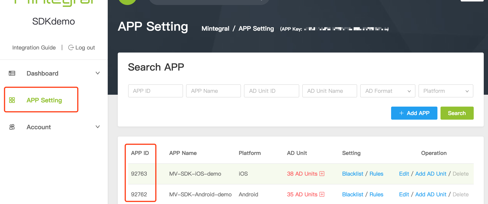
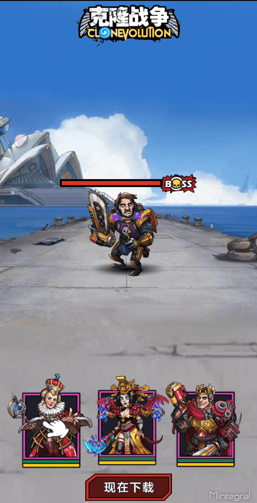

# Overview
This document provides instructions on how to integrate the Mintegral SDK for Unity developers. The Mintegral SDK for Unity Plugin provides six different ads formats: Native, App Wall, Rewarded Video, Interstitial, Interstitial Video and Interactive.

## Preparation
### Retrieve Account-Related Information
**App Key**      
Each Mintegral account has a corresponding App Key, and the key will be required for requesting ads. It can be retreived from your Mintegral account through the following path:   
 **APP Setting -> App Key**:  
     

**App ID**       
The Mintegral system will automatically generate a corresponding App ID for each app created by the developer. Find the App ID(s)  here:   
 **APP Setting -> APP ID**:        
 

**Placements & Units**    
The M-system will automatically generate a corresponding placements for each ad space created by the developer. Find the Placement Id and Unit ID here: **APP Setting -> Placement Management -> Edit Placement & Unit**  
  

### Obtain SDK And Mintegral Unity Plugin
1. Get the Android SDK download link in [Mintegral Android SDK Integration Document](http://cdn-adn.rayjump.com/cdn-adn/v2/markdown_v2/index.html?file=sdk-m_sdk-android&lang=en),and add the required SDK package, AndroidManifest, ProGuard configuration rules and other configurations according to the description of the document.
2. Get the iOS SDK download link in [Mintegral iOS SDK Integration Document](http://cdn-adn.rayjump.com/cdn-adn/v2/markdown_v2/index.html?file=sdk-m_sdk-ios&lang=en), and add the required SDK packages according to instructions.
3. Download the latest Unity plugin [here](https://github.com/Mintegral-official/mintegral-unity-sdk/archive/master.zip).And import all the files in the Unity Plugin into your project. you can also refer to the sample in the link. **Please note that if you updating the latest plugin requires using the latest SDK at the same time.**    
4. Unity sample view [here](https://github.com/Mintegral-official/mintegral_unity_demo).     **Note: The android/ios sdk in unity sample is not the latest release,Please update the SDK in time via android/ios doc**


## MTGSDK Initialization

Please call MTGSDK integration method in the below codes when your program bengin run. passing in AppId and Appkey, and ApplicationId. MTGSDK will get the configuration info from the server. 

```java
Mintegral.initMTGSDK (MTGSDKAppID,MTGSDKAppKey);
```
### Instruction For EU-GDPR Version
1.To set up the on and off switch to allow SDK to retrieve users' infomationyou will need to adopt the below code before SDK initialization.         
1 means to give authorization and 0 means to decline authorization.      

```java
Mintegral.setConsentStatusInfoType(int GDPR_key);
```

2.Get the switch status set by the user.      
   
```java
Mintegral.getConsentStatusInfoType();
```
##  CCPA Preparation
On June 28, 2018, the State of California (“California“) issued the California Consumer Privacy Act 2018 (“CCPA”), which aims to strengthen consumer privacy and data security protection, which will be effective On January 1st, 2020. For California users, you can use the setDoNotTrackStatus API to limit data processing based on the user's selection. After the setup is completed, Mintegral will no longer show personalized recommended ads to the user based on the their device information, and will not sync the device information to other third-party partners. The API is available in SDK version 5.8.7 and above.


### API Introduction
To set up the on and off switch to allow SDK to retrieve users' information,you will need to adopt the below code before SDK initialization.

```objectivec
/**
 If set to 1, the server will not display personalized ads based on the user's personal information
 When receiving the user's request, and will not synchronize the user's information to other third-party partners.
 Default is 0
 */
Mintegral.setDoNotTrackStatus(0);
```


## Banner
Banner ads are rectangular image or text ads that occupy a spot within an app's layout. They stay on screen while users are interacting with the app, and can refresh automatically after a certain period of time.

### Initialization of Ad Unit 
Please refer to the part of MTGSDK initialization to see how to initialize MTGSDK.
When initializing, you need to pass in your unit id.      
     
```C#
		MTGBannerInfo bannerInfo;
        bannerInfo.adUnitId = MTGBannerUnitID;
        bannerInfo.adPlacementId = MTGBannerPlacementID;
        MTGBannerInfo[] bannerAdInfos = { bannerInfo };
        Mintegral.loadBannerPluginsForAdUnits(bannerAdInfos)	
```

### Create the Banner
```C#
/**
* adUnitID means your unitid for your ad unit.
* bannerAdPosition means the position you put the banner.
* width means the width of the banner view(320 recommanded).
* height means the height of the banner view(50 recommanded).
* isShowCloseBtn means whether to show the close button, the value is true or false.
*/
Mintegral.createBanner(MTGBannerPlacementID, MTGBannerUnitID, Mintegral.BannerAdPosition.TopCenter, 320, 50, false);	
```


Below is the complete list of BannerAdPosition：     

```C#
public enum BannerAdPosition
	{
        TopLeft,
        TopCenter,
        TopRight,
        Centered,
        BottomLeft,
        BottomCenter,
        BottomRight
	}
```

### Destroy the Banner
```C#
Mintegral.destroyBanner(MTGBannerPlacementID, MTGBannerUnitID);
```

### Related CallBack Event
```C#
	//Banner
    void onBannerLoadedEvent (string msg)
    {
		this.mtgLog("onBannerLoadedEvent" + msg);

	}
    void onBannerFailedEvent (string msg)
    {
		this.mtgLog("onBannerFailedEvent" + msg);
    }
    void onBannerLoggingImpressionEvent (string msg)
    {
		this.mtgLog("onBannerLoggingImpressionEvent" + msg);
    }

    void onBannerDidClickEvent (string msg)
    {
		this.mtgLog("onBannerDidClickEvent" + msg);
    }
    void onBannerShowFullScreenEvent (string msg)
    {
		this.mtgLog("onBannerShowFullScreenEvent" + msg);

	}
    void onBannerCloseFullScreenEvent (string msg)
    {
		this.mtgLog("onBannerCloseFullScreenEvent" + msg);

	}

    void onBannerLeaveAppEvent (string msg)
    {
		this.mtgLog("onBannerLeaveAppEvent" + msg);
	}


```

## Native 
Native Ads is currently one of the most popular Ads types. The Mintegral SDK will report back creative material information to your app. You will then be able to assemble and adjust the creative elements as needed to ensure the creative material is compatible to your product style and in turn create the best user experience.


### **Initialization of ad unit**  
Please refer to the part of MTGSDK initialization to see how to initialize MTGSDK.
When initializing, you need to pass in your Placementid and unit id of the corresponding ad slot.

Note:   
1.The current plug-in does not support NativeVideo format, so you need to choose the MTGAD_TEMPLATE_BIG_IMAGE template .

2.The adCategory parameter controls the ad category. If there is no special requirement for the ad type, please fill in the MTGAD_CATEGORY_ALL (or the number 0).

3.AutoCacheImage parameter controls whether to automatically cache images, only for iOS platform.

4.LibMTGNativeAdBridge.a supports  bitcode  mode,  only for the iOS platform.

```java
//Initialization
        MTGNativeInfo nvInfo;
        nvInfo.adUnitId = MTGNVUnitID;
        nvInfo.adPlacementId = MTGNVPlacementID;
        nvInfo.adCategory = MTGAdCategory.MTGAD_CATEGORY_ALL;
        nvInfo.autoCacheImage = false;
        MTGTemplate[] supportedTemplates = new MTGTemplate[1];
        supportedTemplates[0] = new MTGTemplate() { templateType = MTGAdTemplateType.MTGAD_TEMPLATE_BIG_IMAGE, adsNum = 3 };
        nvInfo.supportedTemplate = supportedTemplates;
        MTGNativeInfo[] nativeAdInfos = { nvInfo };
        Mintegral.loadNativePluginsForAdUnits(nativeAdInfos);
```

### **PreLoad Ads**

```java
public static void preRequestNativeAd (string adPlacementId, string adUnitId, string fb_placement_id, string categoryType, MTGTemplate[] supportedTemplate);
```

### **Load Ads**

```java
//Load Native ads
Mintegral.requestNativeAd (placementId, unitId);
```

### **Registered native ads for Android platform**

```java
Mintegral.registerViewNativeAd(placementId, unitId,40, 60, 605, 428,this.campaignForCurrentAdView.index);
```

### **Unregistered native ads for Android platform**

```java
//UnRegistered Native ads
Mintegral.unRegisterViewNativeAd(placementId,unitId,this.campaignForCurrentAdView.index);
```

### **Related Callback Event**  

```java
//load success callback
	public void onNativeLoadedEvent(String json)
	{
		this.mtgLog ("onNativeLoadedEvent: " + json);
		
		//sample code
		MTGCampaignArrayWrapper wrapper = JsonUtility.FromJson<MTGCampaignArrayWrapper> (json);
		MTGCampaign[] campaigns = wrapper.objects;
		MTGCampaign campaign = null;

		if(campaigns.Length > 0){

			campaign = campaigns[0];
			this.campaignForCurrentAdView = campaign;

			StartCoroutine (LoadIconImage (campaign.iconUrl));
			StartCoroutine (LoadCoverImage (campaign.imageUrl));

			title.text = campaign.appName;
			socialContext.text = campaign.appDesc;
			InstallButtonText.text = campaign.adCall;
		}

		this.Log ("Ad loaded OK");

		#if  UNITY_IPHONE || UNITY_IOS

			if(campaigns.Length > 0){

				if(coverViewButtonForiOS != null){
					coverViewButtonForiOS = null;
				}
				
				DrwaMVButtonJustForiOS ();

				// Binding the campaign to the CoverViewButton when you get the campaign or your adView will show.
				string jsonStr = JsonUtility.ToJson(campaign);

				if(Mintegral.nativeMobManager != IntPtr.Zero){
					coverViewButtonForiOS.RegistCampaign (Mintegral.nativeMobManager,jsonStr);
				}
			}
		#endif
		
	}
	//load failed callback
	public void onNativeFailedEvent(String errorMessage)
	{
		this.Log ("AdLoadError :" + errorMessage);
	}
	//display success
	public void onNativeLoggingImpressionEvent(String adSource)
	{
		this.Log ("onLoggingImpression adSource:" + adSource);
	}
	
	public void onNativeDidClickEvent(String message)
	{
		MTGCampaign mtgCampaign = new MTGCampaign ();
			mtgCampaign = JsonUtility.FromJson<MTGCampaign> (message);

		if (mtgCampaign != null) {
			this.Log ("AdClick:" + mtgCampaign.imageUrl);

		}
	}
	
	public void onNativeRedirectionStartEvent(String message)
	{
		this.Log ("StartRedirection:" + message);
	}
	
	public void onNativeRedirectionFinishedEvent(String message)
	{
		this.Log ("FinishRedirection:" + message);
	}
```

## Rewarded Video 
Rewarded Video is one of the best performing Ads formats on the Mintegral platform. Users can get rewards by watching a video Ads. The creativity and attention-grabbing nature of the video content attracts users to download the advertised product.  

**Rewarded Video sample：**     
     
    


### **Initialization of Ad Unit**  
Please refer to the part of MTGSDK initialization to see how to initialize MTGSDK.
When initializing, you need to pass in your unit id of the corresponding ad slot.

```java
        MTGRewardVideoInfo rvInfo;
        rvInfo.adUnitId = MTGRVUnitID;
        rvInfo.adPlacementId = MTGRVPlacementID;
        MTGRewardVideoInfo[] rewardVideoAdInfos = { rvInfo };
        Mintegral.loadRewardedVideoPluginsForAdUnits(rewardVideoAdInfos);
```

### Load Ads
Set the corresponding ad unit id for video ads.

```java
Mintegral.requestRewardedVideo(MTGRVPlacementID, MTGRVUnitID);
```
### **Show Ads**
Display the ads before judging whether it is downloaded or not; if failed. it won't be displayed.  
**Reward Id** corresponds to the Mintegral system background configuration of the reward information, which was created in the dashboard.   
**User Id** is the Identifier for the server-side callback, if it is client-callback mode, you can not use it.


```java
        if (Mintegral.isVideoReadyToPlay(MTGRVPlacementID, MTGRVUnitID)) 
        {

            Mintegral.showRewardedVideo(MTGRVPlacementID, MTGRVUnitID);
        }
        else
        {

            this.mtgLog("Reward Unit:" + MTGRVUnitID + "Not Ready");
        }
```

### **Clear the local cache**

Clear the local cache of the video file.

```java
//clear the local cache
public static void cleanAllVideoFileCache (string adPlacementId, string adUnitId);
```

### **Related CallBack Event**

```java
// Rewarded Video Events

	void onRewardedVideoLoadSuccessEvent(string adUnitId)
    {
        this.mtgLog("onRewardedVideoLoadSuccessEvent: " + adUnitId);
    }

    void onRewardedVideoLoadedEvent (string adUnitId)
	{
		this.mtgLog ("onRewardedVideoLoadedEvent: " + adUnitId);
	}

	void onRewardedVideoFailedEvent (string errorMsg)
	{
		this.mtgLog ("onRewardedVideoFailedEvent: " + errorMsg);
	}

	void onRewardedVideoShownFailedEvent (string adUnitId)
	{
		this.mtgLog ("onRewardedVideoShownFailedEvent: " + adUnitId);
	}

	void onRewardedVideoShownEvent ()
	{
		this.mtgLog ("onRewardedVideoShownEvent");
	}

	void onRewardedVideoClickedEvent (string errorMsg)
	{
		this.mtgLog ("onRewardedVideoClickedEvent: " + errorMsg);
	}

	void onRewardedVideoClosedEvent (MintegralManager.MTGRewardData rewardData)
	{
		if (rewardData.converted) {
			this.mtgLog ("onRewardedVideoClosedEvent: " + rewardData.ToString ());
		} else {
			this.mtgLog ("onRewardedVideoClosedEvent: No Reward"  );
		}
	}

	void onRewardedVideoPlayCompletedEvent(string adUnitId)
    {
        this.mtgLog("onRewardedVideoPlayCompletedEvent: " + adUnitId);
    }

    void onRewardedVideoEndCardShowSuccessEvent(string adUnitId)
    {
        this.mtgLog("onRewardedVideoEndCardShowSuccessEvent: " + adUnitId);
    }
```
### AndroidManifest.xml Configuration
```java
<activity
    android:name="com.mintegral.msdk.reward.player.MTGRewardVideoActivity"
    android:configChanges="orientation|keyboardHidden|screenSize"
    android:exported="false"
    android:theme="@android:style/Theme.NoTitleBar.Fullscreen" />
```
### HardwareAccelerated
Add these codes "android:hardwareAccelerated=ture" in tab of application：   

```java
<application   
        ...
        android:hardwareAccelerated="true">
        ...
        ...
</application>
```
## Interstitial Video
Interstitial Video ads are upgraded versions of Static ads that show users a full-screen or half-screen video, increasing user interest through more engaging videos.    
**Interstitial Video sample：**    

     


### **Initialization of Ad Unit**  
Please refer to the part of MTGSDK initialization to see how to initialize MTGSDK.

```java
        MTGInterstitialVideoInfo ivInfo;
        ivInfo.adUnitId = MTGIVUnitID;
        ivInfo.adPlacementId = MTGIVPlacementID;
        MTGInterstitialVideoInfo[] interstitialVideoAdInfos = { ivInfo };
        Mintegral.loadInterstitialVideoPluginsForAdUnits(interstitialVideoAdInfos);


```
### **Load Ads**
```java
//Load Interstitial
        Mintegral.requestInterstitialVideoAd(MTGIVPlacementID, MTGIVUnitID);
```
### **Show Ads**
```java
        if (Mintegral.isReady(MTGIVPlacementID, MTGIVUnitID))
        {
            Mintegral.showInterstitialVideoAd(MTGIVPlacementID, MTGIVUnitID);
        }
        else
        {
            this.mtgLog("intersitial video Unit:" + MTGIVUnitID+ "Not Ready");
        }
```

### Custom the reward alert dialog display text.

You‘d better call setAlertDialogText before call load method.

```C#
    Mintegral.setAlertDialogText(MTGIVPlacementID, MTGIVUnitID, "title", "content", "confirm", "cancel");
```

### Set the reward alert dialog mode for interstitial video.

Please call setIVRewardEnable before call load method.      

```C#
	Mintegral.setIVRewardMode(MTGIVPlacementID, MTGIVUnitID, Mintegral.MTGIVRewardMode.MTGIVRewardPlayMode, 0.8f);
```
MTGIVRewardMode as below shown：     
    
```C#
public enum MTGIVRewardMode
	{
		MTGIVRewardPlayMode,
		MTGIVRewardCloseMode
	}
```


### **Related CallBack Event**
```java
 void onInterstitialVideoLoadSuccessEvent(string adUnitId)
    {
        this.mtgLog("onInterstitialVideoLoadSuccessEvent: " + adUnitId);
    }

    void onInterstitialVideoLoadedEvent (string adUnitId)
	{
		this.mtgLog ("onInterstitialVideoLoadedEvent: " + adUnitId);
	}

	void onInterstitialVideoFailedEvent (string errorMsg)
	{
		this.mtgLog ("onInterstitialVideoFailedEvent: " + errorMsg);
	}

	void onInterstitialVideoShownEvent (string errorMsg)
	{
		this.mtgLog("onInterstitialVideoShownEvent: " + errorMsg);
	}

	void onInterstitialVideoShownFailedEvent (string adUnitId)
	{
		this.mtgLog ("onInterstitialVideoShownFailedEvent: " + adUnitId);
	}

	void onInterstitialVideoClickedEvent (string adUnitId)
	{
		this.mtgLog ("onInterstitialVideoClickedEvent: " + adUnitId);
	}

	void onInterstitialVideoDismissedEvent (string errorMsg)
	{
		this.mtgLog ("onInterstitialVideoDismissedEvent: " + errorMsg);
	}

    void onInterstitialVideoPlayCompletedEvent(string adUnitId)
    {
        this.mtgLog("onInterstitialVideoPlayCompletedEvent: " + adUnitId);
    }

    void onInterstitialVideoEndCardShowSuccessEvent(string adUnitId)
    {
        this.mtgLog("onInterstitialVideoEndCardShowSuccessEvent: " + adUnitId);
    }

	void onInterstitialVideoAdPlayVideoEvent(MintegralManager.MTGAdPlayVideoData mtgAdPlayVideoData)
	{
		this.mtgLog ("onInterstitialVideoAdPlayVideoEvent: " + mtgAdPlayVideoData.ToString ());
	}
```

### AndroidManifest.xml Configuration
```java
<activity
    android:name="com.mintegral.msdk.reward.player.MTGRewardVideoActivity"
    android:configChanges="orientation|keyboardHidden|screenSize"
    android:exported="false"
    android:theme="@android:style/Theme.NoTitleBar.Fullscreen" />
```
## Static Interstitial 
The interstitial ad will display a large image ad on the screen, and the user can close the ad by clicking the close button.    
**MIntegral has launched a new Interstitial Video ad type that offers better visuals and experience than regular Interstitial ads.**

**Interstitial sample：**    

    


### **Initialization of Ad Unit**  
Please refer to the part of MTGSDK initialization to see how to initialize MTGSDK.     
When initializing, you need to pass in your Placementid and unit id of the corresponding ad slot.     
The "adCategory" controls the advertising app category. If no special requirement here, please set it as MTGInterstitialVideo_AD_CATEGORY_ALL(or figure "0").

```java
        //Interstitial
        MTGInterstitialInfo interstitialInfo;
        interstitialInfo.adUnitId = MTGInterstitialUnitID;
        interstitialInfo.adPlacementId = MTGInterstitialPlacementID;
        interstitialInfo.adCategory = MTGAdCategory.MTGAD_CATEGORY_ALL;
        MTGInterstitialInfo[] interstitialAdInfos = { interstitialInfo };
        Mintegral.loadInterstitialPluginsForAdUnits(interstitialAdInfos);

```
### **Load Ads**
```java
//Load Interstitial
Mintegral.requestInterstitialAd(MTGInterstitialPlacementID, MTGInterstitialUnitID);
```
### **Show Ads**
```java
//show Interstitial
Mintegral.showInterstitialAd(MTGInterstitialPlacementID, MTGInterstitialUnitID);
```

### **Related CallBack Event**

```java
void onInterstitialLoadedEvent ()
	{
		this.mtgLog ("onInterstitialLoadedEvent");
	}

	void onInterstitialFailedEvent (string errorMsg)
	{
		this.mtgLog ("onInterstitialFailedEvent: " + errorMsg);
	}

	void onInterstitialShownEvent ()
	{
		this.mtgLog("onInterstitialShownEvent");
	}

	void onInterstitialShownFailedEvent (string adUnitId)
	{
		this.mtgLog ("onInterstitialShownFailedEvent: " + adUnitId);
	}

	void onInterstitialClickedEvent ()
	{
		this.mtgLog ("onInterstitialClickedEvent");
	}

	void onInterstitialDismissedEvent ()
	{
		this.mtgLog ("onInterstitialDismissedEvent");
	}	

 
```
### AndroidManifest.xml Configuration
```java
<activity
    android:name="com.mintegral.msdk.interstitial.view.MTGInterstitialActivity"
    android:screenOrientation="portrait"
    android:exported="false"
    android:configChanges="orientation|screenSize"/>


```
## Interactive
Interactive ad is a new ad format launched by Mintegral, in which users can instantly experience any app or game in the highest quality possible, before downloading the app. This greatly improves the possibility of conversion. The current ads creatives are mainly interactive videos and HTML5 files.

**Interactive sample：**
 


### **Initialization of ad unit**  
Please refer to the part of MTGSDK initialization to see how to initialize MTGSDK.

```java
        //InterActive
        MTGInterActiveInfo iaInfo;
        iaInfo.adUnitId = MTGIAUnitID;
        iaInfo.adPlacementId = MTGIAPlacementID;
        MTGInterActiveInfo[] interActiveAdInfos = { iaInfo };
        Mintegral.loadInterActivePluginsForAdUnits(interActiveAdInfos);

```
### Load Ads
```java
  Mintegral.requestInterActiveAd(MTGIAPlacementID, MTGIAUnitID);
```
### Show Ads
```java
  Mintegral.showInterActiveAd(MTGIAPlacementID, MTGIAUnitID);
        this.mtgLog("status: " + Mintegral.getInterActiveStatusAd(MTGIAPlacementID, MTGIAUnitID));
```
### **Related CallBack Event**
```javajava
	void onInterActiveLoadedEvent (string adUnitId)
	{
		this.mtgLog ("onInterActiveLoadedEvent: " + adUnitId);
	}

	void onInterActiveFailedEvent (string errorMsg)
	{
		this.mtgLog ("onInterActiveFailedEvent: " + errorMsg);
	}

	void onInterActiveShownEvent (string errorMsg)
	{
		this.mtgLog("onInterActiveShownEvent: " + errorMsg);
	}

	void onInterActiveShownFailedEvent (string adUnitId)
	{
		this.mtgLog ("onInterActiveShownFailedEvent: " + adUnitId);
	}

	void onInterActiveClickedEvent (string adUnitId)
	{
		this.mtgLog ("onInterActiveClickedEvent: " + adUnitId);
	}

	void onInterActiveDismissedEvent (string errorMsg)
	{
		this.mtgLog ("onInterActiveDismissedEvent: " + errorMsg);
	}

    void onInterActiveMaterialLoadedEvent(string adUnitId)
    {
        this.mtgLog("onInterActiveMaterialLoadedEvent: " + adUnitId);
    }

    void onInterActivePlayingCompleteEvent(string completeOrNot)
    {
        this.mtgLog("onInterActivePlayingCompleteEvent: " + completeOrNot);
    }
```
### AndroidManifest.xml Configuration
```java
<activity 
    android:name="com.mintegral.msdk.interactiveads.activity.InteractiveShowActivity"
    android:theme="@android:style/Theme.NoTitleBar.Fullscreen"
    android:exported="false"
    android:configChanges="keyboardHidden|orientation|screenSize">
</activity>

```
## FAQs

1.Why call the preload method？<br/> 

A: Preload: You can cache the ads data before display then use the cache data for the next impression. This helps to reduce ads' loading time, improve user experience and increase your revenue.
<br/>    

2.Why do the ads jump so slowly for the first time?<br/> 

A: The ads will go through several layers of 302 redirects before reaching the final URL. The NativeHandler is notified when the page jump is complete and developers can setup a loading dialogue at this time.  <br/>    


3.Why are no ads returned sometimes? 

A: Please check whether the AppId, AppKey, UnitId and PlacementId are correct; and then check the offers status in the Mintegral dashboard.<br/>    


4.Why are there two different languages in the offers？

A: MTGSDK identifies the user's network IP. So the corresponding area language will be adopted. Also, since English is a universal language there will usually be two languages: English and the local language.<br/>    


5.Can we change the language of the install button in the AppWall? 

A: Unfortunately, we only support English at the moment.<br/>    


6.Why can't the ads be downloaded sometimes? 

A: Check your appstore network connection; check whether your Apple account is in alignment with the area you are connected to.<br/>    


7.What is the amount of offers for a specific area?

A：The number of offers for a specific area is equal to the total number of offers that is promoted in this area. So even if the ad requests exceed the total offer amount, the number won't increase.  

8.How long will Native Ad image resources be cached?   

A：They will be cached for 7 days.<br/>    

## Change Log

Version   | Change Log   | Publish Date
------|-----------|------
4.0.0 | Based on Android 12.1.51,ios 6.1.0, support multi-template feature | Mar 23,2020
3.0.0 | Based on Android 10.1.9,iOS 5.8.4, added Banner and aar integration for Android platform | Dec 23,2019
2.4.4 | Based on Android9.12.0,ios5.3.3, fix internal api changes in Android SDK; | July 19,2019
2.4.3 | Based on Android9.11.0, ios5.3.3, add onInterstitialVideoPlayCompleted,onInterstitialVideoEndCardShowSuccess,<br/>onRewardedVideoPlayCompleted,onRewardedVideoEndCardShowSuccess; | May 21,2019
2.4.2 | Based on Android 9.9.0, iOS 5.0.0, add the onInterActiveMaterialLoaded method and onInterActivePlayingComplete method of InterActive ad; | Mar 21,2019
2.4.1   | Based on Android 9.0.2, iOS 4.5.0, fix the listener method name of InterstitialVideo in Android, increase the onLoadSuccess method of IV and RV;   | Oct 23，2018
2.4.0   | Based on Android 9.0.0, iOS 4.3.0, add InterActive ads, increase GDPR settings to get status methods   | Aug 23,2018
2.3.0  | Replace the mintegral package name. Support InterstitialVideo    |  Jul 03,2018
2.2.0    |  Based on Android 8.11.2, iOS 3.8.0, support GDPR function   |  May 15,2018
2.1.0    | 	Refactoring Mintegral UnityPlugin ，Support Native Ads Type     |  Feb 06,2018
2.0.0    | 	Refactoring Mintegral UnityPlugin (Do not Native Type Support temporarily)    |  Jan 12,2018
1.3.0    | 	add delegate "NativeAdImpressionWithType" for MTGNativeAdsUnity    | 	Nov 20,2017
1.2.6    | 	fixed C# API bug about isReady    |  Nov 08,2017
1.2.5    | 	Update C# API ,AndroidBridge for muli-RV-UnitID   | 	Oct 30,2017
1.2.4    | Fix some bugs	   |  Sep 22,2017
1.2.3    | AndroidBridge only support for V8.3.X   | Sep 16,2017
1.2.2    |  just only modify the UnityPlugin-Android, add Modified Mintegral_UnityAndroidBridge.jar, only for Android SDK 8.1.43 and above    |  Aug 02,2017
1.2.1    |  just only modify the UnityPlugin-Android, add a parame for the function ShowViewInUnity(), by which developer can pass userId    |  Jul 13,2017
1.2.0    |  removed all the sdk,so developer should import current stable SDK manually.     |  Jun 23,2017
1.1.2    |  optimize the Native(iOS); UnityPlugin1.1.2 just support MTGSDK-iOS 1.6.2.MTGSDK-Android 8.1.10 and above  |  Feb 15,2017
1.1.1        |  optimize the RewardWall(iOS); UnityPlugin1.1.1 just support MTGSDK-iOS 1.6.1.MTGSDK-Android 8.1.10  |  Feb 15,2017
1.1.0    |  providing Android-Plugin for ads.AppWall.RewardVideo.OfferWall.Interstitial  |  Jan 11,2017
1.0.0    |  providing IOS-Plugin for native ads.AppWall.RewardVideo.OfferWall.Interstitial  |  Nov 09,2016


